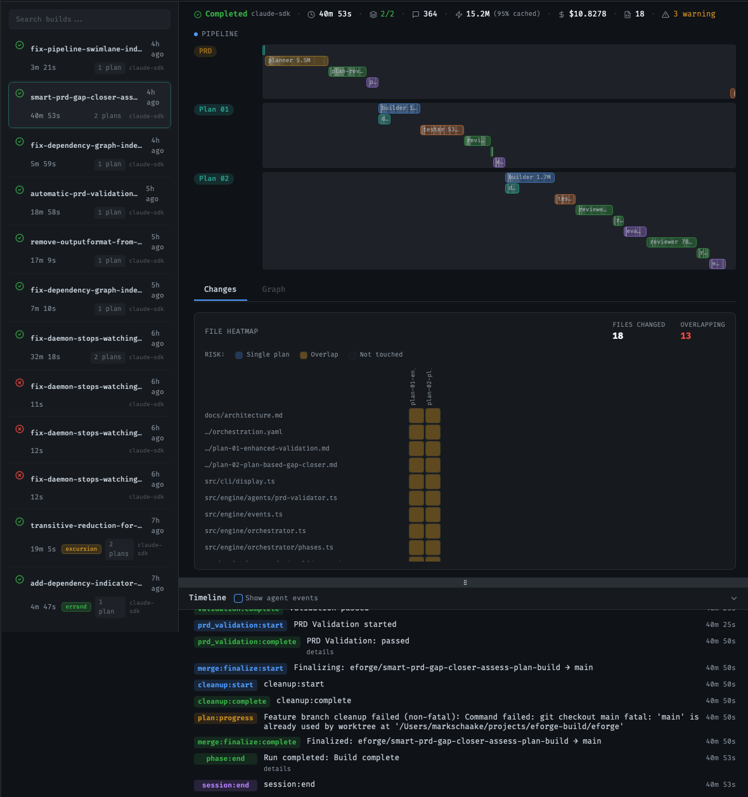
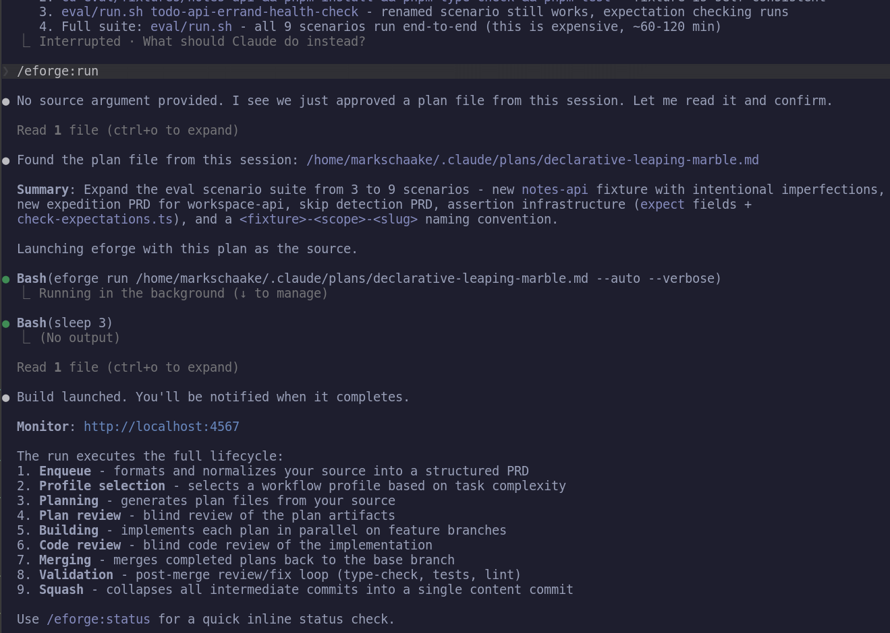

# eforge

[](https://www.npmjs.com/package/eforge)

An agentic build system - PRD in, reviewed and validated code out.

`eforge` stays at the planning level. Describe what you want built - a prompt, a markdown file, a full PRD - and hand it off. eforge orchestrates planning, implementation, code review, and validation across specialized agents.



## Typical Use

Plan a feature interactively in Claude Code, then hand it off with `/eforge:build`. The plugin enqueues the PRD and a daemon picks it up - compile, build, review, validate. A web monitor (default `localhost:4567`) tracks progress, cost, and token usage in real time.

Builds land on the current branch sequentially, so each one plans against the updated codebase, not a stale snapshot.

## Install

**Prerequisites:** Node.js 22+, Anthropic API key or [Claude subscription](https://claude.ai/upgrade)

### Claude Code Plugin (recommended)

```
/plugin marketplace add eforge-build/eforge
/plugin install eforge@eforge
```

The first invocation downloads `eforge` automatically via npx. Plan interactively in Claude Code, then hand off to `eforge` for autonomous build, review, and validation.



### Standalone CLI

```bash
npx eforge build "Add a health check endpoint"
```

Or install globally: `npm install -g eforge`

## Quick Start

Give `eforge` a prompt, a markdown file, or a full PRD:

```bash
eforge build "Add rate limiting to the API"
eforge build plans/my-feature-prd.md
```

By default, `eforge build` enqueues the PRD and a daemon automatically picks it up. Use `--foreground` to run in the current process instead.

## How It Works

**Workflow profiles** - The planner assesses complexity and selects a profile:
- **Errand** - Small, self-contained changes. Passthrough compile, fast build.
- **Excursion** - Multi-file features. Planner writes a plan, blind review cycle, then build.
- **Expedition** - Large cross-cutting work. Architecture doc, module decomposition, cohesion review across plans, parallel builds in dependency order.

**Blind review** - Every build gets reviewed by a separate agent with no builder context. Separating generation from evaluation [dramatically improves quality](https://www.anthropic.com/engineering/harness-design-long-running-apps) - solo agents tend to approve their own work regardless. A fixer applies suggestions, then an evaluator accepts strict improvements while rejecting intent changes.

**Parallel orchestration** - Each plan builds in an isolated git worktree. Expeditions run multiple plans in parallel, merging in topological dependency order. Post-merge validation runs with auto-fix.


## [Architecture](docs/architecture.md)

## Evaluation

An end-to-end eval harness runs `eforge` against embedded fixture projects and validates the output compiles and tests pass.

```bash
./eval/run.sh                        # Run all scenarios
./eval/run.sh todo-api-health-check  # Run one scenario
```


## Configuration

Configured via `eforge.yaml` (searched upward from cwd), environment variables, and auto-discovered files. Custom workflow profiles, hooks, MCP servers, and plugins are all configurable. See [docs/config.md](docs/config.md) and [docs/hooks.md](docs/hooks.md).

## Status

This is a young project moving fast. Used daily to build real features (including itself), but expect rough edges - bugs are likely, change is expected, and YMMV. Source is public so you can read, learn from, and fork it. Not accepting issues or PRs at this time.

## Development

```bash
pnpm dev          # Run via tsx (pass args after --)
pnpm build        # Bundle with tsup
pnpm test         # Run unit tests
```

## Name

**E** from the [Expedition-Excursion-Errand methodology](https://www.markschaake.com/posts/expedition-excursion-errand/) + **forge** - shaping code from plans.

## License

Apache-2.0
