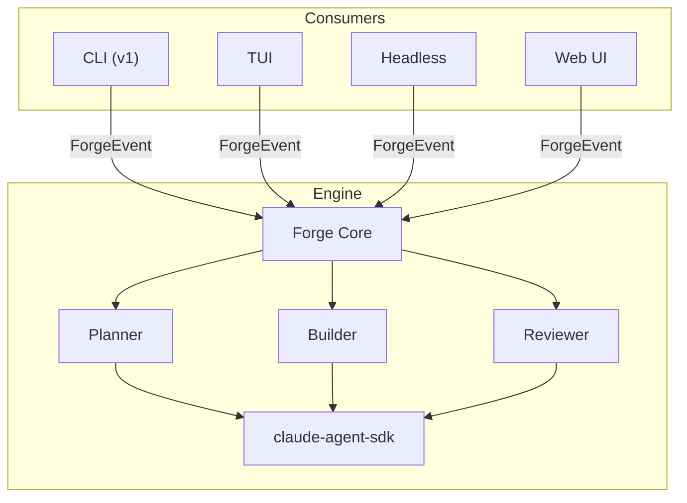

# forgeai

Autonomous plan-build-review CLI for code generation, built on the [Claude Agent SDK](https://docs.anthropic.com/en/docs/agents-and-tools/claude-agent-sdk).

forgeai extracts battle-tested workflows from Claude Code plugins into a standalone tool that runs independently — no Claude Code required.

## Architecture

**Library-first**: A pure, event-driven engine (`src/engine/`) yields typed `ForgeEvent`s via `AsyncGenerator`. Thin consumer layers render, persist, or stream events as appropriate.



**Three-agent loop**:

1. **Planner** — one-shot. Explores codebase, writes plan files. Asks clarifying questions when encountering ambiguity.
2. **Builder** — multi-turn. Turn 1: implement plan → commit. Turn 2: evaluate reviewer's fixes.
3. **Reviewer** — one-shot, blind. Reviews committed code independently, leaves fixes unstaged.

For multi-plan sets, an orchestrator resolves dependencies, computes execution waves, and runs plans in parallel using git worktrees.

## Install

```bash
pnpm install
pnpm run build
```

## Usage

```bash
# Generate plans from a PRD or description
forgeai plan docs/my-feature.md
forgeai plan "Add a health check endpoint"

# Plan + build in one step
forgeai forge docs/my-feature.md

# Execute plans (implement + review loop)
forgeai build my-plan-set

# Review existing code against plans
forgeai review my-plan-set

# Check running builds
forgeai status
```

### Flags

| Flag | Description |
|------|-------------|
| `--auto` | Bypass approval gates |
| `--verbose` | Stream agent output |
| `--dry-run` | Validate without executing |

## Evaluation

An end-to-end eval harness lives in `eval/`. It runs forgeai against embedded fixture projects and validates the output compiles and tests pass.

```bash
./eval/run.sh                        # Run all scenarios
./eval/run.sh todo-api-health-check  # Run one scenario
./eval/run.sh --dry-run              # Smoke-test the harness
```

See `eval/scenarios.yaml` for the scenario manifest and `eval/fixtures/` for the test projects.

## Development

```bash
pnpm run dev          # Run via tsx (pass args after --)
pnpm run build        # Bundle with tsup
pnpm run type-check   # Type check
pnpm test             # Run unit tests
```

## License

UNLICENSED
