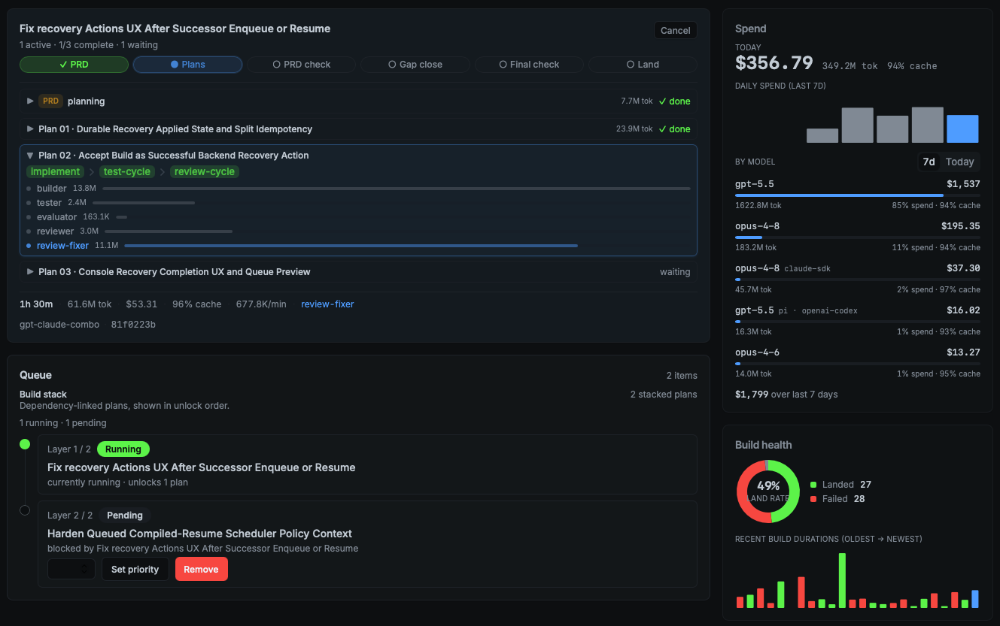
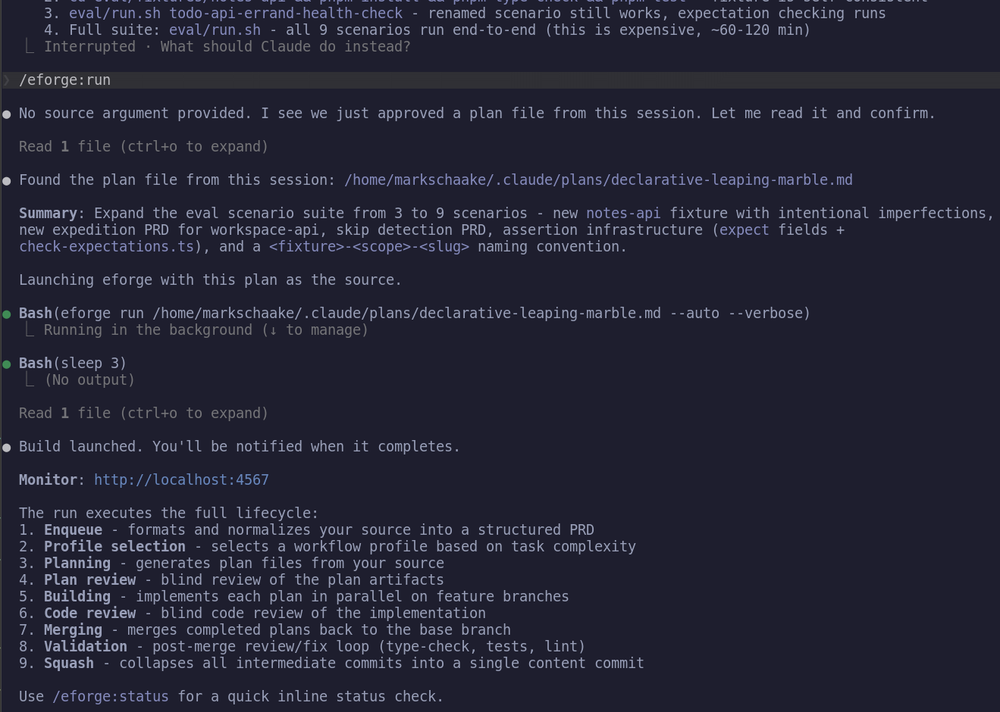

# eforge

[](https://www.npmjs.com/package/@eforge-build/eforge)
[](https://www.npmjs.com/package/@eforge-build/pi-eforge)

> **Public docs:** [https://eforge.build/docs](https://eforge.build/docs) - Getting started, concepts, configuration, and the canonical reference docs for users and agents. Agent-readable artifacts at [/llms.txt](https://eforge.build/llms.txt).

eforge is an open source build-engine kernel surrounded by extensible workflow power. Detailed plans go in. The small kernel consumes normalized build source, orchestrates dependency-aware branch and worktree execution, runs conservative build/review/validation gates, emits typed events, and leaves input authoring surfaces and richer workflow UX to extensions, playbooks, session plans, wrapper apps, and host integrations. The build phase runs in the background while you plan the next thing.

Drive eforge from Pi, Claude Code, or the CLI. Pipeline stages delegate to either pi-agent-core or the Claude Agent SDK - the interface you drive, the input surface you author in, and the harness that executes are independent. Pi is the recommended eforge execution harness for new users: provider-flexible, local, inspectable agent orchestration where runtime choice, cost, and token efficiency stay visible. The Anthropic Claude Agent SDK remains supported as an Anthropic-specific secondary path for users who intentionally choose it.

Harness engineering - the discipline of designing everything around an LLM that makes it a reliable system - applies at two levels here: each pipeline stage delegates to a harness for its agent loop, and the pipeline itself is a higher-order harness across planning, building, review, and validation.

The name: **eforge** means **extensible forge** - a small, durable kernel for shaping code from plans, with extension surfaces around it.



> **Status:** This is a young project moving fast. Used daily to build real features (including itself), but expect rough edges - bugs are likely, change is expected, and YMMV. Source is public so you can read, learn from, and fork it. Not accepting issues or PRs at this time.

## What is eforge?

eforge applies build-system thinking to agentic code generation. Traditional build systems transform source code into artifacts; eforge transforms normalized build source into reviewed, validated source changes.

The durable center is the build engine kernel: normalized build-spec intake, dependency-aware branch/worktree orchestration, the build execution loop, conservative gates, typed failure/recovery dispatch, and baseline console observability/control. Input authoring surfaces live outside that kernel. A CLI prompt, rough notes, a session plan, a playbook, a wrapper app artifact, and a PRD file all normalize before the engine sees them.

The key quality insight: a single AI agent writing and reviewing its own code will almost always approve it. Quality requires **separation of concerns** - distinct agents for planning, building, reviewing, and evaluating. Each piece below is either a guide (steering agents before they act) or a sensor (verifying what they produced) - the two control types that organize [harness engineering](https://martinfowler.com/articles/harness-engineering.html).

- **Spec-driven** (guide) - Input is a requirement, not a code edit. The system decides *how* to implement it.
- **Multi-stage pipeline** (structure) - Planning, implementation, review, and validation are separate stages with separate agents, not one conversation.
- **Blind review** (sensor) - The reviewer operates without builder context (see below).
- **Dependency-aware orchestration** (structure) - Large work decomposes into modules with a dependency graph. Plans build in parallel across isolated git worktrees, merging in topological order.
- **Adaptive complexity** (guide) - The system assesses scope and selects the right workflow: a one-file fix doesn't need architecture review, and a cross-cutting refactor shouldn't skip it.

## Use Cases

Plan a feature interactively, then hand it off to eforge with `/eforge:build`. A daemon picks up the plan and runs planning, building, blind review, and validation autonomously. A web monitor (port assigned deterministically per project in the 4567-4667 range) tracks progress, cost, and token usage in real time. The active dashboard is Eforge Console, served at `/console/`; root UI requests on the same port redirect to Console.

Because the coding agent you drive from and the agent library eforge delegates to are independent, a few ways this plays out:

- **Plan and execute in Pi.** Drive eforge from Pi and delegate to pi-agent-core across OpenAI, Anthropic, OpenRouter, local models, and more.
- **Use Claude Code as the host surface.** Drive eforge from Claude Code while choosing the execution harness separately in your active profile.
- **Mix planning and build runtimes.** Plan in Pi with one provider, then execute specific tiers through another provider or through the Anthropic-specific Claude Agent SDK when that API-priced tradeoff makes sense.
- **Run builds on local models when API spend matters.** Switch to a profile that delegates to a local model like Qwen 3.6 27B via pi-agent-core - work keeps moving with no per-token API cost.



eforge also runs standalone. By default, `eforge build` enqueues and a daemon processes it. Use `--foreground` to run in the current process instead.

## How It Works

**Formatting and enqueue** - eforge accepts input from multiple sources: a CLI prompt, rough notes, a session plan, a playbook, or a detailed PRD file. Autonomous-mode playbooks and session plans are reusable input artifacts that the daemon compiles to ordinary build source via `@eforge-build/input` before reaching the engine queue. The bundled session-planning workflow adapter in `@eforge-build/input` owns the internal session-plan domain behavior while user-facing files remain project-local `.eforge/session-plans/` Markdown artifacts. Planning-mode playbooks instead trigger an investigation-first workflow: the agent loads the playbook, investigates the codebase guided by the playbook's Goal, Acceptance criteria, and Notes, synthesizes investigation findings into an implementation-ready session plan, and continues the planning conversation interactively before a build is enqueued. The engine always receives normalized build source and does not know whether that source originated from a playbook, session plan, wrapper app, CLI prompt, or PRD file.

**Build artifact kinds** — three kinds of artifacts appear during a build, and it helps to keep them distinct:

- **Session plans** (`.eforge/session-plans/`) — driver-side planning files created by `/eforge:plan`. These are local, gitignored, and private to the developer. They are not committed and are not the shared provenance mechanism.
- **Runtime queue files** (`.eforge/queue/`) — normalized PRDs waiting for daemon processing. Enqueue stores a validated, hidden canonical acceptance-criteria inventory with stable `ac-###` IDs in each queued PRD. Queue files are gitignored, ephemeral runtime state only; queue mutations are filesystem operations that produce no git commits. `eforge queue priority <prdId> <priority>` mutates pending or waiting PRD frontmatter so lower numeric priority values dispatch earlier within each dependency wave; failed and skipped PRDs reject priority changes with a conflict until recovery or requeue makes them runnable. `eforge queue remove <prdId>` deletes non-running pending, waiting, failed, or skipped queue files; failed removal also deletes matching `.recovery.md` and `.recovery.json` sidecars. Running PRDs reject priority and removal controls — cancel them with the existing session-id cancel route instead. Removal fails closed when live pending/waiting dependents exist, lists dependent ids, and requires removing dependents first until future cascade controls ship. After a successful mutation the daemon notifies the scheduler, which re-reads queue files before dispatch.
- **Committed build artifacts** — at dispatch time the daemon writes a canonical PRD copy to `eforge/prds/{prdId}.md` and, during compile, writes plan files to `eforge/plans/{planSet}/` (including `orchestration.yaml` and compiled plan `.md` files). These are committed to the artifact branch and are the shared, team-visible provenance record.

When `build.cleanupPlanFiles: true` (default), committed build artifacts are removed from `HEAD` during the `pr` or `merge` landing flows after a successful build. The same cleanup pass also strips temporary plan-ID eforge region marker comment lines from tracked JavaScript/TypeScript-family source files while leaving durable semantic markers and marked code intact. Build artifacts are **not** permanently lost — cleanup only removes them from the final tree. When the artifact branch is landed with a merge commit (eforge's local `merge` action, or a GitHub PR merged via "Create a merge commit"), the commits that added those artifacts remain reachable in Git history. Use `git show <sha>:<path>` to recover any artifact using its commit-pinned reference. PR bodies include an **Eforge provenance** section with these references when artifact commits are found. Note: `landing.action: leave` skips the landing flow and leaves the artifact branch in place for manual inspection. When `landing.action: pr` is used, provenance durability depends on the repository's chosen merge strategy — squash or rebase merges can collapse intermediate commits and make artifact references unreachable.

**Workflow profiles** - The planner assesses complexity and selects a profile:
- **Errand** - Small, self-contained changes. Passthrough compile, fast build.
- **Excursion** - Multi-file features. Planner writes a plan, blind review cycle, then build.
- **Expedition** - Large cross-cutting work. Architecture doc, module decomposition, cohesion review across plans, parallel builds in dependency order.

**Blind review** - The reviewer is an inferential sensor: an LLM judging output in a fresh context with no builder knowledge. Separating generation from evaluation [dramatically improves quality](https://www.anthropic.com/engineering/harness-design-long-running-apps) - solo agents tend to approve their own work regardless. A fixer applies suggestions, then an evaluator accepts strict improvements while rejecting intent changes. The goal is fidelity to the plan - minimizing drift and slop so the code that lands is what was specified, not a reinterpretation.

**Parallel orchestration** - Each plan builds in an isolated git worktree. Expeditions run multiple plans in parallel, merging in topological dependency order. Post-merge validation runs with auto-fix. Build success requires both command validation (type-check, tests) and acceptance validation evidence from the PRD validator — either condition can be waived via explicit config with a reason string.

**Canonical acceptance inventory** - Enqueue canonicalizes acceptance criteria into a hidden queue artifact and rejects malformed, ungrounded, duplicate, low-confidence, bare-command, grouping-label, vague, manual-only, or visual-only criteria before writing the queue file. Manual verification details should be kept as non-gating Manual Verification Notes. The PRD validator then produces a per-criterion verdict (`pass`, `fail`, or `unknown`) for every persisted `ac-###` criterion. Missing or unparseable evidence is fail-closed: it becomes `unknown`, which fails the build. Builds with no acceptance criteria, an empty PRD validation diff, or no committed changes are not automatically treated as passing — each case requires its own explicit waiver with a non-empty reason string surfaced in Console: `build.validation.allowNoAcceptanceCriteria` plus `noAcceptanceCriteriaReason` for builds with no criteria, `build.validation.allowEmptyPrdDiff` plus `emptyPrdDiffReason` for builds where the implementation diff is empty, and `build.validation.allowNoCommittedChanges` plus `noCommittedChangesReason` for builds that produce no committed file changes. Waivers are policy overrides that declare an intentional exception; they are not substitutes for evidence.


**Queue and merge** - Completed builds merge back to the base branch as merge commits via `--no-ff`, preserving the full branch history while keeping first-parent history clean. When `landing.action: pr` is used without stacking, eforge fetches the latest remote base, rebases the artifact branch before validation, and checks freshness again immediately before opening the PR. When the next build starts from the queue, the planner re-evaluates against the current codebase - so plans adapt to changes that landed since they were enqueued.


For a deeper look at the engine internals, see the [architecture docs](docs/architecture.md). For context on the workflow shift that motivated eforge, see [The Handoff](https://www.markschaake.com/posts/the-handoff/).

## Install

**Prerequisites:** Node.js 22+, [Pi](https://github.com/earendil-works/pi-mono), [Claude Code](https://claude.ai/code), or an npm-capable shell, plus an LLM provider credential for your chosen runtime - a provider-specific API key or OAuth token for the recommended `pi` harness, or an Anthropic API key for the supported secondary `claude-sdk` harness. Starting June 15, 2026, Anthropic says Claude Agent SDK and `claude -p` usage no longer count toward Claude plan limits; eligible plans may receive a separate monthly Agent SDK credit, usage beyond that credit is billed at standard API rates when extra usage is enabled, otherwise requests stop, and API-key users remain pay-as-you-go. See https://support.claude.com/en/articles/15036540-use-the-claude-agent-sdk-with-your-claude-plan.

Pi package (recommended):

```bash
pi install npm:@eforge-build/pi-eforge
/eforge:init
```

Add `-l` to `pi install` if you want to write to project settings (`.pi/settings.json`) instead of your global Pi settings:

```bash
pi install -l npm:@eforge-build/pi-eforge
```

Claude Code plugin:

```
/plugin marketplace add eforge-build/eforge
/plugin install eforge@eforge
/eforge:init
```

The main `@eforge-build/eforge` npm package is the standalone CLI and daemon runtime. The Pi integration is published separately as `@eforge-build/pi-eforge`.

The `/eforge:init` command creates `eforge/config.yaml` with sensible defaults and adds `.eforge/` to your `.gitignore`. If you already have user-scope profiles in `~/.config/eforge/profiles/`, it offers to activate one of those instead of creating a new project profile. Otherwise it walks you through a Quick setup (one harness/provider with suggested tier models, including an optional separate implementation model) or a Mix-and-match flow (different harness, provider, or model per tier). In Claude Code, use the recommended Pi path when you want Claude Code as the host surface while builds execute through a Pi profile; choose `claude-sdk` only when you intentionally want the Anthropic Claude Agent SDK. In Pi the harness is pinned to `pi` and you pick from available providers and models. For further customization, run `/eforge:config --edit`.

The Pi package also provides native interactive commands for agent runtime profile management (`/eforge:profile`, `/eforge:profile:new`), config viewing (`/eforge:config`), status dashboards (`/eforge:status`), safe daemon restarts (`/eforge:restart`), build source review (`/eforge:build`), extension contribution browsing (`/eforge:extensions`), and playbook management (`/eforge:playbook`) with interactive TUI panels and selectors. Both the Claude Code plugin and the Pi extension expose `/eforge:plan` for structured planning conversations - exploring scope, code impact, architecture, design decisions, documentation, and risks - before handing off to `/eforge:build`. Both surfaces also expose `/eforge:extend` for assisted eforge TypeScript extension authoring and `/eforge:playbook` for creating, editing, running, and managing reusable automation playbooks that encode recurring workflows as named, version-controlled templates.

Standalone CLI:

```bash
npx @eforge-build/eforge build "Add rate limiting to the API"
npx @eforge-build/eforge build plans/my-feature-prd.md

# Deterministic handoff: enqueue a build that waits for an upstream build to finish
# Use --after <queue-id> to create an explicit dependency on an active build.
# Active upstream (pending/running/waiting): held until upstream completes.
# Completed upstream with artifact: enqueued immediately as an eligible dependent.
npx @eforge-build/eforge build "Add e2e tests for rate limiting" --after q-abc123

# Mutate queued runtime PRDs (filesystem-only under .eforge/queue/, no git commits)
# Lower numeric priority values dispatch earlier within each dependency wave.
npx @eforge-build/eforge queue priority <prdId> <priority>
# Removes non-running pending, waiting, failed, or skipped queue items.
npx @eforge-build/eforge queue remove <prdId>

# Run a saved playbook
npx @eforge-build/eforge play docs-sync

# Manage playbooks
npx @eforge-build/eforge playbook list
npx @eforge-build/eforge playbook run docs-sync --after q-abc
npx @eforge-build/eforge playbook promote tech-debt-sweep

# Discover and invoke extension host contributions
npx @eforge-build/eforge extension contributions list
npx @eforge-build/eforge extension contributions invoke <id> --kind command
```

> **Note**: Planning-mode playbooks require an interactive agent. Running a planning playbook via the standalone CLI returns `requires-agent` guidance rather than starting the investigation workflow. Use `/eforge:playbook run` in Claude Code or Pi to start the investigation-first planning workflow.

Or install globally: `npm install -g @eforge-build/eforge`

For standalone use, run `/eforge:init` (in Claude Code or Pi) to create both `eforge/config.yaml` and an active agent runtime profile under `eforge/profiles/<name>.yaml`. A profile configures one harness, model, and effort level per build tier (planning → implementation → review → evaluation). A minimal Pi-first profile looks like:

```yaml
# eforge/profiles/pi-openrouter.yaml
agents:
  tiers:
    planning:
      harness: pi
      model: anthropic/claude-opus-4-6
      effort: high
      pi:
        provider: openrouter
    implementation:
      harness: pi
      model: anthropic/claude-sonnet-4-6
      effort: medium
      pi:
        provider: openrouter
    review:
      harness: pi
      model: anthropic/claude-opus-4-6
      effort: high
      pi:
        provider: openrouter
    evaluation:
      harness: pi
      model: anthropic/claude-opus-4-6
      effort: high
      pi:
        provider: openrouter
```

Claude Code can still be the host surface while this Pi profile executes builds. For the supported secondary Claude Agent SDK path, set `harness: claude-sdk` and use Anthropic model IDs such as `claude-opus-4-7` or `claude-sonnet-4-6`. Starting June 15, 2026, Anthropic says Claude Agent SDK and `claude -p` usage no longer count toward Claude plan limits; eligible plans may receive a separate monthly Agent SDK credit, usage beyond that credit is billed at standard API rates when extra usage is enabled, otherwise requests stop, and API-key users remain pay-as-you-go. See https://support.claude.com/en/articles/15036540-use-the-claude-agent-sdk-with-your-claude-plan, and see [docs/config.md](docs/config.md) for the full schema.

## Configuration

eforge supports three config tiers, merged lowest to highest priority:

| Tier | Path | Committed? | Purpose |
|------|------|-----------|---------|
| User | `~/.config/eforge/config.yaml` | No | Cross-project, personal |
| Project | `eforge/config.yaml` | Yes | Team-canonical |
| Project-local | `.eforge/config.yaml` | No (gitignored) | Dev-personal override, highest priority |

The project-local tier (`.eforge/`) is automatically gitignored by `/eforge:init`. Use it for personal tuning that should not be committed - it deep-merges over the project and user tiers. Agent runtime profiles, custom workflow profiles, hooks, MCP servers, plugins, and native eforge extensions are all configurable. Native extensions are TypeScript/JavaScript modules discovered from `~/.config/eforge/extensions/`, `eforge/extensions/`, and `.eforge/extensions/`; they load in the daemon Node process without a sandbox, capture registration provenance, run `onEvent` handlers, apply per-run `onAgentRun` prompt/tool augmentation and availability tuning, dispatch `registerProfileRouter` selectors before queued builds, execute `beforeQueueDispatch`, `beforePlanMerge`, and `beforeFinalMerge` policy gates at runtime, and register typed actions, declarative Console contributions, integration commands, and deep links for generic CLI/MCP/Pi host discovery and invocation. Project/team extensions (`eforge/extensions/`) require an explicit per-extension local trust record in `.eforge/extension-trust.json` — created by `eforge extension trust <name>` — before loading; any code change invalidates the stored hash and blocks the extension until re-trusted. Use `eforge extension new <name>` to scaffold one, `eforge extension list/show/validate/test` to inspect and dry-run it, and `eforge extension reload` to refresh daemon discovery. Scope precedence and lookup behavior live in `@eforge-build/scopes`; reusable input artifact protocols (playbooks, session plans) live in `@eforge-build/input`, including the built-in session-planning adapter used by daemon compatibility routes. The build engine consumes normalized build source and does not know whether the source originated from a playbook, session plan, wrapper app, CLI prompt, or PRD file. Agent runtime profiles follow the same three-tier pattern: `eforge/profiles/` (project scope), `~/.config/eforge/profiles/` (user scope), and `.eforge/profiles/` (project-local scope, highest precedence). Playbooks follow the same pattern using `eforge/playbooks/`, `~/.config/eforge/playbooks/`, and `.eforge/playbooks/` respectively - higher-precedence tiers shadow lower ones by name. Use `eforge playbook list` to see available playbooks with their source and shadow chain, `eforge playbook run <name>` (or the shortcut `eforge play <name>`) to run one — autonomous playbooks are enqueued as a build; planning playbooks require an interactive agent investigation, so the standalone CLI returns `requires-agent` guidance while `/eforge:playbook run <name>` in Pi or Claude starts the investigation-first workflow that creates a session plan from codebase findings — and `eforge playbook edit <name>` to modify it in `$EDITOR`. `eforge playbook promote` moves a playbook from project-local to project scope (staged for commit); `eforge playbook demote` moves it back. See [docs/config.md](docs/config.md), [docs/extensions.md](docs/extensions.md), and [docs/hooks.md](docs/hooks.md).

## Stacked PRs with git-spice

eforge supports stacked pull requests via [git-spice](https://abhinav.github.io/git-spice/). Enable it in `eforge/config.yaml`:

```yaml
stacking:
  enabled: true

landing:
  action: pr
```

When enabled, root PRD artifact branches (`eforge/<prd-id>`) target trunk, while child PRD artifact branches normally target the parent artifact branch to form a linear stack of pull requests. PRD frontmatter fields `stack_id` (logical stack name) and `stack_parent` (parent PRD id) control the topology. For linear stacks with a single `depends_on` entry, `stack_parent` is inferred automatically. During landing, eforge can use trunk as the effective base for an initially untracked child, or retarget a child that is already tracked, when the missing parent artifact branch is proven integrated into current remote trunk; otherwise landing fails closed. Before submitting the PR, eforge runs provider repo sync, branch restack, and a remote-base freshness proof for the branch being submitted.

See [docs/stacking.md](docs/stacking.md) for the full guide including git-spice setup, the branch-per-PR topology, stale-parent landing repair, landing-time sync/freshness, manual stack sync, and `landing.action` configuration.

## Development

See [CONTRIBUTING.md](CONTRIBUTING.md) for the branch/PR workflow and [docs/releasing.md](docs/releasing.md) for the maintainer release process.

```bash
pnpm build        # Bundle all workspace packages
pnpm test         # Run unit tests (vitest)
pnpm type-check   # Type check without emitting
```

### npx convention

The eforge plugin uses `npx -y @eforge-build/eforge` to invoke the CLI. This ensures the plugin works for all users regardless of install method - global install, npx, or local development. The `-y` flag auto-confirms install prompts, which is required because the MCP server runs headless and cannot prompt interactively.

### Developer workflow

When developing eforge locally, `pnpm build` compiles the CLI to `dist/cli.js` and makes `eforge` available on PATH via the `bin` entry in `package.json`. After making changes to the engine or CLI, rebuild with `pnpm build` so the daemon picks up the latest code.

To restart the daemon after a local rebuild, use `/eforge:restart` from Claude Code. This calls the daemon's MCP tool to safely stop and restart, checking for active builds first.

For the eforge repository itself, the `/eforge-daemon-restart` project-local skill rebuilds from source and restarts the daemon in one step.

## Evaluation

See [eforge-build/eval](https://github.com/eforge-build/eval) for the end-to-end evaluation harness.

## License

eforge is licensed under [Apache-2.0](LICENSE).

### Third-party harness licenses

eforge's harness abstraction allows different AI providers. Each harness carries its own license terms:

- **Claude Agent SDK** (`@anthropic-ai/claude-agent-sdk`) is proprietary software owned by Anthropic PBC. By using eforge with this harness, you agree to Anthropic's [Commercial Terms](https://www.anthropic.com/legal/commercial-terms) (API users) or [Consumer Terms](https://www.anthropic.com/legal/consumer-terms) (Free/Pro/Max users), plus the [Acceptable Use Policy](https://www.anthropic.com/legal/aup). See [Anthropic's legal page](https://code.claude.com/docs/en/legal-and-compliance) for details. Starting June 15, 2026, Anthropic says Claude Agent SDK and `claude -p` usage no longer count toward Claude plan limits; eligible plans may receive a separate monthly Agent SDK credit, usage beyond that credit is billed at standard API rates when extra usage is enabled, otherwise requests stop, and API-key users remain pay-as-you-go. See https://support.claude.com/en/articles/15036540-use-the-claude-agent-sdk-with-your-claude-plan.

  **Note:** If you are building a product or service on top of eforge, Anthropic requires API key authentication through [Claude Console](https://platform.claude.com/) - OAuth tokens from Free, Pro, or Max plans may not be used for third-party products.

- **Pi harness** (`@earendil-works/pi-ai`, `@earendil-works/pi-agent-core`, `@earendil-works/pi-coding-agent`) - a fully open-source harness alternative supporting 20+ LLM providers (OpenAI, Google, Mistral, Groq, xAI, Bedrock, Azure, OpenRouter, and more). All three packages are [MIT licensed](https://github.com/earendil-works/pi-mono/blob/main/LICENSE) from the [pi-mono](https://github.com/earendil-works/pi-mono) monorepo.

eforge's Apache 2.0 license applies to eforge's own source code. It does not extend to or override the license terms of its dependencies.
