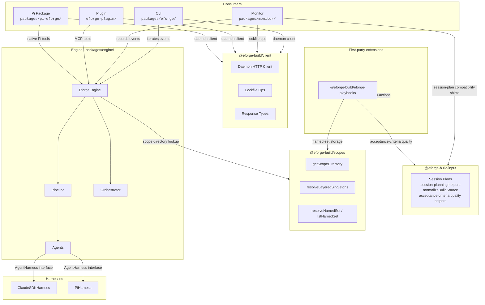
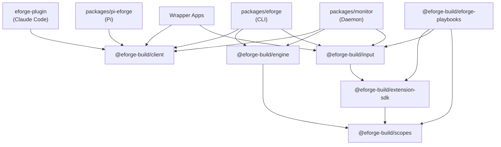
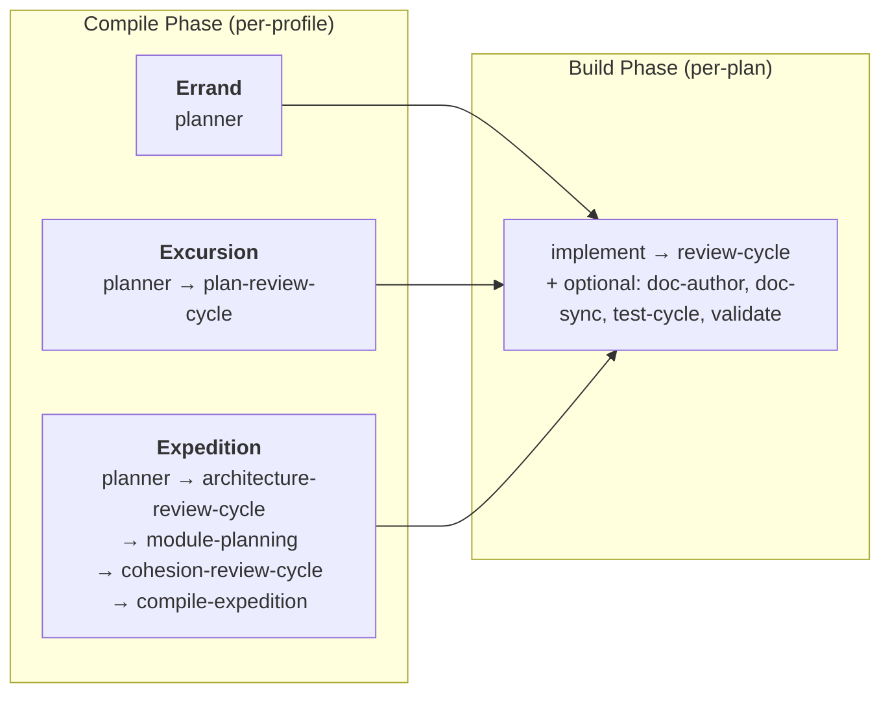
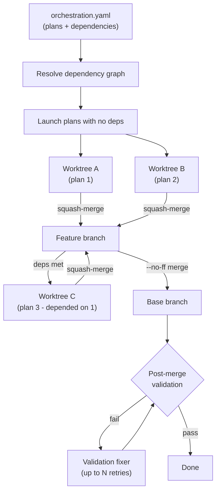

# Architecture

eforge is **library-first**. The engine is a pure TypeScript library that communicates through typed `EforgeEvent`s via `AsyncGenerator` - it never writes to stdout. CLI, web monitor, Claude Code plugin, and Pi package are thin consumers of the same event stream.

## Kernel and extension boundary

The engine is the build-engine kernel. It owns normalized build-spec intake, deterministic compile preflight and prompt-source compaction, bounded compile planning-unit limits and decomposition models, persisted artifact validation, dependency-aware branch/worktree orchestration, the compile/build execution loop, conservative validation and review gates, typed failure/recovery dispatch, and baseline console observability/control events. The engine consumes normalized build source and emits typed `EforgeEvent`s; it does not own the authoring experience that produced that source.

Input surfaces and richer workflow UX sit outside the engine kernel. Playbooks, session plans, wrapper apps, CLI prompts, and PRD files are normalized before they reach the queue; planning workbenches, toolbelts, shell hooks, policy modules, host integrations, and native extensions can shape how work is prepared or governed without becoming engine internals. This boundary keeps the kernel reusable while letting extensions and hosts adapt eforge to different teams and workflows.

## System Layers

## Package Topology

The workspace is organized into packages with explicit, one-way dependency edges. The most important constraint is that `@eforge-build/engine` MUST NOT depend on `@eforge-build/input`, and `@eforge-build/input` MUST NOT depend on `@eforge-build/engine`. This keeps the engine input-agnostic - it always receives normalized build source regardless of producer. Producers can include first-party workflow extensions, session plans, wrapper apps, CLI prompts, or PRD files.

**Allowed dependency edges:**

- `engine` MAY depend on `scopes`. MUST NOT depend on `input`.
- `input` MAY depend on `extension-sdk` for project-local session-plan paths and scoped extension input contexts. MUST NOT depend on `engine` or `scopes`.
- `extension-sdk` MAY depend on `scopes` for scoped path/storage helpers.
- `monitor` MAY depend on `input`, `engine`, and `client`.
- CLI, Pi extension, and plugin SHOULD use `client` for daemon-backed flows; direct `input` imports are allowed only for in-process normalization paths (e.g. the CLI's in-process `eforge build` path).
- First-party extension packages MAY depend on `extension-sdk` and public input/scopes/client packages needed for their contribution contracts. The first-party workflow extension package depends on `extension-sdk`, `scopes`, and domain-neutral acceptance-criteria quality helpers.

Playbook-specific daemon, client, and host-facade APIs are removed. Playbook behavior is exposed through generic extension contribution invocation: the first-party `@eforge-build/eforge-playbooks` extension owns the action/contribution surface for list/load/save/write/move/copy/validate/compile/planning-handoff behavior, owns local parser/storage/compiler/seed behavior, imports `@eforge-build/scopes` for named-set storage, uses only domain-neutral acceptance-criteria quality helpers from the input layer, and enqueues autonomous runs through `ctx.buildQueue.enqueue`.

Session-plan routes and the `eforge_session_plan` tool follow a `client` → `monitor compatibility shim` → `input session-planning helpers` → lower-level input helpers chain: `API_ROUTES.sessionPlan*` constants and response types live in `@eforge-build/client`, the daemon routes keep local HTTP security/request validation/error mapping in `packages/monitor/`, and the bundled session-planning adapter in `@eforge-build/input` owns session-plan domain behavior before reaching lower-level input helpers. The MCP proxy (Claude Code) and Pi extension each register an `eforge_session_plan` tool that dispatches all session-plan mutations against the client constants. The Claude Code MCP proxy uses `daemonRequest` (auto-starting); the Pi extension uses `requireDaemon` from its local no-start wrapper layer, which throws with explicit-start guidance when no daemon is live.

**Why:** Keeping the engine input-agnostic means future wrapper apps can reuse `@eforge-build/input` protocols without pulling in engine internals.

### Engine

`packages/engine/` is the library core. The public API is the `EforgeEngine` class, which exposes methods for compiling, building, enqueueing, and queue processing - all returning `AsyncGenerator<EforgeEvent>`. The engine consumes normalized PRD/build source. Reusable input-artifact protocols live outside the engine: playbook behavior lives in `@eforge-build/eforge-playbooks`, session-plan behavior lives in `@eforge-build/input`, and the engine has no dependency on either package.

### CLI

`packages/eforge/` is a thin consumer. Parses arguments via Commander, iterates the engine's event stream, and renders to the terminal. Also manages the daemon process and handles interactive clarification prompts.

### Monitor

`packages/monitor/` provides the local web dashboard host. Events are recorded to SQLite via transparent middleware - this runs even with `--no-monitor`. The web server serves the Console React SPA over SSE at `/console/`, redirects root UI requests to Console, runs as a detached process, and survives CLI exit. Direct playbook daemon services are removed; the first-party `@eforge-build/eforge-playbooks` extension owns the native playbook action/contribution surface. Session-plan and session-plan-set services lazily call the bundled session-planning adapter from `@eforge-build/input`, and session-plan source paths are adapter-normalized before reaching engine queue helpers.

### Plugin

`eforge-plugin/` is the Claude Code integration. It exposes MCP tools that communicate with the daemon via `mcp__eforge__eforge_*` tool calls for init, build, queue, status, config, extension management, extension contribution discovery/detail/invocation, session-plan, and daemon operations; extension-management and contribution tool text uses compact defaults and a 12,000-character host-output budget, with raw/debug inspection left to CLI `--json` or daemon/client HTTP APIs. Playbook behavior is reached through `eforge_extension_contribution` and the first-party `eforge-playbooks` actions rather than direct playbook daemon tools or plugin slash-command skills. The `/eforge:init` skill drives project onboarding interactively (harness, provider, model selection via a Quick or Mix-and-match flow), then calls `eforge_init` as a pure persister - the tool accepts a fully-assembled `profile` object and writes config to disk. The tool does not elicit input itself.

### Pi Package

`packages/pi-eforge/` is the native Pi extension. It exposes native Pi tools that communicate with the daemon via HTTP API for init, build, queue, status, config, extension management, extension contribution discovery/detail/invocation, session-plan, and daemon management; extension-management and contribution tool text uses compact defaults and the shared 12,000-character host-output budget, with raw/debug inspection left to CLI `--json` or daemon/client HTTP APIs. Playbook behavior is reached through `eforge_extension_contribution` and the first-party `eforge-playbooks` actions rather than direct playbook daemon tools, native commands, or Pi skills. Native Pi commands handle agent runtime profile management (`/eforge:profile`, `/eforge:profile:new`), config viewing (`/eforge:config`), status dashboards (`/eforge:status`), safe daemon restarts (`/eforge:restart`), build source review (`/eforge:build`), and extension contribution browsing (`/eforge:extensions` list/show/invoke without dumping raw manifests by default); variable-length read-only content is shown in scrollable panels, while compact choices use keyboard-driven selectors. Skill-based slash commands (`/eforge:init`, `/eforge:extend`, `/eforge:recover`, `/eforge:update`) provide host guidance where conversational reasoning is required; eforge-plan planning entry, SQLite store/search actions, workstation routing, and deep links are discovered through generic extension contributions rather than host-owned slash commands. The Claude Code MCP proxy and the Pi extension both use `@eforge-build/client` (`packages/client/`) for the daemon HTTP client and response types - a zero-dep TypeScript package that is the canonical source for the daemon wire protocol. Routes are centralised there too: `API_ROUTES` plus a typed helper per route (`apiEnqueue`, `apiCancel`, `apiHealth`, ...) live under `packages/client/src/api/`, and the daemon (`packages/monitor/src/server.ts`), CLI, MCP proxy, Pi extension, and Console all dispatch off the same constants so a route rename surfaces as a type error.

## Event System

`EforgeEvent` is a discriminated union. All event types follow a `category:action` naming pattern. Major categories:

Prefixes carry scope unambiguously:

| Category | Scope | Purpose |
|----------|-------|---------|
| `session:*` | Run-wide envelope (`sessionId`) | Session lifecycle boundaries |
| `phase:*` | Per-command phase (`runId`) | Phase lifecycle boundaries |
| `config:*` | Run-wide | Config-load diagnostics (`config:warning` for malformed fields, unknown keys, stale markers) |
| `planning:*` | Compile-phase activity, one set per phase (`plans: PlanFile[]`) | Planning, plan review, architecture review, cohesion review, submission, preflight risk, scope/context failure, artifact-validation error, and load-time `planning:warning` diagnostics. The `planning:complete` event also carries an optional `planConfigs: Array<{ id; build; review }>` field with per-plan build stage and review profile configs - persisted in SQLite so the monitor can reconstruct stage breakdowns after worktrees are cleaned up. The `planning:pipeline` event carries the planner's scope classification, compile pipeline, default build stages, default review profile, and rationale. `planning:preflight` carries bounded compile-risk representatives; `planning:scope-context:failure` persists bounded compile scope/context failure evidence, including optional decomposition-exhaustion evidence. `planning:decomposition:*` events describe bounded context-managed planning units, schedules, budgets, compact handoffs, and synthesis results without raw source, raw content, prompts, or transcripts. CLI, Console, and recovery sidecar markdown render these as typed compile-resilience diagnostics rather than generic plan-build failures. Continue-repair sessions do not replay `planning:*` history. |
| `plan:*` | Per-plan artifact lifecycle (`planId`) | Per-plan build (`plan:build:*`), per-plan merge (`plan:merge:*`), per-plan schedule readiness (`plan:schedule:ready`) |
| `build:resume:*` | Continue-repair session lifecycle | Continue-and-repair eligibility, seeded state, recovered artifact projection (`build:resume:artifacts`), and completion. The artifact projection is persisted as session-scoped metadata so monitors can render recovered source and plan rows without duplicating historical planning, agent, token, or cost activity. |
| `merge:finalize:*` | Run-wide feature-branch finalization | Final merge of the feature branch to the base branch (`merge:finalize:start`, `merge:finalize:complete`, `merge:finalize:skipped`) |
| `schedule:start` | Run-wide (session-scoped, `planIds: string[]`) | Orchestration kickoff |
| `expedition:*` | Wave / module orchestration (`wave` / `moduleId`) | Expedition-specific planning phases |
| `agent:*` | Per-agent invocation (`agentId`) | Agent lifecycle and streaming |
| `validation:*` | Run-wide | Post-merge validation |
| `queue:*` / `enqueue:*` | Run-wide | PRD queue operations |
| `prd_validation:*` | Run-wide | PRD validation (`prd_validation:start`, `prd_validation:complete`) |
| `gap_close:*` | Run-wide | PRD validation gap closing (`gap_close:start`, `gap_close:complete`) |
| `acceptance_validation:*` | Run-wide | Per-criterion acceptance verdict from the PRD validator (`acceptance_validation:complete`) |
| `reconciliation:*` | Run-wide | Reconciliation (`reconciliation:start`, `reconciliation:complete`) |
| `cleanup:*` | Run-wide | Cleanup (`cleanup:start`, `cleanup:complete`) |
| `approval:*` | Run-wide | Approval flow (`approval:needed`, `approval:response`) |

The CLI composes async generator middleware around the engine's event stream - transformers that stamp session/run IDs, fire hooks, and record to SQLite without altering the events themselves.

## Pipeline

The engine uses a two-phase pipeline. Each phase is a sequence of named stages - async generators registered in a global stage registry.

- **Compile stages** run once per build. The stage list is declared per-profile. Before agent compile stages run, eforge strips the hidden acceptance-criteria inventory, emits `planning:preflight`, keeps the full visible source for traceability and validation, and may pass compacted prompt source to the pipeline composer, planner, and module planner when generated or machine-readable bulk is detected. After pipeline composition, retry-as-expedition escalation, and any selected-scope preflight recomputation, the planner stage chooses direct planning or bounded context-managed decomposition. Normal, elevated, retry-as-expedition, and manual-reduce-scope inputs keep the direct planner path; overflow-risk inputs with a bounded-decomposition recommendation use planning units governed by the top-level `compile.planningUnit*` limits. The pure planning-decomposition model derives acceptance-criteria coverage, source slices, dependency/constraint edges, scheduler batches, budget pressure, recursive splits, and typed decomposition-exhaustion evidence before any agent-facing orchestration consumes those units. Planner-family agents apply prompt and live context-budget guardrails after prompt assembly and during non-final usage updates, so oversized compile context can stop through the typed scope/context failure path before a provider hard context-window failure. For Pi-backed agents, live context guard token limits are derived from Pi ModelRegistry metadata when available, including provider/model context window, effective output reserve, overhead reserve, safety margin, and metadata-source/fallback diagnostics on scope/context failures; planner-family Pi guards cap large output metadata before using it as the effective reserve. Prompt byte defaults remain static byte guards and are not inferred from model metadata. After the compile pipeline finishes, the engine validates persisted plan-set artifacts before reporting compile success.
- **Build stages** run once per plan. The stage list is per-plan, stored in `orchestration.yaml`.

### Compile stages

| Stage | Description |
|-------|-------------|
| `planner` | Direct planning explores codebase, selects profile, submits a plan set via `submit_plan_set` or architecture via `submit_architecture`, and the engine writes plan files and `orchestration.yaml` from the validated payload. Overflow-risk bounded-decomposition inputs enter the context-managed controller instead of one broad root planner session. Tool validation failures return bounded diagnostics with schema path, expected/received type summaries, payload byte count, SHA-256 hash, omitted-byte/truncation metadata, and compact excerpts rather than echoing raw submitted arguments. The `AgentHarness` translates bare tool names into the harness-visible identifier (Claude SDK prefixes `mcp__eforge_engine__`; Pi uses the bare name). |
| `plan-review-cycle` | Blind review of plans against PRD, with fix and evaluate loop |
| `architecture-review-cycle` | Reviews architecture doc for module boundary soundness and integration contracts |
| `module-planning` | Writes detailed plans for each module using architecture context |
| `cohesion-review-cycle` | Reviews cross-module plan cohesion for consistency and integration gaps |
| `compile-expedition` | Validates expedition module files, then compiles module plans into final plan files and orchestration |

### Context-managed planning-unit execution

Context-managed planning invokes planner-family agents through a bounded planning-unit facade rather than through the direct root compile path. The controller schedules ready units concurrently up to `compile.planningUnitParallelism` (default `2`) while honoring dependency, interface, shared-file, and recursive split constraints. Each unit prompt contains only the unit source slice, covered acceptance criteria, subsystem hints, dependency and shared-file constraints, capped upstream handoff summaries or references, and the unit's own budgets. The prompt explicitly states that full root source, root transcripts, and prior raw tool results are unavailable by design.

Bounded planner and module-planner runs use capture-only submission tools: planner submissions are validated with the existing plan-set or architecture schemas, while bounded module-planner runs capture `submit_module_plan` markdown. These captured payloads become `PlanningUnitOutput` suggestions for later synthesis; unit runs do not write root `orchestration.yaml`, `architecture.md`, module files, or root completion events. Direct planner and direct module-planner runs keep their existing file-writing behavior when bounded options are absent.

Compact continuation is unit-local. If local exploration exceeds the unit budget, planner-inspection handoffs are written under the unit artifact directory and synthesis restarts from the unit source plus compact handoff markdown, not from an accumulated root planning transcript. The facade emits `planning:decomposition:unit:*`, `planning:decomposition:budget`, and `planning:decomposition:compact-handoff` events with bounded diagnostics and returns a `PlanningUnitOutput` carrying captured suggestions, discovered files, contract notes, unresolved requirements, compact handoff references, and observed budget pressure.

The controller persists bounded evidence under the plan set's `.decomposition/` directory, including the graph and per-unit outputs. These artifacts contain source slice summaries, criteria coverage, budget observations, handoff references, and artifact paths, but not raw root source, prompts, transcripts, or unbounded agent output. Successful synthesis writes the same compile artifacts as the direct path: expedition architecture/index/module definitions or excursion plan files plus `orchestration.yaml`; it does not author external PRDs or enqueue follow-up work.

### Compile artifact validation

Compile success is gated on persisted artifacts, not only on planner events. For non-skipped compile runs, `orchestration.yaml` must exist, parse successfully, contain the injected effective compile pipeline, and reference a valid plan set. Every referenced plan file must exist under the plan-set directory, parse as a `PlanFile`, match the orchestration entry's `id` and branch, and contain a non-empty body. The engine reloads `ctx.plans` from these validated persisted plan files before the no-review artifact commit path.

Artifact-validation failures fail closed: the compile phase emits `planning:error` and ends with `phase:end` status `failed` using a bounded summary. The summary shape is the client-owned `CompileArtifactSummary`, shared with compile scope/context recovery evidence, so consumers do not need a separate engine-defined wire contract. A `planning:skip` compile remains a valid terminal path and does not require plan artifacts.

Expedition compilation has an additional stage-boundary check. Before deterministic expedition compilation, the stage parses the expedition `index.yaml`, checks that module IDs match the architecture/module context, and verifies each `modules/<id>.md` file exists with non-whitespace content. After compilation, the same persisted-artifact success gate runs before expedition completion events are emitted.

### Build stages

| Stage | Description |
|-------|-------------|
| `implement` | Builder agent codes the plan, runs verification, commits changes. When the planner emits a `shards` block under `agents.builder`, the stage fans out to N parallel builder invocations within the same worktree (each scoped to a `roots`/`files` partition), then a coordinator phase pops any per-shard retry stashes, enforces scope, and produces the single per-plan commit. Sharded plans must include `review-cycle` (the engine injects it if missing); integration verification runs there via the `verify` perspective rather than in the coordinator. |
| `review-cycle` | Composite: expands to `review` -> `review-fix` -> `evaluate`. Supports multiple reviewer perspectives: `code`, `security`, `api`, `docs`, `test`, and `verify`. The `verify` perspective runs the plan's verification commands as subprocesses and emits a critical issue per failing command (including full stdout/stderr), so the review-fix loop can repair failures without restarting the build. Sharded plans always include the `verify` perspective. |
| `doc-author` | Authors plan-specified documentation in parallel with implement |
| `doc-sync` | Syncs existing documentation against the post-implement diff |
| `test-write` | Writes tests from the plan spec (TDD - runs before `implement`) |
| `test-cycle` | Composite: iterates `test` then `evaluate` up to `maxRounds`. The tester agent runs tests, debugs failures, and writes production fixes inline; the evaluator then judges those fixes. There is no separate `test-fix` substage. |
| `validate` | Runs registered extension validation providers as per-plan quality gates before review. Structured provider failures can route to narrow review-fixer recovery or structural validation-fixer recovery; post-merge command validation remains orchestrator-owned. |

Build stages support parallel groups - arrays in the stage list run concurrently. For example, `[['implement', 'doc-author'], 'doc-sync', 'review-cycle']` runs implement and doc-author in parallel, then doc-sync sequentially, then review-cycle after both complete.

## Workflow Profiles

Profiles control which compile stages run. The `pipeline-composer` agent classifies input complexity and selects the initial profile, or the user can specify one explicitly. Compile scope/context recovery may escalate an errand or excursion compile to expedition once, or report bounded-decomposition guidance with decomposition evidence, when preflight or planner-stage evidence shows that is the bounded recovery path.

**Errand** - Small, self-contained changes. Compile: `[planner]`. The planner generates a single simple plan or skips if nothing to do.

**Excursion** - Multi-file feature work. Compile: `[planner, plan-review-cycle]`. Direct planning uses a single planning pass; overflow-risk bounded-decomposition inputs synthesize the same plan artifacts from bounded planning units.

**Expedition** - Large cross-cutting work. Compile: `[planner, architecture-review-cycle, module-planning, cohesion-review-cycle, compile-expedition]`. Decomposes work into modules, each planned independently with architecture and cohesion review across the set; context-managed compiles cap downstream module-planning waves to the resolved planning-unit parallelism.

The three built-in profiles cover the supported workflow modes; the `pipeline-composer` selects among them per build. See [config.md](config.md) for tier and role configuration.

## Agents

Agents are stateless async generators. Each accepts options (including an `AgentHarness`) and yields `EforgeEvent`s. Agents never import AI SDKs directly - all LLM interaction goes through the `AgentHarness` interface.

Two harness implementations exist:
- **ClaudeSDKHarness** - uses `@anthropic-ai/claude-agent-sdk`
- **PiHarness** - uses pi-mono for multi-provider support (OpenAI, Google, Mistral, and more)

Agent roles by tier:

| Tier | Roles |
|------|-------|
| **Planning** | planner, module-planner, formatter, pipeline-composer, merge-conflict-resolver, gap-closer |
| **Implementation** | builder, doc-author, doc-syncer, review-fixer, validation-fixer, test-writer, tester, recovery-analyst, dependency-detector, prd-validator, staleness-assessor |
| **Review** | reviewer, architecture-reviewer, cohesion-reviewer, plan-reviewer |
| **Evaluation** | evaluator, architecture-evaluator, cohesion-evaluator, plan-evaluator |

Per-role configuration (effort level, thinking, tool filters, maxTurns, promptAppend, and builder-only shards) is set via `eforge/config.yaml` under `agents.roles`. See [config.md](config.md). Model, harness, and provider always flow from the role's tier - they cannot be overridden per role.

### Blind review

Quality requires separating generation from evaluation. The reviewer operates without builder context - it sees only the code diff, not the builder's reasoning. The review-fixer applies suggested fixes as unstaged changes. The evaluator then judges each fix against the original plan intent, accepting strict improvements and rejecting changes that alter intent. This same three-step pattern (blind review -> fix -> evaluate) applies to plan review, architecture review, and cohesion review.

The `verify` perspective is an exception to the diff-only rule: instead of reading a diff, it runs the plan's verification commands as subprocesses and emits one critical issue per failing command, with the full exit code and stdout/stderr in the issue's fix element. The review-fixer then applies the necessary edits - which may touch files outside the original diff - and the evaluator accepts or rejects as usual. This allows integration failures in sharded builds to flow through the same iterative fix cycle as code-review issues.

Validation-provider recovery uses the same evaluator boundary with additional routing. Structured provider annotations become review issues with optional `repairClass`, `retryGuidance`, `failureKind`, and `metadata`. Narrow or unspecified issues enter the review-fixer path; structural issues enter the validation-fixer path; repeated signatures that survive a narrow attempt are escalated to structural repair. Before each automated validation-provider repair, the engine writes `.eforge/validation-recovery/.../checkpoint.patch` and `metadata.json` and includes those checkpoint references in both the fixer and evaluator contexts.

## Orchestration

`orchestration.yaml` (written during compile) defines plans with a dependency graph. The orchestrator uses a **greedy scheduling algorithm** - each plan launches as soon as all its dependencies have merged, without waiting for a full "wave" to complete.

Each plan builds in an **isolated git worktree**. Worktrees live in a sibling directory to avoid polluting the main repo. Plans run as soon as their dependencies are met - since plan execution is IO-bound (LLM calls), no throttle is needed.

When a plan completes and merges, the orchestrator immediately checks if any pending plans now have all dependencies satisfied, and launches them. Plans squash-merge back to the feature branch as they finish - a plan only merges after all its dependencies have merged. If a merge conflict occurs, the merge-conflict-resolver agent attempts resolution using context from both plans. After all plans merge, the feature branch merges to the base branch via `--no-ff`, creating a merge commit that preserves the full branch history while keeping the base branch's first-parent history clean.

**PRD validation gap closing** - When PRD validation finds gaps between the spec and implementation, the validator assesses completion percentage and per-gap complexity (trivial, moderate, significant). The validator also produces a per-criterion acceptance verdict (`acceptance_validation:complete`) for every criterion in the canonical PRD inventory: `pass` with specific evidence, `fail` with what is missing, or `unknown` when the diff is insufficient to verify the criterion. Missing or unparseable verdict output is treated as `unknown` (fail-closed). Build success requires `acceptance_validation:complete passed:true` — absent or failed acceptance evidence causes the build to fail even when `prd_validation:complete passed:true` was emitted. A viability gate checks the completion percentage against a configurable threshold (default 75%) - if too much work remains, the build fails immediately rather than attempting a doomed fix-forward. When viable, the gap closer runs a two-stage pipeline: a plan-generation agent (using the planning tier maxTurns) produces a targeted markdown plan scoped to the gaps, then that plan is executed through `runBuildPipeline` with `implement` and `review-cycle` stages - giving the builder continuation/handoff support and blind review. All gap-close build events use `planId: 'gap-close'`, which Console renders as a distinct "PRD Gap Close" swimlane. If plan generation fails, the gap close completes non-fatally without attempting execution. The gap closer must emit `gap_close:complete passed:true`; a `passed:false` result or a missing terminal event fails the build immediately without proceeding. After `gap_close:complete passed:true`, both deterministic validation and PRD/acceptance validation rerun in full before artifact recording — if either rerun fails or acceptance is inconclusive, no artifact record is written.

**Acceptance criterion cross-checking** - Acceptance validation uses the canonical inventory persisted at enqueue: the PRD validator emits exactly one verdict per stable `ac-###` criterion loaded from the queued PRD's hidden inventory block. The hidden block is stripped from planner, validator, dependency, staleness, profile-router, and provenance prose. There is no partial or skipped set — every criterion either passes, fails, or is unknown. The `passed` field on `acceptance_validation:complete` is `true` only when every verdict is `pass` or is covered by an explicit waiver; any `fail` or `unknown` verdict without a matching waiver sets `passed:false` regardless of the command validation result. Waivers are policy overrides that declare an intentional exception — they are not substitutes for evidence. They surface in the Console timeline detail panel alongside the waiver reason string so the reviewer can confirm intent.

**No-validator policy** - Queued PRD builds require the persisted canonical inventory. If the hidden inventory block is missing, duplicated, or malformed, the build fails before orchestration and the PRD must be re-enqueued. Builds with an empty validated inventory do not automatically produce a passing `acceptance_validation:complete`: without `build.validation.allowNoAcceptanceCriteria: true` and a non-empty `noAcceptanceCriteriaReason`, acceptance validation fails. When no `prdValidator` is configured at all, the same waiver path applies. Separately, an empty implementation diff (no changes relative to the base branch) causes `prd_validation:complete passed:false` immediately — the validator cannot confirm that any criterion was addressed when there is nothing to inspect; set `build.validation.allowEmptyPrdDiff: true` with a non-empty `emptyPrdDiffReason` to allow such a build to pass. `builtOnMerge` plans that produce no committed file changes relative to `baseSha` fail during merge unless `build.validation.allowNoCommittedChanges: true` is set with a non-empty `noCommittedChangesReason`. Additionally, builds with zero combined validation commands (no planner-generated `validateCommands`, no configured `postMergeCommands`, and no queued PRD `postMerge` commands) fail unless `build.validation.allowNoCommands: true` is set with a non-empty `noCommandsReason`. All waiver booleans require a reason string; a missing or empty reason is rejected at config validation time.

**Gap-close rerun ordering** - The gap-close pipeline runs before artifact recording but after the initial `prd_validation:complete` assessment. Once the gap closer emits `gap_close:complete passed:true`, the full validation sequence reruns in order: deterministic command validation first, then PRD validation, then acceptance validation. The rerun is unconditional — even if the initial pass produced `prd_validation:complete passed:true`, the rerun must also pass. If either validation fails on rerun, or if acceptance evidence is inconclusive, no artifact record is written and the build is marked failed.

**Post-merge validation** runs commands from `orchestration.yaml` (planner-generated), `eforge/config.yaml` `postMergeCommands` (user-configured), and queued PRD `postMerge` metadata (per-enqueue, appended after configured commands). On failure, the validation-fixer agent attempts repairs up to a configurable retry limit.

**Committed-state invariant** — Validation commands, PRD/acceptance validation, and artifact recording all operate on the committed HEAD of the merge worktree. A `builtOnMerge` plan (single-plan build where the plan runs directly in the merge worktree) must have all implementation work committed before `mergePlan()` returns. If the merge worktree has dirty tracked or untracked files at the point where the plan is marked merged, the orchestrator rejects the merge with an error listing the offending paths. Additionally, a `builtOnMerge` plan must produce at least one committed file change relative to `baseSha` — a build where `HEAD === baseSha` (no new commits) is rejected at merge time unless `build.validation.allowNoCommittedChanges: true` is set with a non-empty `noCommittedChangesReason`. `recordArtifact()` enforces the dirty-worktree invariant independently: if the merge worktree is dirty at artifact-recording time, the build is marked failed and the artifact registry is not written. This ensures that the recorded `commitSha` always corresponds to the full, committed build output.

Build state is persisted to disk, enabling **resume** after interruption. On resume, completed plans are skipped and in-progress plans restart.

## Queue and Daemon

PRDs are enqueued as `.md` files with YAML frontmatter in `.eforge/queue/` (gitignored - runtime state only). Frontmatter carries metadata like title, priority, dependencies, status, and runtime hold state. The body also carries an eforge-owned hidden Markdown block containing the validated canonical acceptance-criteria inventory. The queue resolves processing order via topological sort on dependencies, then by priority and creation time. Lower numeric priority values run earlier within each dependency wave. Held pending or waiting PRDs keep their file location and ordering metadata, but scheduler ticks skip them until their `held` frontmatter is cleared.

Runtime queue controls mutate only `.eforge/queue/` filesystem state and produce no git commits. `eforge queue priority <prdId> <priority>` updates pending or waiting PRD frontmatter; failed and skipped PRDs return conflict until recovery or requeue makes them runnable. Hold/unhold helpers add or remove runtime-only `held`, `hold_reason`, and `held_at` frontmatter on pending or waiting PRDs; running, failed, and skipped PRDs reject hold changes. Daemon queue projections expose that state as `QueueItem.hold` plus daemon-authored `QueueItem.capabilities`, so Console and API consumers render action availability and disabled reasons without duplicating scheduler rules. `eforge queue remove <prdId>` deletes non-running pending, waiting, failed, or skipped queue files; removing a failed PRD also deletes matching `<prdId>.recovery.md` and `<prdId>.recovery.json` sidecars. Legacy remove remains target-only and fails closed when live pending/waiting dependents still reference the item. Cascade remove and cancel use a two-phase preview/apply flow: preview performs read-only snapshot and lock classification, apply rechecks an opaque expected-affected token and affected id list, and dependent mutation requires explicit confirmation. Running PRD cancellation is accepted only with live queue-lock evidence plus daemon-supplied run/session ownership evidence; the engine writes a cancellation marker so the child finalizer records an operator cancel as skipped instead of failed. Failed enqueue attempts are preserved separately from queue files as `FailedEnqueueInfo` projections in `DaemonStreamSnapshot.failedEnqueues`; `daemon:failed-enqueue:upsert` adds or replaces durable attention rows, `daemon:failed-enqueue:resolved` removes them after successful re-enqueue, and the daemon re-enqueue route reuses source data only when that source is still available. After any successful queue mutation, failed-enqueue re-enqueue, or recovery transition, the daemon records the mutation; when the scheduler is not explicitly paused, it reconciles and re-reads queue files before dispatch so moved, missing, or edited files are authoritative.

When the daemon dispatches a PRD from the queue, it writes a canonical copy to `eforge/prds/{prdId}.md` — a committed provenance record that links the build session to its originating requirements. Queue state in `.eforge/queue/` is ephemeral runtime state; `eforge/prds/` captures what was built and survives queue cleanup. The hidden inventory is consumed for validation IDs but stripped from the committed prose artifact.

The **daemon** (`eforge daemon start`) is a long-running process that watches the queue directory. When a new PRD appears, the daemon claims it via an atomic lock file (prevents double-processing across concurrent workers), runs a staleness check against the current codebase, and processes it through the compile-build pipeline.

**Auto-build** mode (default) automatically processes PRDs on enqueue. The daemon spawns a worker process for each build, tracking progress via SQLite. Disabling auto-build changes desired state and prevents automatic queue dispatch until it is enabled again. Scheduler pause is a separate runtime gate: failed builds or an operator pause stop new scheduler launches until explicitly resumed without disabling desired auto-build state, while already-running workers continue unless explicitly cancelled. The daemon shuts down after a configurable idle timeout.

**Explicit deterministic handoff** — Pass `afterQueueId` to the `eforge_build` MCP/Pi tool or `--after <queue-id>` to the CLI to create an explicit dependency on an upstream queue entry. Active upstream items (pending/running/waiting) cause the dependent PRD to be placed in `.eforge/queue/waiting/` and unblocked when the upstream reaches a terminal state. Completed upstream items with a usable artifact cause the dependent PRD to be enqueued immediately as an eligible dependent in the queue root. Failed, skipped, and unknown IDs are rejected at enqueue time. Explicit `afterQueueId` takes precedence over any automatic dependency detection performed during enqueue. Dependency detector inference remains best effort and is used only when no explicit dependency is supplied.

**Piggyback scheduling** — PRDs with unsatisfied active dependencies (upstream entries still in `pending`, `running`, or `waiting/`) are held in a `waiting` state and not dispatched until each such upstream entry reaches a terminal state. PRDs whose dependencies are already completed with usable artifacts are eligible immediately and remain in the queue root rather than `waiting/`. On any terminal transition the dispatcher re-evaluates all `waiting` entries: upstream `completed` removes that id from the dependent's unsatisfied set and, once the set is empty, transitions the dependent to `pending` so the normal concurrency limit picks it up; upstream `failed` or `cancelled` transitions the dependent directly to `skipped` with a reason of `upstream <id> <state>`. Skip propagation is recursive - if a `skipped` entry itself has dependents, those also become `skipped`. The `eforge queue list` command renders piggybacked entries indented under their parent (two-space indent with an `↳ ` prefix); the Console Now dashboard keeps active stack visualizations limited to `pending`, `running`, and `waiting` rows, and the Queue card preview lists only forward `pending`/`waiting` rows while `failed` and `skipped` terminal rows surface in the Needs attention strip. Live `queue:prd:discovered` events carry `dependsOn` from PRD frontmatter, and `daemon:scheduler:dependency-blocked` events can patch an existing live row, so stream projection preserves dependency metadata for the same active dependency display as queue snapshots. Pre-session dispatch blockers emit durable `queue:prd:dispatch-failed` events with a stage (`stacking-validation`, `policy-gate`, `profile-routing`, or `dispatch`), and queue projection attaches `dispatchFailure?: { reason, stage, timestamp }`, hold state, and queue-control capabilities to the item until live rediscovery clears stale failure data; daemon `GET /api/queue` responses and `stream:hello.queue` snapshots use the same projection. `stage` is one of `stacking-validation`, `policy-gate`, `profile-routing`, or `dispatch`; `reason` is the blocker text and `timestamp` is the event time. Extension-originated enqueue requests that specify `afterQueueId` enter the build pipeline without an additional interactive review gate - the caller approved the generated build source before enqueue.

When a build fails, the queue parent's finalize handler runs the recovery-analyst agent inline (synchronously, before the PRD is moved) against the still-present `state.json`. The PRD is moved to `failed/` and both sidecar files (`<prdId>.recovery.md`, `<prdId>.recovery.json`) are written via filesystem-only operations - there is no window where `failed/` has a PRD without sidecars. Queue state lives under `.eforge/queue/` which is gitignored; no git commits are produced for queue mutations. The recovery-analyst operates with `tools: 'none'` and runs under a 90-second timeout; on any error or timeout, a sidecar is still written, with a verdict from deterministic recovery policy (`retry` or `continue-repair`) when automation is safe or a `manual` fallback when deterministic policy cannot automate recovery. The JSON sidecar uses the concise v3/v4 contract: top-level `prdId`/`setName`, `verdict`, operator `report`, bounded evidence, `generatedAt`, optional read-only recovery guidance (`continueRepairEligibility` and `recoveryOptions`, including continue-repair and compile scope/context options with bounded `decompositionEvidence` when decomposition exhausts), and optional durable `applied` metadata. Degraded-context cases are represented with bounded evidence identity `partial` plus verdict recovery metadata such as `recoveryError`. Recovery can also be triggered manually via the `eforge_recover` MCP tool (Claude Code plugin), the `recover` Pi tool, or `eforge recover` CLI - useful for backfilling sidecars on PRDs already in `failed/` before this architecture was in place. When `state.json` is missing (manual backfill scenario), `buildFailureSummary` synthesizes partial evidence from monitor.db events and git history, and the sidecar writer records `partial: true` in bounded evidence identity. The resulting sidecar can be read back through `eforge_read_recovery_sidecar` / `readRecoverySidecar`. Once a verdict has been reviewed, `applyRecovery(prdId)` on `EforgeEngine` enacts it: `retry` prepares compiled-plan recovery guidance first (creating a tracked guidance commit when artifacts need patching), then moves the PRD back to the queue root and removes both sidecars via filesystem-only queue mutation; `continue-repair` delegates to the compiled-artifact queue transition, queues the failed PRD for scheduler dispatch, and reactivates skipped descendants whose dependency chain reaches the parent; `abandon` removes all three paths under `.eforge/queue/failed/`; `manual` is a no-op that returns `noAction: true` and points the operator at bounded manual replanning. The apply path is exposed as `POST /api/recover/apply` on the daemon, the `eforge_apply_recovery` MCP tool (Claude Code plugin and Pi), and the `eforge apply-recovery <prdId>` CLI subcommand. Continue-and-repair also has a direct queueing surface for eligible compiled artifacts: `POST /api/recover/continue-repair`, the `eforge_continue_repair` MCP/Pi tool, and `eforge continue-repair <prdId> [--set-name <name>] [--profile <name>]` all preserve existing queued/already-queued idempotency while returning queued metadata rather than a worker session. On successful continued builds, the engine verifies the built artifact, upserts the completion entry as `completed` with `artifactAvailable: true`, removes failed/root PRD files and recovery sidecars, releases the lock, and then runs normal waiting-unblock semantics. Failed or ineligible continued builds roll the parent back to `failed/`, release the lock, and move reactivated descendants back to `skipped/` without overwriting colliding queue files. Pre-activation ineligible rollbacks may preserve existing recovery sidecars byte-for-byte. Once activation has occurred, failed continued runs refresh sidecars from current run evidence; if that evidence is incomplete, the engine writes a degraded manual sidecar or removes stale sidecars when writing fails so pre-continue evidence is not left authoritative. For failed upstreams that also skipped descendants, the daemon exposes queue-cascade recovery through `POST /api/queue/recovery/analyze` and `POST /api/queue/recovery/apply`; analysis returns dependency classifications, dispatch preflight results, and available bounded metadata repairs in addition to the move operations. The daemon apply route accepts selected repair actions and dependency-removal confirmation fields from the client-owned request contract, passes them through to the engine, and returns repair results without reshaping the wire response. The engine re-reads queue state, refuses the batch on drift, requires explicit confirmation before removing satisfied `depends_on` entries, validates selected `stack_parent` choices, simulates repairs, and refuses to move any files while preflight still reports a dispatch blocker. The `/api/queue` endpoint post-filters `dependsOn` before responding: terminal items (`failed`, `skipped`) never expose a `dependsOn` field, and live items (`pending`, `running`, and `waiting`) expose only `dependsOn` IDs that match other live items in the same response - mirroring `resolveQueueOrder`'s runtime semantics so the UI's view of dependencies is always consistent with what the scheduler actually acts on.

**Recovery guidance** — Compiled-artifact continue-and-repair uses the recovery sidecar as the durable source of failure evidence before builders read preserved plan markdown. The mutating guidance path reads `.eforge/queue/failed/<prdId>.recovery.json`, validates the sidecar metadata and caller overrides, resolves the feature/base branches and plan output directory, and renders a deterministic `## Recovery Guidance` section into the relevant compiled plan artifacts. When compile scope/context recovery options carry `decompositionEvidence`, the guidance section includes bounded failed-unit evidence and states that direct retry/apply-recovery actions do not mutate decomposition state or auto-author successor PRDs. Read-only analysis and eligibility projections remain mutation-free: only explicit prepare/apply paths patch compiled plan markdown.

**Recovery guidance integration** — Before `prepareFailedPrdForQueuedCompiledResume()` moves a failed PRD back to the queue, and before the engine resume path parses `orchestration.yaml` or plan markdown, the engine prepares recovery guidance. If any root target is missing, blocked, unsafe, or dirty, the continue/resume path returns or emits an ineligible/blocked result and leaves queue files and plan artifacts unchanged. When guidance creates a commit, resume eligibility is checked again so branch-history restoration and patched merge-worktree artifacts are the source read by the resumed builders.

**Root-only recovery guidance** — The guidance target set is derived from `boundedEvidence.failingPlans` when present, falling back to `boundedEvidence.failingPlan`. Only those root failed plan ids are eligible for patching. Downstream dependents that were skipped or blocked because of the root failure are intentionally not patched, even if their compiled markdown files exist.

**Idempotent plan artifact mutation** — Each target plan receives exactly one canonical heading line, `## Recovery Guidance`. If a plan has no section, the engine appends one at EOF; if one or more sections already exist, it replaces the first section and removes later duplicates. Byte-identical output reports `already-current` and is not rewritten. Per-root responses use the client-owned recovery-guidance statuses (`patched`, `already-current`, `artifact-missing`, or `blocked`) so daemon and UI code do not redeclare engine wire shapes.

**Git helper discipline** — Guidance patches are committed only from the feature-branch merge worktree, through `forgeCommit()`, with path-limited staging. If compiled artifacts are only reachable from feature-branch history, the engine restores the full plan-set directory into the merge worktree, patches the root plans, and commits the restored plan-set paths plus patched root paths. Preflight rejects unsafe ids/paths/refs and pre-existing uncommitted target diffs before any write, preserving all-or-nothing root patching.

**Accept-build-as-successful recovery** is a focused human path for a failed PRD whose implementation and deterministic checks are acceptable but final PRD or acceptance validation failed (a bad, conflicting, or externally-unverifiable criterion). The daemon exposes it as a read-only preview `GET /api/recover/accept-success/preview` and an audited apply `POST /api/recover/accept-success`. Eligibility scope is narrow: the v3 sidecar projection must indicate PRD or acceptance validation failure, carry at least one landed commit, and have all deterministic validation commands (when present) exiting `0`. The apply runs the normal post-build cleanup commit on the feature branch (or no-ops when no plan/PRD artifacts remain), applies the configured landing action (`merge` | `pr` | `leave`), records the artifact and completion metadata so dependents treat the accepted build as satisfied, and moves selected unblockable skipped dependents back to the queue root with the accepted PRD removed from their `depends_on` (using collision-safe exclusive creation so an existing queue-root PRD is never overwritten). It then writes a durable `accepted-success` applied marker (the rich `AcceptSuccessAppliedSummary`, keyed by `acceptedAt`) to the recovery sidecar; that marker is the idempotency anchor, so a repeated apply short-circuits without re-running cleanup, landing, or dependent moves. The failed PRD file and both recovery sidecars remain in `failed/` as audit records - acceptance never deletes them.

## Landing and Direct PR Publication

After all plans merge into the artifact branch, eforge executes the landing action configured via `landing.action` (`pr` | `merge` | `leave`).

`build.trunkBranch` names the trunk (detected from `origin/HEAD` at init time; defaults to `main`). `build.allowLocalMergeToTrunk` controls whether a direct local merge to trunk is permitted when `landing.action: merge`.

### Direct PR publication

For `landing.action: pr`, eforge opens a pull request from the artifact branch targeting the resolved base branch. For direct non-stacked PRs, eforge first fetches `origin/<baseBranch>`, rebases the artifact branch onto that fetched base before validation, and checks freshness again immediately before PR creation. The resolved base depends on the current branch and stacking state:

| Scenario | PR base |
|---|---|
| On trunk, no stacking | PR from artifact branch to trunk |
| On feature branch, no stacking | PR from artifact branch to feature branch |
| Stacked PRD with `stack_parent` | PR from artifact branch to parent artifact branch, unless stale-parent landing repair proves the parent artifact is integrated and lands the child artifact branch against trunk |

No local merge into the feature branch is performed. The artifact branch is the PR head and the resolved base is the PR target, giving reviewers a clean diff that reflects only the changes from this build. If the remote base advances after validation in the direct non-stacked path, eforge performs a bounded resync and validation retry before opening the PR; if freshness cannot be proven, landing fails closed.

| Current branch | `landing.action: merge` | `landing.action: pr` |
|---|---|---|
| **Trunk** | Requires `allowLocalMergeToTrunk: true`; rejected with a remediation message otherwise | PR from artifact branch to trunk |
| **Non-trunk branch** | Merges artifact branch into base branch locally | PR from artifact branch to base branch directly |

When `allowLocalMergeToTrunk` is `false` and the CLI is running interactively on trunk, it prompts before enqueue and offers four resolutions: switch to `pr`, cancel, create or switch to a feature branch, or enable the solo-dev opt-in. When `--auto` is set, the CLI defers to the engine, which rejects the build at runtime via `landing:skipped` with a reason of the form `Local merge to trunk '<trunk>' is not permitted (set allowLocalMergeToTrunk: true to opt in)`.

### Merge-strategy tradeoff and provenance preservation

eforge builds plan branches that squash-merge into the artifact branch. When the artifact branch lands into the base branch via `--no-ff`, the resulting merge commit retains the full intermediate history. This keeps every commit that added or modified plan artifacts — PRD copies in `eforge/prds/`, compiled plan files in `eforge/plans/{planSet}/`, and `orchestration.yaml` — reachable from the base branch even after `cleanupPlanFiles` removes those paths from `HEAD`. The same cleanup pass strips temporary plan-ID eforge region marker comment lines from tracked JavaScript/TypeScript-family source files while preserving semantic markers and marked code.

The durable provenance guarantee is Git history, not the final tree. Artifact references use commit SHAs (`git show <sha>:<path>`) rather than branch-relative paths so they survive cleanup. A `git show <sha>:<path>` reference points to the commit that last added or modified the file, not a branch tip — so it stays valid regardless of subsequent commits or cleanups.

**Squash and rebase landing:** if you apply a squash or rebase merge strategy after the PR is opened (for example, via GitHub's "Squash and merge" or "Rebase and merge" button), the intermediate commits on the artifact branch are collapsed or discarded. Commit-pinned artifact references that resolve against those intermediate commits become unreachable from the base branch. If preserving eforge build provenance across your Git history is important, configure GitHub to require or prefer merge commits for artifact branch PRs.

### Stacked PR topology

When `stacking.enabled: true`, the artifact branches form a linear chain. Each artifact branch targets the parent artifact branch (`stack_parent`'s artifact branch) as its PR base. Before landing, eforge preflights the remote base; if a deleted parent branch's artifact commit is already an ancestor of trunk, eforge performs automatic branch-scoped repair by using trunk as the effective base before tracking an untracked child, or by retargeting only the child artifact branch to trunk after that child is already tracked. Otherwise, landing fails closed. Stacked PR landing remains delegated to the stack provider: eforge runs provider repo sync, tracks the branch against the effective base, restacks the branch, and proves the fetched remote effective base commit is an ancestor of `HEAD` before submitting the PR. If the remote base advances during landing, eforge retries provider sync plus branch restack once and fails closed if freshness still cannot be proven. git-spice is the only supported stack provider in v1. See [docs/stacking.md](stacking.md) for setup and operation details.

## Monitor

The web monitor tracks cost, token usage, efficiency metrics, and progress in real time. Each project's preferred port is deterministically derived from a hash of the project directory within the 4567-4667 range. If that port is already claimed by another running eforge monitor (per the registry at `~/.config/eforge/monitors.json`), the allocator scans the range from the preferred port for the next free port. The actual chosen port is written to the daemon lockfile.

**Recording** is decoupled from the dashboard. Every `EforgeEvent` is written to SQLite regardless of whether the web server is running. This means event history is always available for inspection and historical efficiency analytics.

The **web server** runs as a detached process that survives CLI exit. It polls SQLite for new events and pushes them to the dashboard via Server-Sent Events (SSE). The server stays alive after the last active session ends so browser users can inspect results before it exits.

The **Console details panel** exposes four lower tabs: `Log` (event stream with typed summaries/details, including compile preflight and scope/context diagnostics), `Changes` (per-plan file diffs), `Graph` (plan dependency graph), and `Plan` (planner decisions). The `Plan` tab renders three sections from the event log - Classification (mode badge from `planning:pipeline`), Pipeline (compile/build/review config), and Plans (per-plan build stage breakdown and review profile from `planning:complete`'s `planConfigs`). Orchestration data is sourced from event payloads via the reducer (`runState.earlyOrchestration`) — normally `planning:complete`, or `build:resume:artifacts` for continue-repair sessions — so per-plan stage breakdowns remain accurate for completed sessions after worktrees have been cleaned.
