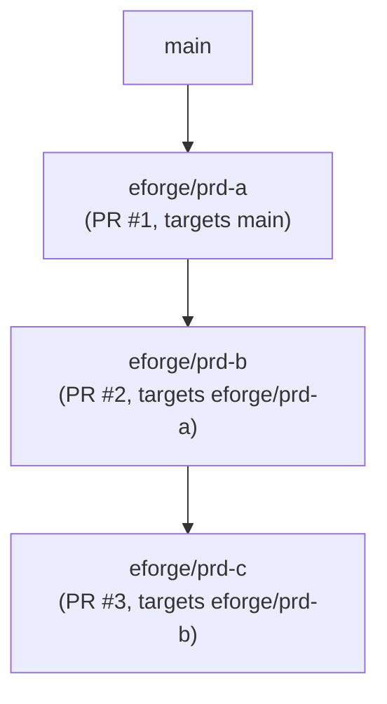

# Stacked PRs with git-spice

Stacked PR landing is an optional, opt-in mode for teams that want a branch-per-PR review flow. eforge currently supports stacked pull requests via git-spice. When `stacking.enabled: true` and `landing.action: pr`, root PRD artifact branches target trunk, while child PRD artifact branches normally target the parent artifact branch. During landing, eforge can repair a missing integrated parent by retargeting only the child artifact branch to trunk. It also runs provider repo sync, branch restack, and a remote-base freshness proof before submitting the PR.

## Concepts

### Artifact branches

Every eforge build produces an **artifact branch** - a named Git branch (`eforge/<prd-id>`) that holds the committed output from that build. When `landing.action: pr`, eforge opens a pull request from this artifact branch targeting its resolved base.

For non-stacked builds, the resolved base is the branch eforge builds from (often the project trunk, but it can be an active feature branch), and direct PR base sync fetches `origin/<baseBranch>` before validation and again immediately before PR creation. For stacked builds, the root PRD targets the resolved trunk branch and child PRDs target the parent PRD's artifact branch, creating a branch-per-PR topology. Stacked landing uses provider-owned repo sync/restack plus a remote effective-base ancestor proof instead of the direct non-stacked PR publication path:



### stack_id and stack_parent

PRD frontmatter carries two optional stacking fields:

- **`stack_id`** - a logical stack name shared by all PRDs in the same stack (e.g. `auth-refactor`). If omitted, defaults to the first PRD id in the chain.
- **`stack_parent`** - the PRD id of the immediate parent layer. Controls which artifact branch this PRD's PR targets.

These fields appear in PRD files under `.eforge/queue/`:

```yaml
---
title: Auth service - part 2
stack_id: auth-refactor
stack_parent: q-abc123
depends_on: [q-abc123]
---
```

### Single-dependency inference

When a PRD has exactly one `depends_on` entry and stacking is enabled, eforge automatically infers `stack_parent` from that dependency at dispatch time. You do not need to set `stack_parent` explicitly for linear stacks.

When a PRD has multiple `depends_on` entries, eforge cannot infer the stack parent unambiguously. You must set `stack_parent` explicitly to indicate which dependency is the direct parent layer.

### Explicit handoff and stack parent

When you use `--after <queue-id>` (CLI) or `afterQueueId` (MCP/Pi tool) to create an explicit dependency, the resulting single `depends_on` entry participates in the same stack parent inference described above. If stacking is enabled and the explicit dependency is the only `depends_on` entry, eforge infers `stack_parent` from it at dispatch time — no extra configuration is needed. The explicit handoff is deterministic: dependency detector inference is not used when `afterQueueId` is supplied.

### Multi-dependency ambiguity

Multi-dependency stacking requires explicit `stack_parent`:

```yaml
---
title: Merge two feature branches
stack_id: merge-pass
stack_parent: q-feature-a   # explicit: feature-a is the parent layer
depends_on: [q-feature-a, q-feature-b]
---
```

If `stack_parent` is missing and there are multiple `depends_on` entries, dispatch fails with a clear error message asking you to add `stack_parent`.

## Configuration

Enable the optional stacking mode in `eforge/config.yaml`. Stacking requires pull-request landing (`landing.action: pr`) and currently uses git-spice:

```yaml
stacking:
  enabled: true              # Default false

landing:
  action: pr                 # Required: stacking only applies when action is 'pr'
```

### git-spice command

eforge uses the `git-spice` executable by default. If it is installed to a non-standard location or you prefer the short `gs` alias, set the path explicitly:

```yaml
stacking:
  enabled: true
  gitSpice:
    command: /usr/local/bin/git-spice   # full path; or 'gs' to use the optional short alias
```

eforge defaults to `git-spice` to avoid ambiguity with other programs named `gs`. If you have configured the `gs` alias and prefer it, set `command: gs`.

## git-spice setup

git-spice must be installed and initialized in the repository before eforge can create stacked PRs. Install from [https://abhinav.github.io/git-spice/](https://abhinav.github.io/git-spice/).

Initialize git-spice in the repository (one time, per developer):

```bash
git-spice repo init
```

This writes a `.git/spice/state.json` tracking file that git-spice uses to maintain branch relationships. The file is local to your clone and not committed.

If git-spice is not available or not initialized, eforge fails the build at the stacking step with a clear error message including the `stacking.gitSpice.command` config key for remediation.

## Branch-per-PR topology

With stacking enabled, the call sequence for a two-PRD stack looks like this:

1. PRD `prd-a` builds, artifact branch `eforge/prd-a` is created off `main`.
2. eforge preflights the effective base, runs provider repo sync, tracks `eforge/prd-a` against `main`, restacks the branch, proves the fetched remote `main` commit is an ancestor of `HEAD`, and submits it as PR #1.
3. PRD `prd-b` (depends on `prd-a`) builds, artifact branch `eforge/prd-b` is created off `eforge/prd-a`.
4. eforge preflights the effective base, runs provider repo sync, tracks `eforge/prd-b` against `eforge/prd-a`, restacks the branch, proves the fetched remote effective base commit is an ancestor of `HEAD`, and submits it as PR #2 targeting PR #1.

The stack state (artifact branch refs and PR URLs) is persisted to `.eforge/stacks/layers.json`. This file is gitignored - it is runtime state, not a committed artifact.

## Stacked PR landing conflict recovery

During stacked builds with `landing.action: pr`, eforge restacks the artifact branch before submitting it. If the stack provider classifies that restack failure as a recoverable conflict, eforge attempts automatic provider-encapsulated recovery before failing the landing step.

Recovery first cleans up deterministic temporary plan-ID region marker conflicts. If unmerged files remain, eforge falls back to the merge-conflict resolver agent. The stack provider owns the continue and abort operations; eforge records provider commands as events without hard-coding git-spice arguments.

If recovery succeeds, eforge proves remote-base freshness and then submits the PR normally. Manual recovery is still required for non-recoverable provider failures, failed automatic recovery, and conflicts from `eforge stack sync`.

## Manual stack sync

Landing-time sync/freshness is automatic and scoped to the branch being submitted: eforge runs provider repo sync, branch restack, and a remote-base ancestor proof immediately before `provider.submitBranch(...)`. If the fetched effective base is not contained in `HEAD`, eforge retries that sync/restack/proof cycle once before failing closed.

When an upstream PR merges, GitHub updates the base branch of the downstream PR automatically. To update local artifact branches after upstream merges outside a landing run, use `eforge stack sync`:

```bash
eforge stack sync
```

Use `--dry-run` to preview what commands would run without executing them:

```bash
eforge stack sync --dry-run
```

`eforge stack sync` calls the daemon's stack sync route, which runs `git-spice repo sync` to pull remote changes, then `git-spice stack restack` to update the full local stack. This is different from automatic landing-time sync, which is branch-scoped and gates PR submission on a freshness proof for that branch's effective base. The manual restack step only runs when there are eligible artifact branches and none of them overlap with active-build worktrees - because git-spice stack restack operates globally, it cannot be scoped to a subset of branches. When active-build branches overlap the stack, sync is skipped until those builds finish. The command returns a structured report with the following fields:

| Field | Description |
|-------|-------------|
| `outcome` | One of `skipped`, `complete`, `deferred`, `failed`, `conflict` |
| `restackCandidates` | Artifact branches eligible for restack (after active-build exclusions); these branches were candidates, not necessarily all restacked if the restack step was skipped |
| `activeBuildSkips` | Branches skipped because active eforge builds are using their worktrees and overlap the stack candidate set |
| `providerCommands` | git-spice commands that ran (or would run in dry-run mode) |
| `fastForward` | Whether local trunk is at or behind `origin/<trunk>` |
| `error` | Error message when outcome is `failed` or `conflict` |

### Manual and automatic sync

Stack sync is available on demand via the CLI and MCP tool (`eforge_stack_sync`) when `stacking.enabled: true`. The sync operation executes from the project root and requires git-spice initialized in the repository.

To run stack sync automatically after every build lands, enable daemon-owned after-build sync in `eforge/config.yaml`:

```yaml
stacking:
  sync:
    afterBuild: true
```

When `stacking.sync.afterBuild: true` is set, the daemon triggers a stack sync from the project root after each build reaches a terminal state (completed, failed, or skipped). The after-build path uses `activeBuildPolicy: "defer"` — if other active builds still overlap the stack candidates at that point, the sync records a `deferred` outcome rather than running.

> **Avoid running `eforge stack sync` via `build.postMergeCommands` for automatic sync.** That path executes outside the daemon context, bypasses deferral and retry semantics, and can produce incomplete syncs when concurrent builds are running. Use `stacking.sync.afterBuild: true` instead.

Use `/eforge:workflow` to configure this through the workflow preset wizard without editing `eforge/config.yaml` manually.

### Active-build deferral

When sync runs while active eforge builds are in progress, branches whose worktrees are in use by active builds are excluded. These branches are reported in `activeBuildSkips`. When all eligible candidates are excluded by active builds, the outcome depends on the `activeBuildPolicy`:

- **`skip` (default for manual sync)** — the sync returns a `skipped` outcome immediately without mutating any branch state. Re-run `eforge stack sync` manually after the active builds complete.
- **`defer` (used by the after-build trigger)** — the sync returns a `deferred` outcome, recording that candidates were available but blocked. When `stacking.sync.afterBuild: true` is configured, the daemon fires another sync attempt after each build reaches a terminal state to retry deferred syncs, which will proceed if the stack is no longer blocked.

### Pre-landing reconciliation

Before a stacked build lands, eforge checks whether the child artifact branch's stacked base still exists on the remote. This remote-base preflight protects git-spice submission from stale parent branches that were deleted after their PR merged. After preflight and any repair, eforge runs provider repo sync and branch restack, rechecks the effective base, fetches the latest remote effective base, and proves that fetched commit is an ancestor of `HEAD` before PR submission.

If the parent remote branch is missing and eforge can prove that the parent artifact commit is already an ancestor of trunk, stale-parent landing repair is automatic and branch-scoped: eforge retargets and restacks only the child artifact branch onto trunk, then submits the child PR against trunk. This avoids running a whole-stack restack while preserving the proof that the parent layer is already integrated.

If eforge cannot prove the parent artifact commit is an ancestor of trunk, landing fails closed with an actionable error instead of guessing or mutating the rest of the stack. Restore, submit, or repair the parent branch, or verify the parent changes are integrated before rerunning the build.

`eforge stack sync` remains the command for normal whole-stack maintenance when parent branches move or upstream PRs merge. Stale-parent landing repair and landing-time sync/freshness are automatic and branch-scoped during landing; use stack sync when you intentionally want git-spice to reconcile the full local stack.

### Conflict recovery

When `eforge stack sync` returns `outcome: conflict`, a merge conflict occurred during the manual sync restack step. This is separate from stacked PR landing, which attempts automatic provider-encapsulated recovery for provider-classified recoverable restack conflicts. To recover a sync conflict:

1. Run `git status` to see the conflicting files.
2. Resolve the conflicts in the affected files.
3. Run `git add <resolved-files>` to stage the resolved files.
4. Run `git rebase --continue` (or the git-spice equivalent) to resume the restack.
5. Once the restack finishes, run `eforge stack sync` again to sync remaining branches.

### Fast-forward-only trunk policy

Stack sync uses a fast-forward-only policy for trunk. It will not force-push or rebase trunk. When `fastForward` is `false`, the local trunk is ahead of `origin/<trunk>`. Push or align the local trunk with origin before running sync.

After upstream merges, subsequent eforge builds that reference updated parent artifact branches will pick up the new commit shas from the persisted stack state.

## GitHub stale inline comments

When a PR's base branch changes (because an upstream PR merged), GitHub marks all existing inline review comments as "outdated". This is a known GitHub limitation, not an eforge-specific behavior. Reviewers see the comment thread marked as outdated but the comment content remains accessible via the PR timeline.

## Stack state visibility

The monitor UI shows per-build stacking metadata - stack id, parent PRD id, and PR URL - in the build detail panel when stacking is active. The `git-spice stack status` command (or `gs stack status` if you have the optional alias) shows the full local stack state.

### Stack sync status

The console UI includes a stack sync status card that shows the current or last sync operation in real time:

- **Current sync**: trigger, start time, and in-progress indicator while a wet sync is running.
- **Last sync outcome**: one of `complete`, `deferred`, `failed`, `conflict`, or `skipped`, with the reason, timestamp, and active-build skip details.
- **Active-build skips**: branches and worktrees that were excluded because active eforge builds were using them.
- **Provider commands**: the git-spice commands that ran (or would have run in dry-run mode).

The durable sync state is available via the REST API at `GET /api/stack/sync/status`, which returns both the `current` (in-progress) and `last` (most recently completed) sync records. The same data is included in the `stream:hello` SSE snapshot under `stackSyncStatus`, so clients receive the full state on (re)connect without an additional round-trip.

## Migration: landing.action vs build.onSuccess

`landing.action` is the current canonical config key. If you have a config using the old `build.onSuccess` key, migrate to `landing.action`:

| Old `build.onSuccess` | New `landing.action` |
|----------------------|---------------------|
| `issue-pr` | `pr` |
| `merge-to-base-branch` | `merge` |
| `leave-branch` | `leave` |

The old `build.onSuccess` key and the legacy full-string values (`issue-pr`, `merge-to-base-branch`, `leave-branch`) are both rejected at validation with migration guidance. Replace `build.onSuccess` with `landing.action` and update the values to `pr`, `merge`, or `leave` before running new builds.
