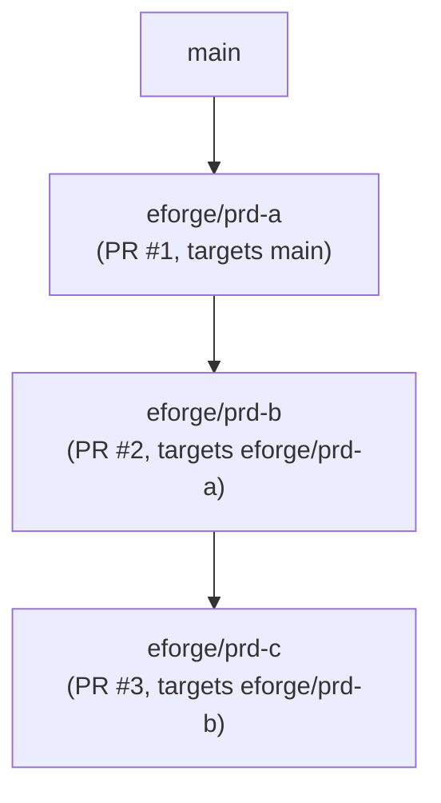

# Stacked PRs with git-spice

eforge supports stacked pull requests via git-spice. When `stacking.enabled: true`, each build's artifact branch targets the parent artifact branch instead of the trunk, forming a linear stack of pull requests that reviewers can merge in order.

## Concepts

### Artifact branches

Every eforge build produces an **artifact branch** - a named Git branch (`eforge/<prd-id>`) that holds the committed output from that build. When `landing.action: pr`, eforge opens a pull request from this artifact branch targeting its resolved base.

For non-stacked builds, the resolved base is the branch eforge builds from (often the project trunk, but it can be an active feature branch). For stacked builds, the root PRD targets the resolved trunk branch and child PRDs target the parent PRD's artifact branch, creating a branch-per-PR topology:



### stack_id and stack_parent

PRD frontmatter carries two optional stacking fields:

- **`stack_id`** - a logical stack name shared by all PRDs in the same stack (e.g. `auth-refactor`). If omitted, defaults to the first PRD id in the chain.
- **`stack_parent`** - the PRD id of the immediate parent layer. Controls which artifact branch this PRD's PR targets.

These fields appear in PRD files under `.eforge/queue/`:

```yaml
---
title: Auth service - part 2
stack_id: auth-refactor
stack_parent: q-abc123
depends_on: [q-abc123]
---
```

### Single-dependency inference

When a PRD has exactly one `depends_on` entry and stacking is enabled, eforge automatically infers `stack_parent` from that dependency at dispatch time. You do not need to set `stack_parent` explicitly for linear stacks.

When a PRD has multiple `depends_on` entries, eforge cannot infer the stack parent unambiguously. You must set `stack_parent` explicitly to indicate which dependency is the direct parent layer.

### Multi-dependency ambiguity

Multi-dependency stacking requires explicit `stack_parent`:

```yaml
---
title: Merge two feature branches
stack_id: merge-pass
stack_parent: q-feature-a   # explicit: feature-a is the parent layer
depends_on: [q-feature-a, q-feature-b]
---
```

If `stack_parent` is missing and there are multiple `depends_on` entries, dispatch fails with a clear error message asking you to add `stack_parent`.

## Configuration

Enable stacking in `eforge/config.yaml`:

```yaml
stacking:
  enabled: true              # Default false

landing:
  action: pr                 # Required: stacking only applies when action is 'pr'
```

### git-spice command

eforge uses the `git-spice` executable by default. If it is installed to a non-standard location or you prefer the short `gs` alias, set the path explicitly:

```yaml
stacking:
  enabled: true
  gitSpice:
    command: /usr/local/bin/git-spice   # full path; or 'gs' to use the optional short alias
```

eforge defaults to `git-spice` to avoid ambiguity with other programs named `gs`. If you have configured the `gs` alias and prefer it, set `command: gs`.

## git-spice setup

git-spice must be installed and initialized in the repository before eforge can create stacked PRs. Install from [https://abhinav.github.io/git-spice/](https://abhinav.github.io/git-spice/).

Initialize git-spice in the repository (one time, per developer):

```bash
git-spice repo init
```

This writes a `.git/spice/state.json` tracking file that git-spice uses to maintain branch relationships. The file is local to your clone and not committed.

If git-spice is not available or not initialized, eforge fails the build at the stacking step with a clear error message including the `stacking.gitSpice.command` config key for remediation.

## Branch-per-PR topology

With stacking enabled, the call sequence for a two-PRD stack looks like this:

1. PRD `prd-a` builds, artifact branch `eforge/prd-a` is created off `main`.
2. git-spice tracks `eforge/prd-a` against `main` and submits it as PR #1.
3. PRD `prd-b` (depends on `prd-a`) builds, artifact branch `eforge/prd-b` is created off `eforge/prd-a`.
4. git-spice tracks `eforge/prd-b` against `eforge/prd-a` and submits it as PR #2 targeting PR #1.

The stack state (artifact branch refs and PR URLs) is persisted to `.eforge/stacks/layers.json`. This file is gitignored - it is runtime state, not a committed artifact.

## Manual stack sync

When an upstream PR merges, GitHub updates the base branch of the downstream PR automatically. To update local artifact branches after upstream merges, use `eforge stack sync`:

```bash
eforge stack sync
```

Use `--dry-run` to preview what commands would run without executing them:

```bash
eforge stack sync --dry-run
```

`eforge stack sync` calls the daemon's stack sync route, which runs `git-spice repo sync` to pull remote changes, then `git-spice stack restack` to update the full local stack. The restack step only runs when there are eligible artifact branches and none of them overlap with active-build worktrees - because git-spice stack restack operates globally, it cannot be scoped to a subset of branches. When active-build branches overlap the stack, sync is skipped until those builds finish. The command returns a structured report with the following fields:

| Field | Description |
|-------|-------------|
| `outcome` | One of `skipped`, `complete`, `failed`, `conflict` |
| `restackCandidates` | Artifact branches eligible for restack (after active-build exclusions); these branches were candidates, not necessarily all restacked if the restack step was skipped |
| `activeBuildSkips` | Branches skipped because active eforge builds are using their worktrees and overlap the stack candidate set |
| `providerCommands` | git-spice commands that ran (or would run in dry-run mode) |
| `fastForward` | Whether local trunk is at or behind `origin/<trunk>` |
| `error` | Error message when outcome is `failed` or `conflict` |

### Opt-in sync configuration

Stack sync is available via the CLI and MCP tool (`eforge_stack_sync`) when `stacking.enabled: true`. The sync operation requires git-spice initialized in the repository.

To enable stack sync as an automatic post-merge step, add `eforge stack sync` to `build.postMergeCommands`:

```yaml
build:
  postMergeCommands:
    - "eforge stack sync"
```

This runs sync automatically after each build lands. Use the `/eforge:workflow` command to configure this through the workflow preset wizard without editing `eforge/config.yaml` manually.

> **Note:** Daemon-level polling config (such as `stacking.sync.enabled`, `stacking.sync.mode`, or `stacking.sync.intervalSeconds`) is not currently implemented. The supported automatic sync mechanism is `build.postMergeCommands: ["eforge stack sync"]`, which runs sync after each build lands rather than on a daemon polling interval.

### Active-build skip behavior

When sync runs while active eforge builds are in progress, branches whose worktrees are in use by active builds are skipped. These branches are reported in `activeBuildSkips`. Re-run sync after the active builds complete to restack the skipped branches.

### Pre-landing reconciliation

Before a stacked build lands, eforge checks whether the parent artifact branch has moved (e.g. due to an upstream merge). If the parent has moved and the stack has diverged, sync should be run before landing to reconcile the stack and ensure each PR targets the correct base.

### Conflict recovery

When `eforge stack sync` returns `outcome: conflict`, a merge conflict occurred during the restack step. To recover:

1. Run `git status` to see the conflicting files.
2. Resolve the conflicts in the affected files.
3. Run `git add <resolved-files>` to stage the resolved files.
4. Run `git rebase --continue` (or the git-spice equivalent) to resume the restack.
5. Once the restack finishes, run `eforge stack sync` again to sync remaining branches.

### Fast-forward-only trunk policy

Stack sync uses a fast-forward-only policy for trunk. It will not force-push or rebase trunk. When `fastForward` is `false`, the local trunk is ahead of `origin/<trunk>`. Push or align the local trunk with origin before running sync.

After upstream merges, subsequent eforge builds that reference updated parent artifact branches will pick up the new commit shas from the persisted stack state.

## GitHub stale inline comments

When a PR's base branch changes (because an upstream PR merged), GitHub marks all existing inline review comments as "outdated". This is a known GitHub limitation, not an eforge-specific behavior. Reviewers see the comment thread marked as outdated but the comment content remains accessible via the PR timeline.

## Stack state visibility

The monitor UI shows per-build stacking metadata - stack id, parent PRD id, and PR URL - in the build detail panel when stacking is active. The `git-spice stack status` command (or `gs stack status` if you have the optional alias) shows the full local stack state.

## Migration: landing.action vs build.onSuccess

`landing.action` is the current canonical config key. If you have a config using the old `build.onSuccess` key, migrate to `landing.action`:

| Old `build.onSuccess` | New `landing.action` |
|----------------------|---------------------|
| `issue-pr` | `pr` |
| `merge-to-base-branch` | `merge` |
| `leave-branch` | `leave` |

The old `build.onSuccess` key and the legacy full-string values (`issue-pr`, `merge-to-base-branch`, `leave-branch`) are both rejected at validation with migration guidance. Replace `build.onSuccess` with `landing.action` and update the values to `pr`, `merge`, or `leave` before running new builds.
