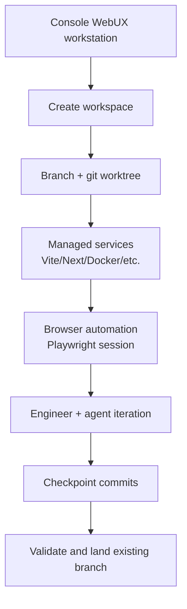
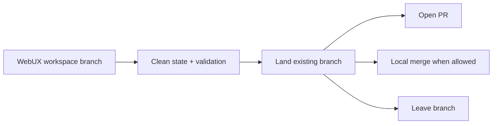

# Eforge WebUX Workspaces Design

## Summary

`eforge-webux` is a proposed native eforge extension for interactive, agent-assisted web UI development. It provides Console-hosted workspaces backed by isolated git worktrees, managed dev servers, browser automation, UX goals, checkpoint commits, and eforge-style landing.

A WebUX workspace is intentionally **not** a normal queued eforge build. It is an interactive authoring and implementation surface that can eventually produce a branch ready to validate and land through the same landing policy model (`pr`, `merge`, or `leave`).

## Goals

- Support rapid, conversational UI iteration against a live-reloading web app.
- Isolate each UX effort in its own branch and worktree by default.
- Manage dev-server ports, process logs, Docker Compose profiles, and browser sessions per workspace.
- Give agents efficient tools for screenshots, DOM/accessibility snapshots, browser interaction, console/network diagnostics, and artifact capture.
- Persist UX goals such as style direction, color schemes, target routes, viewport matrix, and interaction constraints.
- Respect active eforge builds and avoid branch/landing races.
- Preserve the eforge kernel boundary: interactive UX work stays in extension/workstation surfaces rather than becoming a build-engine mode.

## Non-goals

- Replacing editors or IDEs.
- Moving multi-turn interactive chat into the engine kernel.
- Treating WebUX workspaces as PRD queue entries or normal plan builds.
- Guaranteeing arbitrary project setup without explicit configuration.
- Running untrusted project/team extension code without the existing eforge extension trust model.

## Product model

A **WebUX workspace** is a user-facing workspace and an implementation-level git worktree.



Example workspace record:

```ts
interface WebuxWorkspace {
  id: string;
  title: string;
  baseBranch: string;
  branch: string;
  worktreePath: string;
  mode: 'worktree' | 'attached';
  devServers: Array<{
    name: string;
    command: string;
    url: string;
    port: number;
    status: 'stopped' | 'starting' | 'running' | 'failed';
  }>;
  dockerProfiles?: string[];
  uxGoalsPath?: string;
  freshness: {
    remote: string;
    trunkBranch: string;
    commitsBehind?: number;
    lastFetchAt?: string;
    lastRebaseAt?: string;
  };
  status: 'new' | 'running' | 'dirty' | 'rebase-conflict' | 'ready-to-land' | 'landed' | 'failed';
}
```

## Configuration

Project configuration should live outside the engine config, for example `.eforge/webux.yaml` for local experiments and eventually scoped extension storage for reusable defaults.

```yaml
workspace:
  defaultMode: worktree
  branchPrefix: webux
  worktreeRoot: ../.eforge-webux-worktrees

trunk:
  remote: origin
  branch: main

ports:
  start: 5173
  end: 5299

services:
  - name: app
    command: pnpm dev --host 127.0.0.1 --port ${PORT_APP}
    portName: app
    healthUrl: http://127.0.0.1:${PORT_APP}/

browser:
  defaultRoute: /
  viewports:
    - name: desktop
      width: 1440
      height: 1000
    - name: mobile
      width: 390
      height: 844

freshness:
  remindAfterCommitsBehind: 10
  remindAfterHours: 24
  remindBeforeFinalize: true
  blockFinalizeWhenBehind: true

uxGoals:
  file: .eforge/webux/goals.md
```

## Workstation UI

The Console workstation should focus on high-leverage UX operations rather than duplicating a full IDE.

Initial panels:

- **Workspace list** - branch, worktree path, status, service state, freshness state.
- **Create workspace** - title/slug, base branch, worktree or attached mode, services to enable.
- **Services** - start/stop/restart dev servers, Docker Compose profiles, logs, health checks.
- **Preview** - open external browser links and optionally render same-origin/allowed dev-server URLs in an iframe.
- **Browser tools** - capture screenshots, DOM snapshots, accessibility snapshots, console errors, and network failures.
- **Iteration** - prompt composer that includes current route, screenshot references, selected UX goals, and workspace state.
- **Freshness** - fetch/rebase status, reminders, and a safe rebase button.
- **Finalize** - run checks, require clean committed state, and land or leave the branch.

## Agent integration

The extension can use currently supported native extension capabilities for early versions:

- `onAgentRun` appends workspace context and UX goals to builder/reviewer runs.
- Extension tools provide browser and workspace actions for selected runs.
- Actions back workstation buttons for workspace creation, service control, screenshot capture, checkpointing, rebase, and finalization.
- A validation provider can later enforce configured smoke checks, console-error gates, accessibility checks, or screenshot/visual-diff thresholds.

A full chat-like loop is a platform stretch goal. Current daemon-owned extension agent tasks are single-shot and read-only for supported task kinds, so WebUX should initially route implementation through the host agent session or build-source handoffs rather than claiming arbitrary extension-owned multi-turn agent orchestration.

## Browser automation

Playwright is the preferred default because it supports screenshots, DOM inspection, accessibility snapshots, browser interaction, console/network inspection, storage state, traces, and multi-browser expansion.

MVP tools:

- `webux_screenshot`
- `webux_dom_snapshot`
- `webux_accessibility_snapshot`
- `webux_click`
- `webux_fill`
- `webux_navigate`
- `webux_console_errors`
- `webux_checkpoint`

Artifacts should be written under extension-owned storage, for example:

```text
.eforge/storage/extensions/eforge-webux/workspaces/<workspace-id>/artifacts/
```

## Worktree and branch model

Default mode should be worktree-first:

1. Create or select a base branch.
2. Create a feature branch such as `webux/login-redesign`.
3. Add a worktree for that branch.
4. Allocate ports and write workspace metadata.
5. Start configured services in the worktree.
6. Iterate with agents and browser tools.
7. Create checkpoint commits.
8. Finalize through eforge-style landing.

Attached mode can support the current checkout for quick experiments, but it should be explicit and conservative:

- must not run on trunk;
- should require a clean starting state or checkpoint;
- should warn or block when active eforge builds may conflict;
- should require committed clean state before finalization.

## Freshness and rebase

WebUX workspaces may live longer than normal build worktrees, so freshness should be visible and actionable.

The workstation should show:

- configured remote and trunk branch;
- last fetch time;
- commits behind remote trunk;
- dirty/rebase-conflict state;
- last successful rebase time;
- whether finalization is blocked by staleness.

The safe rebase action should:

1. Fetch the configured remote trunk.
2. Check dirty state.
3. Offer checkpoint commit, stash, or cancel when dirty.
4. Stop or pause affected services when necessary.
5. Rebase the workspace branch onto remote trunk.
6. If conflicts occur, leave the workspace in `rebase-conflict` state and surface conflicted files.
7. Optionally invoke a merge-conflict agent flow when supported.
8. Restart services and run configured smoke checks.
9. Capture comparison screenshots when routes are configured.

## Concurrency and active builds

WebUX should be designed to coexist with normal eforge queue builds.

Recommended MVP policy:

- Worktree workspaces may run concurrently with normal builds.
- Attached current-checkout workspaces warn or block when active builds exist.
- Finalization should block when another active operation is landing to the same target branch.
- Direct local merge should be discouraged during active builds; PR landing is the safe default.
- Long-term platform support should expose branch/landing leases that normal builds, stack sync, and WebUX can all respect.

## Landing model

WebUX should not enqueue a fake PRD solely to publish interactive work. It should produce a clean branch and then use a generic “land existing branch” capability.



A future generic primitive could accept:

```ts
interface LandExistingBranchRequest {
  branch: string;
  baseBranch: string;
  landingAction: 'pr' | 'merge' | 'leave';
  validationCommands?: string[];
  provenance: {
    kind: 'webux-workspace' | string;
    id: string;
  };
}
```

This primitive should reuse the same trunk protection and landing freshness rules as queued builds where applicable, while recognizing that the branch was authored interactively rather than generated by the build kernel.

## Platform gaps

The first useful WebUX extension can be built with existing extension APIs, but the full vision likely needs generic platform additions:

- workspace/process supervision APIs for long-running dev servers;
- daemon/client route contracts for workspace state and service logs;
- branch and landing leases;
- generic “land existing branch” support;
- richer action progress/log streaming;
- broader extension-owned agent task support for conversational implementation loops;
- ergonomic workstation bundle development and packaging.

These should be developed as reusable eforge platform seams, not WebUX-only engine behavior.

## MVP phases

### Phase 1: Local utility extension

- Worktree workspace creation.
- Deterministic port allocation.
- Configured dev-server start/stop/status.
- Browser links and Playwright screenshot capture.
- UX goals prompt context.
- Checkpoint commit action.
- Freshness panel and manual rebase action.
- Finalize with `leave` or PR-oriented handoff.

### Phase 2: Rich Console workstation

- Workspace list and lifecycle management.
- Logs and service health UI.
- Screenshot gallery and route/viewport matrix.
- Embedded preview where browser security policy permits it.
- Docker Compose profile controls.
- Config editor for UX goals and workspace defaults.

### Phase 3: Integrated agentic UX loop

- Chat-like iterative implementation flow.
- Visual diff and accessibility gates.
- Network/console failure triage.
- Rebase-conflict assistant.
- Generic land-existing-branch primitive.
- Branch/landing leases shared with normal eforge builds.

## Open questions

- Should `eforge-webux` ship as `@eforge-build/webux`, `@eforge-build/extension-webux`, or another package name?
- Should worktree roots default beside the repository or under `.eforge/`?
- How much process supervision belongs in the eforge daemon versus extension-owned actions?
- What is the minimum safe contract for showing dev-server content in a Console iframe?
- Should workspace metadata be project-local only, or can user-scoped defaults define reusable templates?
- Which landing evidence should be recorded for interactive branches that were never PRD builds?
