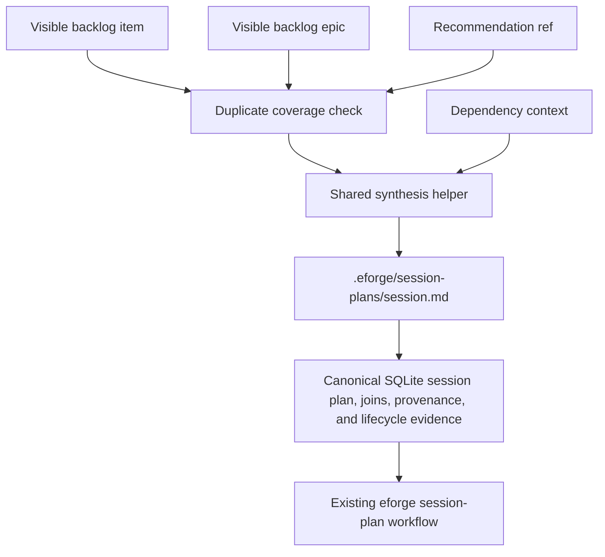

# eforge-plan Extension

`eforge-plan` is a reference extension for curating a project-local backlog and promoting selected backlog items into normal eforge build inputs. It is intentionally dogfoodable: project teams can keep lightweight planning records in the repository, render a derived kanban board, promote work into session plans, and correlate later eforge lifecycle events back to the originating backlog item.

The extension does not replace session plans, playbooks, or normalized build-source preprocessing. It produces ordinary build-source Markdown and `.eforge/session-plans/<session>.md` artifacts that the existing eforge engine can consume.

## Trust model

Extensions run as project-team code. Install and enable `eforge-plan` only in repositories where you trust the extension source and the team-maintained backlog content.

`eforge-plan` is not a sandbox boundary. Actions can read and write project-local files, and lifecycle hooks update extension-owned private storage. The Console workstation is served from packaged browser assets whose files are covered by the extension trust hash. Review extension changes with the same care as build tooling, scripts, or other automation that runs in the repository.

Private planning state is stored under `.eforge/storage/extensions/eforge-plan/`, including the normalized SQLite store at `.eforge/storage/extensions/eforge-plan/eforge-plan-private.sqlite`. Treat that directory as local/private project metadata: it can include backlog records, recommendation models, roadmap steering, lifecycle evidence, accepted-analysis baselines, revision annotations, and AI planning-task workflow indexes. Do not assume it is safe to publish without review.

## Install and manage

`eforge-plan` is published as the first-party npm package `@eforge-build/eforge-plan`. The package declares `eforge.extension.name: "eforge-plan"` and loads from the compiled runtime entrypoint `./dist/index.js`.

```bash
# Install from npm into the default local scope (.eforge/extensions/)
eforge extension install @eforge-build/eforge-plan

# Install from a local package directory or packed tarball after building
eforge extension install ./eforge/extensions/eforge-plan
eforge extension install ./eforge/extensions/eforge-plan/eforge-build-eforge-plan-<version>.tgz

# Install into the project/team scope and trust the reviewed artifact
eforge extension install @eforge-build/eforge-plan --scope project --trust
```

Scope behavior follows normal extension management rules:

- `local` (default) installs under `.eforge/extensions/` and loads without a project/team trust record.
- `project` installs under `eforge/extensions/`; each user must inspect and run `eforge extension trust eforge-plan`, or install/update with `--trust`, before it loads.
- `user` installs under the user eforge config directory and is trusted for that user.

Common lifecycle commands:

```bash
eforge extension validate eforge-plan
eforge extension trust eforge-plan
eforge extension reload
eforge extension show eforge-plan

eforge extension update eforge-plan
eforge extension update eforge-plan --version latest
eforge extension update eforge-plan --version 0.9.0

eforge extension remove eforge-plan
```

`--version <specifier>` is for npm-installed extensions and may be a version, range, or dist-tag understood by npm. Local directory and tarball installs update from their recorded sidecar source rather than from a registry version specifier. Updating a project/team install changes the reviewed hash; update with `--trust` after inspection or run `eforge extension trust eforge-plan` again before reloading.

The npm artifact contains the compiled runtime in `dist/`, the generated workstation bundle in `workstation-assets/plans/`, `README.md`, `LICENSE`, and package metadata. Source-only workstation files, tests, and development config are not part of the runtime artifact.

## Enable

After adding, installing, or changing the extension, validate, trust when required, and reload it from the repository root:

```bash
eforge extension validate eforge-plan
eforge extension trust eforge-plan
eforge extension reload
```

Run `eforge extension show eforge-plan` to confirm the registered actions, integration commands, deep links, Console workstation, and input source.

## Declared capabilities

The directory extension manifest declares two stable first-party capabilities:

- `eforge.plan.planning-workstation` version `1.0.0` — the extension owns the rich planning workstation UI.
- `eforge.plan.planning-mode-playbook` version `1.0.0` — planning-mode playbook hosts may depend on this capability before offering planning continuation.

Planning entry is exposed through generic extension contribution discovery. Hosts can list/invoke the `eforge-plan:open-planning-entry` action or integration command, or follow the action-backed `eforge-plan:planning-workstation` deep link. All return or point at the workstation URL `/console/workstations/eforge-plan%3Aplanning-workstation`.

## Usage

Registered action IDs can be invoked by hosts that expose extension actions:

Backlog captures are guarded to keep open items session-plan-ready: `capture-item` requires concrete acceptance criteria and rejects exploration/revisit/research-style language. Do exploration before capture, then record the chosen implementation change.

- `capture-item` example input: `{ "title": "Add import preview", "claim": "Add a preview step so users can inspect imports before enqueue.", "evidence": "Support tickets mention import mistakes.", "tags": ["ux"], "priority": "high", "epic": "planning", "dependsOn": [], "acceptanceCriteria": "Preview renders changed files and can be cancelled." }`
- `update-item` example input: `{ "id": "add-import-preview", "status": "planned", "priority": "high", "tags": ["ux", "ready"], "evidenceNotes": "Validated with design review.", "recheckNotes": "Recheck after first import flow lands.", "dependsOn": ["import-parser"], "epic": "planning" }`
- `promote-item` example input: `{ "itemId": "add-import-preview", "status": "active", "session": "2026-06-05-add-import-preview", "profile": "excursion" }`
- `render-board-markdown` example input: `{ "includeArchive": false }`
- `list-board-compact` example input: `{ "epic": "planning", "limit": 20, "offset": 0 }`; returns bounded open item summaries by default plus SQL-derived lane counts, total/open/closed counts, pagination metadata, effective lifecycle, user status, reason codes, backend `planEligible`/eligibility reason fields, and compact evidence links without full board payloads. Closed lanes are lazy: request them explicitly with inputs such as `{ "lane": "done", "includeClosed": true, "limit": 20, "offset": 0 }` or `{ "lane": "archive", "includeClosed": true, "includeArchive": true }`. Projection flags: pass `includeEpics: false` to omit compact epic summaries, `includeLaneCounts: false` to omit `lanes` and aggregate `counts`, or `includeDependencies: false` to omit dependency id arrays from item summaries.
- `get-item` example input: `{ "id": "add-import-preview" }`; returns one item with `status`/`userStatus` from the explicit backlog row, SQL-derived lifecycle state and reason codes, backend `planEligible`/eligibility reason fields, compact dependency/dependent summaries, associated plan/build links, lifecycle evidence rows, and Markdown sections. The workstation calls this lazily when a detail drawer opens. Pass `includeBody: true` only when raw item Markdown is needed. Projection flags `includeEpic`, `includeSections`, `includeLifecycleRows`, `includeDependencies`, and `includeDependents` can be set to `false` to omit those optional fields.
- `get-epic` example input: `{ "id": "planning", "limit": 20, "offset": 0 }`; returns one epic with SQLite item counts, open item counts, and paginated compact item summaries. Pass `includeBody: true` only when raw epic Markdown is needed. Projection flags include `includeItems: false`, `includeSections: false`, and `includeItemDependencies: false` for narrower responses. With `includeItems: false`, the response intentionally has `items: []` and `totalItems: 0`; callers that need counts without item rows should read the compact `epic.itemCount` and `epic.openItemCount` fields.
- `search-items` example input: `{ "query": "import preview", "status": "planned", "limit": 20 }`; searches canonical SQLite/FTS backlog item documents by id/title/tags/epic with bounded compact output, ranked matches, snippets, counts, pagination metadata, and explicit index freshness metadata. Pass `searchBody: true` to include claim/evidence/acceptance-criteria/body-summary text in the FTS match, `includeEpics: true` to include compact epics for matched items, or `includeDependencies: false` to omit dependency id arrays from item summaries. Limits default to `20` and are capped at `100`.
- `search-planning-records` example input: `{ "query": "import preview", "types": ["backlog_item", "session_plan"], "fields": ["snippet", "refs"], "limit": 20 }`; searches the all-domain FTS index across backlog items, epics, flat session-plan summaries, and recommendation text. Results always include `id`, `type`, and `title`; optional `fields` can add `rank`, `snippet`, `refs`, and `updatedAt`. The response includes counts by type, offset pagination, and the same dirty-index metadata as `search-items` without returning raw item bodies, recommendation JSON, or session-plan Markdown bodies.
- `get-store-status` example input: `{}`; reports whether the private SQLite store exists, DB/WAL/SHM byte sizes, schema version, table counts, retention eligibility counts, search-index status, and recent maintenance runs. It does not create the store when it is absent.
- `compact-planning-store` example input: `{ "dryRun": true, "olderThanDays": 90 }`; computes explicit retention candidates for prunable lifecycle event payloads, terminal planning-task raw payloads, and superseded non-current recommendation runs. `dryRun` defaults to `true`; apply mode requires `{ "dryRun": false }`, keeps action output bounded, and never returns raw payload text.
- `rebuild-search-index` example input: `{ "types": ["backlog_item", "epic"] }`; rebuilds selected FTS document types through the shared search-index helpers and records maintenance metadata.
- `optimize-search-index` example input: `{}`; runs the explicit FTS optimize helper and records maintenance metadata.
- `vacuum-planning-store` example input: `{ "checkpointWal": true }`; checkpoints WAL when requested, runs SQLite `VACUUM` outside compaction, and reports before/after byte counts.
- `list-planning-artifacts` example input: `{ "includeSubmitted": false, "includeBoard": false, "limit": 50, "offset": 0 }`; returns compact paginated planning artifacts (`artifacts`, `plans`, `planSets`, `total`, `limit`, and `offset`) without rich board data. Plan artifacts include readiness plus `readinessSource` and `readinessFreshness` so callers can tell whether readiness came from the persisted cache or current Markdown. Flat session-plan metadata and lifecycle rows come from SQLite; plan sets still come from the input adapter. `plans` and `planSets` are derived from the same returned page. Submitted flat plans and submitted plan sets are omitted unless `includeSubmitted: true`; legacy callers that intentionally need the old rich board field may pass `includeBoard: true` with `includeArchive`/`epic` filters.
- `show-session-plan` example input: `{ "session": "2026-06-05-add-import-preview" }`; returns SQLite source refs, lifecycle rows, readiness, `readinessSource`, and `readinessFreshness` while loading the flat plan body from `.eforge/session-plans/<session>.md`.
- `show-session-plan-set` example input: `{ "planSetId": "import-workflow" }`
- `create-session-plan` example input: `{ "session": "2026-06-05-add-import-preview", "topic": "Add import preview", "planningType": "feature", "planningDepth": "focused", "profile": "excursion", "agentProfile": "frontend" }`
- `set-session-plan-section` example input: `{ "session": "2026-06-05-add-import-preview", "dimension": "scope", "content": "Implement preview rendering and cancel handling." }`; `dimension: "executive-summary"` is also supported for editing the leading `## Executive Summary` and is not a readiness dimension.
- `check-session-plan-readiness` example input: `{ "session": "2026-06-05-add-import-preview" }`
- `set-session-plan-ready` example input: `{ "session": "2026-06-05-add-import-preview" }`; returns `kind: "not-ready"` instead of mutating when required dimensions or acceptance criteria checks fail.
- `handoff-session-plan` example input: `{ "session": "2026-06-05-add-import-preview" }`; requires the plan to be ready and `status: ready`, then enqueues the session plan through the daemon build queue.
- `get-recommendations` reads the current SQLite recommendation run and returns the server-derived recommendation freshness view (`missing`, `fresh`, or `stale`), compatibility status/stale reason metadata, the private storage paths, any active recommendation refresh task, and additive `recommendationActionability` metadata. Actionability is computed on read (not stored in the recommendation model) from session plans, active planning tasks, queue/build/session/landing rows, lifecycle evidence, active build sessions, and open PR evidence. Entries retain `state: "actionable" | "non-actionable"` for compatibility and add `disposition: "actionable" | "suppressed" | "de-actioned" | "relocated"`; non-actionable entries include a `reasonCode`/`reasonMessage`, `lifecycleState`, and `associatedLinks`. Safe-parallel groups also include `actionableItemIds` and `suppressedItemIds` so mixed groups can still be planned for the actionable subset.
- `put-recommendations` validates item/epic references and writes the private recommendation model, then records fresh status metadata for the current backlog fingerprint with `lastRefreshedBy: "put-recommendations"`; it does not create an accepted-analysis git baseline.
- `get-roadmap-state` example input: `{ "includeLocalFocusContent": true }`; reads private local-focus roadmap state, configured shared-source metadata, discovered conventional context such as `docs/roadmap.md`, conflicts, assumptions, and truncation metadata.
- `update-roadmap-state` example input: `{ "localFocusContent": "# Focus\n\nShip local roadmaps.\n", "expectedLocalFocusSha256": "..." }`; writes only private local-focus roadmap content and/or shared-source configuration under extension storage. Shared-source paths are normalized before storage; disabled sources remain metadata only. Configured shared project files are read-only context and are not rewritten.
- `analyze-all-backlog` example input: `{}`; starts or reuses an active daemon-owned backlog curation task without doing source assembly inside the short action request. The analysis audits open backlog items against current source; current source is the closure authority for shipped/superseded status, history is a navigation hint, ambiguous evidence should be resolved into actionable backlog updates, recommendations, or true needs-input rather than routine skips, and closed-status proposals require current-source citations. The task requests both `backlogCurationDraft` and `recommendations` output and does not enqueue builds. Its background curation source includes a bounded top-level `gitDelta` projection (`gitDelta.baseline.commit`, `gitDelta.baseline.time`, `gitDelta.baseline.source`, `gitDelta.currentHead`, `gitDelta.scannedCommitCount`, scanned commits, scan caps, coverage, diagnostics, and deterministic affected item candidates) plus bounded git/PR shipped or superseded evidence alongside lifecycle evidence. Git-delta diagnostics include `baseline-missing`, `baseline-invalid-sidecar`, `baseline-unreachable`, `baseline-shallow`, `git-unavailable`, `git-command-failed`, `scan-cap-truncated`, and `pr-enrichment-unavailable`; missing, invalid, unreachable, shallow, and no-git baseline states are fallback or unavailable coverage, not complete git-delta coverage. Previews expose server-provided audit coverage, caps, diagnostics, concurrency settings, per-item outcomes, current-source citations, historical navigation hints, evidence source, and confidence metadata. Drafts may include epic patches when justified from item-level findings, dependency state, roadmap context, or recommendation strategy. Optional PR enrichment through `gh` is fail-closed and not required. An unavailable `gh` should leave bounded git-only candidate evidence in place and record `pr-enrichment-unavailable` diagnostics instead of treating GitHub as required. This is the primary workstation path for refreshing recommendations because normal confirmed curation applies the generated recommendation model against the post-curation backlog state; curation-only apply intentionally discards generated recommendations.
- `refresh-recommendations` example input: `{}`; starts or reuses a daemon-owned recommendation-only planning task for the current open backlog and roadmap-context fingerprint. This action remains available as a lower-level/API compatibility path and is allowed for roadmap refresh flows.
- `promote-selection` example input: `{ "itemIds": ["add-import-preview"], "status": "active" }`; also accepts `{ "recommendationRef": "next-one" }` or `{ "epicId": "planning" }` selectors.
- `list-draft-units` example input: `{ "limit": 50, "offset": 0 }`; returns compact paginated draft-unit rows (`units`, `total`, `limit`, and `offset`) with unit id, title, status, provenance, item ids/count, profile, promotion metadata, and timestamps. Verbose intent/detail reads stay behind `get-draft-unit`, e.g. `{ "unitId": "unit_123" }`.
- `prepare-planner-context` example input: `{ "itemIds": ["add-import-preview"], "includeRoadmap": true }`; returns JSON-safe selected/open backlog items, epics, recommendations, dependency/blocker context, roadmap context, and relevant lifecycle summaries.
- `apply-planner-result` example input: `{ "recommendations": { "schemaVersion": 1, "activeWork": [], "readyCandidates": [{ "itemId": "add-import-preview" }], "recommendedNextSequence": [{ "itemId": "add-import-preview", "rationale": "Ready and high priority." }], "safeParallelizableGroups": [], "blockedChains": [], "rationaleAndAssumptions": ["Import preview is unblocked."] } }` or `{ "handoffDraft": { "selection": { "itemIds": ["add-import-preview"], "status": "active" } } }`; applies only structured recommendation models and promotion selections.
- `start-planning-agent-task` example input: `{ "userGoal": "Find the safest next import-preview work", "itemIds": ["add-import-preview"], "includeRoadmap": true }`; prepares bounded planner context, then starts a daemon-owned `eforge-plan.planning-draft` task. `userGoal` is optional: when omitted, the AI-first flow derives the goal from the selection (`itemIds`, `epicId`, or `recommendationRef`), e.g. `{ "itemIds": ["add-import-preview"] }`, `{ "epicId": "planning" }`, or `{ "recommendationRef": "next-one" }`. Callers that plan an explicit ready subset from a recommendation lane may send `{ "itemIds": ["add-import-preview"], "sourceRecommendationRef": "lane-one" }` to keep provenance without using `recommendationRef` as the selector. Direct starts fail closed before daemon task creation when any selected item is already covered by an editable/submitted session plan, an active planning task, queued/building/build-session evidence, or open PR evidence; the invalid-input/user-action details include the same reason codes and associated links as `get-recommendations`.
- `get-planning-agent-task` example input: `{ "taskId": "task_123" }`; returns the daemon task record for polling status and result data.
- `cancel-planning-agent-task` example input: `{ "taskId": "task_123" }`; requests cancellation through the daemon-owned task API.
- `list-planning-agent-tasks` example input: `{ "limit": 50, "offset": 0 }`; returns paginated compact workflow rows (`tasks`, `total`, `returned`, `limit`, `offset`, and continuation metadata) joined to daemon task status. Rows include compact entry/task summaries; Console callers include workflow entries and compact daemon task records by default, while agent callers can opt in with `includeEntry: true` and `includeTask: true`. Heavy generated result payloads such as backlog curation drafts and recommendations are omitted from list rows with `resultOmitted: true`; call `get-planning-agent-task` for full task detail before rendering or applying a selected row.
- `retry-planning-agent-task` example input: `{ "taskId": "task_123" }`; starts a new planning task reusing the preserved request context (selection, requested output sections, planning settings) of a prior task.
- `redraft-planning-agent-task` example input: `{ "taskId": "task_123", "answers": ["Target the import-preview milestone."], "steering": "Keep the scope to the preview rail only." }`; starts a linked redraft of a completed needs-input task, carrying the prior summary and clarification questions plus the user's answers or steering.
- `apply-planning-agent-task-result` example input: `{ "taskId": "task_123", "applyRecommendations": true, "applySessionPlanDrafts": [{ "session": "2026-06-05-add-import-preview", "sections": ["scope", "acceptance-criteria"] }] }`; fetches a completed planning-draft task and writes only the selected recommendation, handoff, or session-plan draft portions through the same safe mutation paths used by the non-agent planner actions. To apply a ready session-plan creation draft instead, pass `applySessionPlanCreationDraft`, e.g. `{ "taskId": "task_123", "applySessionPlanCreationDraft": {} }`, which writes the generated session plan through `applySessionPlanCreationDraft` and persists the task `summary` as a leading `## Executive Summary` section before readiness dimensions. The workstation automatically sends exactly `{ "taskId": "task_123", "applySessionPlanCreationDraft": {} }` once for eligible completed, available, unapplied, single-output `sessionPlanCreationDraft` results whose decision is `ready`; failed, cancelled, unavailable, needs-input, recommendation refresh, backlog curation, handoff, recommendation, patch, revision, and ambiguous multi-output tasks remain visible for manual review. Automatic creation failures, including collision errors from the authoritative apply validation, are shown in Planning activity without retry loops, and the manual Create session plan action remains available. To apply a backlog curation draft, pass `applyBacklogCurationDraft` with both literal confirmation flags, e.g. `{ "taskId": "task_123", "applyBacklogCurationDraft": { "previewAcknowledged": true, "confirmApply": true } }`; this selection cannot be combined with unrelated apply selections. Preview and apply use the same prospective `recommendationProjection`: draft status changes are applied in memory, closed targets are removed, draft-active/planned targets may be repositioned, and unknown, closed, empty, or `wrong-lane` references block normal curation apply. Users may explicitly apply curation only while discarding generated recommendations by adding `"applyCurationOnly": true`, e.g. `{ "taskId": "task_123", "applyBacklogCurationDraft": { "previewAcknowledged": true, "confirmApply": true, "applyCurationOnly": true } }`. Raw generated task output remains preserved as provenance. Normal curation apply writes only `recommendationProjection.effectiveRecommendations`; curation-only apply omits `backlogCuration.recommendations` and returns `backlogCuration.recommendationsSkipped` with reason `apply-curation-only` plus projection validation details.
- `start-plan-revision-session` example input: `{ "session": "2026-06-05-add-import-preview" }`; creates or resumes a private revision thread for an existing flat session plan and returns plan/readiness details.
- `list-plan-revision-sessions` example input: `{ "includePlan": true, "limit": 50, "offset": 0 }`; lists persisted revision threads joined to owner-scoped daemon task records with paginated output. Annotation arrays are included only when `includePlan` is true.
- `get-plan-revision-session` example input: `{ "session": "2026-06-05-add-import-preview" }`; returns one revision thread by session or `threadId`, including persisted annotations.
- `create-plan-revision-annotation` example input: `{ "session": "2026-06-05-add-import-preview", "body": "Clarify the rollout constraint.", "target": { "kind": "selection", "dimension": "scope", "capturedText": "Existing scope text", "quoteContext": { "exact": "Existing scope text" } } }`; persists a bounded semantic/quote-context annotation for a flat session-plan revision session. Durable targets require captured text and quote context; DOM-offset-only targets are rejected.
- `update-plan-revision-annotation`, `delete-plan-revision-annotation`, `resolve-plan-revision-annotation`, and `dismiss-plan-revision-annotation` mutate existing revision annotations and return the updated session projection with annotations.
- `start-plan-revision-turn` example input: `{ "session": "2026-06-05-add-import-preview", "message": "Tighten the scope section." }`; starts one read-only `eforge-plan.planning-draft` task with `requestedOutputSections: ["planRevisionTurn"]` against the current flat plan fingerprint. Annotation-driven turns may also pass `annotationIds`, `includeOpenAnnotations`, and `steering`; selected/open annotations and steering are snapshotted onto the durable turn before the task starts. Selected annotation IDs must still be unresolved, and open-annotation-only requests require at least one unresolved annotation.
- `retry-plan-revision-turn` example input: `{ "session": "2026-06-05-add-import-preview", "turnId": "turn_123" }`; retries a linked turn, or redrafts a completed needs-input turn when `answers` or `steering` are provided, preserving the parent annotation snapshot when present.
- `cancel-plan-revision-turn` example input: `{ "session": "2026-06-05-add-import-preview", "turnId": "turn_123", "reason": "Superseded." }`; cancels the linked daemon task.
- `apply-plan-revision-turn` example input: `{ "session": "2026-06-05-add-import-preview", "turnId": "turn_123" }`; writes all structured section patches from the completed revision turn through adapter-backed section mutations, applies any resolved open questions from the patch metadata to the plan's `open_questions`, resolves referenced open annotations from the turn snapshot, then refreshes readiness. The workstation calls this automatically as soon as a turn produces a patch, so there is no separate section-selection or apply-confirmation step. Apply is idempotent: re-applying an already-applied turn returns `kind: "applied"` without rewriting the plan or changing annotation resolution timestamps. Answer-only, mismatched, invalid-patch, needs-input, failed, or cancelled turns return `kind: "not-applicable"` without writing session-plan sections or resolving annotations.

Integration command IDs are `open-planning-entry`, `render-board`, `promote-item`, and `promote-selection`. Deep-link IDs are `planning-workstation`, `board`, `promote`, and `promote-selection`; they dispatch `open-planning-entry`, `render-board-markdown`, `promote-item`, and `promote-selection` respectively. The planning entry action returns the eforge-plan workstation route `/console/workstations/eforge-plan%3Aplanning-workstation`. The input-source URI form is:

```text
eforge://input/eforge-plan/<itemId>
```

For example, enqueue `eforge://input/eforge-plan/add-import-preview` to compile that backlog item into build-source Markdown.

## Direct agent backlog workflow

Agents should use direct compact backlog actions instead of browsing broad manifests or full board payloads. Discover candidate work with `search-items`, inspect details with `get-item` and `get-epic`, create new ready backlog records with `capture-item`, and mutate visible private item metadata with `update-item`. Use `search-planning-records` when a query should cover backlog items, epics, flat session-plan summaries, and recommendation text in one bounded response. `capture-item` and `update-item` are compact writes without projection inputs. `includeBody` applies only to `get-item` and `get-epic`; `search-items` supports `searchBody` to widen the FTS match scope but does not return body text. Projection flags on reads let agents omit optional epics, sections, lifecycle rows, dependencies, dependents, and dependency id arrays when a smaller payload is enough: `search-items` can add `includeEpics: true` or set `includeDependencies: false`; `search-planning-records` can use `fields` to request only optional all-domain fields such as snippets or refs; `get-item` can set `includeEpic`, `includeSections`, `includeLifecycleRows`, `includeDependencies`, or `includeDependents` to `false`; `get-epic` can set `includeItems`, `includeSections`, or `includeItemDependencies` to `false`. If board summaries are used, `list-board-compact` supports `includeEpics`, `includeLaneCounts`, and `includeDependencies` projection flags.

## Storage model

`eforge-plan` uses project-local storage only:

<!-- region: storage-schema -->
The private SQLite store lives at `.eforge/storage/extensions/eforge-plan/eforge-plan-private.sqlite`. It is the extension-owned normalized store for backlog, epic, recommendation, planning-task, session-plan correlation, lifecycle evidence, queue/build/session/landing links, import/maintenance metadata, and search-index records. Runtime eforge-plan mutations write canonical SQLite rows through storage repositories; legacy Markdown and JSON files remain compatibility/import inputs unless explicitly imported. Callers should use eforge-plan actions instead of reading the SQLite file directly.

Search uses explicit SQLite FTS documents projected from canonical rows into `search_documents` and `search_documents_fts`. The index covers backlog item titles, ids, tags, claims/evidence/acceptance criteria, epics, flat session-plan summaries/provenance, and recommendation lane text. Normal search/read paths do not scan legacy Markdown, recommendation JSON sidecars, trace sidecars, planning-task sidecars, or session-plan Markdown bodies. Canonical writes and imports can mark search documents dirty; read actions report `indexDirty` and `indexStatus` (`dirtyCount`, dirty types, reason/timestamp, and last rebuild time when available) instead of silently rebuilding stale indexes.

<!-- endregion: storage-schema -->

- `.eforge/session-plans/<session>.md` stores promoted flat session-plan artifact bodies. SQLite stores queryable metadata, provenance, source refs, item/epic/recommendation joins, readiness summaries, lifecycle evidence, and queue/build/session/landing links; it does not store the Markdown body as canonical content.
- `.eforge/storage/extensions/eforge-plan/backlog/items/<id>.md` stores legacy/private backlog item Markdown used as compatibility and import input.
- `.eforge/storage/extensions/eforge-plan/backlog/epics/<id>.md` stores legacy/private epic Markdown used as compatibility and import input.
- `.backlog/items/<id>.md` and `.backlog/epics/<id>.md` are legacy read-through and explicit import inputs.
- `.eforge/storage/extensions/eforge-plan/traces/<itemId>.json` stores legacy lifecycle trace sidecars used as compatibility/import input; runtime lifecycle correlation is recorded in SQLite lifecycle, queue/build, session, and landing rows.
- `.eforge/storage/extensions/eforge-plan/recommendations/current.json` and `.eforge/storage/extensions/eforge-plan/recommendations/status.json` are legacy recommendation compatibility/import files. Runtime recommendation model, freshness, lane/item, and current-run state are stored in SQLite.
- `.eforge/storage/extensions/eforge-plan/analysis-baseline/current.json` stores the schema-versioned accepted-analysis baseline when one has been recorded after a successful accepted backlog-curation apply or preserved recommendation-refresh apply with a source fingerprint. The sidecar records `acceptedAt`, `taskId`, `passKind` values such as `backlog-curation` or `recommendation-refresh`, `sourceFingerprint`, `git.headCommit`, `git.headCommittedAt`, coverage (`complete`, `fallback`, or `unavailable`), and diagnostics, and is used by analyze-all source assembly to decide whether git-delta coverage is complete, fallback, or unavailable. Manual `put-recommendations` writes update recommendation freshness only and do not create an accepted-analysis git baseline. Missing, invalid, unreachable, shallow, or no-git baseline states are loaded as diagnostics and produce fallback or unavailable coverage labels, not complete git-delta coverage. Baseline metadata is not encoded into backlog item or epic bodies, recommendation model JSON, or legacy `.backlog/recommendations.json`.
- `.eforge/storage/extensions/eforge-plan/backlog-curation-sources/<sourceFingerprint>.json` stores server-generated backlog curation preview metadata for a curation source fingerprint, such as `itemAuditConcurrency`, `gitDelta`, and optional `fullImplementationAudit` coverage, caps, concurrency settings, diagnostics, per-item outcomes, current-source citations, historical navigation hints, and evidence summaries used by the workstation preview.
- `.eforge/storage/extensions/eforge-plan/roadmaps/local-focus.md` stores the editable developer-local focus roadmap used as local steering context.
- `.eforge/storage/extensions/eforge-plan/roadmaps/config.json` stores configured shared roadmap source metadata with normalized project-relative paths. Shared project roadmap files remain read-only context; disabled entries remain metadata only and conventional files such as `docs/roadmap.md` may be discovered as non-canonical shared context when not enabled as configured sources.
- SQLite planning-task rows store the extension-owned durable planning workflow index used by the Planning activity task monitor for AI planning task discovery, polling, retry, redraft context, recommendation refresh task discovery, backlog curation task discovery, and applied curation markers across reloads. The legacy `.eforge/storage/extensions/eforge-plan/planning-tasks/index.json` path is no longer used by runtime workflows.
- `.eforge/storage/extensions/eforge-plan/plan-revisions/index.json` stores private revision-session threads for existing flat session plans, including annotations, turn/task links, annotation snapshots, base fingerprints, section hashes, retry/redraft linkage, and applied section metadata.

### Retention and compaction

Store maintenance is explicit local extension behavior. `compact-planning-store` defaults to a dry run, reports bounded candidate counts and samples, and writes no archives, dirty markers, rows, or `store_maintenance_runs` records unless callers pass `dryRun: false`. Apply-mode compaction is limited to retention-eligible high-volume data: raw lifecycle event payloads, terminal planning-task raw request/result payloads, and non-current superseded recommendation runs.

Compaction preserves canonical planning rows and explainability. Backlog items, epics, dependencies, session plans, session-plan joins, queue/build/session/landing links, current lifecycle evidence, current recommendation runs, current recommendation lanes/items, recommendation actionability projections, associated links, and duplicate coverage policy are protected. Lifecycle evidence summaries are refreshed into `lifecycle_evidence.retained_summary_json` before raw lifecycle payloads are cleared. Planning task rows retain task identity, purpose, status snapshot, selection summaries, compact result summaries, parent links, and applied timestamps when raw request/result payloads are cleared.

When `archive: true`, affected rows or payloads are written as JSONL under `.eforge/storage/extensions/eforge-plan/archives/maintenance/<runId>/` before mutation. Archive paths and row counts are included in the report; raw archived payloads are not returned by action output and are not read by normal projections. Maintenance action outputs omit raw `payload_json`, `raw_request_json`, `raw_result_json`, `raw_model_json`, `verbose_report_json`, and `details_json` strings. Superseded recommendation pruning deletes only eligible non-current runs after keep-latest protection and can rebuild recommendation search documents through the shared FTS helpers. FTS maintenance through rebuild/optimize and SQLite `VACUUM` are separate explicit maintenance actions; search reads continue to report dirty-index state instead of hiding stale data.

The extension never reads or writes legacy `.backlog/recommendations.json`; recommendation state lives only in private extension storage. Backlog records, lifecycle evidence, recommendation records, backlog curation source preview sidecars, planning task workflow records, and plan revision session records are private extension storage; session plans are public build inputs under `.eforge/session-plans/`.

Backlog item and epic rows preserve the durable human-authored planning record, explicit `backlog_items.user_status`, frontmatter-derived metadata, tags, sections, dependencies, and epic refs. Lifecycle/actionability evidence is stored separately from user-authored status so planned, submitted, queued, building, PR-open, merged, shipped, failed, and partial/current-link states can be explained without overwriting the user's visible status. Confirmed merge or auto-merge evidence may still set the item `user_status` to `shipped` to preserve existing user-facing behavior. Legacy `.backlog` item and epic files remain readable compatibility input when no private record has the same ID, and private records take precedence over same-ID legacy records. Runtime capture, update, upsert, promotion, recommendation, planning-task, session-plan, and lifecycle mutations write canonical SQLite rows; legacy item and epic files are not deleted or rewritten by default. The existing safe-id and path-containment checks apply to private storage reads/writes and legacy compatibility/import reads.

Recommendation freshness is derived by comparing stored recommendation/source fingerprint data against the current or prospective source fingerprint of open backlog items, epics, dependency/blocker context, roadmap context, and lifecycle summaries for current open backlog items. Recommendation actionability is a separate read-time projection and is never persisted into the recommendation model: reason codes include `planned-session-plan`, `submitted-session-plan`, `active-planning-task`, `queued-build`, `running-build`, `active-build-session`, `open-pr`, `merged-result`, `shipped-result`, `failed-result`, and `partial-plan`; compatibility aliases such as `queued-trace` map to the SQL-backed vocabulary at action boundaries. Each suppressed, de-actioned, or relocated item includes associated session/task/queue/build/PR links for inspection. Lifecycle summaries preserve historical evidence rows, but their active fields are projected only from current editable/submitted plan evidence, active planning tasks, live queue/run/build evidence, current PR-open/landing evidence, failed/partial durable evidence, or explicit fallback backlog status rather than from durable history alone:

| State | Meaning |
| --- | --- |
| `missing` | No private current recommendation run exists, and no stale status metadata has been recorded. |
| `fresh` | A current recommendation run exists and status metadata matches the current recommendation source fingerprint with no stale reasons. |
| `stale` | Stale metadata exists, or a current recommendation run exists but its status metadata is missing/invalid, records stale reasons, or its last-applied fingerprint differs from the current source fingerprint. |

Deterministic git-delta matching considers item ids, titles, slugs, changed paths, branch hints, PR numbers/titles/bodies/files, merge subjects, and bounded excerpts. Source-first closed-status patches require current-source preview citations and use exact evidence prefixes `Shipped evidence: current source — ` or `Superseded evidence: current source — `; git/PR/lifecycle/session evidence is navigation-only. Historical evidence prefixes such as `Shipped evidence: lifecycle trace — `, `Shipped evidence: inferred from git/PR history — `, `Superseded evidence: lifecycle trace — `, and `Superseded evidence: inferred from git/PR history — ` may appear as navigation hints but are not closed-status authority. Ambiguous closure evidence is not enough for a closed-status patch; source-first curation should resolve it into open backlog updates, recommendations, or true needs-input where possible, with exact needs-input prefixes `Ambiguous shipped candidate: needs input — ` and `Ambiguous superseded candidate: needs input — ` when a product decision remains required.

The freshness metadata and action outputs expose `freshAt`, `staleSince`, `lastRefreshedBy`, and structured `reasons` entries. Lifecycle stale reasons include `eventType`, affected `itemIds`, `correlationKind` (`single`, `multi`, or `bootstrapped`), `timestamp`, and a bounded `summary`; compatibility fields such as `code`, `message`, `refs`, `sourceFingerprint`, `lastAppliedSourceFingerprint`, `state`, and `staleReasons` remain available for existing consumers. Persisted reason history is deduplicated for exact repeats and trimmed to the latest 20 entries. A correlated lifecycle event can therefore make recommendations stale before a current recommendation model exists; in that case `get-recommendations` returns stale freshness with `recommendations: null` instead of creating or backfilling a model.

Lifecycle hooks are invalidators only. After a lifecycle event has been correlated to one or more backlog items and SQLite lifecycle/status rows have been updated, the hook records structured stale metadata and invalidates recommendation freshness. Uncorrelated or ambiguous lifecycle events do not dirty recommendation freshness, and lifecycle hooks never start daemon-owned agent tasks or host-specific planning commands. Freshness is restored only through explicit recommendation apply or refresh paths: confirmed `applyBacklogCurationDraft` output from the primary `analyze-all-backlog` flow when it includes generated recommendations, `refresh-recommendations` as a lower-level recommendation-only path, `apply-planner-result`, `apply-planning-agent-task-result`, or `put-recommendations`.

Recommendation model writes validate references before changing storage: `put-recommendations`, `apply-planner-result`, `apply-planning-agent-task-result`, and confirmed `applyBacklogCurationDraft` output reject unknown `itemId`/`epicIds` references, closed item/epic recommendation references, and empty safe-parallelizable group `itemIds`. Generated recommendations from a backlog curation draft are projected against the prospective post-curation backlog state before preview validation and apply validation: proposed item/epic status changes are applied in memory, closed targets are removed, draft-active targets are moved to `activeWork`, draft-planned targets can move from `activeWork` to `readyCandidates`, and curation-specific placement validation reports `wrong-lane` issues. Backlog curation task list entries can include preview-time generated recommendation validation and `recommendationProjection` metadata so the workstation can show `effectiveRecommendations`, removed/repositioned targets, and invalid generated recommendation references before apply; backend apply repeats validation and remains authoritative. Raw generated task output remains preserved as provenance; the effective prospective projection is what preview displays and normal apply writes. Validation, reference, and curation precondition failures leave the existing recommendation run, freshness metadata, and accepted-analysis baseline unchanged; canonical writes are transactional and do not partially update related rows. Successful writes update the current SQLite recommendation run, then derive freshness from the applied source fingerprint. When curation output includes generated recommendations, confirmed `applyBacklogCurationDraft` writes private backlog rows first, writes only the effective projected recommendation model after validation succeeds, records freshness against the post-apply/post-curation backlog fingerprint with `lastRefreshedBy: "apply-backlog-curation-draft"`, and records an accepted-analysis baseline when the draft has a source fingerprint. Curation-only apply writes backlog changes, skips recommendation writes, returns projection metadata, records the accepted backlog-curation baseline when the draft has a source fingerprint, and leaves discarded generated recommendations unfresh rather than labeling them fresh. A preserved `recommendation-refresh` workflow entry applied through `apply-planning-agent-task-result` records an accepted-analysis baseline when the entry has a source fingerprint; direct `apply-planner-result` and `put-recommendations` do not. If the recommendation fingerprint has drifted by the time the model is applied, `apply-planning-agent-task-result` can return stale status with a `source-fingerprint-drift` reason instead of fresh. Fresh status records `lastRefreshedBy` as `put-recommendations`, `apply-planner-result`, `apply-planning-agent-task-result`, or `apply-backlog-curation-draft`, depending on the action that applied the model.

## Kanban semantics

The board is derived from backlog status, dependency state, and lifecycle evidence. Lanes are not separate storage locations.

| Lane | Meaning |
| --- | --- |
| `inbox` | True candidate items with no dependency, plan, task, queue, build, PR, landing, lifecycle, failed, partial, or shipped evidence. |
| `ready` | Planned items or editable nonterminal session-plan items without unresolved blockers and without higher-priority active/terminal evidence. |
| `blocked` | Items with unresolved dependencies, failed terminal evidence with no later nonfailed superseding evidence, or partial aggregate evidence that requires intervention. |
| `in-progress` | Active items or items with nonterminal submitted, queued, running/building, active build-session, or PR-open evidence. |
| `done` | Items with shipped/landed/merged evidence or explicit shipped status. |
| `archive` | Stale or superseded items when no higher-priority current evidence supersedes the explicit status. |

Statuses are `candidate`, `planned`, `active`, `shipped`, `stale`, and `superseded`. Promotion never marks an item `shipped`; it marks the item `active` by default, or leaves it `planned` when requested by the action input.

## Actions

The extension registers backlog, board, search, recommendation, roadmap, planner-orchestration, plan-revision, store-maintenance, and planning-workstation actions. Agent-facing compact and paginated actions declare output profiles (`get-item`, `get-store-status`, `compact-planning-store`, `rebuild-search-index`, `optimize-search-index`, and `vacuum-planning-store` as `agent-compact`; `get-epic`, `search-items`, `search-planning-records`, `list-board-compact`, `list-draft-units`, `list-planning-artifacts`, `list-planning-agent-tasks`, and `list-plan-revision-sessions` as `agent-paginated`), direct backlog writes (`capture-item` and `update-item`) declare `agent-compact`, `render-board-markdown` declares `markdown`, and the compatibility full-board payload declares `debug-rich`.

| Action | Purpose | Side effects |
| --- | --- | --- |
| `list-board` | Compatibility/debug read that returns SQL-derived epics, items, lanes, blocked reasons, recommendation status (including missing/fresh/stale), optional recommendation summary, lifecycle summaries, and lifecycle projections as JSON-safe data. Kanban cards include canonical `linkRows`, `failureEvidence`, and `lifecycleState`; the board also exposes aggregate `lifecycleLinks` and `epicProgress`. The workstation does not use this rich action on its hot path. | `local-read` |
| `list-board-compact` | Return bounded SQL-derived compact item summaries, lane counts, total/open/closed counts, pagination metadata, effective lifecycle, user status, reason codes, backend `planEligible`/eligibility reason fields, compact evidence links, and epic counts. It is open-first by default: closed `done`/`archive` cards are omitted from `items` until callers explicitly request a closed lane with `includeClosed` (and `includeArchive` for archive reads). Projection flags can omit epics, lane/count aggregates, and dependency id arrays. | `local-read` |
| `get-item` | Return one backlog item detail with explicit user status, SQL-derived lifecycle/reason codes, backend `planEligible`/eligibility reason fields, associated plan/build links, Markdown sections, lifecycle rows, and compact dependency/dependent summaries. Raw body output is opt-in through `includeBody`; projection flags can omit the epic, sections, lifecycle rows, dependencies, or dependents. | `local-read` |
| `get-epic` | Return one backlog epic detail with Markdown sections, SQLite item/open-item counts, and paginated compact item summaries. Raw body output is opt-in through `includeBody`; projection flags can omit sections, items, or item dependency ids. | `local-read` |
| `search-items` | Search compact item summaries through the SQL/FTS index by text, epic, status, effective lane, or tags with default `limit: 20`, max `limit: 100`, and `offset` pagination. Body-summary search is opt-in through `searchBody`; projection flags can add compact epics for matches or omit dependency id arrays. Text-query responses may add rank, snippets, matched fields, counts, pagination metadata, and dirty-index status while omitting raw backlog body text. Blank queries behave as filtered compact listings. | `local-read` |
| `search-planning-records` | Search the all-domain SQL/FTS index across backlog items, epics, flat session-plan summaries, and recommendation lanes. Returns compact records with counts by type, offset pagination, optional selected fields (`rank`, `snippet`, `refs`, `updatedAt`), and dirty-index status; it does not return raw recommendation JSON, session-plan Markdown bodies, lifecycle event payloads, or backlog bodies. | `local-read` |
| `get-store-status` | Report private SQLite store initialization, expected path, DB/WAL/SHM byte sizes, schema version, table counts, retention eligibility counts, search-index status, and recent maintenance runs. Missing stores return `initialized: false` without creating storage directories. | `local-read` |
| `compact-planning-store` | Dry-run by default; in apply mode, explicitly compacts only retention-eligible raw lifecycle payloads, terminal planning-task raw payloads, and superseded non-current recommendation runs while preserving protected canonical rows and bounded action output. Optional JSONL archives are written under the maintenance archive directory before mutation. | `local-write` |
| `rebuild-search-index` | Rebuild selected all-domain FTS document types through the shared search-index helpers, clear matching dirty markers, and record observable maintenance metadata. | `local-write` |
| `optimize-search-index` | Run the explicit FTS optimize helper and record a maintenance run. | `local-write` |
| `vacuum-planning-store` | Optionally checkpoint WAL, run SQLite `VACUUM` as a separate explicit maintenance operation, and report before/after byte counts. | `local-write` |
| `render-board-markdown` | Return `{ markdown }` for host or Console display, including visible recommendation freshness notes when recommendations are fresh or stale. | `local-read` |
| `capture-item` | Create a visible, session-plan-ready backlog item in private eforge-plan storage from title, claim, evidence, tags, priority, epic, dependencies, and required acceptance criteria. Rejects exploration/revisit/research-style captures. | `local-write` |
| `upsert-epic` | Create or update a visible backlog epic in private eforge-plan storage without duplicating item membership lists. | `local-write` |
| `update-item` | Update visible item status, priority, tags, evidence/recheck notes, dependencies, and epic link in private storage while preserving body content. | `local-write` |
| `promote-item` | Reject duplicate nonterminal coverage, write a session plan, record planned lifecycle evidence, and set item status to `active` or `planned` through canonical SQLite writes. | `local-write` |
| `promote-selection` | Promote selected visible item IDs, a recommendation ref, or an epic into one session plan using the same build-source synthesis path, duplicate coverage guard, and canonical SQLite writes. | `local-write` |
| `get-recommendations` | Read the current SQLite recommendation run, derive the server freshness view from SQLite status metadata, and return summary, compatibility status, freshness view data, additive read-time `recommendationActionability`, plus any active refresh task. Actionability includes per-entry compatibility state, disposition, reason/message, lifecycle state, associated links, and safe-parallel `actionableItemIds`/`suppressedItemIds`; it is not written into recommendation storage. | `local-read` |
| `put-recommendations` | Validate recommendation item/epic references and write the current private recommendation model, then update freshness metadata for the current source fingerprint with `lastRefreshedBy: "put-recommendations"`; it does not create an accepted-analysis git baseline. | `local-write` |
| `get-roadmap-state` | Read private local-focus roadmap state, configured shared-source metadata, discovered conventional context, conflicts, assumptions, truncation metadata, and storage paths. | `local-read` |
| `update-roadmap-state` | Update private local-focus roadmap content and/or configured shared-source metadata. It validates configured paths stay within the project, stores normalized project-relative paths, ignores disabled sources during projection, and never writes the configured shared project files themselves. | `local-read`, `local-write` |
| `analyze-all-backlog` | Start or reuse an active daemon-owned backlog curation planning task for input `{}`. It audits open items against current source, treats current source as the closure authority for shipped/superseded status, treats git/PR/lifecycle/session history as navigation hints, resolves ambiguous evidence into actionable backlog updates, recommendations, or true needs-input rather than routine skips, and requires current-source citations for closure. It records a durable workflow entry with purpose `backlog-curation`, requests `backlogCurationDraft` plus `recommendations`, and defers all-open-backlog source assembly to the background task so the workstation action returns quickly. Normal confirmed apply writes curation changes first, then writes the effective prospective recommendation projection and refreshes recommendations from the post-curation backlog state; curation-only apply discards generated recommendations when explicitly requested. Successful accepted curation apply records the private analysis baseline when a source fingerprint is available. | `local-read`, `local-write`, `daemon-state`, `network` |
| `refresh-recommendations` | Start or reuse a daemon-owned recommendation-only planning task for the current source fingerprint. It records a durable workflow entry with purpose `recommendation-refresh` and does not apply generated output automatically. This lower-level action remains registered and is allowed for roadmap refresh flows. | `local-read`, `local-write`, `daemon-state` |
| `prepare-planner-context` | Prepare JSON-safe backlog, epic, recommendation, dependency/blocker, roadmap context, and relevant lifecycle summaries for external AI planning orchestration. | `local-read` |
| `apply-planner-result` | Apply validated structured planner recommendation updates and/or handoff drafts through private recommendation storage and `promote-selection`. | `local-write` |
| `start-planning-agent-task` | Prepare planner context, reject duplicate selected work using the same server actionability evidence as `get-recommendations`, then ask the daemon-owned agent task service to run one `eforge-plan.planning-draft` task for an explicit user goal or a goal derived from the backlog selection (`itemIds`, `epicId`, or `recommendationRef`). Duplicate planned/in-process selections return invalid input before `agentTasks.start()` and include evidence links in the user-action details. | `local-read`, `local-write`, `daemon-state` |
| `get-planning-agent-task` | Return the daemon task record for one planning task id. | `local-read` |
| `cancel-planning-agent-task` | Delegate cancellation of one planning task to the daemon-owned task service. | `local-write` |
| `list-planning-agent-tasks` | Project the durable planning task workflow index as compact `agent-paginated` rows with `limit`/`offset`, compact entry/task summaries, and owner-scoped daemon task status for discovery, polling, retry, and redraft across reloads. Console callers include workflow entries and compact task records by default; other agents can opt in with `includeEntry`/`includeTask`. Heavy generated result payloads are omitted from list rows with `resultOmitted: true`; fetch full detail through `get-planning-agent-task`. Backlog curation previews are fetched separately through `preview-backlog-curation-task`. | `local-read` |
| `retry-planning-agent-task` | Start a new planning task reusing the preserved request context of a prior task. | `local-read`, `local-write`, `daemon-state` |
| `redraft-planning-agent-task` | Start a linked redraft of a completed needs-input task, carrying prior summary/questions plus the user's clarification answers or steering. | `local-read`, `local-write`, `daemon-state` |
| `apply-planning-agent-task-result` | Apply selected output from a completed planning-draft task through validated recommendation storage, handoff promotion helpers, session-plan section adapters, `applySessionPlanCreationDraft` for ready creation drafts (persisting the task summary as `## Executive Summary`), or `applyBacklogCurationDraft` for confirmed backlog curation drafts; `applyBacklogCurationDraft.applyCurationOnly` applies valid curation while discarding generated recommendations. | `local-write` |
| `start-plan-revision-session` | Create or resume a private revision thread for an existing flat session plan and return its plan/readiness projection. | `local-read`, `local-write` |
| `list-plan-revision-sessions` | List private revision threads as `agent-paginated` rows joined to owner-scoped daemon task records, optionally including current flat plan detail. | `local-read` |
| `get-plan-revision-session` | Return one private revision thread by target session or thread id, joined to daemon task records and including annotations. | `local-read` |
| `create-plan-revision-annotation` | Persist a bounded semantic/quote-context annotation for an existing flat session-plan revision session. | `local-read`, `local-write` |
| `update-plan-revision-annotation` | Update an annotation body and/or semantic target for an existing flat session-plan revision session. | `local-read`, `local-write` |
| `delete-plan-revision-annotation` | Delete one persisted plan revision annotation. | `local-read`, `local-write` |
| `resolve-plan-revision-annotation` | Manually mark one plan revision annotation resolved. | `local-read`, `local-write` |
| `dismiss-plan-revision-annotation` | Mark one plan revision annotation dismissed so it is no longer treated as open context. | `local-read`, `local-write` |
| `start-plan-revision-turn` | Start one read-only `eforge-plan.planning-draft` task for a user revision message or annotation-driven request, requesting only `planRevisionTurn` output and recording the base plan fingerprint plus any annotation snapshot. | `local-read`, `local-write`, `daemon-state` |
| `retry-plan-revision-turn` | Retry a linked revision turn or redraft a completed needs-input turn from clarification answers while preserving parent linkage and annotation snapshots. | `local-read`, `local-write`, `daemon-state` |
| `cancel-plan-revision-turn` | Delegate cancellation of one linked revision task to the daemon-owned task service. | `local-write`, `daemon-state` |
| `apply-plan-revision-turn` | Write all structured section patches from a completed revision turn, resolve referenced open annotations, and refresh readiness; apply is idempotent, and answer-only, mismatched, invalid-patch, needs-input, failed, or cancelled turns write no sections or annotation resolution. | `local-read`, `local-write` |
| `list-planning-artifacts` | Return flat session plans and session plan sets using stable artifact keys such as `plan:<session>` and `plan-set:<planSetId>` as `agent-paginated` compact rows with `total`, `limit`, and `offset`. The default response is artifact-only (`artifacts`, `plans`, and `planSets` for the returned page) and omits rich board data for workstation startup. Plan artifacts include readiness, `readinessSource`, `readinessFreshness`, and lifecycle/source fields when available: `sourceRefs.sourceItemIds`, `sourceRefs.sourceEpicIds`, `lifecycleState`, `itemRows`, `linkRows`, and `failureEvidence`. Legacy callers may request the optional rich `board` field with `includeBoard: true`; otherwise use `list-board` for intentional debug-rich board reads. | `local-read` |
| `show-session-plan` | Return a flat session-plan detail view with frontmatter metadata, body, readiness detail, `readinessSource`/`readinessFreshness`, absolute path, top-level `sourceRefs` (`sourceItemIds`, `sourceEpicIds`), and `lifecycle` (`lifecycleState`, `itemRows`, `linkRows`, `failureEvidence`). | `local-read` |
| `show-session-plan-set` | Return a plan-set detail projection with manifest summary, validation detail, directory paths, manifest path, and anchor content when present. | `local-read` |
| `create-session-plan` | Write `.eforge/session-plans/<session>.md` using the shared session-planning workflow format. | `local-write` |
| `set-session-plan-section` | Replace a named readiness planning dimension section in a flat session plan, or use the supported non-readiness section id `executive-summary` to edit the leading `## Executive Summary`. Duplicate headings for the targeted section are collapsed to one section; readiness dimensions remain separate from the executive summary. | `local-write` |
| `update-session-plan-metadata` | Update session-plan metadata fields that are not exposed through section editing, such as `profile`, `agent_profile`, and `open_questions`. | `local-write` |
| `select-session-plan-dimensions` | Update the selected planning dimensions for a flat session plan. | `local-write` |
| `check-session-plan-readiness` | Run adapter-backed readiness and acceptance-criteria diagnostics without mutating the file. | `local-read` |
| `set-session-plan-ready` | Mark a plan `ready` only when required dimensions are covered and readiness diagnostics pass; otherwise return a structured `not-ready` result. | `local-write` |
| `delete-session-plan` | Remove a flat session plan from active planning lists by marking it `abandoned`; the Markdown file is retained for audit/recovery. | `local-write` |
| `handoff-session-plan` | Verify readiness and `status: ready`, then enqueue the session plan through the daemon build queue. If enqueue fails, return a structured failure with the manual `eforge build <path>` fallback command. | `local-read`, `local-write`, `daemon-state`, `build-queue` |

## Promotion flow

`promote-item` and `promote-selection` are the primary handoffs. They first reject direct planning attempts that overlap nonterminal plan, planning-task, queue/build/session, or PR-open evidence for the selected items. When the selection is actionable, they read source backlog item and related epic/dependency context, synthesize build-source Markdown, write a normal session-plan artifact, and synchronize canonical SQLite session-plan metadata, item/epic/recommendation joins, provenance, and planned lifecycle evidence. `promote-selection` supports multi-source promotion from a recommended item, recommended group, epic, or user-selected item set while preserving many-to-many item/plan and epic/plan links.



Generated session plans include frontmatter compatible with the existing session-plan workflow, including `session`, `topic`, `status`, `planning_type`, `planning_depth`, dimension fields, `open_questions`, and `profile`. The body includes Context, Scope, Assumptions, Design Decisions, Acceptance Criteria, Source Backlog Evidence, Source Epic Evidence, and Dependency Context.

When assumptions or acceptance criteria are missing, generated Markdown includes explicit guidance instead of silently pretending the item is ready.

## Input-source URI

The extension also registers direct input-source adapter `eforge-plan`:

```text
eforge://input/eforge-plan/<itemId>
```

The adapter compiles the backlog item into ordinary build-source Markdown using the same synthesis helper as promotion. The output includes the item claim, evidence, assumptions or missing-assumption guidance, and acceptance criteria or missing-criteria guidance.

The adapter requires the input transform context to resolve visible eforge-plan backlog records from `ctx.cwd`. If invoked without context, it returns instructional Markdown explaining that `eforge-plan` requires an input-source context rather than reading from `process.cwd()`.

## Annotation revision workflow

Plan revision sessions let users improve existing flat session plans without replacing the underlying planning workflow. Start or resume a session with `start-plan-revision-session`, then capture annotations from selected text, a focused block, a section, or whole-plan content in the Plans tab. Selection annotations store bounded quote context and semantic target metadata so the revision turn can reason about the intended location even if nearby text changes; DOM offsets are not accepted as durable annotation targets. When exact targeting is not possible, the workstation exposes fallback controls for section-level or whole-plan annotations.

Unresolved annotations remain visible in the plan detail view and can be edited, deleted, manually resolved, or dismissed. Annotation-driven revision turns snapshot the selected annotation IDs, optional open annotations, steering text, plan fingerprint, and relevant section hashes before the daemon-owned planning task starts. The daemon source context carries structured annotation targets, including kind, dimension, and quote context; oversized fallback context keeps selected/open counts and bounded body/target previews instead of dropping annotation semantics. That snapshot is the context used for retry/redraft so later annotation edits do not silently change the historical turn.

When a completed revision turn includes valid section patches, the workstation auto-applies every patch through the same adapter-backed section mutation path used by manual edits, refreshes readiness, and resolves only the referenced open annotations from the turn snapshot. Answer-only, mismatched, needs-input, failed, or cancelled turns do not write plan sections and do not auto-resolve annotations; invalid-patch turns do not write plan sections and do not auto-resolve annotations. Apply is idempotent, and revision apply never marks a plan ready, hands it off, enqueues a build, or mutates backlog state.

## Roadmap steering workflow

The Roadmap workstation combines private local focus with read-only shared roadmap context. Editable local steering lives at `.eforge/storage/extensions/eforge-plan/roadmaps/local-focus.md`; shared-source configuration lives at `.eforge/storage/extensions/eforge-plan/roadmaps/config.json` with normalized project-relative paths. Enabled configured shared sources and discovered conventional files such as `docs/roadmap.md` are read as non-canonical context only; disabled configured sources stay as metadata and do not suppress conventional discovery. `eforge-plan` does not silently rewrite shared roadmap files.

Planner context and recommendation freshness include the private local focus roadmap, configured shared sources, discovered conventional context, assumptions, conflicts, and truncation metadata. Changing local focus or configured roadmap context can make recommendations stale even when backlog items are unchanged. The workstation can save local-focus edits, start or reuse a roadmap-driven `refresh-recommendations` task, and reload derived freshness from the saved roadmap state.

## Console and host surfaces

The Console System contribution is declarative and uses only the closed renderer set supported by the Console:

- `text`
- `markdown`
- `status-badge`
- `link`
- `action-button`
- `action-form`

The contribution includes board summary content, status badges, and action-backed controls for listing or rendering the board, reading recommendations, reading or updating roadmap state, refreshing recommendations, analyzing all backlog records, promoting an item or selection, preparing planner context, applying structured planner results, capturing an item, updating an item, reading store status, dry-running compaction, rebuilding or optimizing search indexes, and vacuuming the planning store. Dynamic board content is surfaced by invoking `render-board-markdown`; the top-level contribution does not read the filesystem directly.

Host integrations register commands and action-backed deep links for board rendering, promotion workflows, and generic planning entry. Planning-mode playbook hosts should discover or invoke the `eforge-plan:open-planning-entry` contribution, or open the `eforge-plan:planning-workstation` deep link, instead of hard-coding host-specific planning commands. Claude Code and Pi integrations reach the same eforge-plan action IDs through generic extension contribution discovery/invocation; this module does not introduce dedicated host-specific commands, skills, or MCP tools for store/search/maintenance behavior.

The planning workstation appears under `/console/workstations` as an extension-owned `frameBundle` rooted at `workstation-assets/plans` with `index.js` as its entrypoint. Browser assets are built from the TypeScript/React Vite app in `workstation-src/plans`, use local shadcn-style components owned by the extension, and are served through the daemon-owned frame/asset contract. They do not import parent Console React components, private Console routes, `packages/console-ui/src`, or `@/` aliases.

The workstation is view-first and deep-linkable. Its initial refresh uses `list-board-compact` with a bounded limit, `list-planning-artifacts` with `includeBoard: false`, `get-recommendations`, `get-roadmap-state` with local-focus content, `list-draft-units`, and `get-store-status` independently; store-status errors are shown as status errors and do not blank board, plans, recommendations, roadmap, or drafts. Planning artifact startup calls `list-planning-artifacts` with `includeBoard: false`, so Plans data omits rich board data by default and Backlog board data comes only from `list-board-compact`. Detail drawers lazily call `get-item`, and planning-task drawers call `get-planning-agent-task` when a compact task list row reports `resultOmitted: true`. Closed `done`/`archive` lanes are loaded only when the user selects the closed filter or expands a closed lane rail. The rich `list-board` action remains registered for compatibility/debug use but is not in the workstation `allowedActions` surface. Agent and coding-host reads should prefer `list-board-compact`, `search-items`, `search-planning-records`, `get-item`, `get-epic`, paginated planning lists, or `render-board-markdown`; host integrations render `{ markdown }` directly and summarize/truncate oversized rich JSON with warnings, identity fields, counts, omitted counts, and continuation hints. Use `list-board` only for intentional compatibility/debug inspection, preferably through raw CLI `--json` or a UI/workstation path where a large payload is expected.

The workstation exposes three tabbed views - **Roadmap**, **Backlog**, and **Plans** - each beside a context rail that adapts to the active view. The tab badge counts open backlog items on **Backlog**, and the header includes a compact SQLite store badge for initialized, missing, dirty-index, and unavailable status states. The **Roadmap** view shows local focus, configured shared context, discovered conventional context, conflicts, assumptions, truncation metadata, recommendation freshness, active recommendation refresh progress, and a store status/maintenance card. It edits only the private local focus roadmap through `update-roadmap-state`; shared project roadmap files remain read-only context. After saved roadmap edits, it can start or reuse `refresh-recommendations` and then reload workstation data so recommendation freshness reflects the saved roadmap state. The store card renders `get-store-status` projections, explains that missing stores are initialized automatically by canonical eforge-plan writes, invokes dry-run compaction with a capped sample limit, and exposes explicit rebuild, optimize, and two-step vacuum actions; it never auto-compacts or silently prunes data.

- **Backlog** renders the derived kanban with Lane / Epic / Recommended grouping, status filters (`all`, `ready`, `blocked`, `review`, `closed`), free-text and epic filters, compact lifecycle chips (`Plan`, `Queue`, `Run`, `PR open`, `Merged`, `Failed`, or `Partial`), a separate all-domain planning search panel backed by `search-planning-records`, and expandable lifecycle evidence rows. Its context rail is the AI planning co-pilot: a **Build plan** selection-staging card, a **Recommendations** card (an **Analyze all backlog** control with source-first item concurrency, the next-up sequence, safe-parallel lanes, and a blocked-chains/rationale disclosure), and a **Planning activity** durable task monitor. The lifecycle panel shows action-projected session, queue, run, PR, landing, timestamp, branch/commit, and affected-item evidence without reading private trace storage or daemon routes directly. The recommendations rail uses the enriched `get-recommendations` response to show server-derived missing/fresh/stale freshness, structured stale reason metadata, recommendation actionability, and active refresh task status; it does not infer `fresh` from the presence of a recommendation model or infer actionability from local board lifecycle fields. Missing or stale recommendations direct users to **Analyze all backlog** in the recommendations rail; normal confirmed curation apply refreshes recommendations from the post-curation backlog state, while explicit curation-only apply discards generated recommendations. The recommendations rail does not expose a separate recommendation-only refresh control; roadmap-only recommendation refresh is exposed from the **Roadmap** view. Selecting ready items exposes a single **Promote to a build plan** action that starts AI session-plan generation for the ready subset of the selection (blocked, closed, and non-ready items are excluded, and the action is disabled when no ready items remain); actionable recommendation cards and safe-parallel subsets start the same AI planning workflow by item ids or recommendation ref, while non-actionable entries render as read-only rows with server reason text and links. Safe parallelizable groups are planning guidance only. There is no deterministic workstation promotion path and no prompt-input box: the AI promotion derives its goal from the selection. Recommendations stay in the AI workflow rather than calling `promote-selection`.
- **Plans** lists session plans and plan sets and renders a structured detail view. Flat plans show source backlog item refs, source epic refs, lifecycle evidence for queue/run/PR/landing state, partial per-item progress rows when only some linked items are shipped, a leading `## Executive Summary` when present, an actionable readiness checklist (missing dimensions open inline section editors backed by `set-session-plan-section`; acceptance-criteria diagnostics offer a revise affordance; an unselected plan offers a dimension-selection form backed by `select-session-plan-dimensions`), editable metadata backed by `update-session-plan-metadata`, a two-step delete action backed by `delete-session-plan`, collapsed detailed dimension sections that expand to rendered Markdown plus edit and selection/block/section/whole-plan annotation controls, unresolved annotation cards, and a **Revise with AI** panel for answer-only or auto-applied section-patch revision turns. Fenced `mermaid` blocks in rendered plan Markdown display as sanitized diagrams; raw SVG and resource-loading HTML remain disallowed. Plan sets render their children by relationship strategy (`parallel` as a grid; `sequential` and `dag` as a numbered ordered list, with `dag` also surfacing each child's `dependsOn`) plus a validation summary.

Because the workstation runs as a cross-origin sandboxed iframe (`sandbox="allow-scripts"`, opaque origin), it has no shared History and cannot open native `window.confirm`/modal dialogs. The Console host owns the URL: the active sub-path and query are carried on `/console/workstations/<id>/<subPath>?<query>` and synced to the iframe over a token-authed `postMessage` bridge without remounting the frame. Mutations that need confirmation (such as handoff) use a two-step in-app confirmation instead of a browser dialog.

### Workstation UI development

The workstation has a frontend development loop independent of eforge builds:

```bash
pnpm dev:eforge-plan-workstation          # mock bridge / fixture data
pnpm dev:eforge-plan-workstation:daemon   # auto-detect or start daemon, then proxy /api to it
pnpm build:eforge-plan-workstation
pnpm storybook:eforge-plan                # isolated component stories
pnpm storybook:build:eforge-plan
```

`dev:eforge-plan-workstation` runs the Vite app with a mock `window.eforge.invokeAction` bridge and fixture data for rapid UI iteration. `dev:eforge-plan-workstation:daemon` reads the project daemon lockfile, starts the daemon when needed, sets `VITE_EFORGE_DAEMON_URL` automatically, and launches the same Vite app against live daemon data; Vite proxies `/api` to the daemon so local-only action security still sees same-origin requests. Production Console rendering uses the built files in `workstation-assets/plans`.

`workstation-assets/` is a generated artifact and is gitignored - do not commit it. The workstation package is part of the pnpm workspace, and the `@eforge-build/eforge-plan` package build first builds the shared client package, then regenerates the workstation assets before compiling the runtime entrypoints in `dist/`; `workstation-assets.test.ts` also builds it on demand when it is missing. The package artifact includes the built workstation bundle, so rebuild before packing or installing the extension in another project. Rebuilding changes the extension trust hash; re-trust and reload the Console after a rebuild.

The workstation can browse backlog-derived board data, roadmap source status, recommendation summary/status data, active recommendation refresh status, epics, flat session plans, and session plan sets; edit the private local focus roadmap and refresh recommendations from saved roadmap changes; create, edit, or delete session plans; update metadata and selected dimensions; run readiness checks; mark ready plans; start AI session-plan generation from selected ready backlog items or recommendations through **Promote to a build plan**; start or reuse source-first all-backlog curation through `analyze-all-backlog` to curate records and refresh recommendations together; monitor durable planning tasks in the **Planning activity** rail; capture semantic revision annotations from expanded rendered plan selections, focused blocks, sections, or whole-plan content; edit, delete, resolve, or dismiss unresolved annotations; start annotation-driven turns with selected/open annotation context; start, retry, cancel, and auto-apply section-only AI revision turns for existing flat session plans in the **Revise with AI** panel; and enqueue ready session plans after an explicit two-step handoff confirmation. The Planning activity rail is a durable task monitor rather than a prompt box: on load it lists indexed tasks through `list-planning-agent-tasks`, polls running tasks, and (in a task drawer opened from a rail row) renders running progress with current/covered/remaining section progress, failed tasks with a retry control that reuses preserved workflow context, needs-input tasks with clarification questions plus answer/steering inputs that start a linked redraft, recommendation refresh workflow entries, backlog curation workflow entries, and non-auto-applied ready session-plan creation drafts with a preview. Apart from eligible ready session-plan creation drafts that the workstation attempts to auto-apply once, generated output stays read-only until an explicit two-step in-app confirmation applies a creation draft, recommendations, handoff drafts, session-plan sections, or a backlog curation draft; structured backlog curation drafts are validated task output and do not write backlog records by themselves. Completed backlog curation tasks render a preview before mutation with item changes, epic changes, no-op rechecks, unresolved exceptions, needs-input cases, server-provided recommendation freshness, git-delta baseline/head coverage and diagnostics, source-first coverage/caps/concurrency/diagnostics/per-item outcomes/current-source citations/historical navigation hints when supplied by the server, effective generated recommendation details, and any invalid generated recommendation reference details. Evidence preview labels distinguish `Shipped evidence: current source`, `Superseded evidence: current source`, historical navigation hints such as `Shipped evidence: lifecycle trace`, `Shipped evidence: inferred from git/PR history`, `Superseded evidence: lifecycle trace`, `Superseded evidence: inferred from git/PR history`, PR identifiers, commit identifiers, `Ambiguous shipped candidate: needs input`, and `Ambiguous superseded candidate: needs input`; source-first evidence chips are rendered only from server preview metadata, and the preview uses proposed draft wording until a curation entry has actually been applied. Generated recommendation previews use the server-provided prospective `recommendationProjection`: item/epic ids proposed as closed by the curation draft are removed, draft-active/planned targets may be repositioned, effective counts come from `effectiveRecommendations`, and placement issues can appear as `wrong-lane` validation before the user confirms apply. No-op rechecks are freshness-only and should stay rare: the prompt tells agents to omit already-fresh unchanged records, the preview collapses no-op details by default, and apply skips no-op rechecks for records whose `stale_after` date is still in the future, reporting the skipped count as `skippedFreshRechecks` in the apply result. Curation apply requires two in-app confirmation steps and invokes `apply-planning-agent-task-result` with `applyBacklogCurationDraft.previewAcknowledged` and `applyBacklogCurationDraft.confirmApply` both set to `true`. Invalid generated recommendations block normal curation apply; users may explicitly apply curation only while discarding generated recommendations by also sending `applyBacklogCurationDraft.applyCurationOnly: true`. Analyze-all and curation apply do not enqueue builds, submit session plans, or mark records shipped or superseded without durable status-specific evidence. Applying a creation draft refreshes the Plans artifact list; when an eligible ready creation draft is applied automatically, the workstation opens `focus=plans` with the created `plan` selected so readiness/sign-off continues in Plans focus. Failed, cancelled, unavailable, needs-input, apply-error, collision, and multi-output planning tasks stay visible in Planning activity for review, retry, redraft, dismiss, or manual create. For AI session-plan creation drafts, source backlog item ids and epic ids are trusted only from the preserved workflow selection captured before the agent ran, not from agent-authored output. Backlog cards open a detail drawer where status, priority, and epic membership can be edited directly through `update-item` (an empty epic selection clears the link); lanes stay derived, so the drawer flags items whose unresolved dependencies will keep them in Blocked regardless of status. Revision turns can be answer-only, can produce a patch preview that the workstation applies automatically, or can return top-level `needs-input` clarification questions that the user answers through a linked retry/redraft. When a turn produces a patch the workstation auto-applies every proposed section: writes go through adapter-backed section mutations, apply resolved open questions from the patch metadata to the plan's `open_questions`, refresh readiness afterward, and record applied-section markers, with no section-selection or apply-confirmation step. Apply is idempotent, so a re-applied turn does not rewrite the plan. While a revision turn is running the workstation locks plan edits and further revision requests until it completes. Revision apply does not mark a plan ready, hand off, enqueue a build, or mutate backlog state; handoff remains separate.

All reads and mutations go through `window.eforge.invokeAction` and the workstation manifest's `allowedActions` list. The allowlist includes roadmap state reads/writes, recommendation refresh, `search-items`, `search-planning-records`, and the five explicit maintenance actions (`get-store-status`, `compact-planning-store`, `rebuild-search-index`, `optimize-search-index`, and `vacuum-planning-store`), but no longer includes `list-board` or `promote-selection`.

## Lifecycle evidence storage

Runtime lifecycle evidence lives in canonical SQLite rows under the private eforge-plan store. Lifecycle correlation links backlog items and epics to promoted session plans, handoff/submission records, queued PRDs, build runs, build sessions, landing/PR evidence, and durable summarized evidence rows.

Canonical lifecycle data includes:

- session-plan rows keyed by session id, with artifact path, source metadata, readiness summary, and source item/epic/recommendation joins;
- queued PRD records keyed by PRD id or deterministic source fingerprints;
- build runs keyed by run id and session id;
- build sessions keyed by build session id;
- landing results keyed by branch, commit SHA, PR URL, or daemon identifiers;
- raw lifecycle events keyed by stable event keys;
- summarized lifecycle evidence for planned, submitted, queued, build/running, PR-open, merged, shipped, failed, partial, and current-link explainability.

Canonical lifecycle upserts are idempotent and use stable keys such as `session`, `prdId`, `sessionId`, `runId`, `featureBranch`, `commitSha`, and PR URL. Evidence rows are durable audit evidence, not authoritative activity state by themselves: active reasons and nonterminal lifecycle states are derived from current editable session plans, active planning tasks, live queue/run/build rows, current PR-open/landing evidence, or explicit `active` backlog status. Legacy trace sidecars may still be used by importer/debug compatibility paths, but runtime action and hook mutations write the SQLite lifecycle model.

## Lifecycle linkage

The extension registers hooks for enqueue, queue PRD, session, landing, and auto-merge lifecycle events:

- `enqueue:start`
- `enqueue:complete`
- `queue:prd:start`
- `queue:prd:complete`
- `session:start`
- `session:end`
- `landing:complete`
- `landing:auto-merge:complete`

Correlation can use promoted session-plan paths, input-source ids, `enqueue:complete.id`, `queue:prd:complete.prdId`, and event envelope `sessionId` or `runId` values. Shared promoted-plan evidence can correlate one lifecycle event to multiple source items when those items were promoted together into the same session plan, PRD, build, or landing flow.

The supported linkage chain is backlog item or epic selection → generated `.eforge/session-plans/<session>.md` → explicit handoff to the build queue → queue PRD and run/session evidence → PR or landing evidence → correlated item and epic progress. SQLite session-plan, queue/build, landing, and lifecycle-evidence rows are the durable private join records for this chain, while workstation actions project compact public rows for the Backlog and Plans tabs. Those projections keep historical rows in `linkRows`, PR refs, landing refs, and source fingerprints, but derive active reasons and nonterminal lifecycle states only from a current editable session plan, live queue/run/build evidence, current PR-open/landing evidence, or explicit `active` backlog status; submitted session-plan evidence alone does not mark items active or planned.

Lifecycle status mutation is conservative:

- PR-open, failed, skipped, cancelled, and ambiguous evidence updates lifecycle evidence and UI lifecycle rows but does not close backlog items or mark them `shipped`; ambiguous correlations are left unmutated and do not update lifecycle rows unless resolved as a supported multi-source correlation.
- `landing:complete` with a `prUrl` and no merge confirmation records PR evidence and leaves the item active.
- `landing:complete` with confirmed local merge evidence may mark only correlated item ids `shipped`.
- `landing:auto-merge:complete` may mark only correlated item ids `shipped`.
- Unrelated ambiguous correlation writes no backlog status mutation. Diagnostic lifecycle evidence is recorded for all items in a shared multi-source promoted-plan correlation, but unrelated ambiguous matches are left unmutated.
- Mixed multi-item or epic evidence projects a `partial` lifecycle state with per-item rows when only some correlated item ids have confirmed shipped evidence.

## Planning workstation boundary

Planning artifact semantics are owned by `@eforge-build/input` through `createSessionPlanningWorkflowAdapter()`. The extension action handlers use that adapter for flat session-plan and plan-set reads, mutations, readiness checks, acceptance-criteria diagnostics, path containment, and plan-set validation.

Daemon and client session-plan and session plan-set routes remain compatibility plumbing for Pi, Claude, CLI, daemon clients, and other tools. The extension workstation uses extension actions instead of raw extension-owned HTTP routes or private Console APIs.

The handoff flow is an explicit build-queue submission. After confirming the plan is ready and has `status: ready`, `handoff-session-plan` calls the daemon-owned build queue with `.eforge/session-plans/<session>.md` and returns the spawned enqueue worker session id, pid, auto-build state, path, and readiness detail. If queue submission is unavailable or fails, it returns `kind: "enqueue-failed"` with the manual `eforge build <path>` fallback command instead of silently reporting success.

Planner orchestration is action-first: `prepare-planner-context` prepares bounded JSON-safe context packets including roadmap context and relevant lifecycle summaries, and `apply-planner-result` accepts structured recommendation models or handoff drafts. It does not accept raw Markdown or arbitrary filesystem paths from planner output, and handoff drafts use the existing `promote-selection` path.

`eforge-plan` can also start daemon-owned planning agent tasks through `ctx.agentTasks`. The extension owns backlog state, recommendation storage, session-plan draft application, plan revision storage, annotation snapshots/resolution, section-only apply semantics, backlog curation application, and the final apply semantics; the daemon owns agent execution, status, cancellation, and task records. `start-planning-agent-task` always builds a bounded context packet with `prepare-planner-context` before starting an `eforge-plan.planning-draft` task; `analyze-all-backlog` starts or reuses an active daemon-owned read-only source-first `backlog-curation` planning task, requests `backlogCurationDraft` plus `recommendations`, and defers all-open-backlog curation source assembly to that background task before the planner runs. Curation map workers receive bounded item packets as work orders, then use read-only repository tools to inspect current source directly before submitting source-backed verdicts; packet caps bound orchestration but are not the evidence universe. The Planning activity monitor labels curation tasks and supports retry, redraft, cancel, remove, and apply. It auto-applies only completed available unapplied ready single-output `sessionPlanCreationDraft` creation tasks, then refreshes workstation data and opens the created plan in Plans focus; failed automatic apply attempts stay visible for manual review and are not retried automatically for the same task. Readiness checks, sign-off, and handoff remain separate explicit Plan actions. The task result is otherwise read-only until the user previews it and explicitly chooses which recommendations, handoff drafts, session-plan draft sections, or backlog curation draft to apply. Completed curation task previews include item changes, epic changes, no-op rechecks, unresolved exceptions, needs-input cases, generated recommendation details, closure-evidence preview labels, prospective recommendation projection metadata, preview-time invalid generated recommendation references, and source-first coverage/caps/concurrency/diagnostics/current-source citations/historical navigation hints when supplied by the server. No-op recheck details are collapsed in the preview and apply ignores already-fresh records, so curation drafts do not rewrite the whole backlog just to refresh dates. Invalid generated recommendations block normal curation apply, but users may explicitly apply curation only while discarding generated recommendations with `applyCurationOnly`. Applying generated output does not enqueue a build, mark backlog items shipped or superseded without durable status-specific evidence, or submit session plans; the separate confirmed handoff action enqueues a ready session plan.

The AI planning flow is durable but bounded. The workstation can start tasks from backlog selections and recommendations, monitor indexed tasks across reloads, poll running tasks, cancel, retry failed tasks with preserved context, answer needs-input clarifications to start a linked redraft, start/reuse recommendation refresh tasks for stale or missing recommendation state, start/reuse active all-backlog curation tasks in the selected scan mode, start linked plan revision turns for existing flat session plans through **Revise with AI**, attempt eligible ready session-plan creation draft auto-apply once per task, and preview and explicitly apply non-eligible or failed creation, revision, or curation drafts. Structured backlog curation draft task output is validated and stored as task output but does not write backlog records by itself. Applying generated output never enqueues a build, marks backlog items shipped or superseded without durable status-specific evidence, or submits session plans; users must explicitly confirm handoff on a ready plan to enqueue. It still does not provide an open-ended multi-turn chat UI, autonomous backlog draining, or automatic application of generated content beyond eligible ready session-plan creation drafts and section-only plan revision turns.

Parent-Console plugins, direct React loading into the parent Console, private Console imports/routes, raw extension-owned HTTP routes, daemon-owned chat state, a generic daemon-owned chat runtime, multi-turn AI chat UI, scheduling, stale-triggered execution, unattended mutation, auto-mode backlog draining, automatic queue selection, unattended enqueueing, queue orchestration, plan-set generation from recommendations, legacy `.backlog/recommendations.json` import/export, and promotion into a bundled/core distribution remain unsupported. General extension-owned AI chat runtime support is not implemented by this extension.
