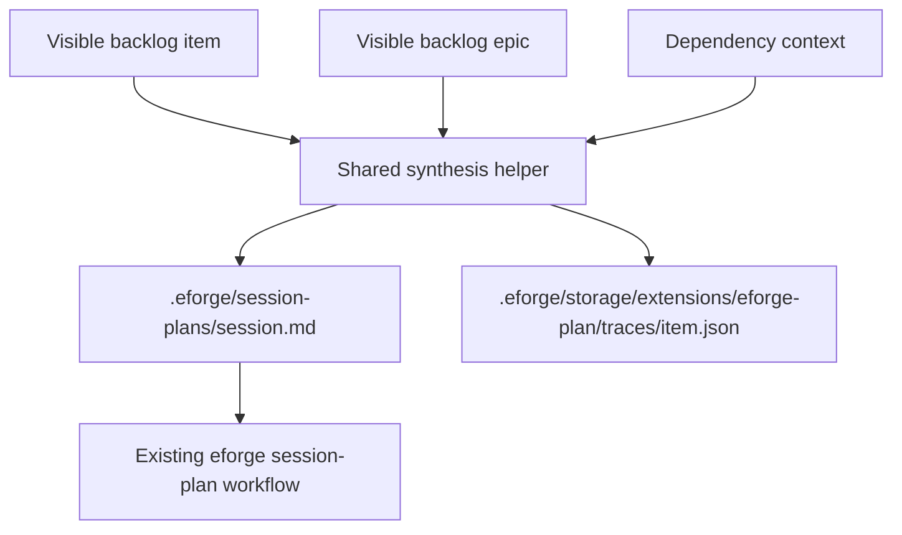

# eforge-plan Extension

`eforge-plan` is a reference extension for curating a project-local backlog and promoting selected backlog items into normal eforge build inputs. It is intentionally dogfoodable: project teams can keep lightweight planning records in the repository, render a derived kanban board, promote work into session plans, and correlate later eforge lifecycle events back to the originating backlog item.

The extension does not replace session plans, playbooks, or normalized build-source preprocessing. It produces ordinary build-source Markdown and `.eforge/session-plans/<session>.md` artifacts that the existing eforge engine can consume.

## Trust model

Extensions run as project-team code. Install and enable `eforge-plan` only in repositories where you trust the extension source and the team-maintained backlog content.

`eforge-plan` is not a sandbox boundary. Actions can read and write project-local files, and the lifecycle hooks update extension-owned sidecars. Review extension changes with the same care as build tooling, scripts, or other automation that runs in the repository.

## Enable

After adding or changing the extension, trust and reload it from the repository root:

```bash
eforge extension validate eforge-plan
eforge extension trust eforge-plan
eforge extension reload
```

Run `eforge extension show eforge-plan` to confirm the registered actions, integration commands, deep links, Console workstation, and input source.

## Usage

Registered action IDs can be invoked by hosts that expose extension actions:

- `capture-item` example input: `{ "title": "Add import preview", "claim": "Users need to inspect imports before enqueue.", "evidence": "Support tickets mention import mistakes.", "tags": ["ux"], "priority": "high", "epic": "planning", "dependsOn": [], "acceptanceCriteria": "Preview renders changed files and can be cancelled." }`
- `update-item` example input: `{ "id": "add-import-preview", "status": "planned", "priority": "high", "tags": ["ux", "ready"], "evidenceNotes": "Validated with design review.", "recheckNotes": "Recheck after first import flow lands.", "dependsOn": ["import-parser"], "epic": "planning" }`
- `promote-item` example input: `{ "itemId": "add-import-preview", "status": "active", "session": "2026-06-05-add-import-preview", "profile": "excursion" }`
- `render-board-markdown` example input: `{ "includeArchive": false }`
- `list-planning-artifacts` example input: `{ "includeSubmitted": false, "includeArchive": false }`; by default submitted flat plans and submitted plan sets are omitted, and `includeSubmitted: true` includes them.
- `show-session-plan` example input: `{ "session": "2026-06-05-add-import-preview" }`
- `show-session-plan-set` example input: `{ "planSetId": "import-workflow" }`
- `create-session-plan` example input: `{ "session": "2026-06-05-add-import-preview", "topic": "Add import preview", "planningType": "feature", "planningDepth": "focused", "profile": "excursion", "agentProfile": "frontend" }`
- `set-session-plan-section` example input: `{ "session": "2026-06-05-add-import-preview", "dimension": "scope", "content": "Implement preview rendering and cancel handling." }`
- `check-session-plan-readiness` example input: `{ "session": "2026-06-05-add-import-preview" }`
- `set-session-plan-ready` example input: `{ "session": "2026-06-05-add-import-preview" }`; returns `kind: "not-ready"` instead of mutating when required dimensions or acceptance criteria checks fail.
- `handoff-session-plan` example input: `{ "session": "2026-06-05-add-import-preview" }`; requires the plan to be ready and `status: ready`, then enqueues the session plan through the daemon build queue.
- `get-recommendations` reads the private recommendation model and returns derived freshness status (`missing`, `fresh`, or `stale`), structured stale reason metadata, the private storage paths, and any active recommendation refresh task.
- `put-recommendations` validates item/epic references and writes the private recommendation model, then records a fresh status sidecar for the current backlog fingerprint with `lastRefreshedBy: "put-recommendations"`.
- `refresh-recommendations` example input: `{}`; starts or reuses a daemon-owned recommendation-only planning task for the current open backlog fingerprint.
- `analyze-all-backlog` example input: `{}`; starts or reuses a daemon-owned backlog curation task for the current visible open backlog fingerprint. The task requests both `backlogCurationDraft` and `recommendations` output and does not enqueue builds.
- `import-legacy-backlog` example input: `{ "kind": "all" }`; copies validated legacy `.backlog` item and epic records into private eforge-plan backlog storage, skips IDs that already exist privately, and leaves legacy files in place.
- `promote-selection` example input: `{ "itemIds": ["add-import-preview"], "status": "active" }`; also accepts `{ "recommendationRef": "next-one" }` or `{ "epicId": "planning" }` selectors.
- `prepare-planner-context` example input: `{ "itemIds": ["add-import-preview"], "includeRoadmap": true }`; returns JSON-safe selected/open backlog items, epics, recommendations, dependency/blocker context, roadmap evidence, and relevant trace summaries.
- `apply-planner-result` example input: `{ "recommendations": { "schemaVersion": 1, "activeWork": [], "readyCandidates": [{ "itemId": "add-import-preview" }], "recommendedNextSequence": [{ "itemId": "add-import-preview", "rationale": "Ready and high priority." }], "safeParallelizableGroups": [], "blockedChains": [], "rationaleAndAssumptions": ["Import preview is unblocked."] } }` or `{ "handoffDraft": { "selection": { "itemIds": ["add-import-preview"], "status": "active" } } }`; applies only structured recommendation models and promotion selections.
- `start-planning-agent-task` example input: `{ "userGoal": "Find the safest next import-preview work", "itemIds": ["add-import-preview"], "includeRoadmap": true }`; prepares bounded planner context, then starts a daemon-owned `eforge-plan.planning-draft` task. `userGoal` is optional: when omitted, the AI-first flow derives the goal from the selection (`itemIds`, `epicId`, or `recommendationRef`), e.g. `{ "itemIds": ["add-import-preview"] }`, `{ "epicId": "planning" }`, or `{ "recommendationRef": "next-one" }`.
- `get-planning-agent-task` example input: `{ "taskId": "task_123" }`; returns the daemon task record for polling status and result data.
- `cancel-planning-agent-task` example input: `{ "taskId": "task_123" }`; requests cancellation through the daemon-owned task API.
- `list-planning-agent-tasks` example input: `{}`; projects the durable planning task workflow index and joins owner-scoped daemon task records so the monitor can discover, poll, retry, and redraft tasks across reloads.
- `retry-planning-agent-task` example input: `{ "taskId": "task_123" }`; starts a new planning task reusing the preserved request context (selection, requested output sections, planning settings) of a prior task.
- `redraft-planning-agent-task` example input: `{ "taskId": "task_123", "answers": ["Target the import-preview milestone."], "steering": "Keep the scope to the preview rail only." }`; starts a linked redraft of a completed needs-input task, carrying the prior summary and clarification questions plus the user's answers or steering.
- `apply-planning-agent-task-result` example input: `{ "taskId": "task_123", "applyRecommendations": true, "applySessionPlanDrafts": [{ "session": "2026-06-05-add-import-preview", "sections": ["scope", "acceptance-criteria"] }] }`; fetches a completed planning-draft task and writes only the selected recommendation, handoff, or session-plan draft portions through the same safe mutation paths used by the non-agent planner actions. To apply a ready session-plan creation draft instead, pass `applySessionPlanCreationDraft`, e.g. `{ "taskId": "task_123", "applySessionPlanCreationDraft": {} }`, which writes the generated session plan through `applySessionPlanCreationDraft`. To apply a backlog curation draft, pass `applyBacklogCurationDraft` with both literal confirmation flags, e.g. `{ "taskId": "task_123", "applyBacklogCurationDraft": { "previewAcknowledged": true, "confirmApply": true } }`; this selection cannot be combined with unrelated apply selections.

Integration command IDs are `render-board`, `promote-item`, and `promote-selection`. Deep-link IDs are `board`, `promote`, and `promote-selection`; they dispatch `render-board-markdown`, `promote-item`, and `promote-selection` respectively. The input-source URI form is:

```text
eforge://input/eforge-plan/<itemId>
```

For example, enqueue `eforge://input/eforge-plan/add-import-preview` to compile that backlog item into build-source Markdown.

## Storage model

`eforge-plan` uses project-local storage only:

- `.eforge/storage/extensions/eforge-plan/backlog/items/<id>.md` stores canonical backlog items.
- `.eforge/storage/extensions/eforge-plan/backlog/epics/<id>.md` stores canonical epics.
- `.backlog/items/<id>.md` and `.backlog/epics/<id>.md` are legacy read-through and explicit import inputs.
- `.eforge/session-plans/<session>.md` stores promoted session-plan artifacts.
- `.eforge/storage/extensions/eforge-plan/traces/<itemId>.json` stores lifecycle trace sidecars as extension-owned private metadata.
- `.eforge/storage/extensions/eforge-plan/recommendations/current.json` stores the project-local private recommendation model used by recommendation and planner actions.
- `.eforge/storage/extensions/eforge-plan/recommendations/status.json` stores the private derived recommendation status sidecar. It records freshness timestamps, the source fingerprint used when recommendations were last applied, the mutation path that last refreshed recommendations, and a bounded history of structured stale reasons.
- `.eforge/storage/extensions/eforge-plan/planning-tasks/index.json` stores the extension-owned durable planning workflow index used by the "Plan with AI" monitor for AI planning task discovery, polling, retry, redraft context, recommendation refresh task discovery, backlog curation task discovery, and applied curation markers across reloads.

The extension never reads or writes legacy `.backlog/recommendations.json`; recommendation state lives only in private extension storage. Backlog records, trace sidecars, recommendation files, and planning task workflow records are private extension storage; session plans are public build inputs under `.eforge/session-plans/`.

Backlog item and epic files are Markdown documents with frontmatter. Legacy `.backlog` item and epic files remain readable compatibility input when no private record has the same ID, and private records take precedence. Writes from capture, update, upsert, and promotion helpers target private backlog storage. The item body remains the durable human-authored planning record; update actions preserve body content while changing supported frontmatter fields, including `evidence_notes` and `recheck_notes`.

Recommendation freshness is derived from `current.json`, `status.json`, and a fingerprint of open backlog items, epics, dependency/blocker context, roadmap evidence, and trace summaries for current open backlog items:

| State | Meaning |
| --- | --- |
| `missing` | No private recommendation model exists at `.eforge/storage/extensions/eforge-plan/recommendations/current.json`, and no stale status sidecar has been recorded. |
| `fresh` | `current.json` exists and `status.json` matches the current recommendation source fingerprint with no stale reasons. |
| `stale` | A stale sidecar exists, or `current.json` exists but the sidecar is missing/invalid, records stale reasons, or its last-applied fingerprint differs from the current source fingerprint. |

The status sidecar and action outputs expose `freshAt`, `staleSince`, `lastRefreshedBy`, and structured `reasons` entries. Lifecycle stale reasons include `eventType`, affected `itemIds`, `correlationKind` (`single`, `multi`, or `bootstrapped`), `timestamp`, and a bounded `summary`; compatibility fields such as `code`, `message`, `refs`, `sourceFingerprint`, `lastAppliedSourceFingerprint`, `state`, and `staleReasons` remain available for existing consumers. Persisted reason history is deduplicated for exact repeats and trimmed to the latest 20 entries. A correlated lifecycle event can therefore make recommendations stale before `current.json` exists; in that case `get-recommendations` returns stale freshness with `recommendations: null` instead of creating or backfilling a model.

Lifecycle hooks are invalidators only. After a lifecycle event has been correlated to one or more backlog items and trace/status sidecars have been updated, the hook records structured stale metadata and invalidates recommendation freshness. Uncorrelated or ambiguous lifecycle events do not dirty recommendation freshness, and lifecycle hooks never start daemon-owned agent tasks or host-specific planning commands. Freshness is restored only through explicit recommendation apply or refresh paths: `refresh-recommendations`, `apply-planner-result`, `apply-planning-agent-task-result`, `applyBacklogCurationDraft` when a curation draft includes generated recommendations, or `put-recommendations`.

Recommendation model writes validate references before changing storage: `put-recommendations`, `apply-planner-result`, `apply-planning-agent-task-result`, and confirmed `applyBacklogCurationDraft` output reject unknown `itemId`/`epicIds` references and empty safe-parallelizable group `itemIds`. Validation failures leave the existing `current.json` and status sidecar unchanged; there are no partial writes. Successful writes update `current.json` first, then derive freshness from the applied source fingerprint. If that fingerprint has drifted by the time the model is applied, `apply-planning-agent-task-result` can return stale status with a `source-fingerprint-drift` reason instead of fresh. Fresh status records `lastRefreshedBy` as `put-recommendations`, `apply-planner-result`, `apply-planning-agent-task-result`, or `apply-backlog-curation-draft`, depending on the action that applied the model.

## Kanban semantics

The board is derived from backlog status, dependency state, and trace evidence. Lanes are not separate storage locations.

| Lane | Meaning |
| --- | --- |
| `inbox` | Candidate items that need triage or refinement. |
| `ready` | Planned items without unresolved blockers. |
| `blocked` | Items with unresolved dependencies or other blocking evidence. |
| `in-progress` | Active items or items with active trace evidence. |
| `done` | Shipped items. |
| `archive` | Stale or superseded items. |

Statuses are `candidate`, `planned`, `active`, `shipped`, `stale`, and `superseded`. Promotion never marks an item `shipped`; it marks the item `active` by default, or leaves it `planned` when requested by the action input.

## Actions

The extension registers backlog, board, recommendation, planner-orchestration, and planning-workstation actions:

| Action | Purpose | Side effects |
| --- | --- | --- |
| `list-board` | Return epics, items, lanes, blocked reasons, recommendation status (including missing/fresh/stale), optional recommendation summary, trace summaries, and lifecycle projections as JSON-safe data. Kanban cards include canonical `linkRows`, `failureEvidence`, and `lifecycleState`; the board also exposes aggregate `lifecycleLinks` and `epicProgress`. | `local-read` |
| `render-board-markdown` | Return `{ markdown }` for host or Console display, including visible recommendation freshness notes when recommendations are fresh or stale. | `local-read` |
| `capture-item` | Create a visible backlog item in private eforge-plan storage from title, claim, evidence, tags, priority, epic, and dependencies. | `local-write` |
| `upsert-epic` | Create or update a visible backlog epic in private eforge-plan storage without duplicating item membership lists. | `local-write` |
| `update-item` | Update visible item status, priority, tags, evidence/recheck notes, dependencies, and epic link in private storage while preserving body content. | `local-write` |
| `import-legacy-backlog` | Copy validated legacy `.backlog` item and/or epic records into private eforge-plan backlog storage, skipping IDs that already exist privately and leaving legacy files in place. | `local-read`, `local-write` |
| `promote-item` | Write a session plan, update trace evidence, and set item status to `active` or `planned` through private backlog metadata updates. | `local-write` |
| `promote-selection` | Promote selected visible item IDs, a recommendation ref, or an epic into one session plan using the same build-source synthesis path and private backlog metadata updates. | `local-write` |
| `get-recommendations` | Read `.eforge/storage/extensions/eforge-plan/recommendations/current.json`, derive enriched freshness from `.eforge/storage/extensions/eforge-plan/recommendations/status.json`, and return summary/status data plus any active refresh task. | `local-read` |
| `put-recommendations` | Validate recommendation item/epic references and write `.eforge/storage/extensions/eforge-plan/recommendations/current.json`, then update the status sidecar for the current source fingerprint with `lastRefreshedBy: "put-recommendations"`. | `local-write` |
| `refresh-recommendations` | Start or reuse a daemon-owned recommendation-only planning task for the current source fingerprint. It records a durable workflow entry with purpose `recommendation-refresh` and does not apply generated output automatically. | `local-read`, `local-write`, `daemon-state` |
| `analyze-all-backlog` | Start or reuse a daemon-owned backlog curation planning task for the current visible open backlog fingerprint. It records a durable workflow entry with purpose `backlog-curation`, requests `backlogCurationDraft` plus `recommendations`, and does not enqueue builds. | `local-read`, `local-write`, `daemon-state` |
| `prepare-planner-context` | Prepare JSON-safe backlog, epic, recommendation, dependency/blocker, roadmap evidence, and relevant trace summaries for external AI planning orchestration. | `local-read` |
| `apply-planner-result` | Apply validated structured planner recommendation updates and/or handoff drafts through private recommendation storage and `promote-selection`. | `local-write` |
| `start-planning-agent-task` | Prepare planner context, then ask the daemon-owned agent task service to run one `eforge-plan.planning-draft` task for an explicit user goal or a goal derived from the backlog selection (`itemIds`, `epicId`, or `recommendationRef`). | `local-read`, `local-write`, `daemon-state` |
| `get-planning-agent-task` | Return the daemon task record for one planning task id. | `local-read` |
| `cancel-planning-agent-task` | Delegate cancellation of one planning task to the daemon-owned task service. | `local-write` |
| `list-planning-agent-tasks` | Project the durable planning task workflow index and join owner-scoped daemon task records for discovery, polling, retry, and redraft across reloads. | `local-read` |
| `retry-planning-agent-task` | Start a new planning task reusing the preserved request context of a prior task. | `local-read`, `local-write`, `daemon-state` |
| `redraft-planning-agent-task` | Start a linked redraft of a completed needs-input task, carrying prior summary/questions plus the user's clarification answers or steering. | `local-read`, `local-write`, `daemon-state` |
| `apply-planning-agent-task-result` | Apply selected output from a completed planning-draft task through validated recommendation storage, handoff promotion helpers, session-plan section adapters, `applySessionPlanCreationDraft` for ready creation drafts, or `applyBacklogCurationDraft` for confirmed backlog curation drafts. | `local-write` |
| `list-planning-artifacts` | Return backlog board summaries plus flat session plans and session plan sets using stable artifact keys such as `plan:<session>` and `plan-set:<planSetId>`. Plan artifacts include lifecycle/source fields when available: `sourceRefs.sourceItemIds`, `sourceRefs.sourceEpicIds`, `lifecycleState`, `itemRows`, `linkRows`, and `failureEvidence`. | `local-read` |
| `show-session-plan` | Return a flat session-plan detail view with frontmatter metadata, body, readiness detail, absolute path, top-level `sourceRefs` (`sourceItemIds`, `sourceEpicIds`), and `lifecycle` (`lifecycleState`, `itemRows`, `linkRows`, `failureEvidence`). | `local-read` |
| `show-session-plan-set` | Return a plan-set detail projection with manifest summary, validation detail, directory paths, manifest path, and anchor content when present. | `local-read` |
| `create-session-plan` | Write `.eforge/session-plans/<session>.md` using the shared session-planning workflow format. | `local-write` |
| `set-session-plan-section` | Replace a named planning dimension section in a flat session plan. Duplicate headings for that dimension are collapsed to one section. | `local-write` |
| `update-session-plan-metadata` | Update session-plan metadata fields that are not exposed through section editing, such as `profile`, `agent_profile`, and `open_questions`. | `local-write` |
| `select-session-plan-dimensions` | Update the selected planning dimensions for a flat session plan. | `local-write` |
| `check-session-plan-readiness` | Run adapter-backed readiness and acceptance-criteria diagnostics without mutating the file. | `local-read` |
| `set-session-plan-ready` | Mark a plan `ready` only when required dimensions are covered and readiness diagnostics pass; otherwise return a structured `not-ready` result. | `local-write` |
| `handoff-session-plan` | Verify readiness and `status: ready`, then enqueue the session plan through the daemon build queue. If enqueue fails, return a structured failure with the manual `eforge build <path>` fallback command. | `local-read`, `local-write`, `daemon-state`, `build-queue` |

## Promotion flow

`promote-item` and `promote-selection` are the primary handoffs. They read source backlog item and related epic/dependency context, synthesize build-source Markdown, write a normal session-plan artifact, and record the promotion in the trace sidecar. `promote-selection` supports multi-source promotion from a recommended item, recommended group, epic, or user-selected item set while preserving the same session-plan helper and trace behavior.



Generated session plans include frontmatter compatible with the existing session-plan workflow, including `session`, `topic`, `status`, `planning_type`, `planning_depth`, dimension fields, `open_questions`, and `profile`. The body includes Context, Scope, Assumptions, Design Decisions, Acceptance Criteria, Source Backlog Evidence, Source Epic Evidence, and Dependency Context.

When assumptions or acceptance criteria are missing, generated Markdown includes explicit guidance instead of silently pretending the item is ready.

## Input-source URI

The extension also registers direct input-source adapter `eforge-plan`:

```text
eforge://input/eforge-plan/<itemId>
```

The adapter compiles the backlog item into ordinary build-source Markdown using the same synthesis helper as promotion. The output includes the item claim, evidence, assumptions or missing-assumption guidance, and acceptance criteria or missing-criteria guidance.

The adapter requires the input transform context to resolve visible eforge-plan backlog records from `ctx.cwd`. If invoked without context, it returns instructional Markdown explaining that `eforge-plan` requires an input-source context rather than reading from `process.cwd()`.

## Console and host surfaces

The Console System contribution is declarative and uses only the closed renderer set supported by the Console:

- `text`
- `markdown`
- `status-badge`
- `link`
- `action-button`
- `action-form`

The contribution includes board summary content, status badges, and action-backed controls for listing or rendering the board, reading recommendations, refreshing recommendations, analyzing all backlog records, promoting an item or selection, preparing planner context, applying structured planner results, capturing an item, updating an item, and importing legacy backlog records. Dynamic board content is surfaced by invoking `render-board-markdown`; the top-level contribution does not read the filesystem directly.

Host integrations register commands and action-backed deep links for board rendering and promotion workflows.

The planning workstation appears under `/console/workstations` as an extension-owned `frameBundle` rooted at `workstation-assets/plans` with `index.js` as its entrypoint. Browser assets are built from the TypeScript/React Vite app in `workstation-src/plans`, use local shadcn-style components owned by the extension, and are served through the daemon-owned frame/asset contract. They do not import parent Console React components, private Console routes, `packages/console-ui/src`, or `@/` aliases.

The workstation is view-first and deep-linkable. It exposes two tabs:

- **Backlog** renders the derived kanban with Lane / Epic / Recommended grouping, status filters (`all`, `ready`, `blocked`, `review`, `closed`), free-text and epic filters, compact lifecycle chips (`Plan`, `Queue`, `Run`, `PR open`, `Merged`, `Failed`, or `Partial`), expandable lifecycle evidence rows, and a next-up recommendations rail with blocked chains and rationale. The lifecycle panel shows action-projected session, queue, run, PR, landing, timestamp, branch/commit, and affected-item evidence without reading private trace storage or daemon routes directly. The recommendations panel uses the enriched `get-recommendations` response to show missing/fresh/stale status, structured stale reason metadata, active refresh task status, and a refresh control when recommendations are missing or stale. The refresh control invokes `refresh-recommendations` through `window.eforge.invokeAction` and then reloads task workflows/status; it starts or reuses a recommendation refresh planning task but does not apply its generated recommendations. Selecting ready items exposes a single **Promote to a build plan** action that starts AI session-plan generation for the ready subset of the selection (blocked, closed, and non-ready items are excluded, and the action is disabled when no ready items remain); recommendation cards and groups start the same AI planning workflow by item ids or recommendation ref. Safe parallelizable groups are planning guidance only. There is no deterministic workstation promotion path and no prompt-input box: the AI promotion derives its goal from the selection. Recommendations stay in the AI workflow rather than calling `promote-selection`.
- **Plans** lists session plans and plan sets and renders a structured detail view. Flat plans show source backlog item refs, source epic refs, lifecycle evidence for queue/run/PR/landing state, partial per-item progress rows when only some linked items are shipped, an actionable readiness checklist (missing dimensions open inline section editors backed by `set-session-plan-section`; acceptance-criteria diagnostics offer a revise affordance; an unselected plan offers a dimension-selection form backed by `select-session-plan-dimensions`), editable metadata backed by `update-session-plan-metadata`, and rendered dimension sections. Plan sets render their children by relationship strategy (`parallel` as a grid; `sequential` and `dag` as a numbered ordered list, with `dag` also surfacing each child's `dependsOn`) plus a validation summary.

Because the workstation runs as a cross-origin sandboxed iframe (`sandbox="allow-scripts"`, opaque origin), it has no shared History and cannot open native `window.confirm`/modal dialogs. The Console host owns the URL: the active sub-path and query are carried on `/console/workstations/<id>/<subPath>?<query>` and synced to the iframe over a token-authed `postMessage` bridge without remounting the frame. Mutations that need confirmation (such as handoff) use a two-step in-app confirmation instead of a browser dialog.

### Workstation UI development

The workstation has a frontend development loop independent of eforge builds:

```bash
pnpm dev:eforge-plan-workstation          # mock bridge / fixture data
pnpm dev:eforge-plan-workstation:daemon   # auto-detect or start daemon, then proxy /api to it
pnpm build:eforge-plan-workstation
```

`dev:eforge-plan-workstation` runs the Vite app with a mock `window.eforge.invokeAction` bridge and fixture data for rapid UI iteration. `dev:eforge-plan-workstation:daemon` reads the project daemon lockfile, starts the daemon when needed, sets `VITE_EFORGE_DAEMON_URL` automatically, and launches the same Vite app against live daemon data; Vite proxies `/api` to the daemon so local-only action security still sees same-origin requests. Production Console rendering uses the built files in `workstation-assets/plans`.

`workstation-assets/` is a generated artifact and is gitignored - do not commit it. The workstation package is part of the pnpm workspace, so root `pnpm build` (run by CI before tests and by the daemon-restart dev loop) regenerates it, and `workstation-assets.test.ts` builds it on demand when it is missing. Extension packaging copies the extension directory from disk, so the bundle must be built before contributing the extension to another project. Rebuilding changes the extension trust hash; re-trust and reload the Console after a rebuild.

The workstation can browse backlog-derived board data, recommendation summary/status data, active recommendation refresh status, epics, flat session plans, and session plan sets; create or edit session plans; update metadata and selected dimensions; run readiness checks; mark ready plans; start AI session-plan generation from selected ready backlog items or recommendations through **Promote to a build plan**; refresh missing or stale recommendations through `refresh-recommendations`; start or reuse all-backlog curation through `analyze-all-backlog`; monitor durable planning tasks in the **Plan with AI** panel; and enqueue ready session plans after an explicit two-step handoff confirmation. The Plan with AI panel is a durable task monitor rather than a prompt box: on load it lists indexed tasks through `list-planning-agent-tasks`, polls running tasks, and renders running progress with current/covered/remaining section progress, failed tasks with a retry control that reuses preserved workflow context, needs-input tasks with clarification questions plus answer/steering inputs that start a linked redraft, recommendation refresh workflow entries, backlog curation workflow entries, and ready session-plan creation drafts with a preview. Generated output stays read-only until an explicit two-step in-app confirmation applies a creation draft, recommendations, handoff drafts, session-plan sections, or a backlog curation draft; structured backlog curation drafts are validated task output and do not write backlog records by themselves. Applying a creation draft refreshes the Plans artifact list. For AI session-plan creation drafts, source backlog item ids and epic ids are trusted only from the preserved workflow selection captured before the agent ran, not from agent-authored output. All reads and mutations go through `window.eforge.invokeAction` and the workstation manifest's `allowedActions` list, which no longer includes `promote-selection`.

## Trace sidecars

Trace sidecars live under `.eforge/storage/extensions/eforge-plan/traces/<itemId>.json`. They are extension-owned private metadata resolved through the SDK's extension storage helper, and they correlate backlog items with eforge lifecycle evidence.

Trace-owned data includes:

- promoted session plans keyed by session id;
- queued PRD records keyed by PRD id;
- build runs keyed by run id and session id;
- build sessions keyed by session id;
- landing results keyed by feature branch or commit SHA;
- last observed lifecycle event metadata.

Sidecar updates are idempotent and use stable keys such as `session`, `prdId`, `sessionId`, `runId`, `featureBranch`, and `commitSha`.

## Lifecycle linkage

The extension registers hooks for enqueue, queue PRD, session, landing, and auto-merge lifecycle events:

- `enqueue:start`
- `enqueue:complete`
- `queue:prd:start`
- `queue:prd:complete`
- `session:start`
- `session:end`
- `landing:complete`
- `landing:auto-merge:complete`

Correlation can use promoted session-plan paths, input-source ids, `enqueue:complete.id`, `queue:prd:complete.prdId`, and event envelope `sessionId` or `runId` values. Shared promoted-plan evidence can correlate one lifecycle event to multiple source item traces when those items were promoted together into the same session plan, PRD, build, or landing flow.

The supported linkage chain is backlog item or epic selection → generated `.eforge/session-plans/<session>.md` → explicit handoff to the build queue → queue PRD and run/session evidence → PR or landing evidence → correlated item and epic progress. The trace sidecars are the durable private join records for this chain, while workstation actions project compact public rows for the Backlog and Plans tabs.

Lifecycle status mutation is conservative:

- PR-open, failed, skipped, cancelled, and ambiguous evidence updates trace evidence and UI lifecycle rows but does not close backlog items or mark them `shipped`; ambiguous correlations are left unmutated and do not update trace or UI lifecycle rows unless resolved as a supported multi-source correlation.
- `landing:complete` with a `prUrl` and no merge confirmation records PR evidence and leaves the item active.
- `landing:complete` with confirmed local merge evidence may mark only correlated item ids `shipped`.
- `landing:auto-merge:complete` may mark only correlated item ids `shipped`.
- Unrelated ambiguous correlation writes no backlog status mutation. Diagnostic trace evidence is recorded for all traces in a shared multi-source promoted-plan correlation, but unrelated ambiguous matches are left unmutated.
- Mixed multi-item or epic evidence projects a `partial` lifecycle state with per-item rows when only some correlated item ids have confirmed shipped evidence.

## Planning workstation boundary

Planning artifact semantics are owned by `@eforge-build/input` through `createSessionPlanningWorkflowAdapter()`. The extension action handlers use that adapter for flat session-plan and plan-set reads, mutations, readiness checks, acceptance-criteria diagnostics, path containment, and plan-set validation.

Daemon and client session-plan and session plan-set routes remain compatibility plumbing for Pi, Claude, CLI, daemon clients, and other tools. The extension workstation uses extension actions instead of raw extension-owned HTTP routes or private Console APIs.

The handoff flow is an explicit build-queue submission. After confirming the plan is ready and has `status: ready`, `handoff-session-plan` calls the daemon-owned build queue with `.eforge/session-plans/<session>.md` and returns the spawned enqueue worker session id, pid, auto-build state, path, and readiness detail. If queue submission is unavailable or fails, it returns `kind: "enqueue-failed"` with the manual `eforge build <path>` fallback command instead of silently reporting success.

Planner orchestration is action-first: `prepare-planner-context` prepares bounded JSON-safe evidence packets including relevant trace summaries, and `apply-planner-result` accepts structured recommendation models or handoff drafts. It does not accept raw Markdown or arbitrary filesystem paths from planner output, and handoff drafts use the existing `promote-selection` path.

`eforge-plan` can also start daemon-owned planning agent tasks. The extension owns backlog state, recommendation storage, session-plan draft application, backlog curation application, and the final apply semantics; the daemon owns agent execution, status, cancellation, and task records. `start-planning-agent-task` always builds a bounded context packet with `prepare-planner-context` before starting an `eforge-plan.planning-draft` task; `analyze-all-backlog` builds an all-open-backlog curation source and requests `backlogCurationDraft` plus `recommendations`. The task result is read-only until the user previews it and explicitly chooses which recommendations, handoff drafts, session-plan draft sections, or backlog curation draft to apply. Applying generated output does not enqueue a build, mark backlog items shipped, or submit session plans; the separate confirmed handoff action enqueues a ready session plan.

The AI planning flow is durable but bounded. The workstation can start tasks from backlog selections and recommendations, monitor indexed tasks across reloads, poll running tasks, cancel, retry failed tasks with preserved context, answer needs-input clarifications to start a linked redraft, start/reuse recommendation refresh tasks for stale or missing recommendation state, start/reuse all-backlog curation tasks for the current source fingerprint, and preview and explicitly apply ready creation or curation drafts. Structured backlog curation draft task output is validated and stored as task output but does not write backlog records by itself. Applying generated output never enqueues a build, marks backlog items shipped, or submits session plans; users must explicitly confirm handoff on a ready plan to enqueue. It still does not provide an open-ended multi-turn chat UI, autonomous backlog draining, or automatic application of generated content.

Parent-Console plugins, direct React loading into the parent Console, private Console imports/routes, raw extension-owned HTTP routes, daemon-owned chat state, multi-turn AI chat UI, scheduling, auto-mode backlog draining, automatic queue selection, unattended enqueueing, queue orchestration, plan-set generation from recommendations, legacy `.backlog/recommendations.json` import/export, and promotion into a bundled/core distribution remain unsupported. General extension-owned AI chat runtime support is not implemented by this extension.
