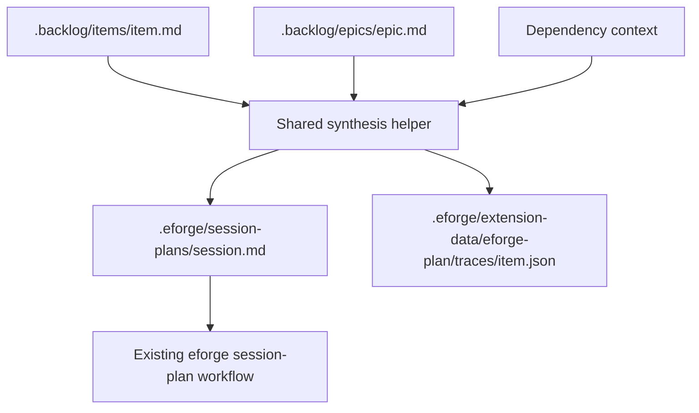

# eforge-plan Extension

`eforge-plan` is a reference extension for curating a project-local backlog and promoting selected backlog items into normal eforge build inputs. It is intentionally dogfoodable: project teams can keep lightweight planning records in the repository, render a derived kanban board, promote work into session plans, and correlate later eforge lifecycle events back to the originating backlog item.

The extension does not replace session plans, playbooks, or normalized build-source preprocessing. It produces ordinary build-source Markdown and `.eforge/session-plans/<session>.md` artifacts that the existing eforge engine can consume.

## Trust model

Extensions run as project-team code. Install and enable `eforge-plan` only in repositories where you trust the extension source and the team-maintained backlog content.

`eforge-plan` is not a sandbox boundary. Actions can read and write project-local files, and the lifecycle hooks update extension-owned sidecars. Review extension changes with the same care as build tooling, scripts, or other automation that runs in the repository.

## Enable

After adding or changing the extension, trust and reload it from the repository root:

```bash
eforge extension validate eforge-plan
eforge extension trust eforge-plan
eforge extension reload
```

Run `eforge extension show eforge-plan` to confirm the registered actions, integration commands, deep links, and input source.

## Usage

Registered action IDs can be invoked by hosts that expose extension actions:

- `capture-item` example input: `{ "title": "Add import preview", "claim": "Users need to inspect imports before enqueue.", "evidence": "Support tickets mention import mistakes.", "tags": ["ux"], "priority": "high", "epic": "planning", "dependsOn": [], "acceptanceCriteria": "Preview renders changed files and can be cancelled." }`
- `update-item` example input: `{ "id": "add-import-preview", "status": "planned", "priority": "high", "tags": ["ux", "ready"], "evidenceNotes": "Validated with design review.", "recheckNotes": "Recheck after first import flow lands.", "dependsOn": ["import-parser"], "epic": "planning" }`
- `promote-item` example input: `{ "itemId": "add-import-preview", "status": "active", "session": "2026-06-05-add-import-preview", "profile": "excursion" }`
- `render-board-markdown` example input: `{ "includeArchive": false }`

Integration command IDs are `render-board` and `promote-item`. Deep-link IDs are `board` and `promote`; they dispatch `render-board-markdown` and `promote-item` respectively. The input-source URI form is:

```text
eforge://input/eforge-plan/<itemId>
```

For example, enqueue `eforge://input/eforge-plan/add-import-preview` to compile that backlog item into build-source Markdown.

## Storage model

`eforge-plan` uses project-local storage only:

- `.backlog/items/<id>.md` stores backlog items.
- `.backlog/epics/<id>.md` stores epics.
- `.eforge/session-plans/<session>.md` stores promoted session-plan artifacts.
- `.eforge/extension-data/eforge-plan/traces/<itemId>.json` stores lifecycle trace sidecars.

Backlog item and epic files are Markdown documents with frontmatter. The item body remains the durable human-authored planning record; update actions preserve body content while changing supported frontmatter fields, including `evidence_notes` and `recheck_notes`.

## Kanban semantics

The board is derived from backlog status, dependency state, and trace evidence. Lanes are not separate storage locations.

| Lane | Meaning |
| --- | --- |
| `inbox` | Candidate items that need triage or refinement. |
| `ready` | Planned items without unresolved blockers. |
| `blocked` | Items with unresolved dependencies or other blocking evidence. |
| `in-progress` | Active items or items with active trace evidence. |
| `done` | Shipped items. |
| `archive` | Stale or superseded items. |

Statuses are `candidate`, `planned`, `active`, `shipped`, `stale`, and `superseded`. Promotion never marks an item `shipped`; it marks the item `active` by default, or leaves it `planned` when requested by the action input.

## Actions

The MVP registers six actions:

| Action | Purpose | Side effects |
| --- | --- | --- |
| `list-board` | Return epics, items, lanes, blocked reasons, and trace summaries as JSON-safe data. | `local-read` |
| `render-board-markdown` | Return `{ markdown }` for host or Console display. | `local-read` |
| `capture-item` | Create `.backlog/items/<id>.md` from title, claim, evidence, tags, priority, epic, and dependencies. | `local-write` |
| `upsert-epic` | Create or update `.backlog/epics/<id>.md` without duplicating item membership lists. | `local-write` |
| `update-item` | Update status, priority, tags, evidence/recheck notes, dependencies, and epic link while preserving body content. | `local-write` |
| `promote-item` | Write a session plan, update trace evidence, and set item status to `active` or `planned`. | `local-write` |

No MVP action declares `build-queue` side effects.

## Promotion flow

`promote-item` is the primary handoff. It reads the source backlog item and related epic/dependency context, synthesizes build-source Markdown, writes a normal session-plan artifact, and records the promotion in the trace sidecar.



Generated session plans include frontmatter compatible with the existing session-plan workflow, including `session`, `topic`, `status`, `planning_type`, `planning_depth`, dimension fields, `open_questions`, and `profile`. The body includes Context, Scope, Assumptions, Design Decisions, Acceptance Criteria, Source Backlog Evidence, Source Epic Evidence, and Dependency Context.

When assumptions or acceptance criteria are missing, generated Markdown includes explicit guidance instead of silently pretending the item is ready.

## Input-source URI

The extension also registers direct input-source adapter `eforge-plan`:

```text
eforge://input/eforge-plan/<itemId>
```

The adapter compiles the backlog item into ordinary build-source Markdown using the same synthesis helper as promotion. The output includes the item claim, evidence, assumptions or missing-assumption guidance, and acceptance criteria or missing-criteria guidance.

The adapter requires the input transform context to resolve `.backlog` from `ctx.cwd`. If invoked without context, it returns instructional Markdown explaining that `eforge-plan` requires an input-source context rather than reading from `process.cwd()`.

## Console and host surfaces

The Console System contribution is declarative and uses only the closed renderer set supported by the Console:

- `text`
- `markdown`
- `status-badge`
- `link`
- `action-button`
- `action-form`

The contribution includes board summary content, status badges, and action-backed controls for listing or rendering the board, promoting an item, capturing an item, and updating an item. Dynamic board content is surfaced by invoking `render-board-markdown`; the top-level contribution does not read the filesystem directly.

Host integrations register commands and action-backed deep links for board rendering and promotion workflows.

## Trace sidecars

Trace sidecars live under `.eforge/extension-data/eforge-plan/traces/<itemId>.json`. They are extension-owned metadata that correlate backlog items with eforge lifecycle evidence.

Trace-owned data includes:

- promoted session plans keyed by session id;
- queued PRD records keyed by PRD id;
- build runs keyed by run id and session id;
- build sessions keyed by session id;
- landing results keyed by feature branch or commit SHA;
- last observed lifecycle event metadata.

Sidecar updates are idempotent and use stable keys such as `session`, `prdId`, `sessionId`, `runId`, `featureBranch`, and `commitSha`.

## Lifecycle linkage

The extension registers hooks for enqueue, queue PRD, session, landing, and auto-merge lifecycle events:

- `enqueue:start`
- `enqueue:complete`
- `queue:prd:start`
- `queue:prd:complete`
- `session:start`
- `session:end`
- `landing:complete`
- `landing:auto-merge:complete`

Correlation can use promoted session-plan paths, input-source ids, `enqueue:complete.id`, `queue:prd:complete.prdId`, and event envelope `sessionId` or `runId` values when exactly one trace matches.

Lifecycle status mutation is conservative:

- Failed and skipped queue results update trace evidence but do not mark items `stale`, `superseded`, or `shipped`.
- `landing:complete` with a `prUrl` and no merge confirmation records PR evidence and leaves the item active.
- `landing:complete` with confirmed local merge evidence may mark the item `shipped`.
- `landing:auto-merge:complete` may mark the item `shipped`.
- Ambiguous correlation writes no backlog status mutation. Diagnostic trace evidence is recorded only when a single trace can be identified.

## Deferred platform gaps

The MVP intentionally does not add private daemon routes, custom Console routes, browser bundles, custom React renderers, raw extension-owned HTTP routes, or extension-owned AI planning/chat runtime APIs.

A first-class Console workstation API, an extension-owned AI planning/chat API, and promotion into a bundled/core distribution remain TBD.
