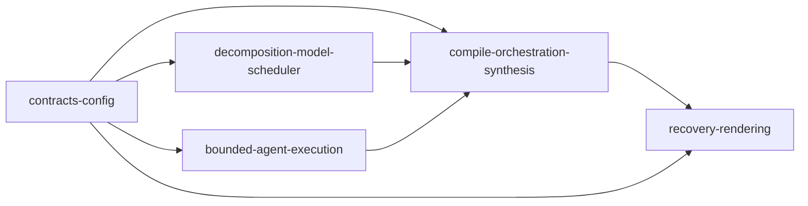
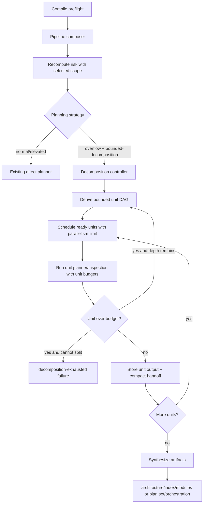

# Add Context-Managed Compile Planning for Oversized Sources

## Vision and Goals

eforge compile must treat overflow-risk planning input as a scheduling problem, not as a terminal planner failure. After compile preflight and pipeline composition have run, sources classified as `overflow-risk` with a bounded-decomposition recommendation enter a context-managed planning controller. The controller decomposes the source into bounded planning units, schedules independent units up to a configured planning-unit parallelism limit, preserves per-unit compact handoffs, and synthesizes existing compile artifacts without requiring any planner-family session to carry the whole source or root transcript.

This architecture preserves the current direct planner flow for normal and elevated risk sources, and preserves the external PRD/queue model: decomposition is an internal compile artifact only, not automatic successor PRD authoring or auto-enqueueing.

## Existing Flow Summary

Current compile behavior is concentrated in `packages/engine/src/pipeline/stages/compile-stages.ts`:

1. The `planner` compile stage runs `composePipeline()`.
2. Preflight evidence is recomputed with the selected pipeline scope.
3. The stage may retry-as-expedition, then calls `runPlanner()` for one broad root planning session.
4. Expedition architecture output feeds `module-planning`, which plans dependency waves in parallel using `runModulePlanner()`.
5. Planner-family context guards and compact-inspection continuation exist, but the root planner can still exceed live context before producing artifacts.

The new path keeps steps 1-2, but replaces step 3 for bounded-decomposition overflow work.

## Core Architectural Principles

- **Preflight + composer select strategy.** The strategy selector runs only after pipeline composition and preflight recomputation with the selected scope.
- **Direct remains default.** `normal` and `elevated` risks continue through the existing direct `runPlanner()` path.
- **No monolithic retry for bounded-decomposition.** Overflow-risk sources whose recommendation is `bounded-decomposition` use the decomposition controller rather than a second broad root planner attempt.
- **Context is a scheduled resource.** Each unit has source caps, prompt caps, live input-token limits, compact-handoff caps, max local exploration counts, and recursive split limits.
- **Dependency-aware parallelism.** Independent units run concurrently up to `compile.planningUnitParallelism`, default `2`; dependencies, unresolved interface contracts, and shared-file blockers serialize units.
- **Unit-local salvage.** Compact-inspection continuation is available inside a unit, with unit-only source and unit-only handoff evidence. It never replays or accumulates the root transcript.
- **Client owns wire contracts.** Decomposition event schemas, failure kinds, sidecar evidence shapes, and exported types live in `@eforge-build/client`.
- **Existing artifact formats remain authoritative.** Synthesis emits existing architecture/module/index artifacts for expeditions and plan/orchestration artifacts for excursions when needed.

## Strategy Selection

Add a focused selector, used by the compile `planner` stage after composer output is applied:

```ts
type CompilePlanningStrategy = 'direct' | 'context-managed-decomposition';

function selectCompilePlanningStrategy(input: {
  risk?: CompilePreflightRisk;
  recommendation?: CompileContextRecommendation;
  selectedScope: CompilePipelineScope;
  retriedAsExpedition: boolean;
}): CompilePlanningStrategy;
```

Selection rules:

- Return `direct` when there is no preflight risk, risk is `normal`, or risk is `elevated`.
- Return `direct` when the risk recommendation is `retry-as-expedition`; the existing escalation path first changes pipeline scope and recomputes risk.
- Return `context-managed-decomposition` when risk is `overflow-risk` and recommendation is `bounded-decomposition`, including the post-escalation case where the same source has already been retried as expedition.
- Return `direct` for `manual-reduce-scope` until future host workflows explicitly choose a reduced source.

The first acceptance-regression path is: preflight `overflow-risk` + composer `expedition` + recomputed recommendation `bounded-decomposition` -> context-managed decomposition, with no root broad `runPlanner()` call.

## Implementation Module Boundaries

The module boundaries below are the ownership map for implementation plans. A module may consume exported types or helper APIs from an upstream module, but it must not edit another module's owned logic except in shared files and regions listed in the shared file registry.

| Module | Owns | Produces | Consumes | Must not own |
|--------|------|----------|----------|--------------|
| `contracts-config` | Client-owned TypeBox event schemas, decomposition failure evidence wire shapes, event exports/registry entries, and config default/validation plumbing for planning-unit limits. | `PlanningDecomposition*` event schemas and TypeScript types, `decomposition-exhausted` failure kind, `planning-decomposition` stage, resolved `PlanningDecompositionLimits`. | PRD requirements and existing client event/config patterns. | Engine strategy branching, agent prompts, artifact synthesis, or Console/CLI rendering behavior. |
| `decomposition-model-scheduler` | Pure engine decomposition model in `packages/engine/src/compile-resilience/planning-decomposition.ts`: graph derivation, coverage assignment, deterministic scheduler, recursive split decisions, budget diagnostics, and synthesis input records. | `PlanningDecompositionGraph`, `PlanningScheduleDecision`, child graph updates, `DecompositionPlanningError`, and bounded `PlanningUnitOutput` synthesis inputs. | Preflight evidence, selected pipeline scope, resolved limits, and bounded unit observations. | Agent invocation, compile-stage branching, filesystem artifact writing, or UI/recovery wording. |
| `bounded-agent-execution` | Bounded planner/module-planner/inspection invocation: unit prompts, unit-local compact continuation, upstream handoff inclusion, and live context guard wiring. | `PlanningUnitOutput`, compact handoff artifact references, observed budget pressure, and unit lifecycle/progress events through the controller emitter. | `PlanningDecompositionUnit`, upstream `PlanningUnitOutput`/handoff references, budgets, and client event types. | Root strategy selection, graph scheduling policy, final artifact synthesis, or recovery sidecar classification. |
| `compile-orchestration-synthesis` | Compile-stage branch, controller loop, schedule execution, event emission, internal decomposition artifact persistence, and synthesis into existing compile artifacts. | Populated compile stage context (`ctx.expeditionModules`, `ctx.plans`, `ctx.moduleBuildConfigs` as applicable), architecture/index/module or plan/orchestration artifacts, persisted `.decomposition/*` evidence, and terminal synthesis/failure events. | Strategy selector, graph/scheduler helpers, bounded agent execution, client event/failure types, and existing plan-writing helpers. | Client schema definitions, bounded prompt construction details, Console/CLI rendering, or product-level successor PRD authoring. |
| `recovery-rendering` | Recovery sidecar wording/classification and Console/CLI rendering of decomposition progress, compact handoffs, scheduling decisions, and decomposition exhaustion evidence. | User-facing recovery text, timeline/event summaries, and CLI/Console details backed by shared client types. | Client event/failure schemas, persisted decomposition artifacts, and `planning:scope-context:failure` evidence. | Engine strategy decisions, schema ownership, scheduler policy, or artifact synthesis. |

Producer-to-consumer flow is acyclic:



## Shared Data Model

### Engine Internal Model

Create `packages/engine/src/compile-resilience/planning-decomposition.ts` for the pure model, derivation, scheduler helpers, recursive split helpers, and synthesis inputs.

Core types:

- `PlanningDecompositionGraph`
  - `rootUnitId: string`
  - `units: PlanningDecompositionUnit[]`
  - `edges: Array<{ from: string; to: string; reason: string }>` where `from` must complete before `to` can run.
  - `coverage: PlanningCoverageSummary`
  - `parallelism: number`
  - `limits: PlanningDecompositionLimits`
- `PlanningDecompositionUnit`
  - `id: string`: stable slug such as `unit-foundation-contracts` or `unit-console-rendering`.
  - `parentId?: string`
  - `depth: number`
  - `sourceSlices: PlanningSourceSlice[]`
  - `criteriaCoverage: PlanningCriterionCoverage`
  - `subsystemHints: string[]`: e.g. `engine`, `client`, `console`, `cli`, `test`.
  - `dependsOn: string[]`
  - `interfaceConstraints: string[]`: unresolved contract keys that block parallel execution.
  - `sharedFileConstraints: string[]`: shared file/region keys that block parallel execution.
  - `budgets: PlanningUnitBudget`
  - `status: 'queued' | 'running' | 'completed' | 'skipped' | 'failed'`
- `PlanningSourceSlice`
  - `kind: 'heading' | 'criteria' | 'line-range' | 'excerpt' | 'sidecar'`
  - `sourceHash: string`
  - `path?: string`
  - `headingPath?: string[]`
  - `startLine?: number`
  - `endLine?: number`
  - `criteriaIds: string[]`
  - `excerpt?: string`
  - `byteLength: number`
- `PlanningCriterionCoverage`
  - `coveredCriteria: string[]`
  - `unresolvedCriteria: Array<{ criterionId: string; reason: string; evidence: string[] }>`
- `PlanningCoverageSummary`
  - `totalCriteria: number`
  - `coveredCriteria: string[]`
  - `coverageByUnit: Record<string, string[]>`
  - `unresolvedCriteria: Array<{ criterionId: string; reason: string; evidence: string[] }>`
- `PlanningDecompositionLimits`
  - `parallelism: number`
  - `maxDepth: number`
  - `maxPromptSourceBytes: number`
  - `maxPromptBytes: number`
  - `maxObservedInputTokens: number`
  - `maxObservedTurns?: number`
  - `maxCompactHandoffBytes: number`
  - `maxLocalExplorationToolUses: number`
  - `maxCriteriaPerUnit: number`
  - `maxSubsystemsPerUnit: number`
  - `maxSplitAttemptsPerUnit: number`
- `PlanningUnitBudget`
  - `maxPromptSourceBytes: number`
  - `maxPromptBytes: number`
  - `maxObservedInputTokens: number`
  - `maxObservedTurns?: number`
  - `maxCompactHandoffBytes: number`
  - `maxLocalExplorationToolUses: number`
  - `maxCriteriaPerUnit: number`
  - `maxSubsystemsPerUnit: number`
  - `maxRecursiveDepth: number`
- `PlanningScheduleDecision`
  - `readyUnitIds: string[]`
  - `runningUnitIds: string[]`
  - `waiting: Array<{ unitId: string; reasons: string[] }>`
  - `selectedBatch: string[]`
  - `parallelism: number`
  - `blockedPairs: Array<{ leftUnitId: string; rightUnitId: string; blocker: string }>`
- `PlanningUnitOutput`
  - `unitId: string`
  - `status: 'completed' | 'skipped' | 'failed'`
  - `coveredCriteria: string[]`
  - `discoveredFiles: string[]`
  - `sharedContractNotes: Array<{ key: string; summary: string }>`
  - `moduleSuggestions: unknown[]`
  - `planSuggestions: unknown[]`
  - `unresolvedRequirements: Array<{ requirementId: string; reason: string; evidence: string[] }>`
  - `compactHandoffRef?: string`
  - `synthesisNotes: string[]`
  - `observedBudget?: PlanningObservedBudgetPressure`
- `PlanningObservedBudgetPressure`
  - `observedInputTokens?: number`
  - `promptBytes?: number`
  - `promptSourceBytes?: number`
  - `compactHandoffBytes?: number`
  - `localExplorationToolUses?: number`
  - `triggeredLimitKeys: string[]`
- `DecompositionFailureEvidence`
  - `unitId: string`
  - `parentId?: string`
  - `depth: number`
  - `budgets: PlanningUnitBudget`
  - `observedPressure: PlanningObservedBudgetPressure`
  - `assignedCriteria: string[]`
  - `unresolvedCriteria: PlanningCriterionCoverage['unresolvedCriteria']`
  - `blockers: string[]`
  - `splitAttempts: Array<{ reason: string; childCount: number; reducedPressure: boolean; evidence: string[] }>`
- `DecompositionPlanningError`
  - `kind: 'decomposition-exhausted'`
  - `stage: 'planning-decomposition'`
  - `source: 'decomposition'`
  - `message: string`
  - `evidence: DecompositionFailureEvidence`

### Client-Owned Wire Model

Add TypeBox schemas in a new client module such as `packages/client/src/events/shared/planning-decomposition.ts`, then export through the existing event facades.

Typed event variants include:

- `planning:decomposition:start`
- `planning:decomposition:unit:queued`
- `planning:decomposition:unit:running`
- `planning:decomposition:unit:progress`
- `planning:decomposition:unit:completed`
- `planning:decomposition:unit:skipped`
- `planning:decomposition:unit:failed`
- `planning:decomposition:schedule`
- `planning:decomposition:budget`
- `planning:decomposition:compact-handoff`
- `planning:decomposition:synthesis:complete`

Named payload schemas should be owned by the client package and mirror the bounded engine model without exposing unbounded source or transcripts:

- `PlanningDecompositionStartPayload`: graph ID/root unit, unit summaries, dependency edges, coverage summary, limits, selected parallelism, and source risk evidence.
- `PlanningDecompositionUnitLifecyclePayload`: unit ID, previous/new status where applicable, source slice summaries, criteria coverage, subsystem hints, dependencies, budgets, and reason/evidence for skipped or failed units.
- `PlanningDecompositionUnitProgressPayload`: unit ID, bounded progress message, observed budget pressure, compact handoff status, and covered/unresolved criteria deltas.
- `PlanningDecompositionSchedulePayload`: `PlanningScheduleDecision` fields plus active concurrent units, waiting reasons, blocker evidence, and capacity reason.
- `PlanningDecompositionBudgetPayload`: unit ID, budgets, observed pressure, triggered limit keys, and split/decomposition decision.
- `PlanningDecompositionCompactHandoffPayload`: unit ID, artifact reference, byte size, covered criteria, upstream handoff refs, and hash.
- `PlanningDecompositionSynthesisCompletePayload`: synthesized artifact paths/types, graph ID, completed/skipped/failed unit counts, unresolved criteria, and existing downstream event emitted next.

Extend compile-scope failure contracts in the client package:

- Add failure kind `decomposition-exhausted`.
- Add stage `planning-decomposition`.
- Add bounded optional `DecompositionFailureEvidence` to compile-scope failures and/or compile-scope recovery options so sidecars can distinguish decomposition exhaustion from provider context-window failures.

## Context-Managed Planning Flow



### Decomposition Derivation

The initial derivation uses:

- Preflight evidence: risk score, acceptance criteria count, subsystem breadth, source/prompt bytes, generated inventory evidence.
- Source structure: markdown headings, acceptance criteria, code fences, sidecar references, and requirement clusters.
- Codebase evidence from bounded unit-local inspection.
- Foundation/interface detection: route constants, client event schemas, config contracts, shared file ownership, and module boundaries.

The first graph should usually contain a foundation/interface unit when shared contracts are ambiguous, followed by vertical units that depend on it. Independent vertical units can run together only when they do not share unresolved interface or shared-file constraints.

Core helper contract:

```ts
function derivePlanningDecompositionGraph(input: {
  source: { content: string; hash: string; path?: string };
  preflight: CompilePreflightResult;
  pipeline: ComposedPipeline;
  limits: PlanningDecompositionLimits;
}): PlanningDecompositionGraph;
```

### Scheduling

Add a deterministic scheduler in `planning-decomposition.ts`:

- Resolve positive integer parallelism from `compile.planningUnitParallelism`; default `2`.
- Topologically schedule dependency-ready units.
- Exclude units from the same concurrent batch when their unresolved interface or shared-file constraint keys overlap.
- Emit a schedule event whenever queued/running/waiting sets change.
- Include waiting reasons such as `dependency:unit-foundation`, `interface-contract:event-schemas`, `shared-file:packages/client/src/events/variants/session-planning.ts`, or `capacity:parallelism-2`.
- Treat each running unit as consuming one planning context slot. Future provider limits can add secondary resource weights without changing the unit DAG model.

Core helper contract:

```ts
function selectReadyPlanningBatch(input: {
  graph: PlanningDecompositionGraph;
  completedUnitIds: string[];
  failedUnitIds: string[];
  runningUnitIds: string[];
  skippedUnitIds: string[];
  parallelism: number;
}): PlanningScheduleDecision;
```

### Recursive Decomposition

When a unit still exceeds budgets:

1. Attempt a deterministic split by acceptance-criteria cluster, subsystem hint, source heading, or source slice size.
2. Preserve parent coverage and assign every criterion to one or more child units or to `unresolved` with evidence.
3. Emit budget and unit failed/skipped events for the parent as applicable.
4. Stop recursion at `compile.planningUnitMaxDepth` and raise a typed decomposition failure with unit evidence if no child reduces budget pressure.

Core helper contract:

```ts
function splitOverBudgetPlanningUnit(input: {
  graph: PlanningDecompositionGraph;
  unit: PlanningDecompositionUnit;
  observedPressure: PlanningObservedBudgetPressure;
  limits: PlanningDecompositionLimits;
}): { graph: PlanningDecompositionGraph; childUnitIds: string[] } | DecompositionPlanningError;
```

## Planner and Module Planner Integration

Update planner-family agents so a bounded unit prompt contains only:

- The unit source slice and source hash.
- Unit acceptance criteria and coverage obligations.
- Unit subsystem hints.
- Relevant upstream compact handoffs and interface outputs.
- Unit budgets and local exploration limits.
- A clear instruction that the full root source and full root transcript are unavailable by design.

Shared bounded execution input:

```ts
interface BoundedPlanningUnitInput {
  unit: PlanningDecompositionUnit;
  unitSourceContent: string;
  upstreamOutputs: PlanningUnitOutput[];
  upstreamCompactHandoffRefs: string[];
  budgets: PlanningUnitBudget;
  artifactDir: string;
  emit: (event: EforgeEvent) => void;
}

async function runBoundedPlanningUnit(input: BoundedPlanningUnitInput): Promise<PlanningUnitOutput>;
```

Changes:

- `packages/engine/src/agents/planner.ts`
  - Accept optional bounded-unit context on planner calls used by the decomposition controller.
  - Support bounded unit context for synthesis runs.
  - Allow compact-inspection continuation to use unit-local source context and handoff artifact paths.
  - Ensure synthesis from a compact unit handoff uses read-only tools and never includes root transcript tool results.
- `packages/engine/src/agents/module-planner.ts`
  - Accept module/unit source slices instead of always passing `ctx.promptSourceContent` for the whole source.
  - Accept compact dependency handoffs rather than concatenating unbounded dependency plan content.
  - Keep existing module plan output format.
- Planner-inspection helpers
  - Accept unit IDs and unit source context.
  - Emit bounded unit handoff summaries and artifact references.

## Artifact Synthesis

The decomposition controller writes internal artifacts under the plan set directory, for example:

- `eforge/plans/<set>/.decomposition/graph.json`
- `eforge/plans/<set>/.decomposition/units/<unit-id>/handoff.json`
- `eforge/plans/<set>/.decomposition/units/<unit-id>/output.json`

These artifacts are compile-internal evidence. They are not external PRDs and must not enqueue new work.

Synthesis targets:

- **Expedition:** synthesize `architecture.md`, `index.yaml`, and module definitions, then emit `expedition:architecture:complete` so existing architecture review, module planning, cohesion review, and `compile-expedition` can continue.
- **Excursion:** synthesize plan files and `orchestration.yaml` through existing plan-writing helpers, then emit `planning:complete`.
- **Failure:** emit typed decomposition events and a `planning:scope-context:failure` with `failureKind: decomposition-exhausted`, `stage: planning-decomposition`, `source: decomposition`, and bounded unit evidence.

Core synthesis contract:

```ts
interface ContextManagedSynthesisResult {
  artifactPaths: string[];
  expeditionModules?: unknown[];
  plans?: unknown[];
  moduleBuildConfigs?: unknown[];
  unresolvedCriteria: string[];
}

async function synthesizeContextManagedPlanning(input: {
  pipelineScope: CompilePipelineScope;
  graph: PlanningDecompositionGraph;
  unitOutputs: PlanningUnitOutput[];
  planSetDir: string;
  emit: (event: EforgeEvent) => void;
}): Promise<ContextManagedSynthesisResult>;
```

## Configuration Contract

Add an engine config section:

```yaml
compile:
  planningUnitParallelism: 2
  planningUnitMaxDepth: 3
  planningUnitMaxPromptSourceBytes: 40000
  planningUnitMaxObservedInputTokens: 120000
  planningUnitMaxCompactHandoffBytes: 12000
  planningUnitMaxLocalExplorationToolUses: 24
```

Only `planningUnitParallelism` is required by the source as a user-facing override. Other limit names can be adjusted during implementation, but they must resolve to explicit defaults and appear in budget diagnostics. Invalid non-positive parallelism is rejected by config validation or ignored with a config warning according to existing config conventions.

Config resolution contract:

```ts
function resolvePlanningDecompositionLimits(config: EngineConfig): PlanningDecompositionLimits;
```

## Integration Contracts

### Compile Stage Contract

`plannerStage` remains the compile-stage entry point so existing pipelines continue to work. After composer output and any retry-as-expedition escalation, it calls the strategy selector:

- `direct`: call existing `runPlannerAttempt()`.
- `context-managed-decomposition`: call `runContextManagedCompilePlanning()` and return without invoking the broad root planner.

The context-managed path must still populate `ctx.expeditionModules`, `ctx.plans`, and `ctx.moduleBuildConfigs` as existing downstream stages expect.

Controller contract:

```ts
interface ContextManagedCompilePlanningInput {
  ctx: CompileStageContext;
  pipeline: ComposedPipeline;
  preflight: CompilePreflightResult;
  limits: PlanningDecompositionLimits;
  emit: (event: EforgeEvent) => void;
}

interface ContextManagedCompilePlanningResult extends ContextManagedSynthesisResult {
  graph: PlanningDecompositionGraph;
  unitOutputs: PlanningUnitOutput[];
  decompositionArtifactDir: string;
}

async function runContextManagedCompilePlanning(
  input: ContextManagedCompilePlanningInput,
): Promise<ContextManagedCompilePlanningResult>;
```

### Event Contract

All new event payloads are TypeBox schemas in `@eforge-build/client`. Engine code imports the resulting types; Console and CLI render through shared client types. Update:

- event variants and root exports
- event registry summaries and persistence flags
- wire parity fixtures
- browser/index/event facade exports
- client schema tests

Persist decomposition terminal/failure and compact handoff events. Progress-only events can remain non-persisted if Console can still replay state from persisted lifecycle events.

### Recovery Contract

Recovery sidecars must show decomposition failure separately from provider context-window failure:

- `failureKind: decomposition-exhausted`
- `source: decomposition` rather than `provider`
- `stage: planning-decomposition`
- bounded failed unit evidence: unit ID, parent ID, depth, budgets, observed pressure, assigned criteria, unresolved criteria, blockers, and split attempts.

Recovery mapping contract:

```ts
function toDecompositionCompileScopeFailure(
  error: DecompositionPlanningError,
): CompileScopeContextFailureInput;
```

Do not recommend auto-authored successor PRDs from engine code. Recovery text can explain which unit exhausted decomposition and what evidence remains unresolved.

## Shared File Registry

Files not listed here are single-owner by the module boundary table. If implementation discovers that two modules must edit an unlisted file, update this registry before making shared edits.

| File | Modules | Region Strategy |
|------|---------|-----------------|
| `packages/engine/src/compile-resilience/context-recovery.ts` | `compile-orchestration-synthesis`, `recovery-rendering` | Compile orchestration owns conversion/catch integration; recovery owns option/sidecar reason formatting and typed decomposition failure evidence. |
| `packages/engine/src/pipeline/stages/compile-stages.ts` | `bounded-agent-execution`, `compile-orchestration-synthesis` | Bounded agent module owns option shape threading comments/helpers; orchestration module owns strategy branch, controller call, and scheduler parallelism callsites. |
| `packages/client/src/events/variants/session-planning.ts` | `contracts-config`, `recovery-rendering` | Contracts module owns schema imports and variant definitions; recovery module may only add registry/fixture references if required after variants exist. |
| `packages/console-ui/src/components/timeline/event-card.tsx` | `recovery-rendering`, `compile-orchestration-synthesis` | Rendering module owns summaries/details; orchestration module must not edit UI rendering except to add event names if tests require it. |

CLI rendering files are owned by `recovery-rendering` unless another module needs to edit the same file; in that case, the file must be added to this registry before implementation.

### Region Declarations

**`packages/engine/src/compile-resilience/context-recovery.ts`**
- `compile-orchestration-synthesis`: near `toCompileScopeContextError()` and failure-building callsites; map `DecompositionPlanningError` to compile-scope failure input.
- `recovery-rendering`: near `compileScopeContextRecoveryOption()` and `recoveryReason()`; append decomposition evidence and wording.

**`packages/engine/src/pipeline/stages/compile-stages.ts`**
- `bounded-agent-execution`: confined to helper signatures/options that pass bounded source slices and compact handoffs into planner-family agents.
- `compile-orchestration-synthesis`: confined to the post-composer strategy branch, context-managed controller invocation, and `runParallel(..., { parallelism })` changes.

**`packages/client/src/events/variants/session-planning.ts`**
- `contracts-config`: add decomposition event variant schemas in the planning/expedition area.
- `recovery-rendering`: avoid schema edits when possible; if needed, only update imports or fixture references after contracts land.

**`packages/console-ui/src/components/timeline/event-card.tsx`**
- `recovery-rendering`: add classification, summary, and detail rendering for decomposition events.
- `compile-orchestration-synthesis`: no UI ownership except adding exhaustive ignored event names in run-state handlers if required.

When module planners later emit plan files, any temporary source markers must use compiled `plan-\d{2}-...` IDs, not module IDs.

## Technical Decisions

1. **Add an internal controller instead of changing the external PRD queue model.** This satisfies bounded planning without creating automatic successor work items.
2. **Use client-owned event schemas.** Console, CLI, monitor, and recovery read the same event variants and sidecar evidence shapes.
3. **Keep `planner` as the stage entry point.** This avoids requiring pipeline-composer prompt changes to select a brand-new compile stage, while still allowing the engine to branch after it has risk and scope evidence.
4. **Persist internal decomposition artifacts under the plan set.** Recovery and Console can explain what happened without replaying agent transcripts.
5. **Default parallelism to 2.** This satisfies the source requirement and prevents existing unbounded wave parallelism from causing planner-family context pressure.
6. **Use foundation/interface units before verticals.** Shared event schemas, config contracts, route constants, and shared file ownership are established before dependent units plan against them.

## Quality Attributes

- **Boundedness:** every unit has explicit budget fields and emits diagnostics.
- **Replayability:** typed events and internal artifacts reconstruct queued, running, waiting, completed, skipped, failed, and synthesized states.
- **Backward compatibility:** normal/elevated compile paths use the current direct planner flow.
- **Recoverability:** decomposition exhaustion is typed and evidence-rich, not mislabeled as provider context-window failure.
- **Maintainability:** new implementation files stay below project line limits and large touched files receive bounded edits with region markers where needed.

## Module Implementation Expectations

Each module must include tests with its code changes. Do not create a test-only plan. Required validation after merge is:

- `pnpm type-check`
- `pnpm test`
- `pnpm maintainability:check`
