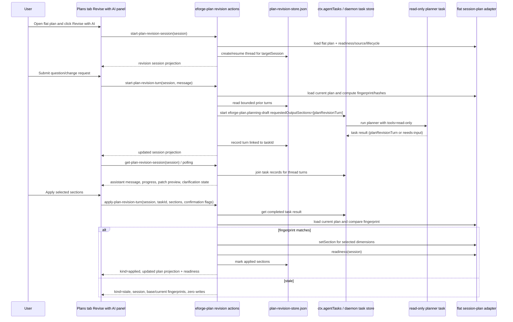

# Architecture: Add Interactive AI Plan Revision Sessions for Existing Session Plans

**Plan set:** `add-interactive-ai-plan-revision-sessions-for-existing-session-plans`  
**Selected mode/profile:** expedition — this spans shared client task contracts, engine structured-output handling, extension-owned backend state/actions, a workstation UI flow, generated/reference docs, and cross-package tests. The implementation should be delegated by subsystem while preserving one shared task wire contract.

## Delta assessment

Current code already has:

- A daemon-owned single-shot `eforge-plan.planning-draft` agent task runner with read-only tools in `packages/engine/src/agents/extension-planning-task.ts`.
- A shared task schema in `packages/client/src/extension-agent-tasks.ts` with `existingSessionPlan`, `sessionPlanPatch`, `sessionPlanCreationDraft`, `backlogCurationDraft`, and `needs-input`.
- Extension-owned durable planning task workflow storage in `planning-task-workflow-store.ts` for backlog/recommendation/curation tasks.
- Flat session-plan action/mutation helpers through `createSessionPlanningWorkflowAdapter()` in `session-plan-actions.ts` and `planner-orchestration.ts`.
- A Plans tab detail card with readiness, metadata, lifecycle evidence, sections, ready, and handoff controls.
- A Backlog tab “Plan with AI” monitor for durable planning tasks.

Gaps to close:

- No `planRevisionTurn` answer-plus-optional-patch result shape exists in the shared client task contract.
- The engine submit tool and prompt do not guide or validate plan revision turns.
- eforge-plan has no extension-owned revision thread/index linked to flat session plans.
- eforge-plan has no revision-session actions for start/resume, turn start, retry/redraft, cancel, list/get, or explicit section apply.
- The Plans tab has no **Revise with AI** panel, thread rendering, patch preview/apply controls, stale apply warning, or clarification flow.
- Documentation still frames multi-turn chat as unsupported without distinguishing bounded first-party plan revision sessions from generic daemon chat.

## Vision and goals

Add a bounded **Revise with AI** experience for existing flat `.eforge/session-plans/<session>.md` artifacts:

1. A user opens a flat session plan in the Plans tab and starts or resumes a revision session scoped to that single `session`.
2. Every user message starts one daemon-owned read-only planning task with current plan context, readiness/lifecycle/source summaries, the user message, and bounded prior-turn context.
3. The agent returns either:
   - a structured `planRevisionTurn` with an assistant message and optional patch data, or
   - the existing top-level `decision: "needs-input"` result with clarification questions.
4. The workstation renders answer-only turns without mutation controls, renders patch-bearing turns as per-section preview cards, and applies only selected sections after explicit confirmation.
5. Apply validates the base plan fingerprint before any write. Stale applies return a blocked result naming the target `session` and perform zero section writes.
6. Apply writes through adapter-backed session-plan mutations, refreshes readiness, records applied metadata in extension-private thread state, and never marks ready, hands off, or enqueues a build.

## Non-goals

- No generic extension marketplace chat runtime.
- No daemon-owned chat transcript or conversation memory.
- No mutation-capable agent tools during revision turns.
- No plan-set revision UX in V1.
- No automatic ready marking, handoff, queue enqueueing, backlog status mutation, build execution, or code editing from the revision panel.
- No Pi or Claude plugin user-facing command/skill changes unless a later module intentionally exposes new integration-surface commands. This architecture does not require that.

## Core architectural principles

1. **Shared task wire shapes stay in `@eforge-build/client`.** Persisted agent task result variants, requested-output literals, and exported browser/node types must be defined in client code and reused by engine, monitor, extension backend, and workstation code.
2. **Daemon remains single-shot and read-only for AI execution.** The daemon persists task records/status/results and enforces read-only tools. It does not own revision transcripts.
3. **eforge-plan owns revision state and apply semantics.** The extension stores thread/index data under private project-local storage and links turns to daemon task ids.
4. **Apply is explicit and selected.** Structured AI output is read-only until the user selects section dimensions and confirms apply.
5. **Staleness is fail-closed.** Apply validates the AI turn’s base plan fingerprint against the current flat plan before writing. A stale result writes nothing.
6. **Keep large files under maintainability limits.** Several current files are near the 600-line implementation ceiling. Add focused new modules instead of growing them past the cap.

## End-to-end control flow



## Shared data model and integration contracts

### Client task contract (`@eforge-build/client`)

Add a first-class requested output literal and result variant:

- Requested output section: `planRevisionTurn`.
- Result field: `planRevisionTurn`.
- Export node/browser schemas and types, for example `EforgePlanPlanningPlanRevisionTurnSchema` and `EforgePlanPlanningPlanRevisionTurn`.

Recommended `planRevisionTurn` shape:

```ts
{
  schemaVersion: 1,
  targetSession: string,
  assistantMessage: string,
  basePlanFingerprint: string, // sha256 hex of the current flat plan at task start
  baseSectionHashes?: Array<{ dimension: string; sha256: string }>,
  proposedPatch?: {
    sections?: Array<{ dimension: string; content: string; rationale?: string }>,
    metadata?: { openQuestions?: string[] },
    skippedDimensions?: Array<{ dimension: string; reason: string }>
  },
  citations?: Array<{ label: string; excerpt?: string; path?: string; url?: string }>,
  applyGuidance?: string,
  noPatchReason?: string
}
```

`proposedPatch.sections[].dimension` must use the existing flat session-plan section-dimension contract used by session-plan actions; arbitrary strings must not be accepted at apply time. Keep the exported schema aligned with the existing section-dimension literal/schema if one is available, or validate against that list in extension backend code before any write.

V1 apply semantics are section-only. `proposedPatch.metadata` and `proposedPatch.skippedDimensions` may be displayed as advisory context or future-compatible structured guidance, but `apply-plan-revision-turn` must not mutate metadata or skipped-dimension state unless a later module adds explicit action input, preview UI, adapter-backed mutation semantics, and tests for those fields.

Clarification turns should reuse the existing top-level `decision: "needs-input"` result variant with `clarificationQuestions` and `rationale`; do not create a daemon chat state variant for clarification.

`hasEforgePlanPlanningDraftOutputSection()` and monitor output-section counting must treat `planRevisionTurn` as one output-bearing section. Answer-only turns are valid because the structured output section is `planRevisionTurn`; they do not need fake `sessionPlanPatch` mutations.

### Fingerprint and result-validation contract

The extension backend owns fingerprint calculation. Add focused helpers in the backend orchestration layer, for example `computeFlatPlanFingerprint(flatPlan)` and `computeFlatSectionHashes(flatPlan)`, and call those same helpers from `start-plan-revision-turn`, `retry-plan-revision-turn`, and `apply-plan-revision-turn`. The engine and workstation only receive or echo fingerprint strings; they must not compute authoritative fingerprints.

The helper must hash a deterministic representation of the adapter-loaded flat session plan so the value computed when a task starts is comparable to the value computed immediately before apply. Whichever representation is chosen, it must be owned by one backend helper and covered by tests to avoid false stale/non-stale decisions caused by start/apply using different plan serializations.

Before displaying a turn as applicable or applying it, backend actions must validate all of the following:

- The task id belongs to the stored revision thread/turn and is a completed owner-scoped daemon task record.
- The completed result contains either `planRevisionTurn` or top-level `needs-input`; other output shapes are non-applicable for revision apply.
- `planRevisionTurn.targetSession` equals the stored `targetSession` and the action `session`.
- `planRevisionTurn.basePlanFingerprint` equals the stored turn `basePlanFingerprint` captured when the task started.
- Every selected section is present in `planRevisionTurn.proposedPatch.sections` and uses an allowed flat session-plan dimension.

If any validation fails, return a non-applicable/validation failure result according to the existing action error convention and perform zero plan writes.

### Revision session storage contract

Create `eforge/extensions/eforge-plan/plan-revision-store.ts` with an atomic JSON index, newest-first ordering, and missing/malformed fallback behavior matching `planning-task-workflow-store.ts`.

Storage path:

```text
.eforge/storage/extensions/eforge-plan/plan-revisions/index.json
```

Recommended index shape:

```ts
{
  schemaVersion: 1,
  sessions: Array<{
    threadId: string,
    targetSession: string,
    createdAt: string,
    updatedAt: string,
    dismissedAt?: string,
    summary?: string,
    turns: Array<{
      turnId: string,
      taskId: string,
      parentTaskId?: string,
      retryOfTaskId?: string,
      redraftOfTaskId?: string,
      userMessage: string,
      basePlanFingerprint: string,
      baseSectionHashes?: Array<{ dimension: string; sha256: string }>,
      createdAt: string,
      appliedAt?: string,
      appliedSections?: string[]
    }>
  }>
}
```

The store API should return sessions newest-first by `updatedAt` and turns newest-first by `createdAt`. The UI may reverse turns locally if it wants chronological chat-style rendering.

V1 may store one active thread per target flat session. Keep the shape thread-ready so a future follow-up can support multiple named threads if needed.

### Extension action contract

Register these local action ids under `eforge-plan` and include all implemented ids in the planning workstation `allowedActions`:

| Action | Purpose | Side effects |
| --- | --- | --- |
| `start-plan-revision-session` | Load a flat plan and create/resume the extension-owned revision thread for `session`. | `local-read`, `local-write` |
| `list-plan-revision-sessions` | List stored revision sessions newest-first, optionally joined with task statuses. | `local-read` |
| `get-plan-revision-session` | Return one thread by `session` or `threadId`, joining each turn to owner-scoped daemon task records. | `local-read` |
| `start-plan-revision-turn` | Start one linked read-only daemon task from a user message and current plan context; reject concurrent running turns for the same thread in V1. | `local-read`, `local-write`, `daemon-state` |
| `retry-plan-revision-turn` | Start a new linked turn from preserved prior-turn context. When `answers` or `steering` are supplied for a needs-input parent, this is the clarification redraft path. | `local-read`, `local-write`, `daemon-state` |
| `cancel-plan-revision-turn` | Delegate cancellation to `ctx.agentTasks.cancel` for a linked running turn. | `local-write`, `daemon-state` |
| `apply-plan-revision-turn` | Validate fingerprint and write selected section dimensions through the flat session-plan adapter. | `local-read`, `local-write` |

Define all action schemas in `planning-agent-task-schemas.ts`. Recommended action input/output contracts:

```ts
type PlanRevisionSessionProjection = {
  threadId: string
  targetSession: string
  createdAt: string
  updatedAt: string
  dismissedAt?: string
  summary?: string
  plan?: unknown // existing flat plan projection type from session-plan actions
  readiness?: unknown // existing readiness projection type from session-plan actions
  turns: PlanRevisionTurnProjection[]
}

type PlanRevisionTurnProjection = {
  turnId: string
  taskId: string
  parentTaskId?: string
  retryOfTaskId?: string
  redraftOfTaskId?: string
  userMessage: string
  basePlanFingerprint: string
  baseSectionHashes?: Array<{ dimension: string; sha256: string }>
  createdAt: string
  appliedAt?: string
  appliedSections?: string[]
  task?: ExtensionAgentTaskRecord // imported from @eforge-build/client, not re-declared
}
```

Use the existing flat plan/readiness projection schemas instead of `unknown` in implementation; the `unknown` annotations above only indicate that this architecture does not introduce duplicate local copies of those existing contracts.

Recommended per-action signatures:

- `start-plan-revision-session` input: `{ session: string }`; output: `PlanRevisionSessionProjection` with current plan/readiness included.
- `list-plan-revision-sessions` input: `{ includeTaskStatus?: boolean; includeDismissed?: boolean }`; output: `{ sessions: Array<Omit<PlanRevisionSessionProjection, "plan" | "readiness">> }` or an equivalent summary projection.
- `get-plan-revision-session` input: exactly one of `{ session: string }` or `{ threadId: string }`, plus optional `{ includePlan?: boolean }`; output: `PlanRevisionSessionProjection` or the existing action not-found/error convention.
- `start-plan-revision-turn` input: `{ session: string; message: string }`; output: `PlanRevisionSessionProjection` including the newly linked turn.
- `retry-plan-revision-turn` input: `{ session: string; taskId?: string; turnId?: string; message?: string; steering?: string; answers?: Array<{ questionId?: string; prompt?: string; answer: string }> }`; output: `PlanRevisionSessionProjection` including the linked retry/redraft turn.
- `cancel-plan-revision-turn` input: `{ session: string; taskId?: string; turnId?: string }`; output: `PlanRevisionSessionProjection` or a focused cancelled-turn projection.

Recommended apply input requires explicit confirmation flags:

```ts
{
  session: string,
  taskId?: string,
  turnId?: string,
  sections: string[],
  previewAcknowledged: true,
  confirmApply: true
}
```

Recommended apply output is a discriminated union:

- `{ kind: "applied", session, taskId, appliedSections, readiness, plan, path }`
- `{ kind: "stale", session, taskId, basePlanFingerprint, currentPlanFingerprint, message }`
- `{ kind: "not-applicable", session, taskId, message }` for answer-only, missing patch selections, invalid task linkage, mismatched target session/fingerprint, or other non-applicable revision results.

### Bounded task input contract

`start-plan-revision-turn` and retry/redraft helpers should start the existing task kind:

```ts
ctx.agentTasks.start({
  kind: EXTENSION_AGENT_TASK_KIND_EFORGE_PLAN_PLANNING_DRAFT,
  input: {
    topic: userMessageOrRedraftGoal,
    session,
    existingSessionPlan: rawFlatPlanMarkdownOrCanonicalPlanText,
    requestedOutputSections: ['planRevisionTurn'],
    sourceText: JSON.stringify({
      purpose: 'plan-revision-turn',
      targetSession: session,
      basePlanFingerprint,
      baseSectionHashes,
      readiness,
      sourceRefs,
      lifecycle,
      recentTurns,
      userMessage,
      redraftContext
    })
  }
})
```

The engine prompt must tell the agent to copy the provided `basePlanFingerprint` into `planRevisionTurn.basePlanFingerprint`, answer questions without a patch when no change is needed, and include machine-readable `proposedPatch.sections` when it wants an apply control.

### Apply semantics

- Resolve `taskId`/`turnId` to a stored turn in the target session thread and load the completed owner-scoped task record before any plan mutation.
- Validate the completed result against the fingerprint and result-validation contract above before considering any write.
- Load current plan with `createSessionPlanningWorkflowAdapter().flat.load()` and compute the current full-plan fingerprint with the same backend helper used when the turn started.
- If `currentPlanFingerprint !== planRevisionTurn.basePlanFingerprint`, return `kind: "stale"` and do not call `setSection`, `updateSessionPlanMetadata`, `setStatus`, `handoff`, or `buildQueue.enqueue`.
- For a fresh patch-bearing turn, apply only selected dimensions present in `planRevisionTurn.proposedPatch.sections`.
- Do not apply `proposedPatch.metadata` or `proposedPatch.skippedDimensions` in V1; display them as guidance only unless a later explicit mutation contract is added.
- Use `planning.flat.setSection({ cwd, session, dimension, content })` for every selected dimension.
- Refresh readiness with `planning.flat.readiness({ cwd, session })` after all selected writes.
- Record `appliedAt` and `appliedSections` on the turn.
- Do not mark the plan ready, hand off, enqueue, or mutate backlog state.

## Module integration contracts

### Module: `client-engine-task-contract`

Owns all changes to shared task result schemas, engine submit/prompt handling, monitor count metadata, and client/engine tests. Downstream modules must import these types instead of declaring duplicate daemon task result shapes.

Important maintainability constraint: `packages/client/src/extension-agent-tasks.ts` is already 599 lines. Before adding `planRevisionTurn`, split focused sub-schemas into new files under `packages/client/src/extension-agent-tasks/` (for example `backlog-curation.ts`, `plan-revision.ts`, or `session-plan-creation.ts`) and re-export through the existing public `extension-agent-tasks.ts` barrel so it remains under 600 lines.

### Module: `plan-revision-extension-backend`

Owns extension-private revision session storage, action schemas, action handlers, fingerprint/apply orchestration, action registration, and backend tests. It depends on the shared `planRevisionTurn` contract.

Important maintainability constraint: avoid growing `planner-orchestration.ts` past 600 lines. Prefer a focused new `plan-revision-orchestration.ts` for plan revision context/fingerprint/result/apply helpers, with only tiny shared exports from existing files if unavoidable.

### Module: `plan-revision-workstation`

Owns the Plans tab revision panel, hook, thread rendering, patch previews, stale warnings, clarification forms, frontend types, mock bridge/fixtures, UI tests, and workstation build artifacts. It depends on the backend action contract and shared client task result types.

Important maintainability constraint: `mock-data.ts` is 575 lines. Put revision-specific fixture state in a new focused fixture module and import it into `bridge.ts` rather than growing `mock-data.ts` past 600 lines.

### Module: `docs-reference-boundary`

Owns README, shared extension docs, generated API/reference artifacts, and the final Pi/Claude consumer-surface check. It must not add Pi or Claude plugin documentation unless implementation exposes new CLI/MCP commands or skills.

## Shared File Registry

The modules are intentionally partitioned so no source file is owned by more than one module. If a module planner discovers an unavoidable shared-file edit, it must declare a non-overlapping temporary plan region before implementation.

| File | Owning module | Region strategy |
| --- | --- | --- |
| `packages/client/src/extension-agent-tasks.ts` | `client-engine-task-contract` | Contract module only; refactor into focused submodules before adding the variant. |
| `packages/engine/src/agents/extension-planning-task.ts` | `client-engine-task-contract` | Contract module only; add submit-tool field and validation tests. |
| `packages/engine/src/prompts/eforge-plan-planning-draft.md` | `client-engine-task-contract` | Contract module only; add revision-turn guidance. |
| `packages/monitor/src/routes/extensions/agent-task-service.ts` | `client-engine-task-contract` | Contract module only; count `planRevisionTurn` output sections. |
| `eforge/extensions/eforge-plan/planning-agent-task-schemas.ts` | `plan-revision-extension-backend` | Backend module only; add a durable `// --- eforge:region plan-revision-schemas ---` block for new action schemas/types. |
| `eforge/extensions/eforge-plan/index.ts` | `plan-revision-extension-backend` | Backend module only; register actions and allowedActions in one edit. |
| `eforge/extensions/eforge-plan/workstation-src/plans/src/types.ts` | `plan-revision-workstation` | UI module only; add a durable `// --- eforge:region plan-revision-types ---` block for new frontend projections. |
| `eforge/extensions/eforge-plan/workstation-src/plans/src/bridge.ts` | `plan-revision-workstation` | UI module only; route mock actions to new revision fixture helpers. |
| `eforge/extensions/eforge-plan/README.md` | `docs-reference-boundary` | Docs module only. |
| `docs/extensions.md` and generated web/docs artifacts | `docs-reference-boundary` | Docs module only. |

#### Region Declarations

No temporary cross-module source regions are required at architecture time. Module planners must use plan-id region markers only if later implementation needs two modules to edit the same file.

## Technical decisions and rationale

1. **Reuse the existing task kind.** A new `planRevisionTurn` output section is sufficient; a new daemon task kind would add platform surface without changing execution behavior. The task remains `eforge-plan.planning-draft`, read-only, and single-shot.
2. **Use existing top-level `needs-input` for clarification.** This preserves the existing output-free clarification contract and avoids a second clarification model nested under revision turns.
3. **Store transcript/index in eforge-plan private storage.** This preserves the daemon boundary: daemon task records remain authoritative for status/result/error, while the extension owns conversation linkage and apply state.
4. **Use full-plan fingerprint for V1 stale blocking.** Per-section hashes can be stored and displayed, but V1 apply blocks on the full base fingerprint to prevent silent overwrites after any manual plan edit.
5. **Flat plans only.** The action schemas and UI should reject or omit plan-set targets. Plan-set child coordination needs a separate design.
6. **No shared raw HTTP routes.** Workstation code must continue to use `window.eforge.invokeAction` and registered `allowedActions`.
7. **No duplicate daemon task interfaces in UI.** The workstation can define extension action projection types locally, but `planRevisionTurn` task result typing should import from `@eforge-build/client/browser`.

## Quality attributes and test strategy

- **Contract safety:** Add client schema tests for answer-only, patch-bearing, invalid payload rejection, and round-trip parsing through completed `ExtensionAgentTaskRecord.result`.
- **Engine safety:** Add StubHarness tests for answer-only, patch-bearing, needs-input, malformed revision payloads, prompt guidance, and `tools: 'read-only'`.
- **Storage durability:** Add store tests for missing storage, malformed storage, atomic write/read behavior, and newest-first ordering.
- **Action correctness:** Add extension action tests for starting sessions, starting linked turns, listing after reload, cancel, retry, clarification redraft through `retry-plan-revision-turn`, stale apply blocking with zero writes, selected section apply through adapter mutations, and no ready/handoff/enqueue side effects.
- **UI behavior:** Add workstation tests for answer-only question submission/rendering, patch previews for `scope` and `acceptance-criteria`, selected-dimension apply, readiness refresh after apply, stale warnings, clarification answers, and linked redraft task display.
- **Docs drift:** Update eforge-plan README, shared extension docs, generated docs/reference artifacts when client exports change, and keep generic daemon-owned chat unsupported language.
- **Maintainability:** New implementation files must stay under 600 lines; new test files under 1,200 lines; edited files over 300 lines should get durable semantic region markers for new blocks.

## Validation commands

Run after all modules merge:

```bash
pnpm type-check
pnpm test
pnpm docs:check
pnpm build:eforge-plan-workstation
pnpm maintainability:check
```

## Consumer integration check

Before sign-off, inspect `eforge-plugin/` and `packages/pi-eforge/` for any required parity updates. This feature is a first-party Console workstation capability with extension actions, not a new CLI/MCP command or Pi/Claude skill, so the expected outcome is no plugin/package version bump and no Pi/Claude docs changes unless implementation expands the user-facing integration surface.