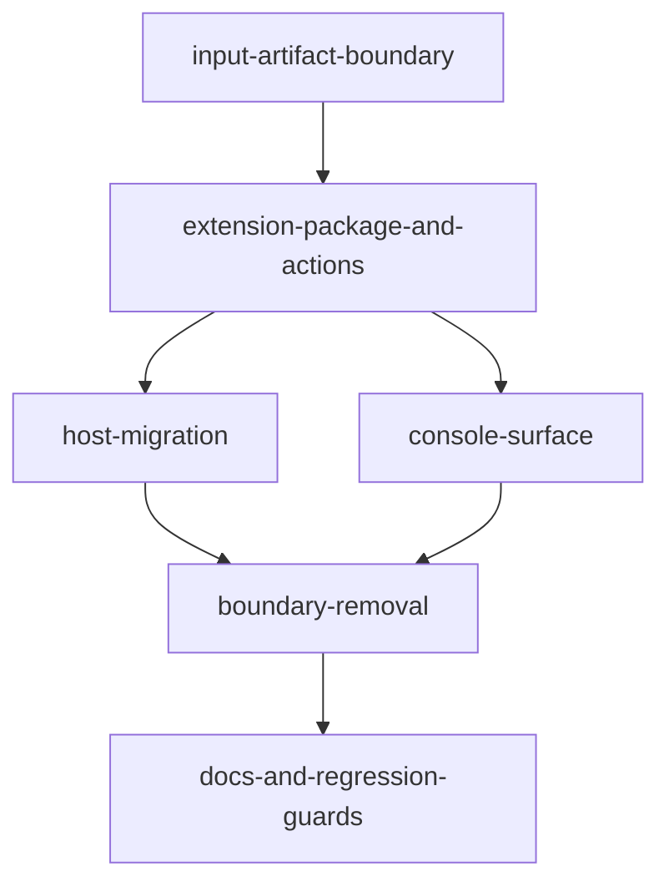

# Extract standalone eforge-playbooks extension

## Current-state delta

The requested boundary is not implemented. A source audit found direct playbook ownership in daemon/client/host/core Console surfaces:

- `packages/client/src/routes/route-map.ts` exposes `playbookList`, `playbookShow`, `playbookSave`, `playbookRun`, `playbookPromote`, `playbookDemote`, `playbookValidate`, and `playbookCopy` as `/api/playbook/*` routes.
- `packages/client/src/api/playbook.ts`, `packages/client/src/routes/playbook.ts`, `packages/client/src/index.ts`, and `packages/client/src/browser.ts` export playbook-specific helpers and wire types.
- `packages/monitor/src/routes/playbooks.ts` and `packages/monitor/src/routes/playbook-service.ts` implement direct playbook route behavior and queue handoff.
- `packages/input/src/playbook-workflow.ts` declares `builtin:playbooks` and `createPlaybookWorkflowAdapter()` ownership language.
- `packages/eforge/src/cli/playbook.ts`, `packages/eforge/src/cli/mcp-proxy.ts`, `packages/pi-eforge/extensions/eforge/playbook-commands.ts`, and `packages/pi-eforge/extensions/eforge/index.ts` call playbook-specific routes/helpers.
- `packages/console-ui/src/views/system/playbooks-section.tsx` and related System state/fetch code make Playbooks a core Console section.
- Docs and generated API reference still describe direct playbook daemon/client surfaces.

The codebase already has the generic platform seams needed for the migration: extension action registration, contribution manifests, generic contribution invocation helpers, action availability diagnostics, `ctx.capabilities` lookup, and `ctx.buildQueue.enqueue(...)` for trusted queue handoffs. `eforge-plan` already declares `eforge.plan.planning-mode-playbook` and the `eforge-plan:open-planning-entry` / workstation contribution ids.

## Vision and goals

Create `eforge-playbooks` as a first-party native extension that owns playbook management, autonomous playbook runs, and planning-mode playbook continuation. After the migration:

1. Playbook authoring/listing/show/save/validate/copy/promote/demote/run behavior is exposed as extension actions and host contributions.
2. Autonomous playbook runs compile to normalized build source and enqueue through the generic extension build-queue handoff.
3. Planning-mode playbook runs check the `eforge.plan.planning-mode-playbook` capability and return eforge-plan planning entry metadata or actionable diagnostics without creating session plans or enqueueing PRDs.
4. The daemon and `@eforge-build/client` no longer expose `/api/playbook/*`, `apiPlaybook*`, or playbook wire contracts as supported surfaces.
5. CLI, MCP/Claude, Pi commands/tools, and skills preserve user-facing playbook workflows by invoking the extension through generic contribution APIs.
6. Console playbook inventory/management appears through extension Console contributions or workstation entries, not a core System `PlaybooksSection`.

## Core architectural principles

- **Extension owns behavior; engine consumes normalized source.** `eforge-playbooks` owns playbook workflow semantics. The build engine remains input-agnostic and receives normalized build source through the queue.
- **Generic daemon hosting only.** Monitor keeps generic extension loading, contribution dispatch, and queue handoff. It does not keep playbook-specific HTTP routes or services.
- **Generic client APIs only.** `@eforge-build/client` keeps route constants and helpers for generic extension contribution invocation and generic enqueue. It does not export playbook-specific daemon helpers or wire types.
- **Host compatibility through extension invocation.** Existing CLI/MCP/Pi compatibility commands may remain, but their implementations call `invokeEforgeExtensionContribution*` or `apiInvokeExtensionAction*`, never `/api/playbook/*` or `apiPlaybook*`.
- **No long-lived compatibility shims.** Any temporary direct-route adapter needed during refactor must be removed before acceptance.
- **Keep plugin and Pi in sync.** Skill narratives and tool behavior must remain parity-checked. Bump `eforge-plugin/.claude-plugin/plugin.json`; do not bump `packages/pi-eforge/package.json`.
- **Bounded edits in legacy files.** `packages/eforge/src/cli/mcp-proxy.ts` and `packages/pi-eforge/extensions/eforge/index.ts` are oversized legacy files; use small exact edits, avoid rewrites, and keep them under the maintainability baseline.

## Module decomposition and dependency graph

Downstream module plans should use these responsibility boundaries. The modules are domain-oriented; they must not split the same behavior by file alone.

| Module | Responsibilities | Explicit non-responsibilities |
|---|---|---|
| `input-artifact-boundary` | Keep `packages/input/src/playbook.ts` as pure parse/serialize/list/load/write/move/copy/validate/compile utilities; move or delete workflow-adapter ownership from `packages/input/src/playbook-workflow.ts`. | No extension action registration, no daemon route behavior, no queue enqueueing. |
| `extension-package-and-actions` | Create/register/publish `eforge/extensions/eforge-playbooks/`; define capabilities, optional eforge-plan dependency, manifest contributions, TypeBox action schemas, action handlers, extension-local tests, and generic Console contribution metadata. | No direct daemon routes, no monitor playbook-service imports, no host compatibility command implementations. |
| `host-migration` | Migrate CLI, MCP/Claude, Pi commands/tools, and Claude/Pi skills to invoke `eforge-playbooks:*` through generic extension contribution/action invocation and show extension-unavailable diagnostics. | No direct `/api/playbook/*` or `apiPlaybook*`; no core Console UI work. |
| `console-surface` | Remove core System Playbooks fetch/state/selectors/rendering and surface playbook inventory/management only through generic extension contribution/workstation rendering. | No playbook-specific client helpers or daemon routes. |
| `boundary-removal` | Remove direct client route constants/helpers/wire types, daemon playbook route registration/handlers/services, direct session-plan-from-playbook API entrypoints, and bump `DAEMON_API_VERSION`. Own producer-agnostic enqueue contract additions if needed. | No host command behavior except updating imports broken by route/helper removal. |
| `docs-and-regression-guards` | Update source docs/generated reference docs and add/adjust tests/audits for route/helper removal, extension actions, capability diagnostics, planning handoff, cross-host parity, package registration, and large-file guards. | No product behavior beyond regression tests and documentation. |

The dependency graph is acyclic:



`boundary-removal` runs after direct host and Console callers have extension-owned paths available, so route/helper deletion does not leave broken supported consumers. `docs-and-regression-guards` runs last because generated reference docs and final grep gates depend on the final public surface.

## Shared data model and contracts

### Extension package

Create `eforge/extensions/eforge-playbooks/` as a public, lockstep first-party package owned by `extension-package-and-actions`:

- Package name: `@eforge-build/eforge-playbooks`
- Extension name: `eforge-playbooks`
- Entrypoint: `./dist/index.js`
- Public capabilities:
  - `eforge.playbooks.management` version `1.0.0`
  - `eforge.playbooks.run` version `1.0.0`
- Optional dependency:
  - provider `eforge-plan`, capability `eforge.plan.planning-mode-playbook`, version `>=1.0.0`

Register the package in `pnpm-workspace.yaml` and add it to lockstep publish/version propagation so `publish-all` publishes it like `@eforge-build/eforge-plan`.

### Action IDs

Use stable local action IDs; effective contribution IDs are prefixed by the extension runtime:

| Local action id | Effective id | Purpose |
|---|---|---|
| `list-playbooks` | `eforge-playbooks:list-playbooks` | List merged playbook inventory with warnings |
| `show-playbook` | `eforge-playbooks:show-playbook` | Load the resolved playbook and shadow metadata |
| `save-playbook` | `eforge-playbooks:save-playbook` | Validate and write structured playbook content to a target scope |
| `validate-playbook` | `eforge-playbooks:validate-playbook` | Validate raw Markdown without writing |
| `copy-playbook` | `eforge-playbooks:copy-playbook` | Copy resolved playbook to another scope, updating frontmatter scope |
| `promote-playbook` | `eforge-playbooks:promote-playbook` | Move project-local to project-team |
| `demote-playbook` | `eforge-playbooks:demote-playbook` | Move project-team to project-local |
| `run-playbook` | `eforge-playbooks:run-playbook` | Run autonomous playbooks or return planning continuation metadata/diagnostics |

Integration commands can mirror these local IDs for discoverability. Host integrations that invoke by generic contribution must pass `kind: 'action'` or `kind: 'command'` when an action and command share an effective id.

### Action inputs and outputs

Action schemas are extension-owned TypeBox schemas inside `eforge/extensions/eforge-playbooks/`. Host integrations consume the schemas only through generic extension invocation responses; they must not re-declare playbook daemon wire types. Schema names below are the canonical cross-module contract. When existing direct APIs used the same field name, keep that field name to preserve CLI/MCP/Pi/skill compatibility.

Shared enums:

- `PlaybookScopeSchema`: `user | project-team | project-local`
- `PlaybookModeSchema`: `autonomous | planning`
- `RequiredPlanningCapabilitySchema`: `{ provider: 'eforge-plan', id: 'eforge.plan.planning-mode-playbook', range: '>=1.0.0' }`

| Action | Input schema | Required input | Optional input |
|---|---|---|---|
| `list-playbooks` | `ListPlaybooksInputSchema` | none | `scope`, `mode`, `includeShadowed` |
| `show-playbook` | `ShowPlaybookInputSchema` | `name` | `scope` |
| `save-playbook` | `SavePlaybookInputSchema` | `name`, `scope`, structured playbook fields or raw Markdown payload matching the current save command contract | `overwrite`, `profile`, `postMerge` when supplied by current callers |
| `validate-playbook` | `ValidatePlaybookInputSchema` | raw Markdown/content payload | `scope` for scope-aware diagnostics only |
| `copy-playbook` | `CopyPlaybookInputSchema` | `name`, `targetScope` | `sourceScope`, `overwrite` |
| `promote-playbook` | `PromotePlaybookInputSchema` | `name` | none; source is project-local and target is project-team |
| `demote-playbook` | `DemotePlaybookInputSchema` | `name` | none; source is project-team and target is project-local |
| `run-playbook` | `RunPlaybookInputSchema` | `name` | `scope`, `mode`, `profile`, `afterQueueId`, `landingAction`, `landingAutoMerge` |

Outputs:

- `ListPlaybooksResultSchema`: `{ playbooks, warnings }`, with each playbook carrying `name`, `description`, `scope`, `mode`, `source`, `shadows`, `path`, and optional `profile`.
- `ShowPlaybookResultSchema`: `{ playbook, source, shadows }` with full frontmatter/body fields, including optional `postMerge` and `profile`.
- `SavePlaybookResultSchema`: `{ path }`.
- `ValidatePlaybookResultSchema`: `{ ok: true } | { ok: false, errors }`.
- `CopyPlaybookResultSchema`: `{ sourcePath, targetPath, targetScope }`.
- `PromotePlaybookResultSchema` / `DemotePlaybookResultSchema`: `{ path }`.
- `RunPlaybookResultSchema`:
  - Autonomous: `{ kind: 'enqueued', id, sessionId?, autoBuild? }`. Keep `id` for compatibility; it may alias the daemon enqueue session id when using generic queue handoff.
  - Planning available: `{ kind: 'requires-agent', mode: 'planning', name, requiredCapability, planningEntry, message }`.
  - Planning unavailable: `{ kind: 'planning-unavailable', mode: 'planning', name, requiredCapability, diagnostics, planningEntry?, message }`.

`planningEntry` is extension-produced metadata, not a session plan. Its schema is:

```ts
type PlanningEntryMetadata = {
  contributionId: 'eforge-plan:open-planning-entry';
  workstationId: 'eforge-plan:planning-workstation';
  workstationUrl: '/console/workstations/eforge-plan%3Aplanning-workstation';
  seed: PlaybookPlanSeed; // produced by playbookToPlanSeed() in @eforge-build/input
  source: {
    extension: 'eforge-playbooks';
    playbookName: string;
    scope?: 'user' | 'project-team' | 'project-local';
    path?: string;
  };
};
```

### Artifact utility boundary

Keep `packages/input/src/playbook.ts` as pure artifact logic: parse, serialize, list/load/write/move/copy, validate, `playbookToBuildSource`, and `playbookToPlanSeed`. Move workflow-level validation/save/run semantics out of `packages/input/src/playbook-workflow.ts` into `eforge-playbooks` action modules. Remove `PLAYBOOK_WORKFLOW_ADAPTER_DESCRIPTOR`, `builtin:playbooks`, and `createPlaybookWorkflowAdapter()` exports before acceptance.

### Autonomous queue handoff

`run-playbook` must:

1. Load and compile the playbook with pure input helpers.
2. Reject planning playbooks before landing prompts or queue handoff.
3. Run the same acceptance-criteria quality gate as the old route before queue handoff. This gate is owned by the `eforge-playbooks` action module and should be implemented from pure playbook validation/build-source helpers; it must not import `packages/monitor/src/routes/playbook-service.ts` or any daemon route module.
4. Call `ctx.buildQueue.enqueue({ source: compiled.source, profile, afterQueueId, landingAction, landingAutoMerge, ... })`.
5. Preserve current profile, landing action, landing auto-merge, and afterQueueId behavior through generic enqueue validation.
6. If preserving playbook `postMerge` requires a generic enqueue option, add that option to `EnqueueRequest` and the enqueue command as a producer-agnostic queue field; do not add playbook-specific queue fields.

### Planning-mode handoff

`run-playbook` planning mode must:

- Check `ctx.capabilities.get('eforge.plan.planning-mode-playbook', '>=1.0.0')`.
- Return fixed generic eforge-plan metadata when available:
  - action/integration command: `eforge-plan:open-planning-entry`
  - deep link/workstation: `eforge-plan:planning-workstation`
  - URL: `/console/workstations/eforge-plan%3Aplanning-workstation`
  - `seed`: the `PlaybookPlanSeed` returned by `playbookToPlanSeed()` for the resolved playbook
- Return unavailable diagnostics from the capability lookup when unavailable, plus installation/trust/reload guidance.
- Never call session-plan creation helpers.
- Never enqueue a PRD.

### Console contribution contract

Register a Console contribution from `eforge-playbooks` that exposes playbook inventory/management via action buttons/forms. This satisfies Console availability without a core `PlaybooksSection`. A workstation is optional; if implemented, it must use the standard sandboxed workstation frame/srcDoc contract.

The contribution producer is `extension-package-and-actions`; the consumers are `console-surface` and host integrations that list extension contributions. The contribution must reference the canonical action IDs above rather than embedding direct daemon routes.

## Integration contracts by subsystem

### Client and daemon boundary

- Remove `packages/client/src/api/playbook.ts` and `packages/client/src/routes/playbook.ts` exports from public client surfaces.
- Remove `playbook*` route keys from `API_ROUTES`.
- Remove all direct client/daemon helpers or routes whose purpose is to create a session plan from a playbook, including `sessionPlanCreateFromPlaybook` if present. Keep only pure playbook-to-plan seed helpers in `@eforge-build/input`, where they are still covered as artifact utilities.
- Remove `createPlaybookRoutes()` from monitor route registration and delete or orphan no playbook route handlers.
- Bump `DAEMON_API_VERSION` because direct playbook HTTP API entrypoints are removed.
- Keep generic extension routes, contribution invocation, and build queue handoff untouched except producer-agnostic additions such as optional `postMerge`.

### Host compatibility commands/tools

- CLI `eforge playbook ...` and `eforge play ...` call generic contribution invocation for `eforge-playbooks:*`.
- MCP `eforge_playbook` compatibility tool may remain, but each branch invokes `eforge-playbooks:*` through generic contribution dispatch. Add `copy` support if the tool remains the skill's compatibility path.
- Pi `eforge_playbook` tool and `/eforge:playbook` command call generic contribution invocation. Interactive selectors may narrow generic action outputs with local runtime guards, but must not call playbook-specific daemon routes.
- Skills may call either the compatibility `eforge_playbook` tool (which delegates to the extension) or the generic `eforge_extension_contribution` tool directly. Update text to state that `eforge-playbooks` owns behavior.

### Console

- Remove core System playbook fetch/state/selectors and `PlaybooksSection` rendering.
- Keep `ExtensionContributionsSection` as the core rendering path for extension-owned playbook UI.
- Update System copy to omit core-owned playbooks.

### Documentation

Update source docs and generated reference artifacts to describe playbooks as first-party extension-owned workflow behavior:

- `web/content/docs/playbooks.md`
- `web/content/docs/extensions.md`
- `web/content/docs/extensions-api.md`
- `web/content/docs/configuration.md`
- `web/content/docs/integrations.md`
- `web/content/docs/getting-started.md`
- `web/content/docs/concepts.md`
- `web/content/docs/profiles.md`
- `web/content/docs/glossary.md`
- `docs/extensions.md`
- `docs/extensions-api.md`
- `docs/architecture.md` if it still describes direct playbook routes
- generated `web/content/reference/*` after `pnpm docs:generate`
- Claude/Pi playbook skills, keeping parity

Docs must not document `/api/playbook/*`, `apiPlaybook*`, or `sessionPlanCreateFromPlaybook` as supported entrypoints.

## Shared File Registry

Most files have a single module owner. The following legacy, aggregation, or acceptance-critical files are high-risk and must remain single-owner during module planning; if a later module planner needs to edit one of these files, it must coordinate by adding a temporary `plan-\d{2}-...` region declaration in its downstream plan.

| File | Owner module | Region strategy |
|---|---|---|
| `pnpm-workspace.yaml` | `extension-package-and-actions` | Owns registration of the standalone package. |
| publish/version propagation files for first-party packages | `extension-package-and-actions` | Owns adding `@eforge-build/eforge-playbooks` to lockstep publish without changing Pi package versioning. |
| `eforge/extensions/eforge-playbooks/**` | `extension-package-and-actions` | Owns all new extension package files, tests, README, manifest, and optional workstation assets. |
| `packages/input/src/playbook.ts` | `input-artifact-boundary` | Owns pure helper additions/moves only; no workflow/route semantics. |
| `packages/input/src/playbook-workflow.ts` | `input-artifact-boundary` | Owns removal of `builtin:playbooks` and workflow adapter exports. |
| `packages/client/src/index.ts` | `boundary-removal` | Boundary-removal owns deletion of playbook exports; other modules must not edit this file. |
| `packages/client/src/browser.ts` | `boundary-removal` | Boundary-removal owns deletion of playbook browser exports; Console module consumes the result without editing this file. |
| `packages/client/src/routes/route-map.ts` | `boundary-removal` | Boundary-removal owns route-key deletion. |
| `packages/client/src/api/playbook.ts` | `boundary-removal` | Boundary-removal owns deletion/removal from exports; no compatibility shim may remain. |
| `packages/client/src/routes/playbook.ts` | `boundary-removal` | Boundary-removal owns deletion/removal from exports; no compatibility route contract may remain. |
| `packages/monitor/src/routes/playbooks.ts` | `boundary-removal` | Boundary-removal owns route handler removal. |
| `packages/monitor/src/routes/playbook-service.ts` | `boundary-removal` | Boundary-removal owns service removal or full de-orphaning after semantics move to the extension. |
| `packages/monitor/src/routes/extension-content.ts` and monitor route registration aggregators | `boundary-removal` | Boundary-removal owns route registration changes. |
| `packages/eforge/src/cli/playbook.ts` | `host-migration` | Host-migration owns CLI compatibility command migration to generic extension invocation. |
| `packages/eforge/src/cli/mcp-proxy.ts` | `host-migration` | Host-migration owns the bounded playbook-tool and playbook-specific session-plan-tool edits. |
| `packages/pi-eforge/extensions/eforge/playbook-commands.ts` | `host-migration` | Host-migration owns Pi playbook command migration to generic extension invocation. |
| `packages/pi-eforge/extensions/eforge/index.ts` | `host-migration` | Host-migration owns the bounded playbook-tool and command registration edits. |
| `eforge-plugin/skills/playbook/playbook.md` | `host-migration` | Host-migration owns Claude playbook skill changes. |
| `eforge-plugin/.claude-plugin/plugin.json` | `host-migration` | Host-migration owns the required plugin version bump when plugin skill/command behavior changes. |
| `packages/pi-eforge/skills/eforge-playbook/SKILL.md` | `host-migration` | Host-migration owns Pi playbook skill parity changes. |
| `packages/pi-eforge/package.json` | `host-migration` | Host-migration must not bump this version; edit only if required for non-version metadata. |
| `packages/console-ui/src/views/system/*` | `console-surface` | Console-surface owns core Playbooks section removal. |
| `packages/console-ui/src/**/*extension*`, `packages/console-ui/src/**/*workstation*` | `console-surface` | Console-surface owns any generic contribution/workstation visibility adjustments. |
| `web/content/docs/*`, `docs/*`, `packages/docs-gen/src/*` | `docs-and-regression-guards` | Docs module owns all docs/source reference updates. |
| `test/playbook-*.test.ts`, `test/cli-playbook.test.ts`, `test/pi-playbook-commands.test.ts`, `test/eforge-playbook-planning-contract.test.ts`, `packages/monitor/src/__tests__/routes-playbooks.test.ts` | `docs-and-regression-guards` | Owns regression/audit coverage updates unless a module keeps a narrowly scoped package-local test next to new implementation code. |

### Region declarations

No multi-module edit regions are declared at architecture time. The table above assigns single owners to high-risk files to avoid overlapping edits.

## Technical decisions and rationale

1. **Use extension actions as the canonical API.** This matches existing eforge-plan patterns and allows CLI/MCP/Pi/Console to use generic contribution discovery/invocation.
2. **Keep playbook file storage where it is.** The storage tiers and shadow-chain behavior remain backed by `@eforge-build/scopes` and pure `@eforge-build/input` helpers, so user data does not move.
3. **Keep planning as metadata handoff.** Planning playbooks return eforge-plan contribution/deep-link metadata rather than creating session plans. This preserves the eforge-plan ownership boundary.
4. **Remove direct routes in the same session.** The migration is boundary-first and acceptance requires no compatibility `/api/playbook/*` shims.
5. **Use generic queue handoff even when it needs a small generic extension.** Any extra queue fields must be producer-agnostic and tested against `ctx.buildQueue.enqueue`, not playbook route internals.
6. **Rely on Console contribution rendering.** A declarative contribution is sufficient for inventory/management and avoids new workstation bundle complexity unless the implementer elects to add one.

## Quality attributes

- **Boundary safety:** Grep/audit tests must fail if `/api/playbook/*`, `apiPlaybook*`, `createPlaybookWorkflowAdapter`, `builtin:playbooks`, or core `PlaybooksSection` ownership returns.
- **Cross-host parity:** CLI, MCP/Claude, Pi commands/tools, and playbook skills expose the same actions and extension-unavailable diagnostics.
- **Planning dependency drift protection:** Tests assert the eforge-plan capability, contribution ids, deep link id, and workstation URL used by `eforge-playbooks` still match eforge-plan registration.
- **Extension-unavailable behavior:** Host compatibility commands show actionable install/trust/reload diagnostics when `eforge-playbooks` is absent or unavailable.
- **No large-file churn:** Oversized files receive bounded exact edits; new extension implementation files stay under the repository file-size policy.
- **Validation:** Final validation runs `pnpm maintainability:check`, `pnpm type-check`, `pnpm build`, `pnpm test`, and `pnpm docs:check`.
