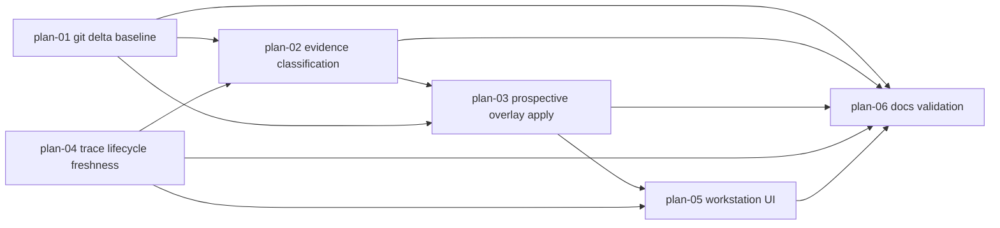

# Git-Delta Backlog Curation Overlays Architecture

## Vision and goals

Add an overlay-first backlog curation flow that treats the last accepted analysis as an explicit git baseline. A new analyze-all source must describe the baseline, `HEAD`, scanned commits, caps, diagnostics, and deterministic backlog-record matches. Curation preview/apply must then validate generated recommendations against the same prospective post-curation backlog state, record the accepted baseline only after explicit apply, and keep trace and recommendation freshness labels honest.

Current implementation already has bounded curation source assembly, a `gitDelta` source projection, deterministic affected/shipped/superseded evidence candidates, status-specific closed-evidence prefix validation, two-step curation apply, recommendation freshness sidecars, same-draft closed-target filtering, and a workstation preview. Gaps remain: preview/apply share only a limited closed-target filter rather than a full prospective projection, stale submitted session-plan trace rows can still appear active, and the workstation has no git-delta diagnostics/effective overlay projection.

## Core architectural principles

1. **Extension-owned semantics.** Source assembly, baseline storage, curation semantics, recommendation freshness, trace projection, preview/apply behavior, and workstation presentation stay in `eforge/extensions/eforge-plan/` except for shared client schema/task-contract updates that are already owned by `@eforge-build/client`.
2. **Engine remains the task runner.** Daemon-owned planning tasks and output contract validation continue to run through the existing engine. Do not add scheduling, auto-apply, auto-enqueue, or GitHub-required flows.
3. **Private storage only.** Baseline metadata lives under `.eforge/storage/extensions/eforge-plan/`. It must not be embedded in backlog item bodies or `.backlog/recommendations.json`.
4. **Fallback is diagnostic, not success.** Missing, unreachable, shallow, or no-git baselines produce bounded recent-history scans plus explicit diagnostics and incomplete/fallback coverage.
5. **Deterministic evidence before prompting.** Commit-to-item matching and evidence ranking happen before the agent sees source text. The agent receives explicit candidates and must cite only source-provided strong evidence for closed-status changes.
6. **One prospective projection.** Preview, apply validation, and workstation display must derive effective recommendations from the same prospective backlog projection helper. Do not mutate task results to achieve recommendation overlay.
7. **Historical traces by default.** Trace rows remain audit evidence; active/planned state requires current editable plan evidence, live queue/build evidence, current PR/landing evidence, or explicit active backlog status.

## Module decomposition and dependency graph

The expedition modules are domain modules, not file-split modules. File ownership is listed later only where concurrent edits need coordination.

1. **`plan-01-git-delta-baseline`** owns accepted-analysis baseline storage, baseline read/write APIs, `HEAD`/baseline resolution, bounded git scans, optional PR enrichment capture, git-delta diagnostics, `gitDelta` source projection, source fingerprint inclusion, and `backlog-curation-source-provider.ts` pass-through of the enriched source. It produces `AcceptedAnalysisBaselineSidecar` and `BacklogCurationGitDeltaSource`.
2. **`plan-02-evidence-classification`** owns deterministic commit-to-item/epic matching, evidence ranking, affected/shipped/superseded classification, ambiguous skipped/needs-input evidence, prompt wording for no-invented evidence, and apply-time evidence-prefix validation for closed-status patches. It consumes `BacklogCurationGitDeltaSource` and lifecycle rows; it produces `GitDeltaAffectedItemCandidate`/shipped evidence projections.
3. **`plan-03-prospective-overlay-apply`** owns the pure prospective recommendation overlay helper, preview/apply parity, generated recommendation validation after overlay, normal apply/curation-only apply behavior, and calling the baseline writer after all accepted writes succeed. It consumes curation drafts, recommendation models, evidence validation results, and baseline writer APIs; it produces server preview/apply effective projection metadata.
4. **`plan-04-trace-lifecycle-freshness`** owns active-versus-historical trace classification and recommendation freshness derivation. It distinguishes submitted/historical session-plan traces from live evidence, and computes missing/fresh/stale labels by comparing saved recommendation/source fingerprints with current or prospective backlog fingerprints.
5. **`plan-05-workstation-ui`** owns workstation view-model/component display of server-provided git-delta diagnostics, effective recommendation counts/removals/repositioning, ambiguous needs-input evidence, and missing/fresh/stale freshness labels. It must not locally reimplement recommendation overlay filtering.
6. **`plan-06-docs-validation`** owns README/workstation documentation updates and the validation matrix tying tests and commands back to this architecture.

The dependency graph is acyclic:



## Shared data model

### Accepted analysis baseline sidecar

Create a schema-versioned sidecar, for example `.eforge/storage/extensions/eforge-plan/analysis-baseline/current.json`. It is owned by `plan-01-git-delta-baseline`; apply/recommendation-refresh callers use its writer API rather than shaping JSON themselves.

```ts
interface AcceptedAnalysisBaselineSidecar {
  schemaVersion: 1;
  acceptedAt: string;
  taskId: string;
  passKind: 'backlog-curation' | 'recommendation-refresh';
  sourceFingerprint: string;
  git: {
    headCommit: string | null;
    headTime: string | null;
    coverage: 'complete' | 'fallback' | 'unavailable';
    diagnostics: GitDeltaDiagnostic[];
  };
}
```

Record it only after an explicit accepted analysis apply succeeds:

- confirmed `applyBacklogCurationDraft` records `passKind: 'backlog-curation'` for both normal and curation-only apply;
- accepted recommendation-refresh task output records `passKind: 'recommendation-refresh'` only when it came from a preserved recommendation-refresh workflow entry with a source fingerprint;
- manual `put-recommendations` does not create a git baseline because it is not an accepted daemon analysis pass;
- no-git/unavailable states still record the accepted analysis with `git.headCommit: null`, `coverage: 'unavailable'`, and diagnostics so the next source can truthfully report baseline unavailability rather than pretending to have complete git coverage.

### Git delta source projection

`buildBacklogCurationSource()` adds a top-level `gitDelta` object and includes a stable fingerprint projection for it. `backlog-curation-source-provider.ts` only passes this source through to the analyze-all task/action output; it must not recompute or filter the git-delta section.

```ts
type GitDeltaDiagnosticCode =
  | 'baseline-missing'
  | 'baseline-invalid-sidecar'
  | 'baseline-unreachable'
  | 'baseline-shallow'
  | 'git-unavailable'
  | 'git-command-failed'
  | 'scan-cap-truncated'
  | 'pr-enrichment-unavailable';

interface GitDeltaDiagnostic {
  code: GitDeltaDiagnosticCode;
  message: string;
  severity: 'info' | 'warning';
  commit?: string;
}

interface GitDeltaScanCaps {
  commitScanCount: number;
  changedPathCount: number;
  excerptCount: number;
  excerptBytes: number;
  prEnrichmentCount: number;
  subprocessTimeoutMs: number;
}

interface GitDeltaScannedCommit {
  hash: string;
  shortHash: string;
  subject: string;
  bodyExcerpt?: string;
  mergeSubject?: string;
  committedAt: string;
  parents: string[];
  isMerge: boolean;
  changedPaths: string[];
  branchHints: string[];
  prNumbers: number[];
  pr?: {
    source: 'gh';
    number: number;
    title?: string;
    bodyExcerpt?: string;
    files: string[];
  };
  excerpts: string[];
}

interface GitDeltaAffectedItemCandidate {
  itemId: string;
  itemSlug?: string;
  itemTitle?: string;
  intent: 'shipped' | 'superseded' | 'affected' | 'ambiguous-shipped' | 'ambiguous-superseded';
  confidence: 'strong' | 'medium' | 'ambiguous';
  matchedBy: Array<
    | 'item-id'
    | 'item-title'
    | 'item-slug'
    | 'changed-path'
    | 'branch-hint'
    | 'pr-number'
    | 'pr-title'
    | 'pr-body'
    | 'pr-file'
    | 'merge-subject'
    | 'bounded-excerpt'
  >;
  commitHashes: string[];
  prNumbers: number[];
  evidence: string[];
}

interface BacklogCurationGitDeltaSource {
  schemaVersion: 1;
  baseline: {
    commit: string | null;
    time: string | null;
    source: 'accepted-analysis-sidecar' | 'missing' | 'invalid-sidecar' | 'unavailable';
    acceptedAt?: string;
    taskId?: string;
    passKind?: 'backlog-curation' | 'recommendation-refresh';
    sourceFingerprint?: string;
    coverage?: 'complete' | 'fallback' | 'unavailable';
  };
  currentHead: { commit: string; time?: string } | null;
  scannedCommitCount: number;
  scannedCommits: GitDeltaScannedCommit[];
  caps: GitDeltaScanCaps;
  coverage: { kind: 'complete' | 'fallback' | 'unavailable'; reason?: string };
  diagnostics: GitDeltaDiagnostic[];
  affectedItemCandidates: GitDeltaAffectedItemCandidate[];
}
```

Scanned commits are bounded and include hash/short hash, subject, bounded body/merge subject metadata, commit time, parents/isMerge, changed paths, branch hints, PR numbers, optional bounded `gh` PR metadata, and bounded excerpts. Diagnostics cover baseline missing, invalid sidecar, unreachable, shallow, no-git/unavailable, git command failures, optional PR enrichment failures, and cap truncation.

### Evidence prefixes

Closed item/epic status patches must include evidence entries with one of the accepted exact prefixes for the status being applied:

- `Shipped evidence: lifecycle trace — ...`
- `Shipped evidence: inferred from git/PR history — ...`
- `Superseded evidence: lifecycle trace — ...`
- `Superseded evidence: inferred from git/PR history — ...`

Ambiguous evidence is never enough for a status change and must be represented as skipped/needs-input with compact evidence beginning:

- `Ambiguous shipped candidate: needs input — ...`
- `Ambiguous superseded candidate: needs input — ...`

### Prospective recommendation projection

The shared pure helper is owned by `plan-03-prospective-overlay-apply` in `backlog-curation-recommendation-overlay.ts`. It accepts current item/epic records, a parsed curation draft, and an optional generated recommendation model. It returns:

```ts
interface RecommendationReferenceRecord {
  id: string;
  kind: 'item' | 'epic';
  title?: string;
  slug?: string;
  status: string;
  lifecycleState?: string;
}

interface ProspectiveCurationProjection {
  prospectiveItems: RecommendationReferenceRecord[];
  prospectiveEpics: RecommendationReferenceRecord[];
  effectiveRecommendations?: BacklogRecommendationModel;
  removed: { itemIds: string[]; epicIds: string[] };
  repositioned: { itemIds: string[]; from: string; to: string }[];
  validation: RecommendationReferenceValidationResult;
  summary: RecommendationSummary | undefined;
}
```

The helper applies item/epic metadata changes in memory, filters closed targets, repositions/excludes active/planned/status-changed targets according to the recommendation lanes, and validates unknown/closed/wrongly placed references against the prospective state. Preview, apply validation, and workstation display consume this projection; task result JSON is preserved separately and is not mutated to create the overlay.

### Recommendation freshness projection

`plan-04-trace-lifecycle-freshness` owns a single freshness view model used after backlog mutation, curation preview, curation-only apply, and normal curation+recommendations apply:

```ts
interface RecommendationFreshnessView {
  state: 'missing' | 'fresh' | 'stale';
  reason: string;
  storedSourceFingerprint?: string;
  comparedSourceFingerprint: string;
  baselineTaskId?: string;
}
```

Freshness is derived by comparing the stored recommendation/source fingerprint with the current backlog source fingerprint, or with the prospective post-curation fingerprint during preview/apply validation. Curation-only apply must not mark discarded generated recommendations as fresh. Normal curation+recommendations apply may mark fresh only for the recommendation model actually written with the prospective post-curation fingerprint.

## Integration contracts

### Baseline sidecar and git delta

- `readAcceptedAnalysisBaseline(storageRoot): Promise<AcceptedAnalysisBaselineSidecar | null>` reads and validates the current sidecar. Invalid JSON/schema returns `null` plus an `invalid-sidecar` diagnostic in the next `gitDelta` source.
- `writeAcceptedAnalysisBaseline(storageRoot, input): Promise<void>` writes the exact sidecar schema after accepted apply/recommendation-refresh completion. Callers provide `taskId`, `passKind`, `sourceFingerprint`, accepted time, current `HEAD` metadata when available, coverage, and diagnostics.
- `collectBacklogCurationGitDelta({ repoRoot, storageRoot, caps, now }): Promise<BacklogCurationGitDeltaSource>` resolves the sidecar baseline, current `HEAD`, reachability, shallow state, bounded range scan, changed paths, optional PR enrichment, diagnostics, and affected candidate shell. Complete coverage requires a recorded baseline commit that is reachable from `HEAD` in a usable repository; missing/unreachable/shallow/no-git states produce fallback/unavailable diagnostics.

Producer/consumer contract: `plan-01-git-delta-baseline` produces `BacklogCurationGitDeltaSource`; `plan-02-evidence-classification` consumes its scanned commits and candidates; `plan-03-prospective-overlay-apply` consumes its current `HEAD`/coverage when recording the accepted baseline; `plan-05-workstation-ui` consumes diagnostics only through server preview/source payloads.

### Git delta and shipped evidence

- `shipped-evidence-git.ts` accepts an explicit `BacklogCurationGitDeltaSource`/range result for curation callers and falls back to the existing bounded recent scan for non-curation callers.
- `shipped-evidence.ts`/`shipped-evidence-matching.ts` classify scanned commits and lifecycle rows into strong, medium, and ambiguous evidence without weakening shipped/superseded confidence rules.
- `backlog-curation-source.ts` calls git-delta once, passes the scanned records into shipped/affected evidence classification, and includes both `gitDelta` and shipped evidence in the source/fingerprint. Matching considers item id, title, slug, changed paths, branch hints, PR number/title/body/files when available, merge subjects, and bounded excerpts.

### Evidence validation and prompt contract

- `packages/engine/src/prompts/eforge-plan-planning-draft.md` tells the agent that strong shipped/superseded closures require the exact evidence prefixes and source-provided evidence, and that ambiguous evidence must be skipped/needs-input.
- `validatePatchBasics()` in `backlog-curation-apply.ts` rejects shipped/superseded closed-status patches that lack an evidence entry with the required prefix for the target status.
- Prefix validation is status-specific: shipped prefixes cannot justify superseded changes, superseded prefixes cannot justify shipped changes, and ambiguous prefixes cannot justify either closed status.

### Apply, recommendation overlay, and baseline recording

- `buildProspectiveCurationProjection(input): ProspectiveCurationProjection` is the only helper allowed to compute effective recommendations after draft item/epic changes.
- `prepareBacklogCurationDraftApply()` calls the projection helper for generated recommendation filtering/repositioning and validates unknown/closed/wrongly placed references against the prospective state.
- `previewBacklogCurationDraftFromTask()` returns the effective recommendation model plus compact summary, removed, repositioned, and validation metadata needed by the workstation.
- `applyBacklogCurationDraftFromTask()` continues to perform two-step confirmation and precondition validation. It uses the same projection helper as preview, rejects validation errors, then writes backlog changes and any accepted generated recommendation/status updates.
- It records the accepted baseline only after backlog writes and any generated recommendation write/status handling succeeds.
- Curation-only apply still remains available and discards generated recommendations; it still records an accepted curation baseline because the curation draft was explicitly accepted.
- Recommendation-refresh apply records an accepted analysis baseline only for preserved `recommendation-refresh` workflow entries; it must not hide commits when no git baseline could be recorded.

### Recommendation freshness and trace classification

- `projectLifecycleSignals()`/`summarizeTrace()` distinguish active editable session-plan evidence from submitted/historical plan rows.
- A submitted plan trace by itself does not set `hasActiveSessionPlan`, `hasActiveTrace`, `lifecycleState: 'planned'`, or in-progress board state.
- Active state can still come from current editable plan evidence, live queue/run/build session evidence, current PR-open/landing evidence, or item backlog status.
- `deriveRecommendationFreshnessView({ storedStatus, comparedSourceFingerprint }): RecommendationFreshnessView` is used after backlog mutation, preview, curation-only apply, and normal apply so stale snapshots are never labeled fresh. Preview calls compare against the prospective fingerprint without persisting it; apply calls compare against the post-write/current fingerprint.

### Preview/apply/UI parity

- The workstation preview displays server-provided effective projection/counts/removals/repositioning instead of running a separate closed-target-only filter.
- Workstation freshness labels come from `RecommendationFreshnessView`; components may format labels but must not independently decide missing/fresh/stale.
- Git-delta diagnostics and ambiguous needs-input evidence are displayed from the server source/preview payload without local recomputation.

## Shared File Registry

New or focused single-owner implementation files are intentionally not in the shared table: `backlog-curation-git-delta.ts` is owned by `plan-01-git-delta-baseline`; `backlog-curation-recommendation-overlay.ts` is owned by `plan-03-prospective-overlay-apply`; `backlog-curation-source-provider.ts` plumbing for the enriched source is owned by `plan-01-git-delta-baseline`; workstation documentation under `eforge/extensions/eforge-plan/workstation-src/plans/` is owned by `plan-06-docs-validation`. If another module needs to edit one of those files, module planners must add a shared-file row before implementation.

| File | Modules | Region Strategy |
| --- | --- | --- |
| `eforge/extensions/eforge-plan/backlog-curation-source.ts` | plan-01-git-delta-baseline, plan-02-evidence-classification | plan-01 owns gitDelta imports/options/fingerprint/source insertion; plan-02 owns shipped/affected evidence projection and ranking blocks. |
| `eforge/extensions/eforge-plan/shipped-evidence-types.ts` | plan-01-git-delta-baseline, plan-02-evidence-classification | Append non-overlapping type additions: plan-01 owns git range/collection input fields; plan-02 owns affected/superseded evidence fields. |
| `eforge/extensions/eforge-plan/shipped-evidence-git.ts` | plan-01-git-delta-baseline, plan-02-evidence-classification | plan-01 owns range-aware git record collection; plan-02 owns excerpt/matching metadata consumed by evidence classification. |
| `eforge/extensions/eforge-plan/backlog-curation-apply.ts` | plan-02-evidence-classification, plan-03-prospective-overlay-apply | plan-02 owns closed-status evidence prefix validation; plan-03 owns prospective recommendation projection usage and accepted-baseline recording. |
| `eforge/extensions/eforge-plan/backlog-curation-schemas.ts` | plan-03-prospective-overlay-apply, plan-05-workstation-ui | plan-03 owns backend preview/apply output schema fields; plan-05 owns no runtime changes here except tests that assert those fields. |
| `eforge/extensions/eforge-plan/recommendation-status.ts` | plan-03-prospective-overlay-apply, plan-04-trace-lifecycle-freshness | plan-04 owns missing/fresh/stale derivation and fingerprint comparison semantics; plan-03 owns apply call sites that persist/read recommendation status and must use plan-04 exports. |
| `eforge/extensions/eforge-plan/trace-store.ts` | plan-02-evidence-classification, plan-04-trace-lifecycle-freshness | plan-04 owns active/historical classification; plan-02 may only read projected lifecycle rows and must not change activity semantics. |
| `eforge/extensions/eforge-plan/lifecycle-projection.ts` | plan-02-evidence-classification, plan-04-trace-lifecycle-freshness | plan-04 owns lifecycle state/row activity fields; plan-02 consumes landing/PR evidence classification without overlapping edits. |
| `eforge/extensions/eforge-plan/workstation-src/plans/src/types.ts` | plan-03-prospective-overlay-apply, plan-05-workstation-ui | plan-05 owns TypeScript interface updates matching backend schema; plan-03 does not edit workstation types. |
| `eforge/extensions/eforge-plan/workstation-src/plans/src/views/backlog/backlog-curation-view-model.ts` | plan-03-prospective-overlay-apply, plan-05-workstation-ui | plan-05 removes/replaces local overlay helpers with server-preview projections; plan-03 does not edit UI files. |
| `packages/engine/src/prompts/eforge-plan-planning-draft.md` | plan-02-evidence-classification, plan-03-prospective-overlay-apply | plan-02 owns evidence prefix/invention guidance; plan-03 owns recommendation overlay/prospective-state wording. |
| `eforge/extensions/eforge-plan/README.md` | plan-06-docs-validation | Docs module owns README edits for baseline storage, git-delta diagnostics, overlay-first apply behavior, baseline sidecar semantics, same-draft overlay behavior, and active-versus-historical trace evidence. |

#### Region Declarations

**`backlog-curation-source.ts`**:
- `plan-01-git-delta-baseline`: imports for git-delta helper, source build option/caps additions, gitDelta collection call, source/fingerprint/minimal-fallback insertion.
- `plan-02-evidence-classification`: shipped/affected evidence helper signatures, candidate projection, counts, labels, diagnostics, and ranking.

**`shipped-evidence-types.ts`**:
- `plan-01-git-delta-baseline`: new range/scan input and diagnostic types.
- `plan-02-evidence-classification`: evidence intent/classification and affected-item candidate types.

**`backlog-curation-apply.ts`**:
- `plan-02-evidence-classification`: `validatePatchBasics()` evidence-prefix checks for shipped/superseded closed status changes.
- `plan-03-prospective-overlay-apply`: prepare/preview/apply projection, generated recommendation validation, and accepted-baseline write after successful apply.

**`recommendation-status.ts`**:
- `plan-04-trace-lifecycle-freshness`: missing/fresh/stale derivation, source-fingerprint comparison, and freshness view-model helpers.
- `plan-03-prospective-overlay-apply`: call sites that update recommendation status after generated recommendations are accepted; no freshness semantics changes.

**`lifecycle-projection.ts`**:
- `plan-04-trace-lifecycle-freshness`: active/historical lifecycle row classification and state aggregation.
- `plan-02-evidence-classification`: read-only consumption of PR/landing rows; avoid writing to module-owned classification regions.

**`packages/engine/src/prompts/eforge-plan-planning-draft.md`**:
- `plan-02-evidence-classification`: exact evidence prefixes, superseded/ambiguous guidance, and no-inventing-evidence rules.
- `plan-03-prospective-overlay-apply`: recommendation generation guidance to reason against prospective post-curation state.

## Technical decisions and rationale

1. **Separate analysis baseline sidecar.** Recommendation status remains freshness metadata; git-delta coverage comes from an explicit accepted-analysis sidecar so old recommendation models are never mistaken for a git baseline.
2. **Range-aware scanner with fallback.** Complete coverage requires a recorded baseline commit that is an ancestor of `HEAD` in a usable repository. Missing/unreachable/shallow/no-git states scan bounded recent history when possible and mark coverage fallback/unavailable.
3. **Single git scan per curation source.** The curation source builds `gitDelta` first and passes those records to evidence matching. This keeps runtime bounded and ensures shipped/affected evidence matches the displayed delta.
4. **Strong evidence is enforced twice.** The prompt tells the agent not to invent evidence; apply validation rejects closed-status patches that lack required source-prefixed evidence.
5. **Server-authoritative effective recommendations.** UI display uses the same server preview helper that apply validation uses, eliminating preview/apply drift.
6. **Freshness is derived, not trusted.** Saved recommendation status is compared to the current/prospective source fingerprint at display and apply time so backlog mutations immediately surface stale or missing snapshots.
7. **No broad GitHub dependency.** PR enrichment remains optional `gh` metadata. Local git evidence and diagnostics must be sufficient for safe fallback.

## Quality attributes

- **Safety:** no unattended writes; curation apply remains two-step; evidence sections stay append-only; ambiguous matches route to skipped/needs-input.
- **Traceability:** source includes baseline/current/scanned commit metadata and diagnostics; accepted apply records task id, accepted time, source fingerprint, pass kind, and coverage.
- **Determinism:** commit matching and candidate ranking are stable and unit-tested before agent prompting.
- **Bounded output:** commit counts, paths, excerpts, diagnostics, and PR enrichment are capped; source text fallback preserves `gitDelta` and candidate evidence.
- **Parity:** preview, apply validation, and workstation display share one prospective projection.
- **Compatibility:** no writes to `.backlog/recommendations.json`; no database migrations; existing no-git projects continue with diagnostics and fallback behavior.

## Validation ownership

Targeted Vitest coverage should include:

- baseline sidecar read/write, missing, invalid, unreachable, shallow, no-git, and bounded range scanning;
- curation source assertions that `gitDelta` includes baseline metadata, current `HEAD`, scanned commits, caps, and diagnostics;
- commit-to-item matching for id/title/slug/changed-path/branch/PR/merge/excerpt evidence plus ambiguous match routing;
- shipped/superseded prefix validation for git/PR/lifecycle evidence and rejection of ambiguous evidence for closed statuses;
- prospective overlay preview/apply parity, including closed item/epic filtering, active/planned/status-changed repositioning/exclusion, and unknown/closed/wrong-lane rejection;
- trace tests proving stale submitted session-plan rows do not imply active/planned state without live plan/queue/build/PR evidence;
- workstation view-model/component tests for stale freshness labels, git-delta diagnostics, effective recommendation counts, and ambiguous needs-input evidence.

Run after all modules merge:

```bash
pnpm type-check
pnpm test
pnpm maintainability:check
```
