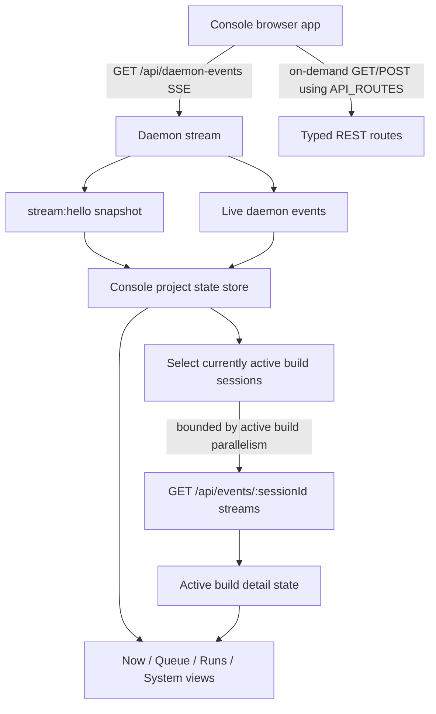

# Add Eforge Console Side-by-Side With Legacy Monitor UI

## Problem / Motivation

This phase starts the repo-local **Eforge Console** rewrite as a separate package while keeping the existing monitor UI available until replacement is complete.

The desired Console is a project-local operator console, not the future multi-project **Overseer** service. It should provide a live, trustworthy view of currently implemented daemon/project data while avoiding hallucinated or future-only features.

Evidence gathered:

- `AGENTS.md` requires UI consumers to build on stable `@eforge-build/client` APIs/events, avoid inline `/api/...` route literals, keep daemon wire shapes owned by the client package, and use shadcn/ui components for monitor UI surfaces.
- `docs/roadmap.md` reserves **Overseer** for future multi-project observability/control while keeping orchestration local to project daemons.
- Schaake OS epic `cf245870-90f4-48db-b5e7-b7a0f17a458b` confirms Overseer is intended as a durable multi-project service that receives normalized events from many project daemons.
- `pnpm-workspace.yaml` includes `packages/*`, so adding `packages/console-ui` automatically enters the workspace.
- Root `package.json` currently has `build:ui` and `dev:monitor` scripts targeted at `@eforge-build/monitor-ui`, and root devDependencies include `@eforge-build/monitor-ui` but no console UI package yet.
- `packages/monitor/package.json` has `@eforge-build/monitor-ui` as a devDependency.
- `packages/monitor/tsup.config.ts` copies `../monitor-ui/dist` into `dist/monitor-ui` for packaged serving.
- `packages/monitor/src/server.ts` serves static UI assets from `const UI_DIR = resolve(__dirname, 'monitor-ui')` and falls back to `index.html` for SPA routes.
- Existing `packages/monitor-ui` is a Vite/React/Tailwind/shadcn package with reusable configuration patterns.
- Existing monitor UI uses a two-SSE architecture, but the new Console should support monitoring multiple concurrent active builds in real time.
- `@eforge-build/client` exposes browser-safe typed routes, route constants, event types, and stream snapshot types.
- `.eforge/tmp/monitor-v2-wireframe-opus.html` contains the desired visual style direction only and must not be treated as feature authority.
- `.eforge/session-plans/2026-05-24-automated-stack-sync.md` is the source for near-future stack sync capabilities/events, but Phase 1 should not render nonexistent stack-sync controls.

Classification: this is an **architecture / deep** change. It creates a new workspace package, changes monitor static-serving/package-copy boundaries, and introduces a transitional side-by-side UI switch.

## Goal

Create a new `@eforge-build/console-ui` package branded as **Eforge Console**, serve it at `/console/` beside the legacy monitor UI at `/`, and provide a first functional live-data Console shell grounded in currently implemented daemon/client APIs.

Run the implementation as an **Expedition** so each major Console view receives detailed module planning before code implementation begins.

## Approach

### Package and UI boundary

- Add `packages/console-ui` as a new browser-only package named `@eforge-build/console-ui`.
- Build it as a Vite + React + TypeScript app using Tailwind and shadcn/ui-style primitives.
- Follow reusable setup patterns from `packages/monitor-ui`, including Vite, TypeScript, PostCSS, `components.json`, and UI primitives where useful.
- Do not import old monitor UI application code, reducers, or components wholesale.
- Do not import `@eforge-build/engine` or monitor server internals.
- Consume `@eforge-build/client/browser` for route constants, stream helpers, and wire types.
- Every HTTP/SSE path should come from `API_ROUTES`, `buildPath`, typed helpers, or `subscribeWithSnapshot`.
- No hardcoded `/api/...` route literals should appear in Console source except intentional guard-test fixtures.

### Visual direction

Use `.eforge/tmp/monitor-v2-wireframe-opus.html` only as a style reference:

- near-black background
- green eforge accent `#67f553`
- compact left sidebar
- bordered cards/tables
- Inter + JetBrains Mono typography
- eforge logo usage

Do not treat the wireframe feature list or placement as authoritative because it contains hallucinated capabilities.

### Static serving boundary

Current state:

- `packages/monitor/src/server.ts` serves one SPA from `dist/monitor-ui` via `UI_DIR = resolve(__dirname, 'monitor-ui')`.
- `packages/monitor/tsup.config.ts` copies `../monitor-ui/dist` into `dist/monitor-ui`.

Phase 1 should serve two SPAs side-by-side:

- old monitor at `/` using `dist/monitor-ui`
- new Console at `/console/` using `dist/console-ui`

The Console Vite app should set:

```ts
base: '/console/'
```

The monitor server static file resolver should be generalized rather than duplicated where possible, such as:

```ts
serveStaticFile(req, res, urlPath, rootDir, basePath)
```

The static-serving implementation must preserve:

- path traversal protections
- asset 404 behavior
- cache headers for hashed assets
- SPA fallback behavior

### Data flow

Console should use daemon-wide SSE as its authoritative project snapshot, then add bounded per-session detail subscriptions for active builds when the dashboard needs real-time build detail.



Implementation guidance:

- Always maintain one daemon-wide stream for project state.
- Derive active build session IDs from `runs`/liveness/scheduler state.
- Subscribe to active build session streams needed by the visible dashboard.
- Tear down streams when builds complete, are no longer active, or leave the visible dashboard scope.
- Avoid opening streams for every historical run row.
- If two builds are running concurrently, the Console dashboard should be able to subscribe to and render both in real time.
- The guardrail is bounded active-build subscriptions, not “exactly two subscribers.”

### Transitional navigation

- The side-by-side switch is a transitional hosting feature, not a runtime mode inside either app.
- Old monitor UI links to `/console/`.
- New Console UI links to `/`.
- The switch can be a button/link in each app header/sidebar.
- No shared state or cross-app iframe is needed.

### Build/package graph

- Root package should add `@eforge-build/console-ui` as a workspace devDependency if needed for topological build ordering and scripts.
- `packages/monitor/package.json` should add `@eforge-build/console-ui` as a devDependency so monitor builds can copy its `dist` next to `monitor-ui`.
- `packages/monitor/tsup.config.ts` should copy both UI dists when present.
- Root scripts should either update `build:ui` to build both UIs or add `build:console-ui` and `dev:console` while preserving existing `dev:monitor`.

### Required Expedition planning modules

1. **Console shell and visual system**
   - Sidebar/top-level navigation, route structure, style tokens, layout primitives, monitor/console return switch, responsive behavior, and logo treatment.
2. **Now dashboard**
   - Daemon status, auto-build/scheduler state, queue depth, active concurrent builds, recent failures/attention items, stack layer summary, and live build detail cards.
3. **Queue view**
   - Pending/running/failed queue items, dependencies, priority display, recovery verdict chips when available, and clear boundaries around not-yet-implemented queue editing.
4. **Runs and build detail entry points**
   - Run history table/list from `monitor.db`, active build grouping, run status rollups, links/drill-in affordances, and what detail is live in phase 1 versus deferred.
5. **System configuration view**
   - Implemented config validation/show surfaces, profiles, extensions, playbooks, session plans, models/providers, and how each is fetched/displayed without inventing missing controls.
6. **Activity/audit view**
   - Recent daemon activity, live event log, filters/grouping, event summaries, and debugging affordances.
7. **Static serving/package integration**
   - New package setup, `/console/` serving, Vite base/asset paths, old monitor switch, build ordering, and server tests.

### Console UX principles

Every Expedition subplanner responsible for a view must use these principles:

1. **Operational clarity over visual density** — Every view should answer: “What is happening, what needs attention, and what can I do next?”
2. **Live state must feel trustworthy** — Clearly distinguish live data, snapshot data, loading states, stale states, and unavailable daemon data.
3. **Attention first, details second** — Surface failures, blocked work, active builds, recovery needs, and queue risks before historical or secondary data.
4. **Progressive disclosure** — Top-level views should be scannable; details should be available by drill-in, expansion, or secondary panels rather than crowded into the dashboard.
5. **No invented capabilities** — If an action/API/event does not exist, do not render it as available. Future affordances should be omitted or explicitly labeled as deferred/planned.
6. **Project-local mental model** — Console represents one project daemon. Avoid multi-project language or UI assumptions; leave Overseer space untouched.
7. **Explain the system’s reasoning** — Status, recovery, stack layers, scheduler state, and queue dependencies should include enough context for the user to understand why something is in that state.
8. **Action boundaries should be explicit** — Read-only surfaces should feel read-only. Workflow-changing actions should be deliberate, confirmed where appropriate, and grounded in existing APIs.
9. **Consistency beats cleverness** — Use existing terms consistently: runs, queue, builds, plans, sessions, profiles, extensions. Avoid casually renaming backend concepts per view.
10. **Design for empty/error/offline states** — Each view plan must specify what appears when there are no runs, no queue items, daemon disconnected, API error, or partial snapshot.
11. **Calm, compact, terminal-adjacent aesthetic** — Dark, focused, information-rich, and not noisy. Green accent should signal eforge identity and positive/active state, not decorate everything.
12. **Every view needs a contract** — Each subplan should define the primary user question, data sources, live vs fetched data, available actions, empty/loading/error states, and acceptance checks.

### Code impact

Likely new files under `packages/console-ui/`:

- `packages/console-ui/package.json`
  - name: `@eforge-build/console-ui`
  - private browser package
  - scripts: `dev`, `build`, `type-check`, `test`, `test:watch`
  - dependencies based on actual Console needs; likely start with `@eforge-build/client`, React, React DOM, lucide, SWR if used, Tailwind/shadcn dependencies, and Vite dev tooling
- `packages/console-ui/vite.config.ts`
  - React plugin
  - alias `@` to `src`
  - `base: '/console/'`
  - dev server proxy for `/api` to daemon port, matching monitor UI pattern
- `packages/console-ui/tsconfig.json`
- `packages/console-ui/postcss.config.js`
- `packages/console-ui/components.json`
- `packages/console-ui/index.html`
- `packages/console-ui/src/main.tsx`
- `packages/console-ui/src/app.tsx`
- `packages/console-ui/src/globals.css`
- `packages/console-ui/src/components/ui/*`
  - copy/adapt shadcn primitives from monitor UI if needed
- `packages/console-ui/src/hooks/use-daemon-events.ts`
  - connect to `API_ROUTES.daemonEvents` via `subscribeWithSnapshot` from `@eforge-build/client/browser`
- `packages/console-ui/src/lib/*`
  - state projection/selectors for queue, runs, active builds, liveness, stack layers, and activity
- `packages/console-ui/src/__tests__/*`
  - route literal guard
  - no engine import guard
  - reducer/selector tests for active build and queue/run projections
  - view-module tests where practical for the Expedition-planned Now, Queue, Runs, System, and Activity views

Likely changes to `packages/monitor-ui/`:

- Add a visible link/button to `/console/`, probably in the header.
- Do not rework existing monitor UI layout or state.
- Do not import Console code.

Likely changes to `packages/monitor/`:

- `packages/monitor/src/server.ts`
  - Add `CONSOLE_UI_DIR = resolve(__dirname, 'console-ui')`.
  - Generalize static serving so paths under `/console` resolve against `CONSOLE_UI_DIR` and all other non-API paths continue to resolve against `UI_DIR`.
  - Preserve path traversal checks and SPA fallback semantics.
- `packages/monitor/tsup.config.ts`
  - Copy `../console-ui/dist` to `dist/console-ui` when present, in addition to current `monitor-ui` copy.
- `packages/monitor/package.json`
  - Add `@eforge-build/console-ui` as a devDependency.

Likely changes to root workspace files:

- `package.json`
  - Add `@eforge-build/console-ui` workspace devDependency if consistent with current workspace dependency style.
  - Add/update scripts such as `build:ui`, `build:console-ui`, and `dev:console`.
  - Preserve existing `dev:monitor`.
- `pnpm-lock.yaml`
  - Update by package changes if lockfile is committed.

### Documentation impact

Documentation changes should be modest in phase 1.

Likely updates:

- `README.md` or existing monitor/daemon docs if they tell users where to open the monitor UI.
- Add a short note that the new **Eforge Console** preview is available at `/console/` while the legacy monitor remains at `/`.
- Developer docs or package scripts section, if present, should include `dev:console` / Console build instructions.

Docs to avoid changing in this phase:

- `docs/roadmap.md` should not be pruned for Overseer, queue reordering, or automated stack sync.
- Do not document wireframe-hallucinated features.
- Do not document stack sync UI controls until the automated stack sync APIs/events land.
- Generated command/API docs are likely not affected because this phase should not add daemon routes or CLI commands.

### Recommended validation

- `pnpm --filter @eforge-build/console-ui type-check`
- `pnpm --filter @eforge-build/console-ui build`
- `pnpm --filter @eforge-build/monitor-ui type-check`
- `pnpm --filter @eforge-build/monitor type-check`
- targeted monitor server tests for static serving `/` and `/console/`
- root `pnpm type-check` if feasible

### Risks and mitigations

- **Static asset collision**: two Vite apps can both emit `/assets/...`. Mitigation: set Console `base: '/console/'` and serve Console under `/console/`.
- **Old UI coupling leak**: copying old reducers/components would recreate the current monitor architecture. Mitigation: copy only generic config/shadcn primitives; build new state and layout intentionally.
- **Hallucinated feature creep**: the wireframe contains features that are not implemented. Mitigation: explicitly constrain feature inclusion to existing `@eforge-build/client` APIs/events and the stack-sync plan after it lands.
- **Daemon serving regression**: changing static serving could break root monitor UI fallback or asset caching. Mitigation: add server tests for `/`, `/index.html`, `/assets/...`, `/console/`, `/console/index.html`, `/console/assets/...`, and path traversal fallback/404 cases.
- **Build ordering fragility**: monitor’s tsup copy step depends on UI dist directories existing. Mitigation: add workspace devDependencies and root scripts that build UI packages before/with monitor; preserve copy-if-exists behavior to avoid local dev failures.
- **API route drift**: new package might accidentally hardcode API paths. Mitigation: add a source-grep test like monitor UI’s API route compliance test.
- **Browser bundle pollution**: importing non-browser client/engine modules could pull Node APIs into the Vite bundle. Mitigation: import from `@eforge-build/client/browser` only and add a no-engine-import guard.
- **Overseer conceptual drift**: Console could start adding multi-project semantics too early. Mitigation: keep phase 1 project-local; name concepts so future Overseer can aggregate them later without making Console an Overseer prototype.
- **Live stream over-subscription**: monitoring multiple active builds in real time requires multiple per-session streams. Mitigation: derive subscriptions from active/running builds and visible dashboard scope; release streams promptly when builds complete; do not subscribe to historical runs by default.
- **External logo dependency**: existing web/wireframe use GitHub avatar URL for the eforge logo. If Console uses that URL directly, logo display depends on network availability. Mitigation: acceptable for phase 1 if matching current web usage, but consider vendoring a local logo asset in a follow-up if offline reliability matters.

### Assumptions and validation

| Assumption | Evidence / validation performed | Confidence | Cost to validate further | Validation path | Impact if wrong |
|------------|----------------------------------|------------|--------------------------|-----------------|-----------------|
| A new package is preferable to rewriting inside `packages/monitor-ui`. | User explicitly agreed to creating a new package and later dropping old monitor UI. `pnpm-workspace.yaml` includes `packages/*`, so a package under `packages/console-ui` is workspace-compatible. | high | low | Create package and run `pnpm --filter @eforge-build/console-ui build/type-check`. | If wrong, implementation would create avoidable package churn; user preference makes this unlikely. |
| The user-facing name should be **Eforge Console**. | Conversation established this preference; it avoids conflicting with future Overseer naming. | high | low | User can rename before build if desired. | Naming churn if changed later, but low technical impact. |
| Serving Console under `/console/` is the safest side-by-side route. | `server.ts` currently serves old UI at `/`; Vite apps emit root assets by default; `base: '/console/'` is a standard Vite way to scope asset URLs. | high | low | Build Console with `base` and inspect generated `index.html`; add static-serving tests. | If wrong, asset paths may break or collide with monitor UI assets. |
| Monitor server can be adjusted to serve two SPA roots without changing daemon APIs. | `server.ts` static serving is localized around `UI_DIR` and `serveStaticFile`; `tsup.config.ts` copy step is localized. | high | low | Implement route dispatch for `/console` and run monitor server tests/type-check. | If wrong, phase may require broader monitor server refactor. |
| Console can use current client/browser exports for phase-1 data. | `browser.ts` exports `API_ROUTES`, `subscribeWithSnapshot`, daemon/session stream types, queue/run/profile/extension/model/config types, and stack layer types. | high | low | Type-check imports in new package. | If a needed type/helper is missing, small client browser export addition may be required. |
| The wireframe’s style tokens are safe to use while ignoring features. | User explicitly instructed that the wireframe is style/layout only; grep/read confirmed it defines visual CSS tokens and includes concrete markup with likely hallucinated feature locations. | high | low | During implementation, audit UI sections against implemented route/event inventory. | If ignored, Console may expose nonexistent controls/features. |
| Using the GitHub avatar URL for the eforge logo is acceptable for phase 1. | Existing `web/app/layout.tsx` and the wireframe use `https://avatars.githubusercontent.com/u/272340669?v=4`; no local logo asset was found by a quick search. | medium | low | Ask user or vendor a local logo asset if offline reliability matters. | Logo may fail offline or violate desired packaging polish; low functional impact. |
| `pnpm -r build` ordering can be made reliable through workspace devDependencies/scripts. | Existing monitor package already has `@eforge-build/monitor-ui` as a devDependency, apparently to support UI dist copying. | medium | low | Add `@eforge-build/console-ui` similarly and run build in clean state. | If ordering is still wrong, root build scripts may need explicit UI-before-monitor sequencing. |
| Phase 1 should not implement new stack-sync controls. | Automated stack sync is in `.eforge/session-plans/2026-05-24-automated-stack-sync.md`, not implemented yet; current client route only exposes stack layers. | high | low | Re-check client routes/events before implementation; add UI only when events/routes exist. | Premature controls would be misleading and likely broken. |
| Multiple live per-session streams are acceptable when bounded by active build parallelism. | User explicitly clarified that if two concurrent builds are running, the Console dashboard should monitor both in real time. Existing client/browser exports include session stream helpers. | high | low | Implement a small subscription manager and test that it subscribes to active sessions and unsubscribes on completion. | If wrong, active-build dashboard would either under-report live detail or overload browser/daemon connections. |
| Minimal docs update is enough. | This phase adds a preview UI route/package, not new engine/daemon API semantics. | medium | low | Search README/docs for monitor UI references during implementation. | Users may not discover `/console/` if docs are not updated. |

No low-confidence, high-impact assumptions remain unresolved. The medium-confidence assumptions have low validation cost and clear implementation-time checks.

### Profile signal

Recommended profile: **Expedition**.

Rationale: the implementation is still a phase-1 slice, but the desired outcome is no longer just a minimal shell. The user wants each major UI view planned in detail during eforge’s planning phase. That calls for delegated module planning across the Console shell, Now dashboard, Queue view, Runs/build entry points, System configuration view, Activity/audit view, and static-serving/package integration, followed by cohesion review to keep the views consistent and grounded in implemented features.

## Scope

### In scope

- Add a new workspace package `packages/console-ui` with npm package name `@eforge-build/console-ui`.
- Build the new package as a Vite + React + TypeScript app using shadcn/ui-style primitives and Tailwind.
- Follow existing monitor UI package patterns where useful.
- Do not import old monitor UI application code.
- Brand the new UI as **Eforge Console**.
- Use `.eforge/tmp/monitor-v2-wireframe-opus.html` only as a style reference.
- Keep feature inclusion grounded in currently implemented `@eforge-build/client` APIs and stream snapshots.
- Implement a first functional Console shell that can display currently implemented daemon/project data.
- Display daemon/liveness summary.
- Display current queue summary/list.
- Display active builds derived from `runs`.
- Display recent run history from `runs`.
- Display stack layer summary from `stackLayers` if present.
- Display links/sections for implemented system surfaces: config, profiles, extensions, playbooks, session plans/models as data availability permits.
- Keep the existing `packages/monitor-ui` available during this phase.
- Add a visible switch/toggle in the old monitor UI that opens the new Console view.
- Add a visible switch/toggle in the new Console UI that returns to the old monitor view.
- Update the monitor server/build packaging so packaged daemon builds can serve both SPAs side-by-side.
- Add package/root scripts so developers can build and run the new Console UI locally.
- Add lightweight tests/static guards for the new package.
- Add a guard that prevents engine imports.
- Add a guard that prevents hardcoded `/api/...` literals outside sanctioned `API_ROUTES` usage.
- Add successful type/build checks.
- Run this as an **Expedition** so eforge performs detailed module planning for each major UI view before implementation.
- Require module planners to produce concrete per-view layouts, component boundaries, data requirements, and acceptance checks.
- Allow the Console architecture to accommodate future stack sync capabilities/events.
- Keep the Console project-local and avoid multi-repo assumptions.

### Out of scope

- Deleting `packages/monitor-ui`.
- Renaming `packages/monitor`.
- Renaming `monitor.db`.
- Renaming daemon internals.
- Renaming existing API routes.
- Implementing Overseer.
- Implementing multi-project/multi-daemon views.
- Adding new daemon capabilities just for this UI phase, except minimal static-serving changes needed to host the second SPA.
- Rendering controls for hallucinated wireframe features.
- Rendering controls for future stack-sync capabilities before those APIs/events are implemented.
- Queue reordering unless the underlying API has landed separately.
- Priority editing unless the underlying API has landed separately.
- Full run-detail parity with the existing monitor UI unless trivial reuse is possible without coupling the new package to old UI internals.

### Roadmap relation

- Aligns with the Overseer roadmap by keeping this UI repo-local and project-daemon-scoped.
- Leaves multi-project aggregation to future Overseer work.
- Prepares a UI foundation for future queue controls and automated stack sync observability without implementing those future features in this phase.

## Acceptance Criteria

- `packages/console-ui/package.json` exists and declares package name `@eforge-build/console-ui`.
- `pnpm --filter @eforge-build/console-ui build` exits 0.
- `pnpm --filter @eforge-build/console-ui type-check` exits 0.
- The root `package.json` contains a developer script that starts the Console UI dev server.
- The root `package.json` preserves the existing developer script that starts the legacy monitor UI dev server.
- The root `package.json` contains a developer script that builds the Console UI.
- `packages/monitor/package.json` declares `@eforge-build/console-ui` as a workspace devDependency or otherwise guarantees the Console UI package is built before monitor packaging copies its dist output.
- A monitor package build copies `packages/console-ui/dist` into `packages/monitor/dist/console-ui` when the Console UI dist directory exists.
- A monitor package build continues to copy `packages/monitor-ui/dist` into `packages/monitor/dist/monitor-ui` when the legacy monitor UI dist directory exists.
- The daemon/monitor server returns the legacy monitor SPA HTML for `GET /`.
- The daemon/monitor server returns the Console SPA HTML for `GET /console/`.
- The daemon/monitor server serves Console built asset requests under `/console/assets/` from `packages/monitor/dist/console-ui/assets/`.
- The daemon/monitor server serves legacy monitor built asset requests under `/assets/` from `packages/monitor/dist/monitor-ui/assets/`.
- Static-serving tests cover `GET /`, `GET /index.html`, `GET /assets/<asset>`, `GET /console/`, `GET /console/index.html`, and `GET /console/assets/<asset>`.
- Static-serving tests verify path traversal attempts under both `/` and `/console/` do not read files outside the configured UI dist directories.
- The legacy monitor UI renders a visible link or button whose accessible name contains `Console` and whose target is `/console/`.
- The Console UI renders a visible link or button whose accessible name contains `Monitor` and whose target is `/`.
- `packages/console-ui/vite.config.ts` sets Vite `base` to `/console/`.
- A built Console `index.html` references generated assets with `/console/assets/` URLs.
- The Console UI displays the eforge logo in its primary shell.
- The Console UI global styles include a near-black application background token or CSS value.
- The Console UI global styles include the green eforge accent `#67f553` or a documented project token that resolves to that color.
- The Console UI shell includes a compact sidebar navigation area.
- The Console UI uses bordered card or table surfaces for primary dashboard content.
- The Console UI uses Inter and JetBrains Mono fonts, or explicitly documented local/system fallbacks when those fonts are unavailable.
- Console source does not render controls for queue reordering, priority editing, multi-project Overseer navigation, or stack-sync operations unless matching implemented typed client APIs exist in `@eforge-build/client` at implementation time.
- Console source establishes the daemon-wide SSE stream through `subscribeWithSnapshot` from `@eforge-build/client/browser`.
- Console source references the daemon-wide SSE route through `API_ROUTES` or `buildPath` from `@eforge-build/client/browser`.
- The Console dashboard renders queue information derived from the daemon stream snapshot or subsequent daemon stream events.
- The Console dashboard renders run information derived from the daemon stream snapshot or subsequent daemon stream events.
- The Console dashboard renders auto-build or liveness information derived from the daemon stream snapshot or subsequent daemon stream events.
- The Console dashboard renders recent activity information when `recentActivity` is present in the daemon stream snapshot or subsequent daemon stream events.
- The Console dashboard renders stack layer information when `stackLayers` is present in the daemon stream snapshot or subsequent daemon stream events.
- Console REST fetches for config, profiles, extensions, playbooks, session plans, models, recovery, or stack layers use typed helpers or route constants exported by `@eforge-build/client/browser`.
- Console source does not duplicate daemon API response interfaces for queue items, runs, session metadata, auto-build state, or stack layers.
- Console source imports shared wire types from `@eforge-build/client` or `@eforge-build/client/browser`.
- Console source does not import `@eforge-build/engine`.
- A Console guard test fails when a source file outside an explicitly allowed test fixture contains a hardcoded `/api/` route literal.
- A Console guard test fails when a source file imports `@eforge-build/engine`.
- Console selector or state-projection tests cover active build derivation from daemon run state.
- Console selector or state-projection tests cover queue summary derivation from daemon queue state.
- Console active-build subscription logic subscribes to each currently active build session shown on the dashboard.
- Console active-build subscription logic unsubscribes from a build session when that build leaves the active dashboard set.
- Console active-build subscription logic does not subscribe to every historical run by default.
- When daemon state contains two concurrent active builds, the Console dashboard displays live status or detail surfaces for both active builds.
- The Expedition build plan contains separate implementation subplans or equivalent plan sections for the Console shell, Now dashboard, Queue view, Runs/build entry points, System configuration view, Activity/audit view, and static serving/package integration before code implementation begins.
- Each Console view implementation includes an empty state for the case where its primary data collection is empty.
- Each Console view implementation includes a loading or connecting state for the case where required daemon data has not arrived yet.
- Each Console view implementation includes an error or unavailable state for the case where the daemon stream or an on-demand typed fetch fails.
- Console top-level copy uses project-local terminology and does not describe the UI as a multi-project or multi-daemon Overseer.
- Existing monitor UI type-checks after adding the Console link.
- Monitor server type-checks after adding side-by-side static serving.
- If documentation is changed, the changed documentation describes Console as a transitional preview at `/console/`.
- If documentation is changed, the changed documentation does not claim queue editing, stack-sync controls, multi-project Overseer behavior, or other unimplemented capabilities.
