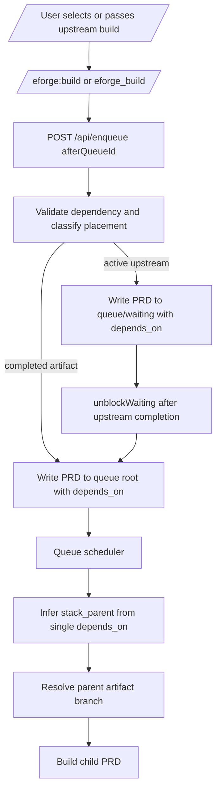

# Add First-Class Dependency Handoff for Builds

## Problem / Motivation

Users reasonably expect `/eforge:build` to support the same explicit wait/dependency handoff that the lower-level queue and stacking systems already support.

Today, normal build enqueue can only rely on best-effort dependency detection, and the user-facing build surfaces do not expose a reliable `afterQueueId` path. This creates a mismatch:

- The scheduler and stacking layers know how to wait and stack.
- Autonomous playbooks can pass `afterQueueId`.
- `/eforge:build` cannot reliably express "this build depends on that queue item".

As a result, users cannot safely hand off a dependent session plan while an upstream build is running and trust eforge to wait, then branch from the upstream artifact branch.

This gap was discovered while trying to enqueue Console UI work that explicitly depended on an in-flight stack-sync build. The desired user model is: a user hands a build to `/eforge:build`, selects or supplies an upstream queue item, and eforge persists the dependency, waits until the upstream artifact exists, and, when stacking is enabled with PR landing, builds the child on top of the upstream artifact branch.

Evidence gathered:

- `docs/architecture.md` documents piggyback scheduling: PRDs with dependencies are held in `waiting`, unblocked after upstream completion, and skipped transitively if upstream fails or is cancelled.
- `docs/stacking.md` documents single-dependency stack inference: when a PRD has exactly one `depends_on` and stacking is enabled, eforge infers `stack_parent` at dispatch time.
- `packages/engine/src/prd-queue.ts` already supports `enqueuePrd({ depends_on, intoWaiting })`, `validateDependsOnExists`, `propagateSkip`, and `unblockWaiting`.
- `packages/engine/src/queue/scheduler.ts` already waits for dependency artifacts, records completion availability, unblocks waiting PRDs, and persists inferred `stack_parent` for a single dependency before spawning a child.
- `packages/engine/src/stacking/base-resolver.ts` resolves a child stack base from the parent artifact registry entry or stack layer projection.
- `packages/client/src/routes.ts` `EnqueueRequest` currently has `source`, `flags`, `profile`, `landingAction`, and `landingAutoMerge`, but no explicit `afterQueueId` or dependency field.
- `packages/pi-eforge/extensions/eforge/index.ts` `eforge_build` tool schema currently has no dependency field and therefore cannot pass an explicit dependency through to `POST /api/enqueue`.
- `packages/monitor/src/server.ts` enqueue route validates profile and landing inputs, then spawns an `enqueue` worker with CLI flags; it currently has no handling for an explicit upstream dependency.
- `packages/eforge/src/cli/index.ts` `eforge enqueue` has no `--after` option, and `EforgeEngine.enqueue()` currently relies on best-effort dependency detection rather than an explicit dependency contract.
- `packages/pi-eforge/extensions/eforge/playbook-commands.ts` already implements a useful UX pattern for autonomous playbooks: detect active builds, offer "Run now" or "Wait for", resolve the internal queue id, and call `apiPlaybookRun` with `afterQueueId`.
- `packages/client/src/routes.ts` `PlaybookRunRequest` already carries `afterQueueId`; `packages/monitor/src/server.ts` validates it and enqueues autonomous playbooks into `waiting/`.
- Follow-up inspection on 2026-05-27 confirmed a refinement: the autonomous playbook route currently uses `intoWaiting: afterQueueId ? true : false`, which can strand dependents when `afterQueueId` references a completed upstream with a usable artifact because no future completion event will unblock them.
- `test/queue-piggyback.test.ts`, `test/artifact-aware-scheduler.test.ts`, `test/playbook-api.test.ts`, and `test/pi-playbook-commands.test.ts` already cover much of the lower-level dependency/waiting/stack-parent behavior for playbooks and scheduler internals.

Classification: this is a **feature / focused** change. It adds a first-class dependency handoff capability to existing build/enqueue surfaces without changing the underlying queue or stacking model.

## Goal

Add a first-class dependency handoff capability to normal build enqueue flows so builds can explicitly wait for upstream queue items and become stacked PR children when stacking is enabled.

The outcome is that `/eforge:build`, CLI, daemon APIs, Pi, and Claude Code plugin surfaces can deterministically pass an upstream queue id via `afterQueueId`, persist it as `depends_on`, place dependents correctly based on upstream readiness, and preserve existing scheduler-based stack inference.

## Approach

Use `afterQueueId` as the public field name for parity with playbooks.

Rationale: playbook APIs and Pi playbook UX already use `afterQueueId`. Reusing the name avoids introducing a second concept for the same user intent.

Treat explicit dependency as authoritative and skip dependency detector output for that dependency decision.

Rationale: user-stated dependency should not be overridden by a best-effort agent. Dependency detector can still run for requests without explicit `afterQueueId`.

Validate explicit dependencies before spawning enqueue workers or writing queue files.

Rationale: stale queue ids should fail early with a clear message instead of creating stuck dependents.

Keep stack topology inference in the scheduler.

Rationale: the stacking docs already promise that a single `depends_on` infers `stack_parent`. Build surfaces should express dependency intent, not duplicate stacking topology logic.

Add a shared queue dependency placement helper rather than duplicating active-vs-completed checks.

Rationale: playbooks, CLI enqueue, daemon enqueue, and future wrappers need consistent behavior. The helper should validate the upstream id and return both the accepted dependency list and queue placement, for example `{ dependsOn: [afterQueueId], intoWaiting: boolean }`. Active upstreams should produce `intoWaiting: true`; completed upstreams with usable durable artifacts should produce `intoWaiting: false`; failed/skipped/unknown/completed-without-artifact upstreams should be rejected.

Apply the placement helper to autonomous playbooks as well as normal builds.

Rationale: current playbook route evidence shows `afterQueueId` is validated and then always enqueued with `intoWaiting: true`. That is safe for active upstreams but wrong for completed upstreams with usable artifacts because no future completion event will unblock the dependent. This feature should avoid creating a new correct path for `/eforge:build` while leaving playbooks with the old stuck-waiting edge case.

Extend Pi `/eforge:build` with an optional wait selection when active queue items exist.

Rationale: users should not need to type internal queue ids. The UI can show build titles while sending the resolved id internally, matching playbook UX.

Support non-interactive explicit handoff with `--after <queue-id>`.

Rationale: scripts, headless Pi, Claude Code, and direct CLI users need a deterministic path that does not depend on native UI selection.

Keep monitor queue display based on existing queue state.

Rationale: a dependent build in `waiting/` should naturally appear in queue state through existing queue APIs; a dependent build whose upstream already has an artifact should appear as a normal pending/root queue item with `depends_on` preserved. No special monitor-only state is needed.

Likely code changes:

- `packages/client/src/routes.ts`
  - Add `afterQueueId?: string` to `EnqueueRequest` with documentation that it is the queue item id this build should run after.
- `packages/client/src/api/queue.ts`
  - No route literal changes should be needed if `apiEnqueue` continues to use `EnqueueRequest`.
- `packages/engine/src/events.ts`
  - Add `afterQueueId?: string` or equivalent explicit dependency option to `EnqueueOptions`.
- `packages/engine/src/prd-queue.ts`
  - Add or refactor a helper that validates dependency ids and returns queue placement information, for example active dependency vs completed artifact dependency.
  - Prefer a single helper used by normal enqueue and playbook enqueue, rather than a validator-only helper plus local `intoWaiting` decisions.
  - Preserve `validateDependsOnExists` for existing callers or adapt it without breaking playbook behavior.
- `packages/engine/src/eforge.ts`
  - Thread explicit enqueue dependency into `enqueuePrd` as `depends_on: [afterQueueId]`.
  - Use `intoWaiting` only when the upstream is active/waiting rather than already completed with a usable artifact.
  - Avoid replacing explicit `afterQueueId` with dependency-detector output.
- `packages/monitor/src/server.ts`
  - Accept and validate `afterQueueId` on `POST /api/enqueue`.
  - Reject a non-string `afterQueueId` with 400 before spawning a worker.
  - Return a clear 404 or 400 when the selected upstream id is stale, unknown, failed, skipped, or completed without a usable artifact.
  - Pass `--after <id>` to the enqueue worker.
  - Update the autonomous playbook route to use the shared placement helper instead of unconditional `intoWaiting: true` whenever `afterQueueId` is provided.
- `packages/eforge/src/cli/index.ts`
  - Add `eforge enqueue --after <queue-id>`.
  - Add `eforge build --after <queue-id>` if normal build delegation remains the primary user path for daemon-backed enqueue.
  - Pass `afterQueueId` into `engine.enqueue()` for in-process enqueue/build paths.
  - Include `--after` in daemon worker argument handling if daemon route delegates to CLI workers.
- `packages/eforge/src/cli/run-or-delegate.ts`
  - Include `afterQueueId` in delegated `apiEnqueue` calls and in foreground `engine.enqueue()` calls.
- `packages/pi-eforge/extensions/eforge/index.ts`
  - Add optional `afterQueueId` to the `eforge_build` tool schema and forward it in the enqueue body.
- `packages/pi-eforge/extensions/eforge/build-command.ts`
  - Add a wait-or-run-now UI step for active queue items, using the existing playbook command pattern where possible.
  - Append `--after <queue-id>` to delegated `/skill:eforge-build` args when the user selects an upstream build.
- `packages/pi-eforge/skills/eforge-build/SKILL.md`
  - Document `--after <queue-id>` and tool-call behavior.
- `eforge-plugin/`
  - Keep Claude Code plugin parity by adding the same MCP tool parameter and skill documentation updates.
  - Bump `eforge-plugin/.claude-plugin/plugin.json` because plugin-facing behavior changes.
- `docs/config.md`, `docs/architecture.md`, `docs/stacking.md`, and/or README.
  - Clarify that `/eforge:build` supports explicit dependency handoff and that single-dependency PRDs become stacked children when stacking is enabled.

Architecture impact:

No new subsystem is required. The change should connect existing layers:

The key architectural rule is that build surfaces express dependency intent; queue/scheduler/stacking layers remain responsible for readiness, artifact availability, and stack base resolution.

Documentation impact:

- Update user-facing docs to state that normal builds can be handed off after an upstream queue item.
- Document that Pi `/eforge:build` can offer active builds as "wait for" choices.
- Document that CLI can use `eforge enqueue --after <queue-id> <source>`.
- Document that tool callers can pass `afterQueueId` to `eforge_build`.
- Document that with stacking enabled and PR landing, a single explicit dependency is enough for stack-parent inference.
- Avoid implying that eforge always auto-detects every dependency.
- State that explicit handoff is deterministic.
- State that dependency detector remains best effort.

Risks and mitigations:

- **Stuck waiting PRDs**: writing a completed-artifact dependency into `waiting/` could leave it stuck because no future upstream completion event will arrive. Mitigation: classify dependency placement and only use `waiting/` for active upstreams.
- **Existing playbook stuck-waiting edge case**: current autonomous playbook route evidence shows `afterQueueId` dependents are always written with `intoWaiting: true`. Mitigation: move playbooks onto the same placement helper as normal builds and add completed-artifact playbook tests.
- **False confidence from dependency detector**: keeping implicit detection as-is could obscure the new explicit behavior. Mitigation: explicit `afterQueueId` takes precedence and is clearly reported.
- **Stale queue ids**: active builds can finish between selection and enqueue. Mitigation: validate at enqueue time and classify the current state; if the upstream now has a usable artifact, enqueue the dependent in the queue root instead of failing or waiting; if the upstream is failed/skipped/unknown, return a clear error.
- **Plugin/Pi drift**: this touches both consumer integrations. Mitigation: update both `packages/pi-eforge/` and `eforge-plugin/`, and bump the Claude plugin version.
- **Ambiguous future multi-dependency stacking**: this plan only covers one explicit `afterQueueId`. Mitigation: defer multi-dependency and manual `stack_parent` selection.
- **Daemon API versioning**: adding a request field is additive for tolerant servers, but first-party clients and daemon must remain compatible. Mitigation: update shared `EnqueueRequest` and only bump `DAEMON_API_VERSION` if project policy treats this as a breaking route contract change.

Recommended tests:

- Client route type tests or TypeScript usage tests for `EnqueueRequest.afterQueueId`.
- Daemon route tests for `POST /api/enqueue` with valid and invalid `afterQueueId`.
- Engine enqueue tests proving explicit `afterQueueId` persists `depends_on` and bypasses dependency-detector replacement.
- Queue placement tests proving active upstreams write to `waiting/` and completed artifact upstreams can write to queue root.
- Playbook API tests proving autonomous playbooks use the same placement helper: active upstreams write to `waiting/`, completed-artifact upstreams write to queue root, and failed/skipped/unknown upstreams are rejected.
- CLI tests proving `eforge enqueue --after q-abc` and, if added, `eforge build --after q-abc` pass the dependency through.
- Pi tool tests proving `eforge_build` forwards `afterQueueId`.
- Pi native build command tests proving active-build wait selection appends `--after`.
- Plugin parity tests or schema snapshots if present.
- Existing `pnpm type-check` and targeted test suites pass.

Assumptions and validation:

| Assumption | Evidence / validation performed | Confidence | Cost to validate further | Validation path | Impact if wrong |
|------------|----------------------------------|------------|--------------------------|-----------------|-----------------|
| Existing queue/scheduler/stacking layers already support the core wait-then-stack behavior once `depends_on` is present. | Read `prd-queue.ts`, `queue/scheduler.ts`, `stacking/base-resolver.ts`, `docs/architecture.md`, and `docs/stacking.md`; tests already cover waiting, artifact readiness, and stack-parent inference. | high | low | Add an end-to-end route/engine test for `afterQueueId` through queue placement and scheduler dispatch. | If wrong, implementation expands beyond surface plumbing into scheduler fixes. |
| `afterQueueId` is the right public field name. | Existing playbook API and Pi playbook command use `afterQueueId` for the same user intent. | high | low | Confirm docs/API naming during implementation review. | If wrong, API churn and duplicated concepts. |
| Active upstreams should enqueue dependents into `waiting/`, while completed-artifact upstreams should enqueue into root/pending. | `unblockWaiting` is completion-event driven; completed artifacts will not emit a future completion event. `validateDependsOnExists` already accepts both live upstreams and completed upstreams with usable artifacts, but does not itself return placement. | high | low | Write placement tests for both active and completed-artifact upstreams. | If wrong, dependents can get stuck or dispatch too early. |
| Autonomous playbooks should use the same active-vs-completed placement behavior as normal builds. | Current code inspection shows the playbook route validates `afterQueueId` then calls `enqueuePrd` with `depends_on: [afterQueueId]` and `intoWaiting: true` whenever `afterQueueId` is present. This is correct for active upstreams but wrong for completed upstreams with artifacts. | high | low | Add playbook API tests for active upstream and completed-artifact upstream placement before/after refactor. | If wrong, playbooks keep a stuck-waiting edge case or diverge from normal build semantics. |
| Build surfaces should not set `stack_parent` directly for the single-dependency case. | Stacking docs and scheduler code already infer `stack_parent` from one `depends_on`. | high | low | Existing artifact-aware scheduler tests verify inference; add one route-level integration assertion if needed. | If wrong, stack topology may be duplicated or inconsistent. |
| Pi build UI can reuse active-build selection patterns from playbook commands. | `playbook-commands.ts` already fetches running items, presents wait choices, and forwards `afterQueueId`. | medium | low | Inspect helper reuse options during implementation; extract common helper if duplication grows. | If wrong, Pi UI implementation takes slightly longer but the API can still ship. |
| Claude plugin parity is required. | `AGENTS.md` requires keeping `eforge-plugin/` and `packages/pi-eforge/` in sync for consumer-facing behavior. | high | low | Search plugin build tool and skill files during implementation. | If missed, Claude users lack the feature and repo policy is violated. |
| Additive `afterQueueId` does not require a daemon API version bump. | The field is optional and backward-compatible at the TypeScript shape level, but project policy may define API versioning more strictly. | medium | low | Inspect `DAEMON_API_VERSION` policy and existing route-contract tests before implementation. | If wrong, clients may see version mismatch or route-contract drift. |

No low-confidence, high-impact assumptions remain unresolved. The main implementation-time check is queue placement for completed-artifact dependencies, including autonomous playbooks, so dependents do not get stuck in `waiting/`.

Recommended profile: **Excursion**.

Rationale: the work crosses client types, daemon route handling, engine enqueue plumbing, CLI, Pi, Claude plugin parity, docs, and tests, but it is a cohesive single capability. It should not require delegated module planners; one cohesive plan can enumerate the necessary changes and dependencies.

## Scope

In scope:

- Add an explicit dependency handoff field to normal build enqueue APIs, likely named `afterQueueId` for parity with playbooks.
- Thread this field through `@eforge-build/client`, daemon HTTP route handling, CLI `eforge enqueue`, Pi `eforge_build` tool, Pi `/eforge:build` native command, Claude Code plugin MCP schema/skill docs, and user-facing docs.
- Make explicit dependency handoff deterministic and stronger than dependency detector inference.
- Validate explicit upstream ids before queue mutation using existing dependency validation rules.
- Classify explicit dependency placement before queue mutation: active/live upstreams should put dependents in `.eforge/queue/waiting/`; completed upstreams with usable durable artifacts should put dependents in the queue root so they are eligible to dispatch immediately.
- Persist `depends_on: [<afterQueueId>]` in the queued PRD frontmatter for both waiting and immediately-eligible dependents.
- Bring autonomous playbook `afterQueueId` enqueue placement onto the same shared placement path. Current evidence shows the playbook route validates `afterQueueId` but always calls `enqueuePrd(..., intoWaiting: true)` when `afterQueueId` is present; this refinement should fix that so completed-artifact playbook dependencies do not get stuck in `waiting/`.
- Preserve existing dependency-detector behavior for enqueue requests without explicit dependency handoff.
- Preserve stacking inference: when stacking is enabled and the PRD has exactly one `depends_on`, scheduler dispatch should infer and persist `stack_parent` rather than requiring the build surface to set it manually.
- Reuse the playbook wait-or-run-now UX pattern in Pi `/eforge:build` where technically feasible.
- Add targeted tests for route contract, daemon validation, engine enqueue behavior, CLI flag plumbing, Pi tool plumbing, playbook placement parity, and docs/skill parity.

Out of scope:

- General multi-dependency selection UI for normal builds.
- Manual `stack_parent` selection for ambiguous multi-dependency stacks.
- Queue reordering or priority editing.
- New stack providers.
- Changing scheduler artifact-readiness semantics beyond preventing already-completed artifact dependencies from being written to `waiting/`.
- Replacing dependency detector inference.
- Automatically deciding dependencies without user confirmation when an explicit wait choice is available.
- Preserving the current playbook behavior that always writes `afterQueueId` dependents to `waiting/`; that behavior is now treated as part of the placement bug to correct.

## Acceptance Criteria

- `EnqueueRequest` in `packages/client/src/routes.ts` includes optional `afterQueueId?: string` with documentation that it is the queue item id this build should run after.
- The shared `apiEnqueue` helper accepts a request body containing `afterQueueId` without local type errors.
- The Pi `eforge_build` tool schema accepts optional `afterQueueId`.
- The Pi `eforge_build` tool forwards `afterQueueId` to `POST /api/enqueue` when it is provided.
- The Claude Code plugin build tool schema accepts optional `afterQueueId`.
- The Claude Code plugin build tool forwards `afterQueueId` to `POST /api/enqueue` when it is provided.
- The CLI command `eforge enqueue --after <queue-id> <source>` parses `<queue-id>` as an explicit upstream dependency.
- The CLI command `eforge build --after <queue-id> <source>` parses `<queue-id>` as an explicit upstream dependency if normal build remains the daemon-delegated user path.
- The daemon `POST /api/enqueue` route accepts optional `afterQueueId`.
- The daemon `POST /api/enqueue` route rejects a non-string `afterQueueId` with a 400 response.
- The daemon `POST /api/enqueue` route rejects an unknown `afterQueueId` before spawning an enqueue worker.
- The daemon `POST /api/enqueue` route returns an error message that includes the invalid upstream id when `afterQueueId` validation fails.
- The enqueue worker receives the selected upstream id when `POST /api/enqueue` is called with `afterQueueId`.
- `EforgeEngine.enqueue()` accepts an explicit upstream dependency option.
- `EforgeEngine.enqueue()` writes `depends_on: ["<queue-id>"]` when an explicit upstream dependency option is provided.
- `EforgeEngine.enqueue()` does not replace an explicit upstream dependency with dependency-detector output.
- The queue dependency placement helper returns `intoWaiting: true` for an explicit dependency that refers to a live pending upstream queue item.
- The queue dependency placement helper returns `intoWaiting: true` for an explicit dependency that refers to a live running upstream queue item.
- The queue dependency placement helper returns `intoWaiting: true` for an explicit dependency that refers to a live waiting upstream queue item.
- The queue dependency placement helper returns `intoWaiting: false` for an explicit dependency that refers to a completed upstream with a usable durable artifact record.
- The queue dependency placement helper rejects an explicit dependency that refers to a failed upstream queue item.
- The queue dependency placement helper rejects an explicit dependency that refers to a skipped upstream queue item.
- The queue dependency placement helper rejects an explicit dependency that refers to a completed upstream without a usable durable artifact record.
- The queue dependency placement helper rejects an explicit dependency that refers to an unknown queue item id.
- A build enqueued with `afterQueueId` referencing an active upstream is written under `.eforge/queue/waiting/`.
- A build enqueued with `afterQueueId` referencing an active upstream does not dispatch before the upstream has a usable artifact registry record.
- A build enqueued with `afterQueueId` referencing a completed upstream with a usable artifact is written to the queue root instead of `.eforge/queue/waiting/`.
- A build enqueued with `afterQueueId` referencing a completed upstream with a usable artifact is eligible to dispatch without waiting for a future completion event.
- An autonomous playbook run with `afterQueueId` referencing an active upstream is written under `.eforge/queue/waiting/`.
- An autonomous playbook run with `afterQueueId` referencing a completed upstream with a usable artifact is written to the queue root instead of `.eforge/queue/waiting/`.
- An autonomous playbook run with `afterQueueId` referencing a failed upstream is rejected before queue mutation.
- An autonomous playbook run with `afterQueueId` referencing a skipped upstream is rejected before queue mutation.
- An autonomous playbook run with `afterQueueId` referencing an unknown upstream is rejected before queue mutation.
- An autonomous playbook run with `afterQueueId` referencing a completed-without-artifact upstream is rejected before queue mutation.
- A dependent build with exactly one `depends_on` has `stack_parent` inferred and persisted before dispatch when `stacking.enabled` is true.
- A dependent stacked build resolves its base branch from the parent artifact branch recorded for the upstream queue item.
- A dependent waiting build moves to `skipped/` when the selected upstream build fails.
- A dependent waiting build moves to `skipped/` when the selected upstream build is cancelled or skipped.
- Pi `/eforge:build` presents a run-now option and wait-for-active-build options when active queue items are available in UI mode.
- Pi `/eforge:build` passes the selected active build id as `--after <queue-id>` to the build skill when the user chooses to wait.
- `/skill:eforge-build` documents `--after <queue-id>` as the way to enqueue a normal build after an upstream queue item.
- `/skill:eforge-build` passes `afterQueueId` to `eforge_build` when `--after <queue-id>` is present.
- Queue piggyback tests continue to pass.
- Artifact-aware scheduler stack-parent inference tests continue to pass.
- Existing autonomous playbook `afterQueueId` tests for active upstreams continue to pass.
- New daemon enqueue route tests cover a valid active upstream case.
- New daemon enqueue route tests cover a valid completed-artifact upstream case.
- New daemon enqueue route tests cover an unknown upstream case.
- New daemon enqueue route tests cover a failed upstream case.
- New daemon enqueue route tests cover a skipped upstream case.
- New playbook API tests cover a valid active upstream case.
- New playbook API tests cover a valid completed-artifact upstream case.
- New playbook API tests cover an unknown upstream case.
- New playbook API tests cover a failed upstream case.
- New playbook API tests cover a skipped upstream case.
- New CLI tests cover `eforge enqueue --after <queue-id>` argument plumbing.
- New CLI tests cover `eforge build --after <queue-id>` argument plumbing if the flag is added to the build command.
- New Pi tests cover `eforge_build` tool forwarding.
- New Pi tests cover native build wait selection.
- Client route type tests or TypeScript usage tests verify `EnqueueRequest.afterQueueId`.
- Daemon route tests verify `POST /api/enqueue` behavior with a valid `afterQueueId`.
- Daemon route tests verify `POST /api/enqueue` behavior with an invalid `afterQueueId`.
- Engine enqueue tests prove explicit `afterQueueId` persists `depends_on`.
- Engine enqueue tests prove explicit `afterQueueId` bypasses dependency-detector replacement.
- Queue placement tests prove active upstreams write to `waiting/`.
- Queue placement tests prove completed artifact upstreams can write to the queue root.
- Playbook API tests prove autonomous playbooks use the same placement helper as normal builds.
- Playbook API tests prove autonomous playbooks with active upstreams write to `waiting/`.
- Playbook API tests prove autonomous playbooks with completed-artifact upstreams write to the queue root.
- Playbook API tests prove autonomous playbooks with failed upstreams are rejected.
- Playbook API tests prove autonomous playbooks with skipped upstreams are rejected.
- Playbook API tests prove autonomous playbooks with unknown upstreams are rejected.
- CLI tests prove `eforge enqueue --after q-abc` passes the dependency through.
- CLI tests prove `eforge build --after q-abc` passes the dependency through if `eforge build --after` is added.
- Pi tool tests prove `eforge_build` forwards `afterQueueId`.
- Pi native build command tests prove active-build wait selection appends `--after`.
- Plugin parity tests or schema snapshots pass if present.
- Documentation explains that explicit dependency handoff is deterministic and dependency detector inference remains best effort.
- Documentation explains that a single explicit dependency becomes the stack parent automatically when stacking is enabled.
- Documentation explains that active upstream dependencies wait, while completed upstream dependencies with usable artifacts enqueue as immediately eligible dependents.
- The Claude Code plugin version is bumped if any plugin files change.
- `pnpm type-check` exits 0.
- Targeted tests for queue piggybacking exit 0.
- Targeted tests for artifact-aware scheduling exit 0.
- Targeted tests for playbook API behavior exit 0.
- Targeted tests for build enqueue route behavior exit 0.
- Targeted tests for CLI enqueue behavior exit 0.
- Targeted tests for Pi build command behavior exit 0.
