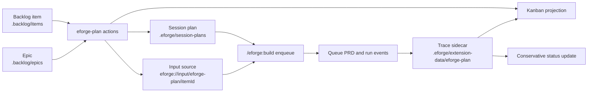

# Design eforge-plan Extension MVP and Data Model

## Problem / Motivation

The eforge project needs a first dogfoodable planning extension that unifies backlog capture, curation, AI-assisted planning handoff, session-plan promotion, and build lifecycle feedback while preserving the small eforge kernel boundary.

Evidence gathered before planning:

- Backlog source `.backlog/items/backlog-2026-06-05-design-cohesive-eforge-plan-extension-mvp-and-data-model.md` asks for the first dogfoodable eforge-plan extension slice covering backlog/epic storage, item states, kanban semantics, promotion-to-plan handoff, build linkage, Console/host surfaces, and current-vs-future API boundaries.
- The linked epic `.backlog/epics/backlog-epic-2026-06-05-eforge-plan-extension-thinking-workstation.md` frames the broader goal as unifying backlog capture, curation, AI-assisted planning, session-plan handoff, and build lifecycle feedback while keeping the eforge kernel small.
- Related backlog items confirm follow-on work is blocked on this design: backlog-item-to-session-plan promotion, build linkage, extension-owned AI planning chat, first project-local dogfood extension, and Console workstation SDK support.
- `docs/roadmap.md` supports this direction under Console Observability and Control, Extension Platform, and kernel boundary discipline, while keeping richer workflow UX out of the engine.
- `docs/extensions.md` and `docs/extensions-api.md` show current native extension APIs that can support an MVP: project-local extension loading, `resolveProjectLocalStoragePath`, `registerAction`, `registerConsoleContribution`, `registerIntegrationCommand`, `registerDeepLink`, `registerInputSource`, `registerPrdEnricher`, and `onEvent` lifecycle observation.
- `packages/extension-sdk/src/contributions.ts` confirms Console contributions are currently limited to closed declarative renderers: `text`, `markdown`, `status-badge`, `link`, `action-button`, and `action-form`.
- `packages/extension-sdk/src/contributions.ts` confirms extension actions have declared side effects.
- `packages/console-ui/README.md` confirms Console currently has first-party routes: `now`, `buildDetail`, `plans`, and `system`.
- `packages/console-ui/README.md` confirms declarative extension contributions render under `/console/system`.
- `packages/console-ui/README.md` confirms arbitrary frontend bundles, custom React, browser JavaScript, extension-owned HTTP routes, and workstation plugins are explicitly deferred.
- `packages/pi-eforge/extensions/eforge/extension-contributions.ts` confirms Pi can list and invoke extension actions, integration commands, and action-backed deep links through the generic contribution dispatcher.
- `eforge/extensions/eforge-guardrails/index.ts` confirms the repository already carries project-team native extensions under `eforge/extensions/`.
- `eforge/extensions/eforge-guardrails/index.ts` confirms existing project-team extensions use focused helper modules plus extension SDK registrations as a reference pattern.
- `examples/extensions/action-contribution.ts`, `examples/extensions/issue-tracker.ts`, and `examples/extensions/minimal-event-logger.ts` provide current examples for typed actions, Console contributions, host contributions, `registerInputSource`, and event hooks.
- `packages/monitor/src/routes/session-plan-service.ts`, `packages/client/src/api/session-plan.ts`, and `packages/monitor/src/routes/enqueue-service.ts` confirm session plans are project-local Markdown files that can be created, updated, and readied by daemon routes.
- `packages/monitor/src/routes/enqueue-service.ts` confirms session plans are automatically marked `submitted` with an `eforge_session` after enqueue from a session-plan file.
- `packages/input/src/extension-normalize.ts` confirms `eforge://input/<adapter>/<id>` input sources are supported at enqueue time.
- `packages/input/src/extension-normalize.ts` confirms PRD enrichers run after input source, file, and inline normalization.
- Event schemas in `packages/client/src/events.schemas.ts` confirm lifecycle events available for linkage include `enqueue:start`, `enqueue:complete`, `queue:prd:start`, `queue:prd:complete`, `session:start`, `session:end`, `landing:complete`, and `landing:auto-merge:complete`.

Validated conclusions:

- The MVP should build a project-team native extension under `eforge/extensions/eforge-plan/`.
- A design document may be supporting documentation, but it is not the primary deliverable.
- Existing extension APIs are enough for a dogfoodable planning extension skeleton.
- Existing extension APIs are not enough for a rich Console workstation or portable AI planning chat.
- Existing `.backlog/items/*.md` and `.backlog/epics/*.md` files already provide a practical Markdown source-of-truth shape with frontmatter fields: `id`, `status`, `priority`, `tags`, `depends_on`, `epic`, and dates.
- The MVP can define compatibility with the existing `.backlog` Markdown shape instead of inventing a replacement store.
- Build linkage should not require engine-specific backlog knowledge.
- The extension can maintain a trace sidecar under project-local `.eforge/` storage and react to normal eforge lifecycle events.

## Goal

Build the first dogfoodable `eforge-plan` project-team native extension MVP as a reference implementation candidate. The extension should support backlog and epic storage, kanban projection, session-plan promotion, direct input-source handoff, conservative build linkage, and current Console/host contribution surfaces without changing the eforge engine kernel.

## Approach

### Architecture boundaries

- Kernel boundary: the eforge engine continues to consume normalized build source and emit typed lifecycle events.
- Kernel boundary: the eforge engine does not read `.backlog`, mutate backlog item states, or know kanban semantics.
- Extension boundary: `eforge/extensions/eforge-plan/` owns backlog curation workflows, promotion actions, trace sidecars, input-source handoff, and current host/Console contribution surfaces.
- Storage boundary: `.backlog/items/*.md` and `.backlog/epics/*.md` remain the durable human-readable source of truth.
- Storage boundary: `.eforge/extension-data/eforge-plan/` contains runtime trace/cache data only.
- Storage boundary: runtime data must not be stored under `.eforge/extensions/eforge-plan/`, because `.eforge/extensions/` is also the project-local extension discovery directory and a same-name directory could create unsupported-layout diagnostics or project-local shadowing confusion.
- Session-plan boundary: promotion creates a normal `.eforge/session-plans/<session>.md` file compatible with the existing session-plan workflow.
- Session-plan boundary: the MVP does not register custom session-plan extraction.
- Input-source boundary: direct build handoff uses `registerInputSource` with `eforge://input/eforge-plan/<itemId>`, producing ordinary build-source Markdown.
- Host boundary: Pi, Claude, and CLI expose actions through the existing contribution dispatcher.
- Host boundary: no host-specific command implementation is required beyond manifest metadata.
- Console boundary: the MVP contributes a declarative `/console/system` panel only.
- Console boundary: rich kanban/workstation UI remains future platform work.

### Proposed extension module layout

```text
eforge/extensions/eforge-plan/
  index.ts                 # registers actions, input source, event hooks, Console/host contributions
  schema.ts                # TypeBox action schemas plus domain literal sets
  markdown-store.ts        # safe Markdown/frontmatter read/write helpers for .backlog
  backlog-domain.ts        # item/epic normalization, validation, dependency helpers
  kanban.ts                # derived lane projection
  trace-store.ts           # .eforge trace sidecar read/write/idempotent updates
  promote.ts               # backlog item -> session-plan/build-source synthesis
  lifecycle.ts             # pure lifecycle event -> trace/status update functions
```

### Suggested test layout

```text
test/eforge-plan-extension-storage.test.ts
test/eforge-plan-extension-kanban.test.ts
test/eforge-plan-extension-promotion.test.ts
test/eforge-plan-extension-lifecycle.test.ts
test/eforge-plan-extension-registration.test.ts
```

### Colocated extension test layout

```text
eforge/extensions/eforge-plan/__tests__/
  storage.test.ts
  kanban.test.ts
  promotion.test.ts
  lifecycle.test.ts
  registration.test.ts
```

### Data flow



### Public API impact

- No daemon HTTP API change is required.
- No `@eforge-build/client` route contract change is required.
- The extension should use current `@eforge-build/extension-sdk` APIs.
- The extension should use Node filesystem APIs.
- The extension should use repo-available dependencies only when necessary.

### Trust and runtime impact

- Project-team extensions are unsandboxed code and require local trust before loading.
- The implementation should document the unsandboxed trust requirement.
- The implementation should keep side effects explicit in action `sideEffects` metadata.
- The extension should be safe to import.
- The extension should perform no top-level filesystem mutation.
- The extension should perform no network calls.
- The extension should perform no daemon mutations at registration time.
- Action handlers and event hooks may write `.backlog` and `.eforge` files only when invoked or when lifecycle events are processed.

### Future architecture signals to document but not implement

- A first-class Console workstation contribution API.
- Extension-owned AI planning/chat orchestration.
- Extension-owned HTTP/data routes for richer workstation queries.
- More reliable external PR merged signals when eforge only opens a PR.

### Design decisions

1. Extension placement:
   - Implement the MVP as a committed project-team native extension at `eforge/extensions/eforge-plan/`.
   - The user confirmed this should become a reference extension implementation and may eventually be promoted into a bundled extension.
   - Project-local `.eforge/extensions/` is gitignored and is not appropriate for the deliverable.
   - Users must inspect and trust the extension locally before it loads.
   - Do not auto-trust the extension in code or tests.

2. Source-of-truth storage:
   - Use existing `.backlog/items/*.md` and `.backlog/epics/*.md` Markdown files as the durable source of truth.
   - Parse and write frontmatter with stable field ordering where practical.
   - Preserve body sections when updating frontmatter.
   - Keep extension trace/cache state under `.eforge/extension-data/eforge-plan/` via `resolveProjectLocalStoragePath`.
   - Do not use `.eforge/extensions/eforge-plan/` for trace/cache state.
   - `.eforge/extensions/` is the project-local extension discovery directory.
   - A data-only `.eforge/extensions/eforge-plan/` directory could produce unsupported-layout diagnostics when no entrypoint exists.
   - A project-local override named `eforge-plan` could later create same-name shadowing confusion.
   - This preserves the current capture/curation workflow and keeps runtime linkage out of human-authored backlog records.

3. Item and epic schema:
   - Support current item fields: `id`, `status`, `priority`, `source`, `created`, `updated`, `last_checked`, `stale_after`, `tags`, optional `depends_on`, optional `epic`, plus Markdown title/body sections.
   - Support current epic fields: `id`, `status`, `priority`, `source`, `created`, `updated`, `last_checked`, `stale_after`, `tags`, plus Markdown title/body sections.
   - Item-to-epic membership is derived from item `epic`.
   - The epic file does not carry a duplicated item list.
   - Do not require new backlog frontmatter for MVP.
   - If future metadata is needed, reserve a namespaced `eforge_plan` key.

4. Statuses and kanban semantics:
   - Reuse the existing status vocabulary: `candidate`, `planned`, `active`, `shipped`, `stale`, and `superseded`.
   - `blocked` is derived from open `depends_on` references.
   - `blocked` is not persisted.
   - Inbox lane contains open `candidate` items without active traces and without unresolved dependencies.
   - Ready lane contains `candidate` or `planned` items whose dependencies are closed and whose trace does not show active work.
   - Blocked lane contains open items with unresolved `depends_on` references.
   - In progress lane contains `active` items or items with active session-plan, queue, or run trace entries.
   - Done lane contains `shipped` items.
   - Archive lane contains `stale` and `superseded` items.
   - Kanban projection should return both lane membership and explanatory reasons so a thin Console/host surface can render useful status without hidden logic.

5. Trace sidecar schema:
   - Store one schema-versioned JSON trace sidecar per backlog item under `.eforge/extension-data/eforge-plan/traces/<itemId>.json`.
   - Include item id, epic id, promoted session plans, queue PRDs, build run/session ids, landing results, and last event metadata.
   - Update traces idempotently by stable keys: `session`, `prdId`, `sessionId`, and `featureBranch`/`commitSha`.
   - Sidecars are not the source of truth for backlog content or status.
   - Sidecars are linkage/projection evidence.

6. Action surface:
   - Register typed actions with object-root TypeBox schemas.
   - Register `list-board`.
   - `list-board` returns epics, items, lanes, blocked reasons, and trace summaries.
   - Register `capture-item`.
   - `capture-item` creates a backlog item from title, claim, evidence, tags, priority, epic, and dependencies.
   - Register `upsert-epic`.
   - `upsert-epic` creates or updates a local backlog epic.
   - Register `update-item`.
   - `update-item` updates status, priority, tags, evidence/recheck notes, dependencies, and epic link.
   - Register `promote-item`.
   - `promote-item` creates a session plan from a backlog item and updates trace/status conservatively.
   - Register `render-board-markdown`.
   - `render-board-markdown` returns a Markdown board summary for host/Console display.
   - Write actions declare side effects.
   - Write actions declare `local-write`.
   - Write actions declare `build-queue` only if an enqueue action is added later.
   - Read actions declare `local-read` or `none` as appropriate.

7. Handoff decisions:
   - `promote-item` is the primary MVP handoff.
   - `promote-item` creates a session plan file.
   - The session plan should include Context, Scope, Assumptions, Design Decisions, Acceptance Criteria seed content, and source backlog/epic evidence.
   - Promotion should not mark an item `shipped`.
   - Promotion may mark an item `active` or leave it `planned` based on action input/default.
   - Direct input-source handoff through `eforge://input/eforge-plan/<itemId>` should generate build-source Markdown from the same synthesis helper.
   - Direct input-source output should include a warning or explicit failure content when required acceptance/assumption content is missing.

8. Lifecycle linkage decisions:
   - Event hooks update trace sidecars for existing events when the extension can correlate the event to an item.
   - Correlation sources include promoted session-plan path, input-source source id, `enqueue:complete.id`, `queue:prd:complete.prdId`, and event envelope `sessionId`/`runId` when present.
   - A failed queue result updates trace evidence but does not automatically mark the item `stale` or `superseded`.
   - A skipped queue result updates trace evidence but does not automatically mark the item `stale` or `superseded`.
   - A local merge completion can mark the item `shipped` with evidence.
   - A confirmed auto-merge completion can mark the item `shipped` with evidence.
   - A PR-open `landing:complete` with `prUrl` but no merge confirmation leaves the item active and records the PR link.
   - Ambiguous correlation must be fail-safe.
   - Ambiguous correlation must write no backlog status mutation.
   - Ambiguous correlation should record only diagnostic trace evidence when possible.

9. Console and host surface decisions:
   - Register a declarative Console System contribution.
   - The Console contribution shows the board summary.
   - The Console contribution shows a status badge.
   - The Console contribution shows action buttons/forms for list, promote, capture, and update.
   - Register integration commands for board display and item promotion.
   - Register action-backed deep links for board display and item promotion.
   - Do not add a first-class Console route in this MVP.
   - Do not add a workstation API in this MVP.

10. Documentation decisions:
   - Add documentation only as supporting reference for the implemented extension.
   - Use `eforge/extensions/eforge-plan/README.md` for extension documentation.
   - `docs/eforge-plan-extension.md` or a section in `docs/extensions.md` may be used if needed.
   - Clearly label rich Console workstation as a future platform gap discovered by the reference MVP.
   - Clearly label AI planning/chat as a future platform gap discovered by the reference MVP.

11. Implementation sequencing:
   - Build pure domain, storage, and trace helpers first.
   - Cover pure domain, storage, and trace helpers with tests.
   - Add promotion/input-source synthesis.
   - Cover promotion/input-source synthesis with tests.
   - Add extension registrations.
   - Cover extension registration/load behavior with tests.
   - Add lifecycle trace update logic.
   - Cover lifecycle trace update logic with representative event object tests.
   - Add docs.
   - Add minimal Console/host contribution metadata.
   - Run type-check, targeted tests, and maintainability checks.

### Code impact

Expected implementation targets under `eforge/extensions/eforge-plan/`:

- `index.ts` registers actions, Console contribution, integration commands, deep links, input source, and lifecycle event hooks.
- `schema.ts` owns domain literal sets and TypeBox action input/output schemas.
- `markdown-store.ts` reads and writes `.backlog` Markdown with frontmatter and safe path handling.
- `backlog-domain.ts` normalizes items/epics, derives dependency state, and validates status/priority fields.
- `kanban.ts` derives lanes and lane reasons from items, epics, dependencies, and trace summaries.
- `trace-store.ts` reads and writes schema-versioned trace sidecars under `.eforge/extension-data/eforge-plan/`.
- `promote.ts` synthesizes session-plan Markdown and direct build-source Markdown from a backlog item plus epic/dependency context.
- `lifecycle.ts` contains pure handlers for enqueue, queue, session, and landing events.
- `lifecycle.ts` contains conservative item status update decisions.
- `README.md` documents the reference extension, trust requirements, action/input-source surface, and future promotion/bundling note.

Colocated extension tests under `eforge/extensions/eforge-plan/__tests__/`:

- `storage.test.ts` tests frontmatter parsing/writing, safe ids, and item/epic loading.
- `kanban.test.ts` tests lane projection and blocked dependency semantics.
- `promotion.test.ts` tests session-plan generation and input-source build-source generation.
- `lifecycle.test.ts` tests trace updates and conservative shipped/failure status behavior.
- `registration.test.ts` tests extension load/registration counts and action/input-source/contribution manifest shape.

Vitest configuration:

- Update `vitest.main.config.ts` so the main test project includes colocated extension tests, for example `eforge/extensions/**/__tests__/**/*.test.ts`.
- This is an intentional exception to the existing centralized `test/` convention because this extension is meant to become a reference implementation and potentially a future bundled extension.
- Tests should travel with the extension source.

Potential existing docs to touch:

- `docs/extensions.md` may get a short link to `eforge/extensions/eforge-plan/README.md` as a reference implementation.
- Avoid turning `docs/roadmap.md` into implementation detail.

Files that should not be modified for this MVP unless a test reveals a genuine bug:

- `packages/engine/src/**`
- `packages/client/src/**`
- `packages/monitor/src/**`
- `packages/console-ui/src/**`
- `packages/pi-eforge/**`
- `eforge-plugin/**`

Implementation constraints:

- New implementation files must stay under 600 lines.
- New colocated test files must stay under 1,200 lines.
- Helper modules must stay focused.
- Pure helpers should be tested directly.
- Avoid top-level filesystem writes.
- Avoid daemon mutations in extension modules.
- Do not add npm/package version changes.
- Do not add secrets.
- Do not add network calls.
- Do not add environment-dependent behavior.
- For imports, prefer public package aliases where test/build resolution supports them.
- Follow the existing project-team extension pattern only where runtime loading requires relative SDK imports.

Validation commands:

- `pnpm test -- eforge/extensions/eforge-plan/__tests__/*.test.ts`
- `pnpm type-check`
- `pnpm maintainability:check`
- `pnpm docs:check` if docs generator inputs or public docs are touched.

### Documentation impact

Required documentation:

- Add `eforge/extensions/eforge-plan/README.md`.
- The README documents the purpose of the `eforge-plan` reference extension MVP.
- The README documents the project-team trust requirement.
- The README documents the unsandboxed-code warning.
- The README documents the backlog/epic Markdown storage model.
- The README documents derived kanban lane semantics.
- The README documents action surfaces.
- The README documents Console contribution surfaces.
- The README documents host command/deep-link surfaces.
- The README documents input-source surfaces.
- The README documents the trace sidecar location.
- The README documents what data trace sidecars own.
- The README documents the promotion-to-session-plan flow.
- The README documents conservative build linkage/status update rules.
- The README documents future/deferred workstation APIs.
- The README documents future/deferred AI planning/chat APIs.
- The README notes that eventual bundled-extension promotion is TBD.

Optional documentation:

- Add a short pointer in `docs/extensions.md` to the reference extension README if it improves discoverability.
- Avoid adding a standalone design-only doc as the main deliverable.
- Avoid roadmap updates unless the implementation reveals a new future-facing gap.

Documentation constraints:

- Use Mermaid for any diagrams.
- Clearly label future/deferred capabilities so readers do not mistake them for current SDK support.
- Avoid documenting private daemon internals as extension author contracts.
- Keep current route/API references tied to client-owned helpers/constants or extension SDK APIs rather than inline daemon path literals.

### Risks and mitigations

- Risk: The extension accidentally pulls backlog semantics into the engine.
- Mitigation: Keep all backlog storage, kanban, promotion, and status mutation logic inside `eforge/extensions/eforge-plan/`.
- Mitigation: Engine files should not change.
- Risk: Project-team native extension changes break local daemon loading until trusted.
- Mitigation: Document trust requirements.
- Mitigation: Keep top-level code side-effect free.
- Mitigation: Validate with direct tests without requiring auto-trust.
- Risk: Current declarative Console contributions are mistaken for a rich workstation API.
- Mitigation: Ship only `/console/system` declarative contribution metadata.
- Mitigation: Document first-class workstation UI as future/deferred.
- Risk: Extension action handlers become too large or hard to maintain.
- Mitigation: Keep `index.ts` as registration glue.
- Mitigation: Move storage, domain, promotion, and lifecycle logic into focused helper modules under 600 lines each.
- Risk: Colocated tests are not run by the existing Vitest include patterns.
- Mitigation: Update `vitest.main.config.ts` to include `eforge/extensions/**/__tests__/**/*.test.ts`.
- Mitigation: Add an acceptance criterion for the targeted command.
- Risk: Markdown frontmatter updates corrupt human-authored backlog content.
- Mitigation: Test parse/write round trips with representative item and epic files.
- Mitigation: Preserve body content.
- Mitigation: Use stable field serialization.
- Risk: Direct `eforge://input/eforge-plan/<itemId>` enqueue bypasses assumption validation.
- Mitigation: Generate explicit missing-assumption guidance when an item is not ready.
- Mitigation: Generate explicit missing-acceptance guidance when an item is not ready.
- Mitigation: Keep promote-to-session-plan as the primary handoff.
- Risk: Event correlation is incomplete for some linkage paths.
- Mitigation: Make lifecycle handlers conservative and idempotent.
- Mitigation: When correlation is ambiguous, update no backlog status.
- Mitigation: When correlation is ambiguous, record trace diagnostics only when a trace can be identified.
- Risk: Automatic shipped status updates overclaim when eforge only opens a PR.
- Mitigation: Mark `shipped` only on confirmed local merge evidence.
- Mitigation: Mark `shipped` only on confirmed auto-merge/merge completion evidence.
- Mitigation: Treat a PR URL alone as trace evidence, not a shipped signal.
- Risk: Future bundling expectations leak into the MVP.
- Mitigation: Structure the extension as a reference implementation.
- Mitigation: Document bundled promotion as TBD.
- Mitigation: Avoid package/distribution work in this slice.

### Assumptions and validation

| Assumption | Evidence / validation performed | Confidence | Cost to validate further | Validation path | Impact if wrong |
|------------|----------------------------------|------------|--------------------------|-----------------|-----------------|
| A project-team native extension under `eforge/extensions/eforge-plan/` is the right committed deliverable. | User explicitly confirmed project-team native extension and reference implementation intent. Existing `eforge/extensions/eforge-guardrails/` confirms this repo already carries project-team native extension source. | high | low | Add the directory and validate extension discovery/load in tests. | High: wrong placement would make the MVP non-dogfoodable or uncommitted. |
| Runtime trace/cache state should not live under `.eforge/extensions/eforge-plan/`. | Read extension discovery code: `.eforge/extensions/` is scanned as the project-local extension directory. A data-only `.eforge/extensions/eforge-plan/` directory would be treated as an unsupported extension layout, and a later project-local override could create same-name shadowing confusion. Plan updated to use `.eforge/extension-data/eforge-plan/`. | high | low | Add trace-store tests asserting the resolved path uses `.eforge/extension-data/eforge-plan/` and extension registration tests that do not create `.eforge/extensions/eforge-plan/`. | Medium: wrong storage location could produce noisy discovery diagnostics or confusing project-local shadow behavior. |
| Existing `.backlog/items` and `.backlog/epics` Markdown can be the MVP backlog/epic source of truth. | Read the target backlog item, linked epic, related backlog items, and listed `.backlog` directories. Current files use stable frontmatter fields and dependencies. | high | low | Run storage tests against representative fixture files modeled on current backlog records. | Medium: design would need a different source-of-truth store. |
| Colocated tests are preferable for this reference extension. | User challenged root-level tests; reference/bundled-extension intent means tests should travel with extension source. `vitest.main.config.ts` currently excludes `eforge/extensions`, so include config must be updated. | high | low | Add `eforge/extensions/**/__tests__/**/*.test.ts` to the main Vitest include list and run targeted tests. | Medium: tests may not run in normal project validation if config is not updated. |
| Current extension contribution APIs can support a dogfoodable host/Console MVP but not a rich workstation. | Read `docs/extensions.md`, `docs/extensions-api.md`, `packages/extension-sdk/src/contributions.ts`, `packages/console-ui/README.md`, Pi contribution dispatch code, and `examples/extensions/action-contribution.ts`. Console renderers are closed and arbitrary frontend bundles/workstations are deferred. | high | low | Re-run code search for `registerWorkstation`, arbitrary frontend bundle loading, and contribution renderer IDs before implementation. | Medium: implementation might underuse a newly added API. |
| Session-plan handoff can be implemented by writing normal `.eforge/session-plans/*.md` artifacts. | Read session-plan daemon service/client helpers and enqueue service; session plans are project-local Markdown and enqueue marks them submitted with `eforge_session`. | high | medium | Generate a promoted session plan fixture and call the session-plan readiness helper or enqueue flow in a targeted/integration test if practical. | Medium: promotion flow would need to route through daemon routes instead of direct file writes. |
| Direct backlog-item build handoff can use `registerInputSource` and `eforge://input/eforge-plan/<itemId>`. | Read extension API docs, `packages/input/src/extension-normalize.ts`, and `examples/extensions/issue-tracker.ts`; input-source URIs are parsed and resolved during enqueue preprocessing. | high | low | Implement an adapter test with a temporary `.backlog` fixture and call the registered fetch handler. | Medium: direct handoff would be deferred, but session-plan promotion remains viable. |
| Event hooks can maintain most build linkage without engine changes. | Read event schemas for enqueue, queue, session, and landing events plus event runtime behavior; available events expose PRD id, status, landing fields, and optional session/run envelopes. | medium | medium | Dogfood or fixture-test representative events and inspect actual event envelopes for correlation completeness. | High: automatic status updates may need to stay partial or require a future traceability API. |
| Marking backlog items `shipped` from PR-open events is unsafe. | Read landing event schemas; `landing:complete` may include `prUrl` for PR creation and does not inherently prove later merge unless local merge/auto-merge completion is confirmed. | high | low | Validate with landing flow event fixtures before implementing status mutation. | High: items could be incorrectly closed before code lands. |

No low-confidence/high-impact assumptions remain unresolved.

The medium-confidence/high-impact event-correlation assumption is accepted with a conservative implementation rule: ambiguous lifecycle events must not mutate backlog item status.

### Profile signal

Recommended profile: **Excursion**.

Rationale: this is a multi-file reference extension with storage, projection, promotion, trace, contribution registration, and colocated tests. One cohesive plan can cover the modules and sequencing without delegated module planning, so Expedition is not warranted. Errand is too light because the implementation must preserve kernel/extension boundary discipline, trust semantics, and conservative lifecycle linkage.

## Scope

### In scope

- Add a committed project-team native extension under `eforge/extensions/eforge-plan/`.
- Implement backlog storage helpers for existing `.backlog/items/*.md` Markdown files.
- Implement epic storage helpers for existing `.backlog/epics/*.md` Markdown files.
- Implement a typed domain model for backlog items.
- Implement a typed domain model for epics.
- Implement a typed domain model for statuses.
- Implement a typed domain model for priorities.
- Implement a typed domain model for dependencies.
- Implement a typed domain model for derived kanban lanes.
- Implement schema-versioned extension-owned trace sidecars under `.eforge/extension-data/eforge-plan/` via `resolveProjectLocalStoragePath`.
- Keep build linkage out of durable backlog Markdown unless a deliberate item status update is made.
- Register extension actions for list/query board state.
- Register extension actions to create or update backlog items.
- Register extension actions to create or update epics.
- Register extension actions to promote a backlog item to a session plan.
- Register extension actions to update item status with evidence.
- Register host-facing integration commands for the core actions so Pi/Claude/CLI can discover and invoke the workflow through existing contribution dispatch.
- Register action-backed deep links for the core actions so Pi/Claude/CLI can discover and invoke the workflow through existing contribution dispatch.
- Register a declarative Console System contribution that surfaces a summary/status panel and action controls using the current closed renderer set.
- Register an input source adapter such as `eforge://input/eforge-plan/<itemId>` that compiles a validated backlog item into build-source Markdown for direct handoff when appropriate.
- Register event hooks for existing enqueue lifecycle events.
- Register event hooks for existing queue lifecycle events.
- Register event hooks for existing session lifecycle events.
- Register event hooks for existing landing lifecycle events.
- Update trace sidecars conservatively when correlation is unambiguous.
- Add tests for storage.
- Add tests for kanban projection.
- Add tests for promotion handoff.
- Add tests for input-source output.
- Add tests for trace update logic.
- Add tests for extension registration/load behavior.
- Add concise reference documentation for the extension.
- Document current MVP capabilities.
- Document trust implications.
- Document explicitly deferred workstation APIs.
- Document explicitly deferred AI-chat APIs.

### Out of scope

- Adding a first-class Console workstation route.
- Adding arbitrary frontend bundle loading.
- Adding extension-owned browser JavaScript.
- Adding custom React renderers.
- Adding raw extension-owned HTTP routes.
- Adding a portable extension-owned AI planning/chat orchestration API.
- Changing the eforge engine kernel to understand backlog items.
- Replacing session plans.
- Replacing playbooks.
- Replacing the existing normalized build-source pipeline.
- Replacing `.backlog` Markdown with a database.
- Automatically marking PR-open builds as `shipped` without a confirmed merge or auto-merge completion signal.
- Bundling the extension into an npm package.
- Bundling the extension into core distribution.
- Deciding final bundled-extension promotion in this MVP.

### Roadmap alignment

- Aligns with Console planning/workflow visibility.
- Aligns with Extension Platform goals in `docs/roadmap.md`.
- Preserves engine boundary discipline.
- Keeps planning workflow state extension-owned.
- Keeps the engine consuming normalized build source.
- Keeps the engine emitting typed events.
- Unblocks related backlog items for promotion handoff.
- Unblocks related backlog items for build linkage.
- Unblocks related backlog items for dogfood extension creation.
- Unblocks related backlog items for AI planning gaps.
- Unblocks related backlog items for future Console workstation APIs.

## Acceptance Criteria

- `eforge/extensions/eforge-plan/index.ts` exists.
- `eforge/extensions/eforge-plan/index.ts` registers an eforge native extension factory.
- The `eforge-plan` extension registers a read action for board/list state.
- The board/list read action has a TypeBox object-root input schema.
- The board/list read action has a JSON-safe output schema.
- The `eforge-plan` extension registers a write action for backlog item capture or update.
- The backlog item capture or update action declares explicit `local-write` side effects.
- The `eforge-plan` extension registers a `list-board` action.
- The `list-board` action returns epics.
- The `list-board` action returns items.
- The `list-board` action returns lanes.
- The `list-board` action returns blocked reasons.
- The `list-board` action returns trace summaries.
- The `eforge-plan` extension registers a `capture-item` action.
- The `capture-item` action creates a backlog item from title, claim, evidence, tags, priority, epic, and dependencies.
- The `eforge-plan` extension registers an `upsert-epic` action.
- The `upsert-epic` action creates or updates a local backlog epic.
- The `eforge-plan` extension registers an `update-item` action.
- The `update-item` action updates item status.
- The `update-item` action updates item priority.
- The `update-item` action updates item tags.
- The `update-item` action updates item evidence or recheck notes.
- The `update-item` action updates item dependencies.
- The `update-item` action updates item epic link.
- The `eforge-plan` extension registers a `promote-item` action.
- The `promote-item` action creates a normal `.eforge/session-plans/<session>.md` file from a backlog item.
- The `promote-item` action does not mark a backlog item `shipped`.
- The `promote-item` action can mark a backlog item `active` or leave it `planned` based on action input/default.
- The `eforge-plan` extension registers a `render-board-markdown` action.
- The `render-board-markdown` action returns a Markdown board summary for host/Console display.
- The `eforge-plan` extension registers a `registerInputSource` adapter.
- The input source adapter handles `eforge://input/eforge-plan/<itemId>` references.
- The input source adapter generates ordinary build-source Markdown.
- The input source adapter uses the same synthesis helper as `promote-item`.
- The input source output includes backlog item claim.
- The input source output includes backlog item evidence.
- The input source output includes assumptions or missing-assumption guidance.
- The input source output includes acceptance criteria or missing-criteria guidance.
- The `eforge-plan` extension registers a declarative Console contribution.
- The declarative Console contribution renders under `/console/system`.
- The declarative Console contribution uses only current closed renderer IDs: `text`, `markdown`, `status-badge`, `link`, `action-button`, and `action-form`.
- The declarative Console contribution shows a board summary.
- The declarative Console contribution shows a status badge.
- The declarative Console contribution exposes action buttons/forms for list, promote, capture, and update workflows.
- The `eforge-plan` extension registers at least one host-discoverable integration command for board or promotion workflows.
- The `eforge-plan` extension registers at least one action-backed deep link for board or promotion workflows.
- The `eforge-plan` extension registers lifecycle event hooks for existing enqueue lifecycle events.
- The `eforge-plan` extension registers lifecycle event hooks for existing queue lifecycle events.
- The `eforge-plan` extension registers lifecycle event hooks for existing session lifecycle events.
- The `eforge-plan` extension registers lifecycle event hooks for existing landing lifecycle events.
- Lifecycle event hooks route lifecycle updates through pure trace update helpers.
- Lifecycle event hooks update trace sidecars when correlation is unambiguous.
- Lifecycle event hooks use promoted session-plan path as a correlation source.
- Lifecycle event hooks use input-source source id as a correlation source.
- Lifecycle event hooks use `enqueue:complete.id` as a correlation source.
- Lifecycle event hooks use `queue:prd:complete.prdId` as a correlation source.
- Lifecycle event hooks use event envelope `sessionId` when present as a correlation source.
- Lifecycle event hooks use event envelope `runId` when present as a correlation source.
- Ambiguous lifecycle event correlation writes no backlog status mutation.
- Ambiguous lifecycle event correlation records only diagnostic trace evidence when a trace can be identified.
- Backlog item storage reads existing `.backlog/items/*.md` files.
- Backlog item storage reads `id` frontmatter.
- Backlog item storage reads `status` frontmatter.
- Backlog item storage reads `priority` frontmatter.
- Backlog item storage reads `source` frontmatter.
- Backlog item storage reads `created` frontmatter.
- Backlog item storage reads `updated` frontmatter.
- Backlog item storage reads `last_checked` frontmatter.
- Backlog item storage reads `stale_after` frontmatter.
- Backlog item storage reads `tags` frontmatter.
- Backlog item storage reads optional `depends_on` frontmatter.
- Backlog item storage reads optional `epic` frontmatter.
- Backlog item storage preserves Markdown title/body sections when updating frontmatter.
- Backlog item storage writes frontmatter with stable field ordering where practical.
- Epic storage reads existing `.backlog/epics/*.md` files.
- Epic storage reads `id` frontmatter.
- Epic storage reads `status` frontmatter.
- Epic storage reads `priority` frontmatter.
- Epic storage reads `source` frontmatter.
- Epic storage reads `created` frontmatter.
- Epic storage reads `updated` frontmatter.
- Epic storage reads `last_checked` frontmatter.
- Epic storage reads `stale_after` frontmatter.
- Epic storage reads `tags` frontmatter.
- Epic storage preserves Markdown title/body sections when updating frontmatter.
- Epic storage writes frontmatter with stable field ordering where practical.
- Item-to-epic membership is derived from item `epic` frontmatter.
- Epic files do not carry duplicated item lists.
- Item status validation accepts `candidate`.
- Item status validation accepts `planned`.
- Item status validation accepts `active`.
- Item status validation accepts `shipped`.
- Item status validation accepts `stale`.
- Item status validation accepts `superseded`.
- The implementation does not require new backlog frontmatter for the MVP.
- Future backlog metadata, if introduced, is reserved under a namespaced `eforge_plan` key.
- Kanban projection treats `blocked` as a derived lane reason from unresolved dependencies.
- Kanban projection does not persist `blocked` as an item status.
- The Inbox lane contains open `candidate` items without active traces and without unresolved dependencies.
- The Ready lane contains `candidate` or `planned` items whose dependencies are closed and whose trace does not show active work.
- The Blocked lane contains open items with unresolved `depends_on` references.
- The In progress lane contains `active` items.
- The In progress lane contains items with active session-plan trace entries.
- The In progress lane contains items with active queue trace entries.
- The In progress lane contains items with active run trace entries.
- The Done lane contains `shipped` items.
- The Archive lane contains `stale` items.
- The Archive lane contains `superseded` items.
- Kanban projection returns lane membership.
- Kanban projection returns explanatory lane reasons.
- Trace sidecars are written under `.eforge/extension-data/eforge-plan/`.
- Trace sidecars are written under `.eforge/extension-data/eforge-plan/traces/<itemId>.json`.
- Trace sidecars include a `schemaVersion` field.
- Trace sidecars include item id.
- Trace sidecars include epic id.
- Trace sidecars include promoted session plans.
- Trace sidecars include queue PRDs.
- Trace sidecars include build run ids.
- Trace sidecars include build session ids.
- Trace sidecars include landing results.
- Trace sidecars include last event metadata.
- Trace updates are idempotent by `session`.
- Trace updates are idempotent by `prdId`.
- Trace updates are idempotent by `sessionId`.
- Trace updates are idempotent by `featureBranch` or `commitSha`.
- Trace sidecars are not used as the source of truth for backlog content.
- Trace sidecars are not used as the source of truth for backlog status.
- Trace/cache state is not written under `.eforge/extensions/eforge-plan/`.
- Promotion-to-session-plan records source backlog item id in the generated session plan body.
- Promotion-to-session-plan records relevant epic context in the generated session plan body.
- Promotion-to-session-plan records relevant dependency context in the generated session plan body.
- Promotion-to-session-plan includes Context content in the generated session plan.
- Promotion-to-session-plan includes Scope content in the generated session plan.
- Promotion-to-session-plan includes Assumptions content in the generated session plan.
- Promotion-to-session-plan includes Design Decisions content in the generated session plan.
- Promotion-to-session-plan includes Acceptance Criteria seed content in the generated session plan.
- Promotion-to-session-plan includes source backlog evidence in the generated session plan.
- Promotion-to-session-plan includes source epic evidence in the generated session plan.
- A failed queue result updates trace evidence without automatically marking a backlog item `stale`.
- A failed queue result updates trace evidence without automatically marking a backlog item `superseded`.
- A failed queue result updates trace evidence without automatically marking a backlog item `shipped`.
- A skipped queue result updates trace evidence without automatically marking a backlog item `stale`.
- A skipped queue result updates trace evidence without automatically marking a backlog item `superseded`.
- A skipped queue result updates trace evidence without automatically marking a backlog item `shipped`.
- A PR-open `landing:complete` result with `prUrl` and no merge confirmation records the PR link.
- A PR-open `landing:complete` result with `prUrl` and no merge confirmation leaves the item active.
- A PR-open `landing:complete` result with `prUrl` and no merge confirmation does not mark a backlog item `shipped`.
- A confirmed local merge completion can mark a backlog item `shipped` with evidence.
- A confirmed auto-merge completion can mark a backlog item `shipped` with evidence.
- Tests for the extension live under `eforge/extensions/eforge-plan/__tests__/`.
- Extension tests do not live under the repository root `test/` directory.
- `eforge/extensions/eforge-plan/__tests__/storage.test.ts` exists.
- `eforge/extensions/eforge-plan/__tests__/storage.test.ts` verifies frontmatter parsing/writing, safe ids, and item/epic loading.
- `eforge/extensions/eforge-plan/__tests__/kanban.test.ts` exists.
- `eforge/extensions/eforge-plan/__tests__/kanban.test.ts` verifies lane projection and blocked dependency semantics.
- `eforge/extensions/eforge-plan/__tests__/promotion.test.ts` exists.
- `eforge/extensions/eforge-plan/__tests__/promotion.test.ts` verifies session-plan generation and input-source build-source generation.
- `eforge/extensions/eforge-plan/__tests__/lifecycle.test.ts` exists.
- `eforge/extensions/eforge-plan/__tests__/lifecycle.test.ts` verifies trace updates and conservative shipped/failure status behavior.
- `eforge/extensions/eforge-plan/__tests__/registration.test.ts` exists.
- `eforge/extensions/eforge-plan/__tests__/registration.test.ts` verifies extension load/registration counts and action/input-source/contribution manifest shape.
- `vitest.main.config.ts` includes `eforge/extensions/**/__tests__/**/*.test.ts` in the main Vitest include list.
- `pnpm test -- eforge/extensions/eforge-plan/__tests__/*.test.ts` exits 0.
- `pnpm type-check` exits 0.
- `pnpm maintainability:check` exits 0.
- `pnpm docs:check` exits 0 if docs generator inputs or public docs are touched.
- `eforge/extensions/eforge-plan/README.md` exists.
- `eforge/extensions/eforge-plan/README.md` documents the purpose of the `eforge-plan` reference extension MVP.
- `eforge/extensions/eforge-plan/README.md` documents project-team trust requirements.
- `eforge/extensions/eforge-plan/README.md` documents the unsandboxed-code warning.
- `eforge/extensions/eforge-plan/README.md` documents the backlog/epic Markdown storage model.
- `eforge/extensions/eforge-plan/README.md` documents derived kanban lane semantics.
- `eforge/extensions/eforge-plan/README.md` documents action surfaces.
- `eforge/extensions/eforge-plan/README.md` documents Console contribution surfaces.
- `eforge/extensions/eforge-plan/README.md` documents host command/deep-link surfaces.
- `eforge/extensions/eforge-plan/README.md` documents input-source surfaces.
- `eforge/extensions/eforge-plan/README.md` documents trace sidecar location.
- `eforge/extensions/eforge-plan/README.md` documents what data trace sidecars own.
- `eforge/extensions/eforge-plan/README.md` documents the promotion-to-session-plan flow.
- `eforge/extensions/eforge-plan/README.md` documents conservative build linkage/status update rules.
- `eforge/extensions/eforge-plan/README.md` documents future/deferred workstation APIs.
- `eforge/extensions/eforge-plan/README.md` documents future/deferred AI planning/chat APIs.
- `eforge/extensions/eforge-plan/README.md` states that future bundling into a shipped/bundled extension is TBD.
- Documentation uses Mermaid for any diagrams.
- Documentation clearly labels future/deferred capabilities so readers do not mistake them for current SDK support.
- Documentation avoids documenting private daemon internals as extension author contracts.
- Documentation keeps current route/API references tied to client-owned helpers/constants or extension SDK APIs rather than inline daemon path literals.
- The implementation does not modify engine kernel source files under `packages/engine/src/`.
- The implementation does not change the daemon HTTP API.
- The implementation does not change the `@eforge-build/client` route contract.
- The implementation does not add a Console workstation route.
- The implementation does not add arbitrary frontend bundle loading.
- The implementation does not add extension-owned browser JavaScript.
- The implementation does not add custom React renderers.
- The implementation does not add raw extension-owned HTTP routes.
- The implementation does not add an extension-owned AI planning/chat runtime API.
- The implementation does not replace session plans.
- The implementation does not replace playbooks.
- The implementation does not replace the existing normalized build-source pipeline.
- The implementation does not replace `.backlog` Markdown with a database.
- The implementation does not bundle the extension into an npm package.
- The implementation does not bundle the extension into core distribution.
- The implementation does not add npm/package version changes.
- The implementation does not add secrets.
- The implementation does not add network calls.
- The implementation does not add environment-dependent behavior.
- New implementation files under `eforge/extensions/eforge-plan/` are each 600 lines or fewer.
- New colocated test files under `eforge/extensions/eforge-plan/__tests__/` are each 1,200 lines or fewer.
- `index.ts` remains registration glue.
- Storage logic is implemented in focused helper modules.
- Domain logic is implemented in focused helper modules.
- Promotion logic is implemented in focused helper modules.
- Lifecycle logic is implemented in focused helper modules.
- Pure helpers are tested directly.
- Importing the extension performs no top-level filesystem mutation.
- Importing the extension performs no daemon mutation.
- Importing the extension performs no network call.
- Action handlers write `.backlog` files only when invoked.
- Action handlers write `.eforge` files only when invoked.
- Event hooks write `.backlog` files only when lifecycle events are processed.
- Event hooks write `.eforge` files only when lifecycle events are processed.

## Manual Verification Notes

- Users must inspect and trust the project-team native extension locally before it loads.
- Do not auto-trust the extension in code or tests.
- Dogfood or fixture-test representative lifecycle events and inspect actual event envelopes for correlation completeness.
- Re-run code search for `registerWorkstation`, arbitrary frontend bundle loading, and contribution renderer IDs before implementation to confirm no newly added API should be used.
- Generate a promoted session plan fixture and call the session-plan readiness helper or enqueue flow in a targeted/integration test if practical.
- Validate PR-open landing behavior with landing flow event fixtures before implementing status mutation.