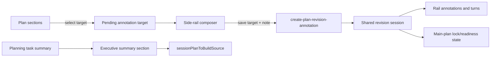

# Improve Session Plan Review and Rendering UX

## Problem / Motivation

The eforge-plan workstation is becoming the primary human-in-the-loop planning surface, but the current plan-detail review flow makes sign-off and revision harder than it needs to be.

Current evidence from the supplied backlog/code analysis:

- `PlanDetailCard` owns revision-session state, renders inline annotation buttons for each section, and places open annotations plus the `Revise with AI` thread in the main plan content.
- `PlanContextRail` is only a surrounding context/build-lineage rail; it does not participate in per-plan review, pending annotation composition, or revision-turn activity.
- Annotation creation can happen from inline controls without first collecting a useful note, so target selection and note composition are not clearly separated.
- Completed, failed, and needs-input revision turns are inspectable only inside a main-content disclosure, which competes with the plan substance.
- Planning task results already have a top-level `summary`, but `applySessionPlanCreationDraft` persists only generated readiness sections, so created session plans lose the high-level executive summary needed for fast scope review.
- Plan detail currently leads with status/readiness and then renders full section bodies, which is heavy for a quick scoping/sign-off pass.
- eforge-plan `SafeMarkdown` uses `marked` plus `DOMPurify`; Mermaid fences currently render as code and SVG/resource-loading tags are forbidden by default.

The result should make a session plan easy to review at three levels: first the executive summary, then collapsed detailed sections, then a side rail for annotations, revision controls, and recent AI activity.

## Goal

Make session-plan review faster and clearer by leading with an executive summary, progressively disclosing detail, and moving annotation/revision activity into a shared side rail. Preserve existing revision-session backend semantics, action ids, and payload shapes unless tests expose a minimal schema gap.

## Approach

### High-level implementation

- Rework the flat session-plan detail surface in `eforge/extensions/eforge-plan/workstation-src/plans/src/views/plans/` so the main content focuses on plan substance while the side rail handles review context, pending annotation composition, open annotations, and revision-turn activity.
- Expand or replace `PlanContextRail` for selected flat plans so it becomes a plan review/activity rail while preserving existing source backlog item, epic, build-state, and PR context.
- Hoist or share `usePlanRevisionSession` state so both the plan body and side rail can read the same revision session without duplicate fetches or competing mutation state.
- Change annotation buttons in `AnnotatablePlanSection` and whole-plan annotation entry points so they select a pending target.
- Save annotations from the side rail by calling the existing create annotation action with target plus note body.
- Cancel pending annotations without persisting an annotation.
- Persist planning task result summaries into created session plans as an executive summary projection or section during `applySessionPlanCreationDraft`.
- Keep readiness dimensions limited to the selected contract.
- Update plan detail rendering so the executive summary appears near the top and detailed sections use progressive disclosure by default while remaining inspectable and editable.
- Ensure normalized build-source output includes the executive summary so the build agent receives high-level direction before detailed dimensions.
- Add safe Mermaid rendering for fenced `mermaid` code blocks in eforge-plan Markdown views, with strict Mermaid security settings, sanitized output, and readable fallback on render failure.
- Update planning prompt/source guidance and docs/tests so planners produce executive summaries and use Mermaid only when diagrams clarify flows, dependencies, architecture, or sequencing.

### Recommended design decisions

1. Treat annotation target selection and annotation persistence as separate states. Inline plan controls should call something like `setPendingAnnotationTarget(target)`; only the side-rail Save action should call `create-plan-revision-annotation` with `{ target, body }`.
2. Keep `usePlanRevisionSession` as the single client-side state owner for a selected plan. Hoist it to the nearest component that can provide both the main detail card and the plan rail, or introduce a small `PlanDetailWorkspace` wrapper that renders both.
3. Preserve existing action ids and payloads for annotation/revision mutation. The UI refactor should be mostly presentational/state-placement work rather than a backend contract migration.
4. Store the executive summary outside the readiness dimension set. A canonical `## Executive Summary` section is compatible with existing session-plan body/build-source behavior, but the readiness validator should continue to validate only required contract dimensions.
5. Render the executive summary as the primary sign-off artifact and collapse detailed sections by default. Readiness diagnostics should remain visible but should not precede the summary.
6. Render Mermaid as a special Markdown fence path rather than permitting arbitrary SVG in normal Markdown. Normal Markdown should continue forbidding resource-loading tags and attributes.
7. Use Mermaid `securityLevel: 'strict'`, `startOnLoad: false`, sanitized rendered SVG, unique render ids, and fallback-to-code behavior on parser/render errors.
8. Keep Mermaid optional in planner guidance. Diagrams should be invited for workflows, dependencies, architecture, and sequencing, not required for every plan.

### Suggested data/control flow

Implementation can split into three commits or PR slices if desired: side-rail state placement, executive summary/progressive disclosure, then Mermaid rendering.

### Likely workstation touchpoints

- `eforge/extensions/eforge-plan/workstation-src/plans/src/views/plans-view.tsx` and `workstation-view.tsx`: route selected plan detail and rail state so the selected flat plan can render a review/activity rail rather than only static `PlanContextRail` context.
- `eforge/extensions/eforge-plan/workstation-src/plans/src/views/plan-context-rail.tsx`: evolve into a reusable `PlanReviewRail`/context rail composition, preserving existing source item, epic, build-state, and PR display.
- `eforge/extensions/eforge-plan/workstation-src/plans/src/views/plans/plan-detail.tsx`: remove local-only ownership assumptions for revision session state, keep readiness/actions in the main card, render executive summary first, and collapse detailed sections by default.
- `eforge/extensions/eforge-plan/workstation-src/plans/src/views/plans/plan-annotatable-section.tsx`: change inline buttons from immediate creation to pending-target selection callbacks.
- `eforge/extensions/eforge-plan/workstation-src/plans/src/views/plans/plan-revision-annotations-panel.tsx`, `plan-revision-panel.tsx`, `plan-revision-thread.tsx`, and `use-plan-revision-session.ts`: reuse existing controls in the rail, or split presentational pieces so the same API object powers rail activity without action-payload drift.
- `eforge/extensions/eforge-plan/workstation-src/plans/src/components/safe-markdown.tsx` and `safe-markdown.test.tsx`: add Mermaid fence detection/rendering while preserving current `marked`/`DOMPurify` behavior for all other Markdown.
- `eforge/extensions/eforge-plan/workstation-src/plans/package.json`: add `mermaid` only if the renderer is implemented in the workstation bundle; prefer a lazy import if bundle size is a concern.

### Likely runtime/input touchpoints

- `eforge/extensions/eforge-plan/planner-orchestration.ts`: carry the planning task result `summary` through creation-draft resolution/application and write the executive summary after readiness validation so generated drafts still use only contract dimensions.
- `packages/input/src/session-plan.ts`: adjust parsing/serialization/build-source projection only if a first-class executive-summary projection is preferable to a plain `## Executive Summary` section.
- `eforge/extensions/eforge-plan/agent-task-actions.ts` and associated tests: update planner task prompt/context guidance so summary expectations and optional Mermaid guidance are explicit.

### Test impact

- Extend `plan-detail-annotations.test.tsx` for pending target composition, save/cancel behavior, and payload preservation.
- Extend `plan-revision-panel.test.tsx` or add rail-focused tests for running/cancel/retry/redraft/recent turn status in the rail.
- Extend `planner-orchestration.test.ts` for summary-to-executive-summary persistence and build-source normalization coverage.
- Extend `safe-markdown.test.tsx` for valid Mermaid rendering, invalid diagram fallback, and unsafe SVG/link/script sanitization.
- Keep new components under the repository maintainability limits and use durable region markers if files exceed 300 lines.

### Assumptions

- The current source analysis in the selected backlog items is accurate: `PlanDetailCard`, `PlanContextRail`, `SafeMarkdown`, and `applySessionPlanCreationDraft` are the central surfaces.
- A non-readiness `executive-summary` section is acceptable because session plans already parse and serialize arbitrary body sections, and build-source normalization includes the full body.
- Existing session plans may not have executive summaries, so rendering and build-source behavior must degrade gracefully.
- Mermaid rendering should not weaken the default Markdown sanitizer. Normal Markdown should still forbid images, SVG, styles, scripts, external resources, and inline event handlers.
- The eforge-plan workstation is the intended first-party planning surface; this work should not revive the built-in Console Plans page.

## Scope

### In scope

- Rework the flat session-plan detail surface in `eforge/extensions/eforge-plan/workstation-src/plans/src/views/plans/`.
- Expand or replace `PlanContextRail` for selected flat plans so it becomes a plan review/activity rail while preserving existing source backlog item, epic, build-state, and PR context.
- Hoist/share `usePlanRevisionSession` state so both the plan body and side rail can read the same revision session without duplicate fetches or competing mutation state.
- Change annotation buttons in `AnnotatablePlanSection` and whole-plan annotation entry points so they select a pending target.
- Save side-rail annotation notes through the existing create annotation action with target plus note body.
- Cancel pending annotations without persisting an annotation.
- Persist planning task result summaries into created session plans as an executive summary projection/section during `applySessionPlanCreationDraft`.
- Keep readiness dimensions limited to the selected contract.
- Update plan detail rendering so the executive summary appears near the top.
- Make detailed sections use progressive disclosure by default while remaining inspectable and editable.
- Ensure normalized build-source output includes the executive summary so the build agent receives high-level direction before detailed dimensions.
- Add safe Mermaid rendering for fenced `mermaid` code blocks in eforge-plan Markdown views.
- Use strict Mermaid security settings, sanitized output, and readable fallback on render failure.
- Update planning prompt/source guidance and docs/tests so planners produce executive summaries.
- Update planning prompt/source guidance and docs/tests so planners use Mermaid only when diagrams clarify flows, dependencies, architecture, or sequencing.

### Out of scope

- Replacing the revision-session backend or changing the semantics of existing annotation/revision actions unless tests expose a minimal schema gap.
- Reintroducing or maintaining a competing built-in Console Plans surface outside the eforge-plan workstation.
- Broad plugin/Pi integration parity work.
- Changes outside the eforge-plan workstation/runtime unless shared user-facing commands or routes are changed.
- General-purpose Markdown rendering changes outside eforge-plan unless a shared helper is intentionally extracted.

### Source backlog items covered

- `implement-side-rail-plan-annotation-and-revision-controls`
- `add-executive-summaries-and-progressive-disclosure-to-session-plans`
- `render-mermaid-diagrams-in-eforge-plan-markdown-views`

## Acceptance Criteria

- Clicking `Annotate selection` sets a pending annotation target.
- Clicking `Annotate focused block` sets a pending annotation target.
- Clicking `Annotate section` sets a pending annotation target.
- Clicking `Annotate whole plan` sets a pending annotation target.
- Selecting an annotation target renders a side-rail composer.
- No `create-plan-revision-annotation` action runs before Save is clicked.
- Saving a side-rail composer invokes the existing `create-plan-revision-annotation` action with the annotation target.
- Saving a side-rail composer sends the trimmed note body.
- Cancelling a side-rail composer leaves the persisted revision session projection unchanged.
- The side-rail composer displays `target.kind`, dimension or section label, captured excerpt, quote context, and a note textarea for selection targets in component tests.
- The side-rail composer displays `target.kind`, dimension or section label, captured excerpt, quote context, and a note textarea for block targets in component tests.
- The side-rail composer displays `target.kind`, dimension or section label, captured excerpt, quote context, and a note textarea for section targets in component tests.
- The side-rail composer displays `target.kind`, dimension or section label, captured excerpt, quote context, and a note textarea for whole-plan targets in component tests.
- Open annotation edit controls render in the plan rail and preserve the existing annotation/revision action ids and payload shapes asserted by tests.
- Open annotation resolve controls render in the plan rail and preserve the existing annotation/revision action ids and payload shapes asserted by tests.
- Open annotation dismiss controls render in the plan rail and preserve the existing annotation/revision action ids and payload shapes asserted by tests.
- Open annotation delete controls render in the plan rail and preserve the existing annotation/revision action ids and payload shapes asserted by tests.
- Selected-revision controls render in the plan rail and preserve the existing annotation/revision action ids and payload shapes asserted by tests.
- Include-open-annotations controls render in the plan rail and preserve the existing annotation/revision action ids and payload shapes asserted by tests.
- Running revision turns are visible in the plan rail.
- Cancel controls are visible in the plan rail.
- Retry controls are visible in the plan rail.
- Redraft needs-input controls are visible in the plan rail.
- Patch-ready status is visible in the plan rail.
- Applied status is visible in the plan rail.
- Failed status is visible in the plan rail.
- Edit locking follows current `usePlanRevisionSession` rules.
- The main plan detail renders plan substance without embedded open-annotation management.
- The main plan detail renders plan substance without primary revision-thread controls.
- The main plan detail keeps inline target-selection affordances tied to the side rail.
- Applying a completed planning task with a top-level `summary` writes an `executive-summary` projection or section.
- `applySessionPlanCreationDraft` keeps readiness dimensions limited to the selected contract.
- `sessionPlanToBuildSource` output contains the executive summary before detailed dimension sections.
- Plan detail rendering shows the executive summary near the top.
- Plans without an executive summary render readiness without errors.
- Plans without an executive summary render sections without errors.
- Detailed sections default collapsed.
- Expansion tests reveal editable content in detailed sections.
- Fenced `mermaid` code blocks render sanitized diagrams under strict Mermaid settings.
- Mermaid rendering uses `securityLevel: 'strict'`.
- Mermaid rendering uses `startOnLoad: false`.
- Mermaid render ids are unique.
- Invalid Mermaid diagrams render an accessible code-block fallback.
- Invalid Mermaid diagram fallbacks include an error label.
- Non-Mermaid Markdown rendering keeps current GFM table wrapping.
- Non-Mermaid Markdown rendering keeps current sanitization behavior.
- Normal Markdown continues forbidding images, SVG, styles, scripts, external resources, and inline event handlers.
- `safe-markdown.test.tsx` covers valid Mermaid rendering.
- `safe-markdown.test.tsx` covers invalid Mermaid diagram fallback.
- `safe-markdown.test.tsx` covers unsafe SVG/link/script sanitization.
- Planning prompt or source guidance mentions executive summaries.
- Planning prompt or source guidance mentions optional Mermaid diagrams.
- Planning prompt or source guidance states that Mermaid diagrams should be used only when diagrams clarify flows, dependencies, architecture, or sequencing.
- Tests assert the generated planner context or prompt text contains the executive-summary guidance.
- Tests assert the generated planner context or prompt text contains the Mermaid guidance.
- `plan-detail-annotations.test.tsx` covers pending target composition.
- `plan-detail-annotations.test.tsx` covers save behavior.
- `plan-detail-annotations.test.tsx` covers cancel behavior.
- `plan-detail-annotations.test.tsx` covers payload preservation.
- `plan-revision-panel.test.tsx` or rail-focused tests cover running revision turn status in the rail.
- `plan-revision-panel.test.tsx` or rail-focused tests cover cancel controls in the rail.
- `plan-revision-panel.test.tsx` or rail-focused tests cover retry controls in the rail.
- `plan-revision-panel.test.tsx` or rail-focused tests cover redraft controls in the rail.
- `plan-revision-panel.test.tsx` or rail-focused tests cover recent turn status in the rail.
- `planner-orchestration.test.ts` covers summary-to-executive-summary persistence.
- `planner-orchestration.test.ts` covers build-source normalization.
- Relevant Vitest suites under `eforge/extensions/eforge-plan/__tests__/` pass for creation-draft application.
- Relevant Vitest suites under `eforge/extensions/eforge-plan/__tests__/` pass for planner prompt guidance.
- `pnpm --filter @eforge-build/eforge-plan-workstation test` exits 0.
- `pnpm --filter @eforge-build/eforge-plan type-check` exits 0.
- `pnpm --filter @eforge-build/eforge-plan-workstation type-check` exits 0 after workstation TypeScript changes.
- `pnpm maintainability:check` exits 0.
- If `mermaid` is added as a dependency, `pnpm --filter @eforge-build/eforge-plan-workstation build` exits 0.

## Manual Verification Notes

- If `mermaid` is added as a dependency, confirm that the generated workstation bundle still loads in the extension workstation.