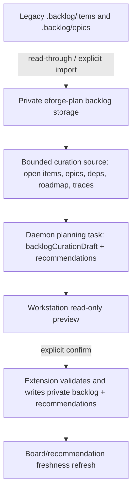

# Migrate eforge-plan backlog storage and add analyze-all curation

## Problem / Motivation

`eforge-plan` is intended to replace the legacy Pi backlog workflow, but two parity blockers remain:

- Backlog item and epic Markdown records are still canonical under project-root `.backlog/items` and `.backlog/epics`, while recommendations, trace sidecars, and planning task workflow state already use `.eforge/storage/extensions/eforge-plan/...`.
- The workstation's current `refresh-recommendations` flow only generates a recommendation model. It does not perform the legacy `/backlog analyze-all` semantic curation pass that reviews every open item, updates statuses, dependencies, evidence, and recheck metadata, and then refreshes recommendations from the post-curation backlog state.

This keeps the legacy Pi backlog extension and `.backlog` storage semantics in the critical path before eforge-plan can become the exclusive backlog/planning surface.

## Goal

Make eforge-plan the canonical local backlog owner by moving item and epic storage to extension-private storage while preserving legacy `.backlog` read-through/import compatibility. Add a manual workstation analyze-all curation workflow that produces a structured preview, requires confirmation, applies validated backlog updates, and refreshes recommendations from post-curation state.

## Approach

Keep the existing boundary: the engine/daemon runs a read-only single-shot planning task; the trusted extension owns validation and side effects.

Key implementation decisions:

- Canonical item storage moves to `.eforge/storage/extensions/eforge-plan/backlog/items/<id>.md`.
- Canonical epic storage moves to `.eforge/storage/extensions/eforge-plan/backlog/epics/<id>.md`.
- Existing Markdown/frontmatter schemas and safe-id/path-containment checks are preserved.
- Legacy `.backlog/items` and `.backlog/epics` records are compatibility input only.
- Private records take precedence over legacy records with the same ID.
- Writes from capture, update, upsert, promote, and curation target only private storage.
- Legacy files are not deleted or rewritten by default.
- Storage migration is implemented inside eforge-plan storage helpers rather than scattered path rewrites.
- Curation is applied from a structured generated patch, not free-form Markdown and not live agent tool calls.
- The curation patch carries precondition data, such as source fingerprint and/or expected current `updated`/body hash values, to fail safely when records changed after task start.
- Low-noise curation mirrors legacy guidance.
- When an item is still valid and materially unchanged, curation updates only `last_checked` and `stale_after`.
- Evidence is added only for durable signal such as shipped, superseded, stale decisions, blocker/dependency changes, claim changes, or meaningful implementation state.
- Recommendation freshness is computed after curation writes.
- If references or preconditions fail, recommendations remain unchanged and a validation error is surfaced.
- Future scheduled/stale-triggered execution can call the same start/apply primitives later, but this slice implements only manual workstation initiation and confirmation.
- The curation workflow reuses durable planning task infrastructure instead of introducing raw extension-owned HTTP routes, direct Console APIs, mutation-capable agent tools, or scheduler logic.

Likely implementation areas:

- `eforge/extensions/eforge-plan/markdown-store.ts`: introduce canonical private storage path helpers, legacy path helpers, merged private+legacy listing, explicit import/copy helpers, and write-only-private behavior.
- `eforge/extensions/eforge-plan/backlog-domain.ts` and `eforge/extensions/eforge-plan/schema.ts`: add curation patch/domain schemas needed for structured item/epic updates while preserving existing backlog status/type exports.
- `eforge/extensions/eforge-plan/index.ts`: update capture/update/upsert/promote/input-source descriptions and paths, register any new import/analyze actions, and add workstation allowed actions.
- `eforge/extensions/eforge-plan/recommendation-status.ts`, `eforge/extensions/eforge-plan/planner-orchestration.ts`, `eforge/extensions/eforge-plan/recommendation-refresh.ts`, `eforge/extensions/eforge-plan/agent-task-actions.ts`, and `eforge/extensions/eforge-plan/planning-task-workflow-store.ts`: include private backlog storage in fingerprints/context, add curation task start/reuse/apply flow, and keep recommendation freshness correct after curation mutations.
- `packages/client/src/extension-agent-tasks.ts` and `packages/engine/src/agents/extension-planning-task.ts`: add a typed requested output section/result field for a curation draft, update the custom tool schema, and keep invalid generated output fail-closed.
- `eforge/extensions/eforge-plan/workstation-src/plans/src/**`: update types, mock data, bridge cases, planning task workflow hook, result preview, recommendations/backlog panels, and task card labels for curation tasks.
- `eforge/extensions/eforge-plan/workstation-assets/plans/*`: rebuild bundled workstation assets.
- `eforge/extensions/eforge-plan/__tests__/`: add tests for storage migration and curation behavior.
- Client/engine schema tests: cover planning task validation.
- `eforge/extensions/eforge-plan/README.md`: document the new storage model and analyze-all workflow.
- README contract tests: update assertions that currently treat `.backlog/items` and `.backlog/epics` as canonical storage.

Assumptions:

- The product direction is to make eforge-plan the canonical local backlog owner, not to maintain two writable stores.
- A confirmed apply step is acceptable for safety even though the legacy Pi prompt mutated records during the agent turn.
- The first slice should design for future automation but not implement scheduling or unattended apply.

Risks:

- Storage migration can hide or duplicate user backlog records if private/legacy merge precedence is wrong.
- Applying a stale curation result could overwrite user edits; use source fingerprints or per-record preconditions and fail closed.
- Large schema/UI changes touch several packages; keep diffs bounded and maintain file-size/region-marker discipline.
- Generated curation may hallucinate dependencies or shipped evidence; validate references structurally and require concise rationale/evidence for substantive changes.
- Recommendation freshness can be misleading if recommendations are recorded before curation writes; compute freshness after curation writes or report stale drift explicitly.
- Workstation bundle drift is easy to miss; rebuild assets and keep source, fixtures, and bundle contract tests aligned.

## Scope

In scope:

- Store backlog items under `.eforge/storage/extensions/eforge-plan/backlog/items/<id>.md`.
- Store backlog epics under `.eforge/storage/extensions/eforge-plan/backlog/epics/<id>.md`.
- Preserve the existing Markdown/frontmatter schema.
- Preserve safe-id/path-containment checks.
- Add read-through compatibility for existing `.backlog/items` records.
- Add read-through compatibility for existing `.backlog/epics` records.
- Add explicit import/copy behavior for legacy item and epic records.
- Keep private records authoritative when private and legacy records have duplicate IDs.
- Keep legacy records as a compatibility source.
- Do not delete legacy records automatically.
- Update all eforge-plan actions to use migrated storage helpers.
- Update board projections to use migrated storage helpers.
- Update promotion/input-source reads to use migrated storage helpers.
- Update recommendation fingerprints to use migrated storage helpers.
- Update lifecycle projections to use migrated storage helpers.
- Update planner context to use migrated storage helpers.
- Add an explicit action such as `analyze-all-backlog`.
- Start or reuse a daemon-owned planning task for the current curation source fingerprint.
- Request a structured backlog curation draft plus recommendations from the task.
- Extend the planning task workflow index with a `backlog-curation` purpose.
- Allow the Plan with AI monitor to label, retry, redraft, cancel, remove, and apply `backlog-curation` tasks like recommendation refresh tasks.
- Add an explicit apply path that validates the curation draft.
- Allow curation apply to update item/epic status, priority, tags, dependencies, epic links, `last_checked`, `stale_after`, and concise Markdown section changes.
- Write the private recommendation model when recommendations are included in the validated curation result.
- Surface the flow in the Backlog workstation with a clear “Analyze all backlog” control.
- Surface a read-only preview before mutation.
- Require two-step confirmation before applying changes.
- Update `eforge/extensions/eforge-plan/README.md` to describe private item/epic storage under `.eforge/storage/extensions/eforge-plan/backlog/...`.
- Update `eforge/extensions/eforge-plan/README.md` to describe legacy `.backlog/items` and `.backlog/epics` compatibility/import semantics.
- Update `eforge/extensions/eforge-plan/README.md` to describe analyze-all curation action(s), task monitor behavior, preview/apply confirmation, and non-goals.
- Update `eforge/extensions/eforge-plan/README.md` to describe recommendation freshness after curation.
- Update `eforge/extensions/eforge-plan/README.md` to state that curation does not enqueue builds.
- Update `eforge/extensions/eforge-plan/README.md` to state that curation does not mark items shipped without evidence.
- Update README contract tests that currently assert `.backlog/items` or `.backlog/epics` as canonical storage.
- Keep existing documentation of `.backlog/recommendations.json` as unsupported legacy recommendation storage unless that behavior is explicitly changed.

Out of scope:

- Deleting `.backlog`.
- Retiring the Pi extension.
- Automatic scheduled execution.
- Automatic stale-triggered execution.
- Unattended mutation.
- Build enqueueing.
- Queue orchestration.
- Plan-set generation from recommendations.
- Changes to the core Console Plans surface.

## Acceptance Criteria

- Backlog item canonical paths resolve under `.eforge/storage/extensions/eforge-plan/backlog/items`.
- Backlog epic canonical paths resolve under `.eforge/storage/extensions/eforge-plan/backlog/epics`.
- Backlog item canonical paths do not resolve under `.backlog/items`.
- Backlog epic canonical paths do not resolve under `.backlog/epics`.
- Storage helpers preserve the existing Markdown/frontmatter schema.
- Storage helpers enforce safe-id checks.
- Storage helpers enforce path-containment checks.
- List/read storage flows expose existing `.backlog/items` records when no same-ID private item exists.
- List/read storage flows expose existing `.backlog/epics` records when no same-ID private epic exists.
- Private item records override legacy item records with the same ID.
- Private epic records override legacy epic records with the same ID.
- Board projections include visible private and compatible legacy backlog records.
- Planner context includes visible private and compatible legacy backlog records.
- Promotion reads include visible private and compatible legacy backlog records.
- Input-source reads include visible private and compatible legacy backlog records.
- Lifecycle projections use the migrated storage helpers.
- Recommendation fingerprints include canonical private backlog storage.
- Capture writes create or update private storage records only.
- Update writes create or update private storage records only.
- Upsert writes create or update private storage records only.
- Promote writes create or update private storage records only.
- Curation apply writes create or update private storage records only.
- Capture/update/upsert/promote/curation writes do not create `.backlog/items` files.
- Capture/update/upsert/promote/curation writes do not create `.backlog/epics` files.
- Compatibility import copies legacy item records into private storage.
- Compatibility import copies legacy epic records into private storage.
- Compatibility import does not delete legacy item files.
- Compatibility import does not delete legacy epic files.
- Compatibility import does not duplicate private IDs.
- The Backlog workstation exposes a manual “Analyze all backlog” control.
- The analyze-all control invokes an explicit action such as `analyze-all-backlog`.
- The analyze-all action starts a daemon-owned planning task for the current curation source fingerprint when no reusable task exists.
- The analyze-all action reuses a daemon-owned planning task for the current curation source fingerprint when a reusable task exists.
- The analyze-all action does not enqueue builds.
- The planning task workflow index supports the `backlog-curation` purpose.
- The Plan with AI monitor labels `backlog-curation` tasks.
- The Plan with AI monitor supports retry for `backlog-curation` tasks.
- The Plan with AI monitor supports redraft for `backlog-curation` tasks.
- The Plan with AI monitor supports cancel for `backlog-curation` tasks.
- The Plan with AI monitor supports remove for `backlog-curation` tasks.
- The Plan with AI monitor supports apply for `backlog-curation` tasks.
- The planning task request can ask for a structured backlog curation draft.
- The planning task request can ask for recommendations alongside the curation draft.
- The extension planning task custom tool schema includes the curation draft result field.
- Malformed curation task results are rejected before persistence.
- Invalid generated output fails closed.
- Completed curation tasks render a read-only preview of proposed item changes before mutation.
- Completed curation tasks render a read-only preview of proposed epic changes before mutation.
- Completed curation tasks render a read-only preview of no-op rechecks before mutation.
- Completed curation tasks render a read-only preview of skipped cases before mutation.
- Completed curation tasks render a read-only preview of needs-input cases before mutation.
- Completed curation tasks render a read-only preview of generated recommendations before mutation.
- Applying a curation draft requires two explicit confirmation steps.
- Applying a curation draft validates item IDs before writing.
- Applying a curation draft validates epic IDs before writing.
- Applying a curation draft validates dependencies before writing.
- Applying a curation draft validates statuses before writing.
- Applying a curation draft validates preconditions before writing.
- The curation patch schema carries source fingerprint or expected current `updated`/body hash precondition data.
- Applying a stale curation result fails without writing backlog record changes.
- Reference validation failures leave the previous recommendation model unchanged.
- Precondition validation failures leave the previous recommendation model unchanged.
- Reference or precondition validation failures surface a validation error.
- Applying curation can update supported `status` fields for items and epics.
- Applying curation can update supported `priority` fields for items and epics.
- Applying curation can update supported `tags` fields for items and epics.
- Applying curation can update supported `depends_on` fields for items and epics.
- Applying curation can update supported `epic` links for items and epics.
- Applying curation can update supported `last_checked` fields for items and epics.
- Applying curation can update supported `stale_after` fields for items and epics.
- Applying curation can update concise Markdown body sections for items and epics.
- Low-noise curation updates materially unchanged items only through `last_checked` and `stale_after`.
- Curation adds Evidence only for durable signal such as shipped decisions, superseded decisions, stale decisions, blocker/dependency changes, claim changes, or meaningful implementation state.
- Applying curation plus recommendations writes the private recommendation model when recommendations are included.
- Applying curation plus recommendations writes the recommendation status sidecar consistently with the post-apply backlog fingerprint.
- Recommendation freshness is computed after curation writes.
- Recommendation-only refresh behavior remains unchanged.
- Recommendation-only refresh continues to use private recommendation storage.
- Existing backlog status/type exports remain available after adding curation schemas.
- Action descriptions and paths for capture, update, upsert, promote, and input-source flows reference private backlog storage.
- Workstation source types support curation task payloads.
- Workstation mock data includes curation task examples.
- Workstation bridge cases handle curation actions.
- The workstation planning task workflow hook handles the `backlog-curation` purpose.
- Workstation result preview renders curation results.
- Workstation recommendations and backlog panels handle curation state.
- Workstation task cards label curation tasks.
- Bundled workstation assets under `eforge/extensions/eforge-plan/workstation-assets/plans/*` are rebuilt from source.
- Unit tests verify private and legacy path resolution.
- Unit tests verify merged private+legacy listing.
- Unit tests verify duplicate precedence.
- Unit tests verify explicit import behavior.
- Unit tests verify write-only-private behavior.
- Action-runtime tests verify analyze-all task start metadata.
- Action-runtime tests verify analyze-all task reuse metadata.
- Action-runtime tests verify curation apply validation.
- Action-runtime tests verify recommendation freshness after curation.
- Action-runtime tests verify that analyze-all curation makes no build queue calls.
- Schema tests prove malformed curation task results are rejected before persistence.
- Workstation source/bundle tests prove curation actions are invoked only through `window.eforge.invokeAction`.
- Workstation source/bundle tests prove curation flow does not use raw `fetch`.
- Workstation source/bundle tests prove curation flow does not import private Console APIs.
- Workstation source/bundle tests prove storage paths do not leak in the bundle.
- `eforge/extensions/eforge-plan/README.md` describes private item and epic storage.
- `eforge/extensions/eforge-plan/README.md` describes legacy compatibility and import behavior.
- `eforge/extensions/eforge-plan/README.md` describes analyze-all curation actions.
- `eforge/extensions/eforge-plan/README.md` describes task monitor behavior.
- `eforge/extensions/eforge-plan/README.md` describes preview/apply confirmation.
- `eforge/extensions/eforge-plan/README.md` describes curation non-goals.
- `eforge/extensions/eforge-plan/README.md` describes recommendation freshness after curation.
- `eforge/extensions/eforge-plan/README.md` states that curation does not enqueue builds.
- `eforge/extensions/eforge-plan/README.md` states that curation does not mark items shipped without evidence.
- README documentation keeps `.backlog/recommendations.json` documented as unsupported legacy recommendation storage unless that behavior is explicitly changed.
- README contract tests no longer assert `.backlog/items` as canonical item storage.
- README contract tests no longer assert `.backlog/epics` as canonical epic storage.
- `pnpm build:eforge-plan-workstation` exits 0.
- `pnpm type-check` exits 0.
- `pnpm test` exits 0.
- `pnpm maintainability:check` exits 0.

## Manual Verification Notes

- Manually exercise the workstation mock.
- If practical, manually exercise daemon-backed dev mode against a project containing both private and legacy backlog records.