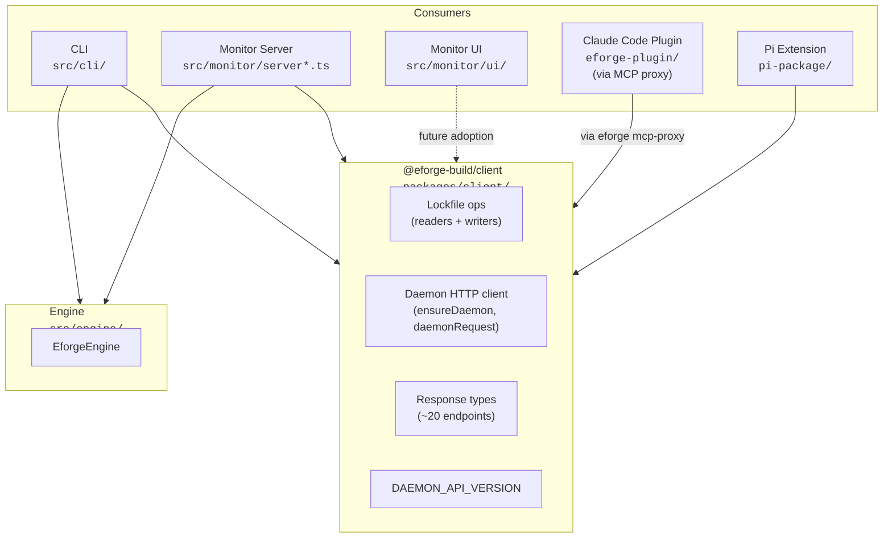

# Extract `@eforge-build/client` package to eliminate MCP proxy / Pi extension duplication

## Problem / Motivation

The daemon HTTP client code is duplicated across two consumers:

- `src/cli/mcp-proxy.ts` (794 lines) implements the daemon tool surface as MCP tools for the Claude Code plugin.
- `pi-package/extensions/eforge/index.ts` (854 lines) implements the same surface as Pi-native tools.

The Pi extension **hand-inlines** copies of `readLockfile`, `isPidAlive`, `isServerAlive`, `ensureDaemon`, `daemonRequest`, and all associated constants (~155 lines), with an explicit comment acknowledging the duplication:

```ts
// Daemon client — inlined from the canonical sources below.
// If the daemon HTTP API changes, update this code to match.
//   src/cli/daemon-client.ts   (ensureDaemon, daemonRequest, daemonRequestWithPort)
//   src/monitor/lockfile.ts    (readLockfile, isPidAlive, isServerAlive, LockfileData)
```

`AGENTS.md` encodes manual sync discipline: *"Keep `eforge-plugin/` (Claude Code) and `pi-package/` (Pi) in sync."* This is a sync-discipline tax. Version skew observability (the blocked `2026-04-07-daemon-version-health-endpoint` roadmap item) is a bandage - the fix is to make the two consumers share code.

The Pi extension cannot `import from 'eforge'` because:

1. The root `eforge` package exports only the engine (via `exports` in `package.json`).
2. The engine drags in heavy dependencies: `@anthropic-ai/claude-agent-sdk`, `@mariozechner/pi-agent-core`, `langfuse`, `@modelcontextprotocol/sdk`, etc.
3. `eforge-pi` wants to stay lightweight and peer-depends only on `@mariozechner/pi-coding-agent`, `pi-ai`, `pi-tui`, and `typebox`.

There is no small, zero-dep surface to import the daemon client from. Extracting a tiny client package solves that.

Additionally, two daemon HTTP endpoints are dead code with zero callers:
- `POST /api/run` (`src/monitor/server.ts:753-776`)
- `POST /api/queue/run` (`src/monitor/server.ts:805-819`)

## Goal

Extract a new zero-dependency TypeScript package (`@eforge-build/client`) containing the daemon HTTP client, lockfile operations, response types for all live endpoints, and a `DAEMON_API_VERSION` constant - eliminating all inlined duplication between the MCP proxy and Pi extension, establishing the first contract package in the repository, and unblocking the daemon version health endpoint roadmap item.

## Approach

### Key Design Decisions

1. **Publish as a standalone scoped npm package (`@eforge-build/client`)** - most orthodox approach, clearest contract, makes version skew a first-class dependency concern. The `@eforge-build` npm organization is user-owned and currently unused; this package is born into it so the scope is validated for future migrations. Other options considered and rejected:
   - *Internal/bundled (private workspace package):* less clean for Pi extension resolution, tooling-assisted imports.
   - *Subpath export under root `eforge` package:* depending on `eforge` still pulls all heavy engine deps into `node_modules` at install time.

2. **Client only in v1 (not shared tool registry)** - the package exports lockfile ops, daemon HTTP client, response types, and `DAEMON_API_VERSION`. Both consumers still declare their own tool lists (MCP Zod vs. Pi TypeBox). This eliminates ~200 lines of duplication (inlined client) but keeps ~400 lines of tool-definition duplication. Smaller blast radius; easier to land; unblocks the health endpoint. Shared tool registry deferred to a follow-up roadmap item requiring its own schema-library discussion.

3. **Package lives at `packages/client/`** - matches the roadmap's stated monorepo direction. `pnpm-workspace.yaml` gains `packages/*` glob so future extracted packages slot in naturally.

4. **`pi-package/` joins the workspace** - required for local `workspace:*` resolution so the Pi extension can `import from '@eforge-build/client'` during development, type-check, and tests. The publish staging script (`scripts/prepare-pi-package-publish.mjs`) gains a `workspace:*` -> concrete version rewrite step.

5. **Type every live daemon HTTP endpoint (~20 after dead endpoint removal)** - the monitor UI has its own hand-cast types today; it can adopt `@eforge-build/client` types in a follow-up. The small extra cost of typing endpoints the MCP proxy / Pi extension don't call today creates a stable foundation for monitor UI adoption later.

6. **Version lock-step with `eforge` root** - publish `@eforge-build/client@x.y.z` with the exact same version as the root package. Single release coordination point. The staging script reads `rootPackage.version` and writes it into both packages.

7. **Writer lockfile functions move into the client package alongside readers** - the lockfile format is a wire-protocol contract; keeping writers and readers together makes the format invariant a single-file concern.

8. **Delete old source files rather than leaving compat shims** - atomic change, single repo, all callers controlled.

9. **`EforgeEvent` stays in `src/engine/events.ts`** - it imports engine internals (`./config.js`, `./review-heuristics.js`, Zod schemas). Moving it would drag engine internals across the package boundary. SSE consumers continue parsing with `Record<string, unknown>`. Captured as a follow-up roadmap item.

10. **`/api/config/show` response typed as opaque `unknown`** - the full `EforgeConfig` type has deep engine dependencies. Callers can cast when they need specific fields.

11. **Dead endpoints removed, not typed** - `POST /api/run` and `POST /api/queue/run` have zero callers.

12. **Build order: `@eforge-build/client` builds first** via explicit `pnpm --filter @eforge-build/client build` before root `tsup`.

13. **Zero runtime dependencies** - only Node builtins (`node:fs`, `node:path`, `node:crypto`, global `fetch`).

14. **tsup as build tool** - consistency with root package.

15. **Roadmap updates ship in this PRD** - captures discoveries made during planning before they're lost.

### Current Callers of Soon-to-be-Extracted Code

**`src/monitor/lockfile.ts` (136 lines) exports:**
- Types: `LockfileData`, `LOCKFILE_NAME`
- Readers: `readLockfile`, `isPidAlive`, `isServerAlive`, `lockfilePath`
- Writers: `writeLockfile`, `removeLockfile`, `updateLockfile`, `killPidIfAlive`

Reader callers (client-side):
- `src/cli/index.ts:22`
- `src/cli/daemon-client.ts:8`
- `src/cli/mcp-proxy.ts:16`
- `pi-package/extensions/eforge/index.ts` (inlined copies)
- `test/monitor-shutdown.test.ts:12,31`

Writer callers (daemon-side):
- `src/monitor/server-main.ts:18`

**`src/cli/daemon-client.ts` (100 lines) exports:**
- Constants: `DAEMON_START_TIMEOUT_MS`, `DAEMON_POLL_INTERVAL_MS`
- Helpers: `sleep`, `ensureDaemon`, `daemonRequest`, `daemonRequestIfRunning`

Callers:
- `src/cli/mcp-proxy.ts:15`
- `src/cli/index.ts:258` (dynamic import)
- `pi-package/extensions/eforge/index.ts` (inlined copies)

### Daemon HTTP API Surface (for typing)

| Method | Path | Notes |
|---|---|---|
| POST | `/api/keep-alive` | |
| POST | `/api/enqueue` | |
| POST | `/api/cancel/:id` | |
| POST | `/api/daemon/stop` | |
| GET | `/api/auto-build` | |
| POST | `/api/auto-build` | |
| GET | `/api/project-context` | |
| GET | `/api/health` | Target of the blocked roadmap item |
| GET | `/api/config/show` | |
| GET | `/api/config/validate` | |
| GET | `/api/queue` | |
| GET | `/api/session-metadata` | |
| GET | `/api/runs` | |
| GET | `/api/latest-run` | |
| GET | `/api/events/:runId` | SSE - not typed in this PRD |
| GET | `/api/orchestration/:id` | |
| GET | `/api/run-summary/:id` | |
| GET | `/api/run-state/:id` | |
| GET | `/api/plans/...` | |
| GET | `/api/diff/...` | |

Dead (to be removed): `POST /api/run`, `POST /api/queue/run`

### Architecture After



### Package Boundaries After

- `@eforge-build/client` (published): daemon wire protocol - lockfile, HTTP client, response types, `DAEMON_API_VERSION`. Zero runtime deps.
- `eforge` (published): engine + CLI + monitor + MCP proxy + daemon. **Depends on `@eforge-build/client`.**
- `eforge-pi` (published): Pi extension. **Depends on `@eforge-build/client`.**
- `monitor-ui` (private workspace): React app.
- Workspace members: `packages/*`, `src/monitor/ui`, `pi-package`.

### Contract Boundary Semantics

- **`@eforge-build/client` is the authority on the daemon wire protocol.** HTTP request shapes, response types, lockfile format, and `DAEMON_API_VERSION` live here.
- **The daemon server (`src/monitor/server.ts`) implements this contract** but does not import from the client package - it's the other side of the wire.
- **Runtime consumers (CLI, MCP proxy, Pi extension) import the client package** to talk to the daemon.
- **Tests depend on the client package** via workspace linking.

### Release Semantics

- `@eforge-build/client` starts at `0.1.0` and is published in lock-step with the root `eforge` version.
- `DAEMON_API_VERSION` is the integer handshake between running daemon and client library. Incremented only on breaking wire-protocol changes. No enforcement in v1.
- `eforge-pi` inherits the root version via the staging script (existing behavior). Its dependency on `@eforge-build/client` is pinned to the matching root version at publish time.

### Suggested Plan Decomposition

1. **Plan 1 - Create `@eforge-build/client` package and migrate callers**
   - Create `packages/client/` with all files.
   - Expand `pnpm-workspace.yaml`.
   - Add `@eforge-build/client` to root `dependencies`.
   - Update root `build` script.
   - Update `src/cli/index.ts`, `src/cli/mcp-proxy.ts`, `src/monitor/server-main.ts`, `test/monitor-shutdown.test.ts`.
   - Delete `src/monitor/lockfile.ts` and `src/cli/daemon-client.ts`.
   - Verify: `pnpm install`, `pnpm build`, `pnpm type-check`, `pnpm test` all green.

2. **Plan 2 - Add pi-package to workspace and migrate the Pi extension** (depends on Plan 1)
   - Add `pi-package` to `pnpm-workspace.yaml`.
   - Update `pi-package/package.json` to add `@eforge-build/client` as a workspace dependency.
   - Rewrite `pi-package/extensions/eforge/index.ts` to import from `@eforge-build/client` and delete the inlined block.
   - Update `scripts/prepare-pi-package-publish.mjs` to rewrite `workspace:*` -> concrete version.
   - Verify: `pnpm install`, `pnpm --filter eforge-pi type-check`, `node scripts/prepare-pi-package-publish.mjs` produces clean staged directory with no `workspace:*` leakage.

3. **Plan 3 - Remove dead endpoints and update docs** (depends on Plan 1, independent of Plan 2)
   - Delete `POST /api/run` and `POST /api/queue/run` handlers from `src/monitor/server.ts`.
   - Update `docs/roadmap.md`: add seven new Integration & Maturity items, modify the Monorepo item.
   - Update `AGENTS.md`: amend sync convention, add `@eforge-build/client` convention.
   - Update `docs/architecture.md`: add sentence to Pi Package section, add node to Mermaid diagram.
   - Verify: `pnpm test` still green, no doc cross-references broken.

## Scope

### In Scope

1. **Create `packages/client/` as a new pnpm workspace member**
   - `packages/client/package.json` with `"name": "@eforge-build/client"`, `"version": "0.1.0"`, `"type": "module"`, ESM-only exports.
   - Zero runtime dependencies. Node builtins only.
   - `packages/client/tsconfig.json` + `packages/client/tsup.config.ts` for build.
   - `packages/client/src/index.ts` as the barrel export.

2. **Move client-side code into the new package** from `src/monitor/lockfile.ts` and `src/cli/daemon-client.ts`:
   - Types: `LockfileData`
   - Lockfile readers: `readLockfile`, `isPidAlive`, `isServerAlive`, `lockfilePath`
   - Lockfile writers: `writeLockfile`, `updateLockfile`, `removeLockfile`, `killPidIfAlive`
   - Constants: `LOCKFILE_NAME`, `DAEMON_START_TIMEOUT_MS`, `DAEMON_POLL_INTERVAL_MS`
   - HTTP client: `sleep`, `ensureDaemon`, `daemonRequest`, `daemonRequestIfRunning`

3. **Introduce `DAEMON_API_VERSION` constant**
   - Initial value `1`.
   - Exported from `@eforge-build/client`.
   - Unblocks the `2026-04-07-daemon-version-health-endpoint` session.

4. **Add TypeScript response types for every live daemon HTTP endpoint** (~20 endpoints):

   | Endpoint | Response type |
   |---|---|
   | `GET /api/health` | `HealthResponse` |
   | `GET /api/auto-build` / `POST /api/auto-build` | `AutoBuildState` |
   | `GET /api/project-context` | `ProjectContext` |
   | `GET /api/config/show` | `ConfigShowResponse` (typed as `unknown` initially) |
   | `GET /api/config/validate` | `ConfigValidateResponse` |
   | `GET /api/queue` | `QueueItem[]` |
   | `GET /api/session-metadata` | `Record<string, SessionMetadata>` |
   | `GET /api/runs` | `RunInfo[]` |
   | `GET /api/latest-run` | `LatestRunResponse` |
   | `GET /api/orchestration/:id` | `OrchestrationResponse` |
   | `GET /api/run-summary/:id` | `RunSummary` |
   | `GET /api/run-state/:id` | `RunState` |
   | `GET /api/plans/:id` | `PlansResponse` |
   | `GET /api/diff/:sessionId/:planId` | `DiffResponse` |
   | `POST /api/enqueue` | `EnqueueResponse` |
   | `POST /api/cancel/:id` | `CancelResponse` |
   | `POST /api/daemon/stop` | `StopDaemonResponse` |
   | `POST /api/keep-alive` | `{ status: 'ok' }` |
   | `GET /api/events/:runId` (SSE) | **not typed in this PRD** |

   Types defined in `packages/client/src/types.ts`, re-exported from the barrel. Shapes derived by reading handler implementations in `src/monitor/server.ts`.

5. **Delete the old source files** once callers are migrated:
   - Delete `src/monitor/lockfile.ts` (136 lines)
   - Delete `src/cli/daemon-client.ts` (100 lines)

6. **Update all callers to import from `@eforge-build/client`**:
   - `src/cli/index.ts:22` - replace `from '../monitor/lockfile.js'` with `from '@eforge-build/client'`
   - `src/cli/mcp-proxy.ts:15-16` - replace both imports
   - `src/monitor/server-main.ts:18` - replace import
   - `test/monitor-shutdown.test.ts:10-13, 31` - replace imports and update `vi.mock` target

7. **Rewrite `pi-package/extensions/eforge/index.ts` to use the new package**
   - Delete the inlined client block (lines 17-172, ~155 lines removed)
   - Add `import { ... } from '@eforge-build/client'` at top
   - Delete the "If the daemon HTTP API changes, update this code to match" comment
   - Replace hand-cast `as unknown as { ... }` on daemon response bodies with properly typed responses

8. **Workspace changes**
   - `pnpm-workspace.yaml` expanded to:
     ```yaml
     packages:
       - "packages/*"
       - "src/monitor/ui"
       - "pi-package"
     ```
   - `pi-package/package.json`: add `"dependencies": { "@eforge-build/client": "workspace:*" }`
   - Root `package.json`: add `"@eforge-build/client": "workspace:*"` to `dependencies`

9. **Build pipeline updates**
   - Root `build` script updated to build `@eforge-build/client` first:
     ```
     "build": "pnpm --filter @eforge-build/client build && tsup && node --import tsx ./scripts/post-build.ts && pnpm --filter monitor-ui build && tsc -p tsconfig.build.json"
     ```
   - `tsup.config.ts`: ensure `@eforge-build/client` is **not** in the `external` array so it gets bundled into `dist/cli.js`.

10. **Update `scripts/prepare-pi-package-publish.mjs`**
    - Rewrite `workspace:*` -> concrete version for `@eforge-build/client` in the staged `package.json`. Use `rootPackage.version` for lock-step versioning.
    - Keep the staging approach (Pi package has README and extensions-dir manipulation that `pnpm publish` can't do on its own) but extend it with the version rewrite.

11. **Remove dead endpoints from `src/monitor/server.ts`**
    - Delete `POST /api/run` handler (lines 753-776)
    - Delete `POST /api/queue/run` handler (lines 805-819)
    - Update any test fixtures that reference these routes (initial grep shows none)

12. **Roadmap updates in `docs/roadmap.md`**
    - Under **Integration & Maturity**, add seven new items:
      - **Schema library unification on TypeBox** - standardize on TypeBox across the codebase. Why TypeBox over Zod: (1) TypeBox schemas *are* JSON Schema, eliminating `z.toJSONSchema()` conversion; (2) already in the dependency tree for Pi integration; (3) aligns with Pi's tool API and unblocks zero-conversion shared tool registry; (4) removes Zod as a runtime dependency. Scope: audit Zod features (discriminated unions, `.describe()`, `.safeParse()`, `z.output<typeof>`) for TypeBox equivalents. Prerequisite for shared tool registry.
      - **Shared tool registry** - factor tool definitions into `@eforge-build/client` so MCP proxy and Pi extension become thin adapters (~100 lines each). Eliminates remaining ~400 lines of cross-package duplication. Depends on schema library unification.
      - **Typed SSE events in client package** - extract `EforgeEvent` wire-protocol types from `src/engine/events.ts` into `@eforge-build/client`. Requires decoupling from engine-internal imports. Three implementation options: (a) extract minimal wire-protocol event union, (b) move whole type hierarchy with transitive deps, (c) define structural types in client with conversion helper in engine.
      - **Pi extension SSE event streaming** - add SSE subscriber to Pi extension and surface events via Pi `ExtensionAPI` channel. Can ship with untyped events and adopt typed events later.
      - **npm scope migration to `@eforge-build`** - republish `eforge` as `@eforge-build/cli` and `eforge-pi` as `@eforge-build/pi-extension`. Deprecate old names with `npm deprecate`. Requires major version bump. Should land after broader workspace/monorepo migration.
      - **Monitor UI client adoption** - port `src/monitor/ui/src/lib/api.ts` to import response types from `@eforge-build/client`. Includes properly typing `/api/config/show` response (requires extracting `EforgeConfig` wire-protocol subset or narrowing engine imports).
      - **TypeScript project references for workspace packages** - adopt `tsconfig.json` `references` across workspace members for automatic topological ordering. Low priority.
    - Modify the existing **Monorepo** item:
      > **Monorepo** - Extend pnpm workspaces (currently monitor UI, `@eforge-build/client`, and pi-package) so the engine, eforge-plugin, and marketing site each get their own package with isolated deps and build configs.

13. **`AGENTS.md` update**
    - Amend the "Keep `eforge-plugin/` and `pi-package/` in sync" convention to scope it to skills / commands / user-facing behavior only (daemon client code duplication no longer applies).
    - Add convention: *Daemon HTTP client and response types live in `@eforge-build/client` (`packages/client/`). Do not inline lockfile or daemon-request helpers in the CLI, MCP proxy, Pi extension, or anywhere else - import them from the shared package. Bump `DAEMON_API_VERSION` in `packages/client/src/index.ts` when making breaking changes to the HTTP API surface.*

14. **`docs/architecture.md` update**
    - Add sentence to the **Pi Package** section: *"Both the Pi extension and the Claude Code MCP proxy use `@eforge-build/client` (`packages/client/`) for the daemon HTTP client and response types - a zero-dep TypeScript package that is the canonical source for the daemon wire protocol."*
    - Add `packages/client/` as a new node in the Mermaid system-layer diagram between Consumers and Engine.

### New Files

```
packages/client/
├── package.json            # @eforge-build/client, 0.1.0, ESM, zero runtime deps
├── tsconfig.json           # extends root, outDir: dist, declaration: true
├── tsup.config.ts          # ESM, dts: true, target: node22
├── README.md               # brief description + "internal package, prefer consuming via eforge/eforge-pi"
└── src/
    ├── index.ts            # barrel export
    ├── lockfile.ts         # moved from src/monitor/lockfile.ts
    ├── daemon-client.ts    # moved from src/cli/daemon-client.ts
    ├── api-version.ts      # DAEMON_API_VERSION = 1
    └── types.ts            # response types for all live endpoints
```

### Modified Files

| File | Change |
|---|---|
| `package.json` (root) | Add `"@eforge-build/client": "workspace:*"` to dependencies. Update `build` script to build client first. |
| `pnpm-workspace.yaml` | Expand `packages` glob to include `packages/*` and `pi-package`. |
| `tsup.config.ts` | No change needed - verify `@eforge-build/client` not in `external`. |
| `tsconfig.json` | No changes expected - verify type-check still works. |
| `src/cli/index.ts` | Change import path on line 22 from `'../monitor/lockfile.js'` to `'@eforge-build/client'`. |
| `src/cli/mcp-proxy.ts` | Change imports on lines 15 and 16 to `'@eforge-build/client'`. Replace `as unknown as {...}` casts with proper types. |
| `src/monitor/server-main.ts` | Change import on line 18 from `'./lockfile.js'` to `'@eforge-build/client'`. |
| `src/monitor/server.ts` | Delete `POST /api/run` handler (lines 753-776). Delete `POST /api/queue/run` handler (lines 805-819). |
| `test/monitor-shutdown.test.ts` | Update imports (lines 10-13, 31) and `vi.mock` target from `'../src/monitor/lockfile.js'` to `'@eforge-build/client'`. |
| `pi-package/package.json` | Add `"dependencies": { "@eforge-build/client": "workspace:*" }`. |
| `pi-package/extensions/eforge/index.ts` | Delete lines 17-172, add import from `'@eforge-build/client'`, replace cast response types. |
| `scripts/prepare-pi-package-publish.mjs` | Rewrite `workspace:*` -> concrete version for `@eforge-build/client`. |
| `docs/roadmap.md` | Add seven new Integration & Maturity items; modify the Monorepo item. |
| `AGENTS.md` | Amend sync convention; add `@eforge-build/client` convention. |
| `docs/architecture.md` | Add sentence to Pi Package section; add node to Mermaid diagram. |

### Deleted Files

- `src/monitor/lockfile.ts` (136 lines)
- `src/cli/daemon-client.ts` (100 lines)

### Net Line Count (rough estimate)

- Added: ~500 lines (new package: ~150 lines moved code + ~300 lines response types + build/package config + README)
- Deleted: ~236 lines (`src/monitor/lockfile.ts` + `src/cli/daemon-client.ts`)
- Deleted from pi-package: ~155 lines (inlined block)
- Deleted dead endpoints: ~40 lines
- Net: roughly flat or slightly positive, but duplication drops dramatically and type safety increases substantially.

### Out of Scope

- **Shared tool registry** (Option Y). Follow-up roadmap item added in this PRD.
- **Moving `EforgeEvent` into the client package.** Events remain in `src/engine/events.ts`. SSE consumers continue to parse with `Record<string, unknown>`.
- **Pi extension SSE streaming.** Feature gap captured as a roadmap follow-up. This PRD only extracts what already exists.
- **Monitor UI adoption of `@eforge-build/client`.** The monitor UI's `src/monitor/ui/src/lib/api.ts` keeps its current hand-cast types. Follow-up roadmap item.
- **Migrating `eforge` and `eforge-pi` to the `@eforge-build` scope.** Follow-up roadmap item with its own deprecation plan and major version bump.
- **Typing `EforgeConfig` in the client package.** `/api/config/show` response typed as `unknown` in v1.
- **Breaking out the engine, CLI, monitor, or plugin into their own packages.** Covered by the existing Monorepo roadmap item.
- **TypeScript project references.** Rely on pnpm workspace linking + build ordering.
- **Any change to the `/api/health` response body beyond the constant.** The endpoint handler change happens in the unblocked follow-up session.

## Acceptance Criteria

### Package Creation & Structure
- [ ] `packages/client/` exists with `package.json` (`"name": "@eforge-build/client"`, `"version": "0.1.0"`, `"type": "module"`, zero runtime `dependencies`), `tsconfig.json`, `tsup.config.ts`, `README.md`, and `src/` with barrel export.
- [ ] `@eforge-build/client` is listed in `pnpm-workspace.yaml` via `packages/*` glob.
- [ ] `pnpm install` resolves the new workspace package without errors.
- [ ] `pnpm --filter @eforge-build/client build` produces ESM output with `.d.ts` declarations in `packages/client/dist/`.

### Code Migration
- [ ] `packages/client/src/lockfile.ts` contains all exports previously in `src/monitor/lockfile.ts`: `LockfileData`, `LOCKFILE_NAME`, `readLockfile`, `isPidAlive`, `isServerAlive`, `lockfilePath`, `writeLockfile`, `updateLockfile`, `removeLockfile`, `killPidIfAlive`.
- [ ] `packages/client/src/daemon-client.ts` contains all exports previously in `src/cli/daemon-client.ts`: `DAEMON_START_TIMEOUT_MS`, `DAEMON_POLL_INTERVAL_MS`, `sleep`, `ensureDaemon`, `daemonRequest`, `daemonRequestIfRunning`.
- [ ] `packages/client/src/api-version.ts` exports `DAEMON_API_VERSION = 1`.
- [ ] `src/monitor/lockfile.ts` is deleted.
- [ ] `src/cli/daemon-client.ts` is deleted.

### Response Types
- [ ] `packages/client/src/types.ts` defines TypeScript types for all live daemon HTTP endpoints: `HealthResponse`, `AutoBuildState`, `ProjectContext`, `ConfigShowResponse` (opaque `unknown`), `ConfigValidateResponse`, `QueueItem`, `SessionMetadata`, `RunInfo`, `LatestRunResponse`, `OrchestrationResponse`, `RunSummary`, `RunState`, `PlansResponse`, `DiffResponse`, `EnqueueResponse`, `Cancel# Extract `@eforge-build/client` package to eliminate MCP proxy / Pi extension duplication

## Problem / Motivation

The daemon HTTP client code is duplicated across two consumers:

- `src/cli/mcp-proxy.ts` (794 lines) implements the daemon tool surface as MCP tools for the Claude Code plugin.
- `pi-package/extensions/eforge/index.ts` (854 lines) implements the same surface as Pi-native tools.

The Pi extension **hand-inlines** copies of `readLockfile`, `isPidAlive`, `isServerAlive`, `ensureDaemon`, `daemonRequest`, and all associated constants (~155 lines), with a comment instructing future maintainers to keep the inlined code in sync with the canonical sources in `src/cli/daemon-client.ts` and `src/monitor/lockfile.ts`. `AGENTS.md` encodes this same manual discipline: "Keep `eforge-plugin/` and `pi-package/` in sync."

This is a sync-discipline tax. The inlining exists because `pi-package/` cannot `import from 'eforge'` - the root package exports only the engine, which drags in heavy dependencies (`@anthropic-ai/claude-agent-sdk`, `@mariozechner/pi-agent-core`, `langfuse`, `@modelcontextprotocol/sdk`, etc.), while `eforge-pi` needs to stay lightweight with only Pi peer dependencies. There is no small, zero-dep surface to import from.

Version-skew observability (adding `version` and `apiVersion` to `/api/health`) is a bandage over this structural problem. The root fix is making the two consumers share code via a dedicated package.

Additionally, two daemon endpoints are dead code with zero callers:
- `POST /api/run` (`src/monitor/server.ts:753-776`)
- `POST /api/queue/run` (`src/monitor/server.ts:805-819`)

## Goal

Extract a new zero-dependency TypeScript package (`@eforge-build/client`) containing the daemon HTTP client, lockfile operations, response types for all live endpoints, and the `DAEMON_API_VERSION` constant - eliminating all inlined duplication between the MCP proxy and Pi extension, and establishing the first contract package in the repository's planned monorepo transition.

## Approach

### Key design decisions

1. **Standalone scoped npm package (`@eforge-build/client`)** - not a subpath export of `eforge` (which would force `eforge-pi` to install all of `eforge`'s heavy deps) and not a private bundled-only package (which requires tooling-assisted imports in the Pi extension). The `@eforge-build` npm org is user-owned and currently unused; this package is born into it so the scope is validated for future migrations.

2. **Client-only in v1 (Option X), not client + shared tool registry (Option Y)** - the package exports lockfile ops, HTTP client helpers, response types, and `DAEMON_API_VERSION`. Both consumers still declare their own tool lists (MCP Zod vs. Pi TypeBox). This eliminates ~200 lines of duplication (the inlined client) but keeps ~400 lines of tool-definition duplication. Smaller blast radius, easier to land, directly addresses the version-skew problem. The shared tool registry is deferred to a follow-up roadmap item that depends on schema library unification (Zod → TypeBox).

3. **Package lives at `packages/client/`** - matches the existing Monorepo roadmap item direction. `pnpm-workspace.yaml` gains a `packages/*` glob so future extracted packages slot in naturally.

4. **`pi-package/` joins the pnpm workspace** - required for local `workspace:*` resolution so the Pi extension can `import from '@eforge-build/client'` during development, type-check, and tests. The publish staging script (`scripts/prepare-pi-package-publish.mjs`) gains a `workspace:*` → concrete version rewrite step.

5. **Version lock-step with `eforge` root** - `@eforge-build/client@x.y.z` publishes with the exact same `x.y.z` as the root `eforge` package. Single release coordination point. The client package has no reason to version independently in v1 - it's not consumed by external projects yet.

6. **Writer lockfile functions move alongside readers** - `writeLockfile`, `updateLockfile`, `removeLockfile`, `killPidIfAlive` all go into `@eforge-build/client`. The lockfile format is a wire-protocol contract; keeping writers and readers together makes the format invariant a single-file concern. The daemon's `src/monitor/server-main.ts` imports them from the client package.

7. **Delete old source files atomically, no compat shims** - `src/monitor/lockfile.ts` and `src/cli/daemon-client.ts` are deleted in the same change. All callers are controlled within the single repo.

8. **`EforgeEvent` stays in `src/engine/events.ts`** - it imports from engine internals (`./config.js`, `./review-heuristics.js`, Zod schemas). Moving it would drag engine internals across the package boundary. SSE consumers continue parsing with `Record<string, unknown>`. Typed SSE events are a follow-up roadmap item.

9. **`/api/config/show` response typed as opaque `unknown`** - the full `EforgeConfig` type lives in `src/engine/config.ts` with deep engine dependencies. Callers can cast when they need specific fields.

10. **Dead endpoints removed, not typed** - `POST /api/run` and `POST /api/queue/run` have zero callers.

11. **Build order: `@eforge-build/client` builds first** - explicit `pnpm --filter @eforge-build/client build` before root `tsup` in the build script. tsup bundles the client into `dist/cli.js` (not in `external`).

12. **Zero runtime dependencies** - only Node builtins (`node:fs`, `node:path`, `node:crypto`, global `fetch`).

13. **tsup as the build tool** - matches the root, produces ESM + types cleanly.

14. **Type every live endpoint (~20 after dead endpoint removal)** - not just the ones called today. The additional cost is bounded, and it creates a stable foundation for monitor UI adoption later. SSE event payloads are excluded (see decision #8).

### Response types to define

| Endpoint | Response type |
|---|---|
| `GET /api/health` | `HealthResponse` |
| `GET /api/auto-build` / `POST /api/auto-build` | `AutoBuildState` |
| `GET /api/project-context` | `ProjectContext` |
| `GET /api/config/show` | `ConfigShowResponse` (typed as `unknown` - see decision #9) |
| `GET /api/config/validate` | `ConfigValidateResponse` |
| `GET /api/queue` | `QueueItem[]` |
| `GET /api/session-metadata` | `Record<string, SessionMetadata>` |
| `GET /api/runs` | `RunInfo[]` |
| `GET /api/latest-run` | `LatestRunResponse` |
| `GET /api/orchestration/:id` | `OrchestrationResponse` |
| `GET /api/run-summary/:id` | `RunSummary` |
| `GET /api/run-state/:id` | `RunState` |
| `GET /api/plans/:id` | `PlansResponse` |
| `GET /api/diff/:sessionId/:planId` | `DiffResponse` |
| `POST /api/enqueue` | `EnqueueResponse` |
| `POST /api/cancel/:id` | `CancelResponse` |
| `POST /api/daemon/stop` | `StopDaemonResponse` |
| `POST /api/keep-alive` | `{ status: 'ok' }` |
| `GET /api/events/:runId` (SSE) | **not typed in this PRD** |

### Current callers being migrated

**`src/monitor/lockfile.ts` (136 lines) exports** - Types: `LockfileData`, `LOCKFILE_NAME`. Readers: `readLockfile`, `isPidAlive`, `isServerAlive`, `lockfilePath`. Writers: `writeLockfile`, `removeLockfile`, `updateLockfile`, `killPidIfAlive`.

Reader callers (client-side):
- `src/cli/index.ts:22` - `readLockfile`, `isServerAlive`, `isPidAlive`, `killPidIfAlive`, `lockfilePath`, `removeLockfile`
- `src/cli/daemon-client.ts:8` - `readLockfile`, `isServerAlive`
- `src/cli/mcp-proxy.ts:16` - `readLockfile`
- `pi-package/extensions/eforge/index.ts` - inlined copies
- `test/monitor-shutdown.test.ts:12,31` - most exports

Writer callers (daemon-side):
- `src/monitor/server-main.ts:18` - `writeLockfile`, `removeLockfile`, `updateLockfile`, `isPidAlive`, `readLockfile`, `isServerAlive`

**`src/cli/daemon-client.ts` (100 lines) exports** - Constants: `DAEMON_START_TIMEOUT_MS`, `DAEMON_POLL_INTERVAL_MS`. Helpers: `sleep`, `ensureDaemon`, `daemonRequest`, `daemonRequestIfRunning`.

Callers:
- `src/cli/mcp-proxy.ts:15` - all of the above
- `src/cli/index.ts:258` - `ensureDaemon`, `daemonRequest` (dynamic import)
- `pi-package/extensions/eforge/index.ts` - inlined copies

### Suggested plan decomposition

**Plan 1 - Create `@eforge-build/client` package and migrate callers**
- Create `packages/client/` with all files.
- Expand `pnpm-workspace.yaml`.
- Add `@eforge-build/client` to root `dependencies`.
- Update root `build` script.
- Update `src/cli/index.ts`, `src/cli/mcp-proxy.ts`, `src/monitor/server-main.ts`, `test/monitor-shutdown.test.ts`.
- Delete `src/monitor/lockfile.ts` and `src/cli/daemon-client.ts`.
- Verify: `pnpm install`, `pnpm build`, `pnpm type-check`, `pnpm test` all green.

**Plan 2 - Add pi-package to workspace and migrate the Pi extension**
- Add `pi-package` to `pnpm-workspace.yaml`.
- Update `pi-package/package.json` to add `@eforge-build/client` as a workspace dependency.
- Rewrite `pi-package/extensions/eforge/index.ts` to import from `@eforge-build/client` and delete the inlined block.
- Update `scripts/prepare-pi-package-publish.mjs` to rewrite `workspace:*` → concrete version.
- Verify: `pnpm install`, Pi extension type-check, `node scripts/prepare-pi-package-publish.mjs` produces a clean staged directory with no `workspace:*` leakage.

**Plan 3 - Remove dead endpoints and update docs**
- Delete `POST /api/run` and `POST /api/queue/run` handlers from `src/monitor/server.ts`.
- Update `docs/roadmap.md`, `AGENTS.md`, `docs/architecture.md`.
- Verify: `pnpm test` still green, no doc cross-references broken.

Plans 2 and 3 both depend on Plan 1. Plan 3 is independent of Plan 2 (could run in parallel). Plan 2 is on the critical path because it unblocks the follow-up health-endpoint session.

## Scope

### In scope

1. **Create `packages/client/` as a new pnpm workspace member**
   - `packages/client/package.json` with `"name": "@eforge-build/client"`, `"version": "0.1.0"`, `"type": "module"`, ESM-only exports.
   - Zero runtime dependencies. Node builtins only.
   - `packages/client/tsconfig.json` + `packages/client/tsup.config.ts` for build.
   - `packages/client/src/index.ts` as the barrel export.

2. **Move client-side code into the new package** from `src/monitor/lockfile.ts` and `src/cli/daemon-client.ts`:
   - Types: `LockfileData`
   - Lockfile readers: `readLockfile`, `isPidAlive`, `isServerAlive`, `lockfilePath`
   - Lockfile writers: `writeLockfile`, `updateLockfile`, `removeLockfile`, `killPidIfAlive`
   - Constants: `LOCKFILE_NAME`, `DAEMON_START_TIMEOUT_MS`, `DAEMON_POLL_INTERVAL_MS`
   - HTTP client: `sleep`, `ensureDaemon`, `daemonRequest`, `daemonRequestIfRunning`

3. **Introduce `DAEMON_API_VERSION` constant** - initial value `1`, exported from `@eforge-build/client`. Unblocks the `2026-04-07-daemon-version-health-endpoint` session.

4. **Add TypeScript response types for every live daemon HTTP endpoint** (~20 endpoints) in `packages/client/src/types.ts`, re-exported from the barrel. Shapes derived from handler implementations in `src/monitor/server.ts`.

5. **Delete old source files**: `src/monitor/lockfile.ts` (136 lines), `src/cli/daemon-client.ts` (100 lines).

6. **Update all callers to import from `@eforge-build/client`**:
   - `src/cli/index.ts:22` - replace `from '../monitor/lockfile.js'`
   - `src/cli/mcp-proxy.ts:15-16` - replace both imports; replace `as unknown as {...}` casts with proper types
   - `src/monitor/server-main.ts:18` - replace import
   - `test/monitor-shutdown.test.ts:10-13, 31` - replace imports and `vi.mock` target

7. **Rewrite `pi-package/extensions/eforge/index.ts`** - delete inlined client block (lines 17-172, ~155 lines), add `import from '@eforge-build/client'`, delete the sync-discipline comment, replace hand-cast `as unknown as {...}` with typed responses.

8. **Workspace changes**:
   - `pnpm-workspace.yaml`: expand to `packages/*`, `src/monitor/ui`, `pi-package`
   - `pi-package/package.json`: add `"dependencies": { "@eforge-build/client": "workspace:*" }`
   - Root `package.json`: add `"@eforge-build/client": "workspace:*"` to `dependencies`

9. **Build pipeline updates** - root `build` script runs `pnpm --filter @eforge-build/client build` before root `tsup`. Ensure `@eforge-build/client` is not in tsup's `external` array so it gets bundled into `dist/cli.js`.

10. **Update `scripts/prepare-pi-package-publish.mjs`** - rewrite `workspace:*` → concrete version for `@eforge-build/client` in staged `package.json`. Use `rootPackage.version` for lock-step versioning.

11. **Remove dead endpoints from `src/monitor/server.ts`** - delete `POST /api/run` handler (lines 753-776) and `POST /api/queue/run` handler (lines 805-819).

12. **Roadmap updates in `docs/roadmap.md`** - add seven new items under **Integration & Maturity**:
    - **Schema library unification on TypeBox** - standardize on TypeBox across the codebase. TypeBox schemas are JSON Schema natively (no `z.toJSONSchema()` conversion), already in the dep tree for Pi, aligns with Pi's tool API, removes Zod as a runtime dep. Requires auditing Zod features (discriminated unions, `.describe()`, `.safeParse()`, `z.output<typeof>`) for TypeBox equivalents. Prerequisite for shared tool registry.
    - **Shared tool registry** - factor tool definitions into `@eforge-build/client` so MCP proxy and Pi extension become thin adapters (~100 lines each). Eliminates remaining ~400 lines of cross-package duplication. Depends on schema library unification.
    - **Typed SSE events in client package** - extract `EforgeEvent` wire-protocol types from `src/engine/events.ts` into `@eforge-build/client`. Requires decoupling from engine internals (`BuildStageSpec`, `ReviewProfileConfig`, `ReviewPerspective`, Zod schemas). Three options documented: (a) minimal wire-protocol event union, (b) move whole type hierarchy, (c) structural client types with conversion helper. Design deferred.
    - **Pi extension SSE event streaming** - add SSE subscriber to Pi extension for live build progress. Can ship with untyped events and adopt typed events later.
    - **npm scope migration to `@eforge-build`** - republish `eforge` as `@eforge-build/cli` and `eforge-pi` as `@eforge-build/pi-extension`. Deprecate old names. Requires major version bump.
    - **Monitor UI client adoption** - port `src/monitor/ui/src/lib/api.ts` to import response types from `@eforge-build/client`. Includes typing `/api/config/show` properly.
    - **TypeScript project references for workspace packages** - adopt `tsconfig.json` `references` across workspace members for automatic topological ordering.
    - Modify the existing **Monorepo** item to acknowledge `@eforge-build/client` as the first new workspace member: "Extend pnpm workspaces (currently monitor UI, `@eforge-build/client`, and pi-package) so the engine, eforge-plugin, and marketing site each get their own package with isolated deps and build configs."

13. **`AGENTS.md` update** - amend the "keep eforge-plugin and pi-package in sync" convention to scope it to skills/commands/user-facing behavior only. Add convention: "Daemon HTTP client and response types live in `@eforge-build/client` (`packages/client/`). Do not inline lockfile or daemon-request helpers anywhere - import them from the shared package. Bump `DAEMON_API_VERSION` in `packages/client/src/index.ts` when making breaking changes to the HTTP API surface."

14. **`docs/architecture.md` update** - add sentence to Pi Package section noting the shared client package. Add `packages/client/` node to Mermaid system-layer diagram between Consumers and Engine.

### Out of scope

- **Shared tool registry** (Option Y) - follow-up roadmap item. Requires schema library unification first.
- **Moving `EforgeEvent` into the client package** - events remain in `src/engine/events.ts`. SSE consumers continue parsing with `Record<string, unknown>`.
- **Pi extension SSE streaming** - follow-up roadmap item. This PRD extracts what already exists; it does not add new capabilities.
- **Monitor UI adoption of `@eforge-build/client`** - `src/monitor/ui/src/lib/api.ts` keeps its current hand-cast types. Follow-up roadmap item.
- **Migrating `eforge` and `eforge-pi` to the `@eforge-build` scope** - follow-up roadmap item with deprecation plan and major version bump.
- **Typing `EforgeConfig` in the client package** - `/api/config/show` response typed as `unknown` in v1.
- **Breaking out the engine, CLI, monitor, or plugin into their own packages** - covered by existing Monorepo roadmap item.
- **TypeScript project references** - follow-up roadmap item.
- **Any change to the `/api/health` response body** - the `DAEMON_API_VERSION` constant is added; the endpoint handler change happens in the unblocked follow-up session.

## Acceptance Criteria

### Package creation and structure

1. `packages/client/` exists with `package.json` (`"name": "@eforge-build/client"`, `"version": "0.1.0"`, `"type": "module"`, zero runtime dependencies), `tsconfig.json`, `tsup.config.ts`, `README.md`, and `src/` with `index.ts`, `lockfile.ts`, `daemon-client.ts`, `api-version.ts`, `types.ts`.
2. `@eforge-build/client` exports all previously-public symbols from `src/monitor/lockfile.ts` and `src/cli/daemon-client.ts`: `LockfileData`, `LOCKFILE_NAME`, `readLockfile`, `isPidAlive`, `isServerAlive`, `lockfilePath`, `writeLockfile`, `updateLockfile`, `removeLockfile`, `killPidIfAlive`, `DAEMON_START_TIMEOUT_MS`, `DAEMON_POLL_INTERVAL_MS`, `sleep`, `ensureDaemon`, `daemonRequest`, `daemonRequestIfRunning`.
3. `DAEMON_API_VERSION` is exported with value `1`.
4. TypeScript response types are exported for all ~20 live daemon HTTP endpoints (per the table in Approach). `/api/config/show` response is typed as `unknown`. SSE event payloads are not typed.

### Code migration

5. `src/monitor/lockfile.ts` and `src/cli/daemon-client.ts` are deleted.
6. `src/cli/index.ts`, `src/cli/mcp-proxy.ts`, and `src/monitor/server-main.ts` import from `'@eforge-build/client'` instead of the deleted files.
7. `src/cli/mcp-proxy.ts` uses the new response types instead of `as unknown as {...}` casts for daemon responses.
8. `test/monitor-shutdown.test.ts` imports and `vi.mock` target updated from `'../src/monitor/lockfile.js'` to `'@eforge-build/client'`.

### Pi extension migration

9. `pi-package/extensions/eforge/index.ts` inlined client block (lines 17-172) is deleted.
10. `pi-package/extensions/eforge/index.ts` imports from `'@eforge-build/client'`.
11. The "If the daemon HTTP API changes, update this code to match" comment is removed.
12. Hand-cast `as unknown as {...}` on daemon response bodies in the Pi extension are replaced with typed responses.
13. `pi-package/package.json` has `"dependencies": { "@eforge-build/client": "workspace:*" }`.

### Workspace and build

14. `pnpm-workspace.yaml` includes `packages/*`, `src/monitor/ui`, and `pi-package`.
15. Root `package.json` has `"@eforge-build/client": "workspace:*"` in `dependencies`.
16. Root `build` script runs `pnpm --filter @eforge-build/client build` before root `tsup`.
17. `@eforge-build/client` is **not** in tsup's `external` array - it is bundled into `dist/cli.js`.
18. `pnpm install` succeeds from a clean state.
19. `pnpm build` succeeds and produces a working `dist/cli.js`.
20. `pnpm type-check` succeeds.
21. `pnpm test` passes.

### Publishing

22. `scripts/prepare-pi-package-publish.mjs` rewrites `workspace:*` → concrete version for `@eforge-build/client` in the staged `package.json`.
23. Running the staging script produces a staged directory with no `workspace:*` entries in `package.json`.
24. `@eforge-build/client` version at publish time matches the root `eforge` package version (lock-step).

### Dead code removal

25. `POST /api/run` handler (lines 753-776 of `src/monitor/server.ts`) is deleted.
26. `POST /api/queue/run` handler (lines 805-819 of `src/monitor/server.ts`) is deleted.

### Documentation

27. `docs/roadmap.md` has seven new items under Integration & Maturity (schema library unification on TypeBox, shared tool registry, typed SSE events, Pi extension SSE streaming, npm scope migration, monitor UI client adoption, TypeScript project references) and the Monorepo item is updated to name `@eforge-build/client` and `pi-package` as workspace members.
28. `AGENTS.md` sync convention is amended to scope daemon-client duplication out (now handled by `@eforge-build/client`). New convention added for `@eforge-build/client` as canonical source for daemon wire protocol.
29. `docs/architecture.md` Pi Package section mentions `@eforge-build/client`. Mermaid diagram includes `packages/client/` node.
30. `packages/client/README.md` exists with description, consumers, rationale, and note to prefer `eforge`/`eforge-pi` over direct dependency.

### Invariants

31. `@eforge-build/client` has zero runtime dependencies - only Node builtins and global `fetch`.
32. No inlined copies of lockfile or daemon-request helpers exist anywhere in the codebase after the change (verify with grep).
33. `dist/cli.js` is executable from a temp directory with no `node_modules` present (confirming bundling works).
