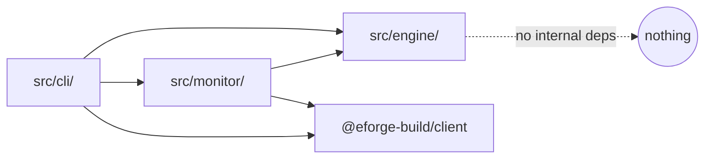
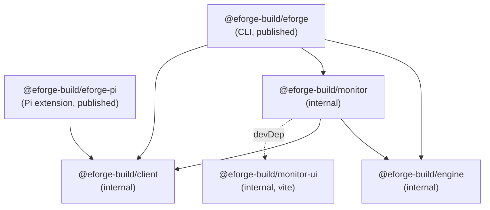

# Monorepo restructuring and npm scope migration to `@eforge-build/*`

## Problem / Motivation

The eforge codebase has outgrown its current workspace structure. Everything — engine, CLI, monitor server, agents, prompts — lives directly under the root `eforge` package in top-level `src/`, while only three packages (`src/monitor/ui` as `monitor-ui`, `packages/client` as `@eforge-build/client`, and `pi-package` as `eforge-pi`) are proper workspace members. This creates several problems:

- **No package boundaries.** The engine (49 files, ~13.5k lines), CLI (5 files, ~2.7k lines), and monitor server (7 files, ~3.6k lines) all share a single `package.json`, `tsconfig.json`, and `tsup.config.ts`. Internal dependency relationships are implicit (verified clean by grep but not enforced by tooling).
- **Unused library export.** The root package exposes `src/engine/index.ts` as a library entry (70 re-exports) via `"exports"` in `package.json`, but `grep "from 'eforge'"` across the entire repo returns zero real matches. All 141 test imports use deep paths (`../src/engine/plan.js`). The `tsc -p tsconfig.build.json` step emits `dist/types/engine/**/*.d.ts` purely to satisfy this unused entry.
- **Dead code.** `src/monitor/mock-server.ts` (937 lines) has zero imports from anywhere in `src/`, `test/`, or `scripts/`. Empty legacy directories `src/agents/` and `src/prompts/` exist alongside the real agent code in `src/engine/agents/` and `src/engine/prompts/`.
- **Package naming misalignment.** The published packages (`eforge@0.3.8`, `eforge-pi@0.3.8`) use bare names without a scope, while the internal client package already uses `@eforge-build/client`. The roadmap calls for migration to `@eforge-build/*` scope across all packages.
- **Build pipeline complexity.** The root build script chains four sequential steps: client build → tsup (three entries from top-level `src/`) → post-build script (restores `node:sqlite` prefix) → vite (monitor-ui) → tsc (unused types). Yesterday's commit `3dc2dae` introduced `noExternal: [/^@eforge-build\//]` to self-contain `dist/cli.js` for eval scenarios, creating a brittle workaround that this PRD explicitly reverses.
- **Monitor fork resolution fragility.** `src/monitor/index.ts::resolveServerMain()` uses `__dirname` to locate `server-main.js` for `fork()`. This works only because tsup emits `cli.js` and `server-main.js` into the same `dist/` folder. Any extraction of the monitor into a separate package breaks this implicit colocation.

This PRD executes two items from `docs/roadmap.md` Integration & Maturity section:
1. **Monorepo** — "Extend pnpm workspaces so the engine, eforge-plugin, and marketing site each get their own package with isolated deps and build configs" (marketing site explicitly deferred).
2. **npm scope migration to `@eforge-build`** — "Republish `eforge` as `@eforge-build/cli` and `eforge-pi` as `@eforge-build/pi-extension`. Deprecate old names." (Naming divergence: planning settled on `@eforge-build/eforge` and `@eforge-build/eforge-pi` to preserve the `eforge` brand.)

## Goal

Extract the engine, CLI, monitor server, and monitor UI into proper pnpm workspace packages under `packages/`, migrate both published npm packages to the `@eforge-build/*` scope, and establish clean per-package build/type/export contracts — all with zero user-facing behavior changes (same CLI bin name, same MCP tools, same daemon HTTP API, same config schema, same SSE events).

## Approach

### Hard constraints (established before planning, not open for re-decision)

1. **Not publishing `@eforge-build/client`.** It stays as a workspace-only contract package. The Pi extension bundles it via `bundledDependencies` (commit `8f6a994`), and the CLI/monitor server inline it via `tsup noExternal` (commit `3dc2dae`). If a future roadmap item needs it published, that's a separate decision.
2. **Not scaffolding the marketing site.** `eforge.build` is a separate roadmap section; `web/` is left out entirely. The `pnpm-workspace.yaml` can accept it later, but no empty placeholder is created.
3. **Local dev workflow is a hard requirement.** `pnpm build` at the repo root must continue to produce a globally-linkable CLI (`pnpm link --global`). The user must not need to run `pnpm install` anywhere else after making local changes. **The user's dev loop is strictly "build + run"** — they do not use `tsx`-based dev modes. They run `pnpm build`, then invoke `eforge` directly (via global link) or let the Pi extension / Claude plugin spawn it.
4. **`eforge-plugin` is not renamed.** The Claude Code plugin stays named `eforge` in `.claude-plugin/plugin.json` because that's its Claude marketplace identity. It may or may not join the pnpm workspace, but its user-facing name doesn't change. The `eforge` identity persists as the user-facing brand; `@eforge-build/*` is the npm publishing identity.
5. **Version scheme preference.** When `@eforge-build/client` eventually ships (not in this PRD), its first published version should be above the currently published `eforge` version (0.3.8), not reset to 0.1.0.

### Triage decisions

1. **Engine is internal/unpublished.** Nobody imports `from 'eforge'` as a library, so `@eforge-build/engine` becomes a workspace package consumed only by `@eforge-build/eforge` and `@eforge-build/monitor`. Delete `tsconfig.build.json`, the root's library tsup entry, and the `dist/types/` generation. The engine package itself still has a `src/index.ts` barrel for internal consumers; only the root-level library export is removed.

2. **Monitor is a separate package.** `@eforge-build/monitor` (internal/unpublished). Semantic cohesion wins — it's a daemon with its own HTTP API, lifecycle, and database.

3. **Tests stay at repo root.** `test/` and `vitest.config.ts` stay where they are. The 141 deep import paths get updated mechanically from `../src/engine/*` to `@eforge-build/engine/*` via tsconfig path aliases.

4. **eforge-plugin stays at the repo root, NOT in the workspace.** It's a Claude Code plugin distributed via the Claude marketplace, not an npm package. It has no `package.json`, no build step, no node_modules.

5. **Package names:**
   - `@eforge-build/engine` — internal
   - `@eforge-build/monitor` — internal
   - `@eforge-build/monitor-ui` — internal, private (moved from `src/monitor/ui/` to `packages/monitor-ui/`)
   - `@eforge-build/eforge` — published (was `eforge`; brand preserved, scope added)
   - `@eforge-build/eforge-pi` — published (was `eforge-pi`; same pattern)
   - `@eforge-build/client` — internal (unchanged)
   - `eforge-plugin` — not a workspace member; Claude marketplace identity stays `eforge`

6. **Clean monorepo: each workspace package builds itself.** No `noExternal` trickery, no source-only packages, no cross-package tsup entries. Each package is fully idiomatic: own `src/`, own `dist/`, own `package.json` with proper `main`/`types`/`exports`, own `tsup.config.ts`. The published `@eforge-build/eforge` tarball is a thin CLI bundle (`dist/cli.js`) that resolves its workspace deps at runtime via standard Node module resolution.

7. **Eval scenario trade-off accepted.** This PRD explicitly reverses commit `3dc2dae`'s `noExternal` workaround and relies on standard Node resolution. Eval scripts must be updated to run from inside a workspace or install the published tarball.

8. **`pi-package/` moves to `packages/eforge-pi/`.** Consistency — all workspace members live under `packages/`. Git history preserved via `git mv`.

9. **Build orchestration via `pnpm -r build`.** No turbo, no custom build tools. pnpm's native workspace topology ordering handles everything.

10. **No `tsx`-based dev loop.** Root `package.json` scripts drop `dev`, `dev:trace`, `dev:mock`. `dev:monitor-ui` (Vite hot-reload for monitor-ui work) is retained.

### Current workspace state

```
pnpm-workspace.yaml:
  - src/monitor/ui      → monitor-ui (private, Vite React app)
  - packages/*          → @eforge-build/client (v0.1.0, unpublished internal)
  - pi-package          → eforge-pi (published; will be renamed)
```

### Source layout and sizes

| Area | Files | Lines | Notes |
|---|---|---|---|
| `src/engine/` | 49 | 13,525 | All orchestration, agents, prompts, backends, state, pipeline, tracing, worktree ops, PRD queue, config schemas |
| `src/cli/` | 4 | 2,657 | `index.ts` (main command dispatcher), `display.ts`, `interactive.ts`, `mcp-proxy.ts` |
| `src/cli.ts` | 1 | ~15 | Thin bin entry point |
| `src/monitor/` (excl. `ui/`) | 7 `.ts` | 3,626 | Daemon server, DB, recorder, registry, HTTP+SSE server, forkable `server-main.ts` entry point. One unused `mock-server.ts` (937 lines, deleted by this PRD). |
| `src/monitor/ui/` | 66 | 6,674 | Vite React app, already a workspace package |
| `packages/client/` | 7 | 678 | Zero-dep HTTP client, already a workspace package |
| `pi-package/` | 10 | 1,608 | One TypeScript source (`extensions/eforge/index.ts`, 692 lines) plus `README.md`, `package.json`, and 7 skill `.md` files |
| `eforge-plugin/` | — | — | Claude Code plugin (6 skills as `.md` files + `plugin.json` + `.mcp.json`); not an npm package |
| `test/` | 64 `.test.ts` (78 total) | 16,667 | All tests at repo root. 141 deep imports into `src/engine/*` (across 58 test files); 14 deep imports into `src/monitor/*` (across 11 test files); **66 unique test files need import rewrites** |

### Internal dependency graph (verified by grep)



- `src/engine/` imports nothing from `cli/` or `monitor/` — confirmed clean
- `src/monitor/` imports from `src/engine/` (types: `events.ts`, `config.ts`; **plus one runtime function** `loadConfig` from `engine/config.ts`, used by `server-main.ts:20`) and from `@eforge-build/client` (lockfile ops). The runtime dependency means `@eforge-build/monitor` must list `@eforge-build/engine` as a regular `dependencies`, not just a type-only dev/peer dep.
- `src/cli/` imports from `src/engine/` (runtime: `EforgeEngine`, `plan`, `config`, `hooks`, `session`, etc.), from `src/monitor/` (the `ensureMonitor` launcher), and from `@eforge-build/client`
- No circular dependencies anywhere

### Published artifacts baseline

- `eforge@0.3.8` — CLI + engine library, published 2 days ago
- `eforge-pi@0.3.8` — Pi extension, published 2 days ago (has the latent `@eforge-build/client` import bug; no users). Note: `pi-package/package.json` locally says `version: "0.1.0"` — the publish script `scripts/prepare-pi-package-publish.mjs` overwrites it with the root version at publish time.
- `@eforge-build/client` — never published, local version `0.1.0`
- `eforge-plugin` — distributed via Claude marketplace as `eforge@0.5.20`

### Target workspace layout

```
eforge/                              (repo root — private workspace orchestrator)
  package.json                       (private, name: "eforge-monorepo", scripts + devDeps only)
  pnpm-workspace.yaml                (packages: ["packages/*"])
  tsconfig.base.json                 (NEW: shared compiler options + @eforge-build/* path aliases)
  vitest.config.ts                   (resolve.alias for @eforge-build/* → src/)
  tsup.config.ts                     (DELETED from root; lives in packages/eforge/ now)
  tsconfig.build.json                (DELETED)
  test/                              (stays put; 155 imports rewritten to use @eforge-build/* aliases)
  docs/
  scripts/
    prepare-eforge-publish.mjs       (NEW: stages @eforge-build/eforge tarball with bundledDeps)
    prepare-eforge-pi-publish.mjs    (renamed from prepare-pi-package-publish.mjs)
  eforge-plugin/                     (unchanged location; .mcp.json + update.md updated)
  .eforge/, .claude/, .github/, README.md, AGENTS.md, CLAUDE.md, LICENSE  (unchanged)

  packages/
    client/                          (existing — unchanged)
      package.json                   (name: @eforge-build/client, private)
      tsconfig.json
      tsup.config.ts
      src/
      dist/                          (gitignored)

    engine/                          (NEW — moved from src/engine/)
      package.json                   (name: @eforge-build/engine, private, files: [dist])
      tsconfig.json                  (extends ../../tsconfig.base.json)
      tsup.config.ts                 (glob entry: src/**/*.ts → matching dist/**/*.js + dts; onSuccess copies prompts/)
      src/
        (NO index.ts — CLI and tests use subpath imports exclusively)
        prompts.ts                   (PROMPTS_DIR = __dirname/prompts)
        prompts/                     (moved from src/engine/prompts/ — the .md files)
        agents/**
        backends/**
        orchestrator/**
        (config, events, plan, pipeline, state, session, hooks, tracing, worktree-*, etc.)
      dist/                          (gitignored)

    monitor/                         (NEW — moved from src/monitor/, excluding ui/)
      package.json                   (name: @eforge-build/monitor, private, files: [dist])
                                     (devDependencies: { "@eforge-build/monitor-ui": "workspace:*" })
      tsconfig.json
      tsup.config.ts                 (glob entry: src/**/*.ts → matching dist/**/*.js + dts;
                                      onSuccess copies ../monitor-ui/dist/ → dist/monitor-ui/)
      src/
        index.ts                     (ensureMonitor launcher — uses createRequire for fork resolution)
        server-main.ts               (forkable daemon entry)
        server.ts                    (HTTP + SSE; UI_DIR = __dirname/monitor-ui stays)
        db.ts
        recorder.ts
        registry.ts
        mock-server.ts
      dist/                          (gitignored)

    monitor-ui/                      (NEW — moved from src/monitor/ui/, sibling of monitor)
      package.json                   (name: @eforge-build/monitor-ui, private, files: [dist])
      vite.config.ts                 (outDir: "dist" — was "../../../dist/monitor-ui")
      tsconfig.json
      src/**
      dist/                          (gitignored)

    eforge/                          (NEW — moved from src/cli.ts + src/cli/)
      package.json                   (name: @eforge-build/eforge, PUBLISHED, v0.4.0,
                                      bin: { eforge: "./dist/cli.js" },
                                      dependencies: { client, engine, monitor as workspace:* },
                                      bundledDependencies: [client, engine, monitor])
      tsconfig.json
      tsup.config.ts                 (single entry: src/cli.ts → dist/cli.js;
                                      externals: @eforge-build/* stay external;
                                      define: { EFORGE_VERSION };
                                      banner: shebang)
      src/
        cli.ts                       (thin bin entry — moved from src/cli.ts)
        cli/                         (moved from src/cli/)
          index.ts                   (command dispatcher; fork resolution uses createRequire)
          display.ts
          interactive.ts
          mcp-proxy.ts               (version read fixed to use EFORGE_VERSION)
      dist/                          (gitignored)

    eforge-pi/                       (NEW — moved from pi-package/)
      package.json                   (name: @eforge-build/eforge-pi, PUBLISHED, v0.4.0)
      extensions/eforge/index.ts     (unchanged content, no build)
      skills/**                      (eforge-update/SKILL.md updated like eforge-plugin)
      README.md
```

**Key structural properties:**

- All 6 workspace packages live under `packages/` as siblings.
- Each package has its own `src/`, `dist/`, `package.json`, `tsconfig.json`, and (where applicable) `tsup.config.ts` or `vite.config.ts`.
- Each package's `dist/` is fully self-contained — no cross-package writes, no implicit file dependencies between dists.
- `@eforge-build/eforge` is the ONLY package whose tsup bundles a runtime executable (`dist/cli.js`). All other packages build plain library outputs.
- `@eforge-build/monitor-ui` uses vite; everything else uses tsup.
- `@eforge-build/eforge-pi` has no build step — it ships raw `.ts` via Pi's jiti loader.

### File moves

| From | To | Count | Notes |
|---|---|---|---|
| `src/engine/**/*.ts` | `packages/engine/src/**/*.ts` | 49 files | All agents, backends, orchestrator, etc. |
| `src/engine/prompts/*.md` | `packages/engine/src/prompts/*.md` | 26 files | Engine prompt templates |
| `src/monitor/*.ts` (excl. ui/ and mock-server.ts) | `packages/monitor/src/*.ts` | 6 files | db, index, recorder, registry, server, server-main |
| `src/monitor/ui/**` | `packages/monitor-ui/**` | 66 files | Entire Vite app |
| `src/cli.ts` | `packages/eforge/src/cli.ts` | 1 file | Bin entry |
| `src/cli/**` | `packages/eforge/src/cli/**` | 4 files | display, index, interactive, mcp-proxy |
| `pi-package/**` | `packages/eforge-pi/**` | 10 files | `extensions/eforge/index.ts`, 7 skill `.md` files, `README.md`, `package.json` |

**Total moves:** 162 files via `git mv` (one monitor file — `mock-server.ts` — is deleted instead of moved). Zero content changes in moved files.

### Deletions

| What | Why |
|---|---|
| `src/monitor/mock-server.ts` (937 lines) | Not actively used; no test imports it; only the `dev:mock` script referenced it |
| `src/agents/` (empty legacy dir) | Verified empty |
| `src/prompts/` (empty legacy dir) | Verified empty |
| `src/` (empty after all moves complete) | Nothing left |
| `pi-package/` (empty after move) | Contents relocated to `packages/eforge-pi/` |
| `tsconfig.build.json` | Only existed for unused `dist/types/` emit |
| Root `tsup.config.ts` | Replaced by `packages/eforge/tsup.config.ts` |
| Root `scripts/post-build.ts` | No longer needed (each package's tsup owns its own post-build) |
| Root `package.json` `exports` field | No library consumers |
| Root `package.json` `types` field | Same |
| Root `package.json` `bin` field | Moves to `packages/eforge/package.json` |
| Root `package.json` `main` field | Moves (effectively removed, root is private workspace) |
| Root `dist/` (gitignored anyway) | No root-level build output anymore |

### New files created

| File | Purpose |
|---|---|
| `tsconfig.base.json` | Shared compiler options; `paths` mapping `@eforge-build/*` → `packages/*/src/*.ts` for dev/test resolution |
| `packages/engine/package.json` | `@eforge-build/engine` workspace package |
| `packages/engine/tsconfig.json` | Extends base |
| `packages/engine/tsup.config.ts` | Builds `src/index.ts` with `dts: true`; `onSuccess` copies `src/prompts/` to `dist/prompts/` |
| `packages/monitor/package.json` | `@eforge-build/monitor` with `workspace:*` dep on monitor-ui |
| `packages/monitor/tsconfig.json` | Extends base |
| `packages/monitor/tsup.config.ts` | Two entries (`index.ts`, `server-main.ts`); `onSuccess` copies `../monitor-ui/dist/` to `dist/monitor-ui/` |
| `packages/monitor-ui/package.json` | Extracted from what `src/monitor/ui/package.json` is today; adds `files: [dist]` |
| `packages/eforge/package.json` | `@eforge-build/eforge`, published, bin `eforge`, workspace deps + bundledDependencies |
| `packages/eforge/tsconfig.json` | Extends base |
| `packages/eforge/tsup.config.ts` | Adapted from root tsup; single `cli.ts` entry; NO `noExternal` for `@eforge-build/*` |
| `packages/eforge-pi/package.json` | Renamed from `eforge-pi` to `@eforge-build/eforge-pi`; otherwise mostly unchanged |
| `scripts/prepare-eforge-publish.mjs` | NEW — stages `@eforge-build/eforge` tarball with engine/monitor/client bundled via `bundledDependencies` |

### Source-file modifications (beyond moves)

1. **`packages/monitor/src/index.ts::resolveServerMain`** — replace `__dirname`-based fork resolution with `createRequire` + package `exports`:

   ```typescript
   import { createRequire } from 'node:module';
   const require = createRequire(import.meta.url);

   function resolveServerMain(): string {
     try {
       return require.resolve('@eforge-build/monitor/server-main');
     } catch (err) {
       throw new Error(
         `Monitor server-main entry not found. Did you run \`pnpm build\`?`
       );
     }
   }
   ```

   Requires `packages/monitor/package.json` to expose the subpath:
   ```json
   "exports": {
     ".": { "import": "./dist/index.js", "types": "./dist/index.d.ts" },
     "./server-main": "./dist/server-main.js"
   }
   ```

   Works in both dev (resolves through pnpm workspace symlinks to `packages/monitor/dist/server-main.js`) and production (resolves through bundledDependencies `node_modules/@eforge-build/monitor/dist/server-main.js`). Requires monitor to have been built at least once in dev.

2. **`packages/eforge/src/cli/index.ts:624-630`** (daemon start --persistent fork) — same treatment:
   ```typescript
   const require = createRequire(import.meta.url);
   const serverMainPath = require.resolve('@eforge-build/monitor/server-main');
   ```

3. **`packages/eforge/src/cli/mcp-proxy.ts:313`** — fix the latent broken runtime `package.json` read; use `EFORGE_VERSION`:
   ```typescript
   // Before (broken in dev):
   const pkgPath = resolve(dirname(fileURLToPath(import.meta.url)), '..', 'package.json');
   const { version } = JSON.parse(await readFile(pkgPath, 'utf-8'));

   // After:
   declare const EFORGE_VERSION: string;
   const version = EFORGE_VERSION;
   ```

4. **`packages/engine/src/prompts.ts`** — no change. `PROMPTS_DIR = resolve(__dirname, 'prompts')` works because prompts live in `src/prompts/` for dev and `dist/prompts/` for built (tsup `onSuccess` copies).

5. **`packages/monitor/src/server.ts`** — no change. `UI_DIR = resolve(__dirname, 'monitor-ui')` works because monitor's tsup `onSuccess` copies `../monitor-ui/dist/` to `dist/monitor-ui/`.

6. **`packages/monitor-ui/vite.config.ts`** — change `outDir` from `'../../../dist/monitor-ui'` to `'dist'` (self-contained).

### Test imports

155 test imports rewritten to use workspace package aliases. Mechanical sed pass driven by a small script.

**Before:**
```typescript
import { runPlanner } from '../src/engine/agents/planner.js';
import type { EforgeEvent } from '../src/engine/events.js';
import { openDatabase } from '../src/monitor/db.js';
```

**After:**
```typescript
import { runPlanner } from '@eforge-build/engine/agents/planner';
import type { EforgeEvent } from '@eforge-build/engine/events';
import { openDatabase } from '@eforge-build/monitor/db';
```

**Resolution mechanism:** `tsconfig.base.json` `paths` + `vitest.config.ts` `resolve.alias`:

```jsonc
// tsconfig.base.json
{
  "compilerOptions": {
    "baseUrl": ".",
    "paths": {
      "@eforge-build/client": ["./packages/client/src/index.ts"],
      "@eforge-build/client/*": ["./packages/client/src/*"],
      "@eforge-build/engine/*": ["./packages/engine/src/*"],
      "@eforge-build/monitor": ["./packages/monitor/src/index.ts"],
      "@eforge-build/monitor/*": ["./packages/monitor/src/*"]
    }
  }
}
```

```typescript
// vitest.config.ts
import { defineConfig } from 'vitest/config';
import { resolve } from 'node:path';

export default defineConfig({
  test: { include: ['test/**/*.test.ts'] },
  resolve: {
    alias: {
      '@eforge-build/client': resolve(__dirname, 'packages/client/src/index.ts'),
      '@eforge-build/engine/': resolve(__dirname, 'packages/engine/src/'),
      '@eforge-build/monitor': resolve(__dirname, 'packages/monitor/src/index.ts'),
      '@eforge-build/monitor/': resolve(__dirname, 'packages/monitor/src/'),
    },
  },
});
```

In dev/test, imports resolve to source via paths/aliases (fast, no build needed for tests). At runtime, the same imports resolve via package `exports` to `dist/*.js`. This dual-resolution is the standard TypeScript monorepo pattern.

### Build pipeline changes

**Root `package.json`:**

```jsonc
{
  "name": "eforge-monorepo",
  "private": true,
  "type": "module",
  "scripts": {
    "build": "pnpm -r build",
    "type-check": "pnpm -r type-check",
    "test": "vitest run",
    "test:watch": "vitest",
    "dev:monitor-ui": "pnpm --filter @eforge-build/monitor-ui dev",
    "prepare:eforge-publish": "node ./scripts/prepare-eforge-publish.mjs",
    "prepare:eforge-pi-publish": "node ./scripts/prepare-eforge-pi-publish.mjs"
  },
  "devDependencies": {
    "typescript": "^5.9.3",
    "vitest": "^4.1.2"
  }
}
```

No `dependencies`, no `bin`, no `exports`, no `main`, no `types`, no `tsx`. Purely a workspace orchestrator.

**Dropped scripts:**
- `dev` (was `tsx src/cli.ts`) — user doesn't use tsx dev loop
- `dev:trace` (was `node --env-file=.env ... tsx src/cli.ts`) — same
- `dev:mock` (was `tsx src/monitor/mock-server.ts`) — script and source file both deleted
- Root `tsx` devDependency removed

**Build order** (derived from workspace deps, `pnpm -r` topologically sorts):
1. `@eforge-build/client` — no internal deps
2. `@eforge-build/engine` — no internal deps
3. `@eforge-build/monitor-ui` — no internal deps
4. `@eforge-build/monitor` — depends on monitor-ui (devDep), reads its dist in tsup onSuccess
5. `@eforge-build/eforge` — depends on client, engine, monitor
6. `@eforge-build/eforge-pi` — depends on client (and has no build step)

**`packages/eforge/tsup.config.ts`:**

```typescript
import { defineConfig } from "tsup";
import { createRequire } from "node:module";

const require = createRequire(import.meta.url);
const { version } = require("./package.json");

export default defineConfig({
  entry: ["src/cli.ts"],
  format: ["esm"],
  target: "node22",
  clean: true,
  dts: false,
  external: [
    // Pi stack (already external today)
    "@anthropic-ai/claude-agent-sdk",
    "@mariozechner/pi-coding-agent",
    "@mariozechner/pi-agent-core",
    "@mariozechner/pi-ai",
    "@sinclair/typebox",
    // Workspace deps — stay external; resolved via node_modules at runtime
    /^@eforge-build\//,
  ],
  define: { EFORGE_VERSION: JSON.# Monorepo restructuring and npm scope migration to `@eforge-build/*`

## Problem / Motivation

The eforge codebase has outgrown its single-package structure. Today, the engine, CLI, monitor server, monitor UI, Pi extension, and HTTP client all live in a single root package (`eforge@0.3.8`) with ad-hoc workspace carve-outs for only three pieces (`src/monitor/ui`, `packages/client`, `pi-package`). This creates several pain points:

- **No package boundaries.** All orchestration, agents, prompts, backends, state, pipeline, tracing, worktree ops, PRD queue, config schemas (~13.5k lines in `src/engine/`), the CLI (~2.7k lines in `src/cli/`), and the monitor daemon (~3.6k lines in `src/monitor/`) share a single `package.json`, a single tsup config, a single tsconfig, and a single `dist/` folder. Internal dependency relationships are implicit (verified clean by grep, but not enforced by tooling).

- **Unused library export adds build overhead.** The root package exposes `src/engine/index.ts` as a library entry (70 re-exports) via `"exports"` in `package.json`, but nobody imports it: zero matches for `from 'eforge'` across the entire repo (excluding docs/node_modules), the Pi extension uses `@eforge-build/client` instead, `eforge-plugin` is a Claude Code plugin (not an npm consumer), and all 141 test imports go to deep paths. Yet `tsc -p tsconfig.build.json` emits `dist/types/engine/**/*.d.ts` purely to satisfy this dead entry.

- **Fragile build pipeline.** The root tsup config has three entries with divergent `noExternal` settings (yesterday's commit `3dc2dae` added `noExternal: [/^@eforge-build\//]` as a workaround for eval scenarios). A `post-build.ts` script restores `node:sqlite` prefixes. The monitor-ui Vite build writes cross-package to `../../../dist/monitor-ui`. The monitor's `resolveServerMain()` relies on `__dirname` sibling co-location of `cli.js` and `server-main.js` in a single `dist/` folder — a fragile coupling that breaks under any extraction.

- **Inconsistent workspace layout.** Three workspace members exist at three different locations (`src/monitor/ui`, `packages/*`, `pi-package`), with no consistent pattern. The `pnpm-workspace.yaml` has three separate entries instead of a single glob.

- **npm scope not established.** The `eforge` and `eforge-pi` package names lack an npm scope. The roadmap calls for migrating to `@eforge-build/*` to establish a consistent publishing identity. Doing the scope migration without the monorepo restructure would require keeping the monolithic root package as the published artifact under a new name — missing the opportunity to establish proper package boundaries.

- **Dead code.** `src/monitor/mock-server.ts` (937 lines) has zero imports from anywhere in `src/`, `test/`, or `scripts/`. Empty legacy directories `src/agents/` and `src/prompts/` still exist. The `dev`, `dev:trace`, and `dev:mock` scripts reference workflows the user doesn't use (Constraint 3: the user's dev loop is strictly "build + run").

This PRD executes two items from `docs/roadmap.md` Integration & Maturity section: **Monorepo** and **npm scope migration to `@eforge-build`**.

### Current workspace state

```
pnpm-workspace.yaml:
  - src/monitor/ui      → monitor-ui (private, Vite React app)
  - packages/*          → @eforge-build/client (v0.1.0, unpublished internal)
  - pi-package          → eforge-pi (published; will be renamed)
```

Everything else — engine, CLI, monitor server, agents, prompts — lives directly under the root `eforge` package in top-level `src/`. The root `eforge` package is published at v0.3.8 and exposes both a CLI bin (`dist/cli.js`) and a library entry (`dist/index.js` via `src/engine/index.ts`).

### Source layout and sizes

| Area | Files | Lines | Notes |
|---|---|---|---|
| `src/engine/` | 49 | 13,525 | All orchestration, agents, prompts (`src/engine/prompts/`), backends (claude-sdk, pi, pi-mcp-bridge, pi-extensions), state, pipeline, tracing, worktree ops, PRD queue, config schemas |
| `src/cli/` | 4 | 2,657 | `index.ts` (main command dispatcher), `display.ts`, `interactive.ts`, `mcp-proxy.ts` |
| `src/cli.ts` | 1 | ~15 | Thin bin entry point (sets process.title, installs SIGPIPE handler, calls `cli/index.ts`'s `run()`) |
| `src/monitor/` (excl. `ui/`) | 7 `.ts` | 3,626 | Daemon server, DB, recorder, registry, HTTP+SSE server, forkable `server-main.ts` entry point. One of the seven files is the unused `mock-server.ts` (937 lines, deleted by this PRD). |
| `src/monitor/ui/` | 66 | 6,674 | Vite React app, already a workspace package |
| `packages/client/` | 7 | 678 | Zero-dep HTTP client, already a workspace package |
| `pi-package/` | 10 | 1,608 | One TypeScript source (`extensions/eforge/index.ts`, 692 lines) plus `README.md`, `package.json`, and 7 skill `.md` files. Already a workspace package. |
| `eforge-plugin/` | — | — | Claude Code plugin (6 skills as `.md` files + `plugin.json` + `.mcp.json`); not an npm package |
| `test/` | 64 `.test.ts` (78 total) | 16,667 | All tests at repo root. 141 deep imports into `src/engine/*` (across 58 test files); 14 deep imports into `src/monitor/*` (across 11 test files); **66 unique test files need import rewrites** (some files import from both). |

Note: `src/agents/` and `src/prompts/` at the top level are empty legacy directories. All agent code and prompts live under `src/engine/agents/` and `src/engine/prompts/` respectively.

### Internal dependency graph (verified by grep)


- `src/engine/` imports nothing from `cli/` or `monitor/` — confirmed clean
- `src/monitor/` imports from `src/engine/` (types: `events.ts`, `config.ts`; **plus one runtime function** `loadConfig` from `engine/config.ts`, used by `server-main.ts:20` to load the daemon's eforge config) and from `@eforge-build/client` (lockfile ops). The runtime dependency means `@eforge-build/monitor` must list `@eforge-build/engine` as a regular `dependencies`, not just a type-only dev/peer dep.
- `src/cli/` imports from `src/engine/` (runtime: `EforgeEngine`, `plan`, `config`, `hooks`, `session`, etc.), from `src/monitor/` (the `ensureMonitor` launcher), and from `@eforge-build/client`
- No circular dependencies anywhere

### The library entry is unused

The root `eforge` package exposes `src/engine/index.ts` as a library export (70 re-exports) via `"exports"` in `package.json`. **Nobody actually imports it:**

- `grep "from 'eforge'"` across the entire repo (excluding docs and node_modules) returns zero real matches
- The Pi extension can't import it (too heavy — Claude SDK, pi-agent-core, etc.)
- `eforge-plugin` doesn't import it (it's a Claude Code plugin, not an npm consumer)
- All 141 test imports go to **deep paths** (`../src/engine/plan.js`, `../src/engine/agents/builder.js`, etc.); zero imports hit the barrel
- `tsc -p tsconfig.build.json` emits `dist/types/engine/**/*.d.ts` purely to satisfy the unused library entry

**Implication:** The engine does not need to be published. It can be an internal workspace package that the CLI and monitor consume via `workspace:*`. The root-level library export is removed.

### Build pipeline today

Root `package.json` build script:
```
pnpm --filter @eforge-build/client build  // builds packages/client/dist/
  && tsup                                  // three bundles from top-level src/
  && node --import tsx ./scripts/post-build.ts  // restores node: prefix for node:sqlite
  && pnpm --filter monitor-ui build        // Vite build into dist/monitor-ui/
  && tsc -p tsconfig.build.json            // emits dist/types/ (unused, see above)
```

`tsup.config.ts` has three entries, all rooted in top-level `src/`:
1. `src/cli.ts` → `dist/cli.js` — has `noExternal: [/^@eforge-build\//]` (yesterday's fix)
2. `src/engine/index.ts` → `dist/index.js` — library entry, deliberately NOT inlining client — but since nobody consumes this, the rationale is moot
3. `src/monitor/server-main.ts` → `dist/server-main.js` — has `noExternal: [/^@eforge-build\//]` (yesterday's fix); forked as a detached child process by the CLI

### The monitor fork-resolution constraint

`src/monitor/index.ts::resolveServerMain()` uses `__dirname` to locate `server-main.js` for `fork()`:

```typescript
// In prod (bundled): __dirname = dist/, server-main.js sits alongside cli.js
// In dev (tsx):      __dirname = src/monitor/, server-main.ts is in the same directory
const jsPath = resolve(__dirname, 'server-main.js');
```

This works today because tsup emits `cli.js` and `server-main.js` into the same `dist/` folder. After extraction, if the monitor lives in a separate package, `resolveServerMain()` can no longer use `__dirname` sibling co-location. Three resolution strategies were considered:

1. **Keep monitor inside the CLI package** — simplest but gives up semantic separation.
2. **Extract monitor but have the CLI package re-bundle `server-main`** — preserves semantic separation but unusual build config.
3. **Change fork resolution to use `createRequire(import.meta.url).resolve('@eforge-build/monitor/server-main')`** — cleanest conceptually, pairs naturally with treating `@eforge-build/*` as `external` in tsup.

**Resolved: Option 3.**

### Published artifacts baseline

- `eforge@0.3.8` — CLI + engine library, published 2 days ago. Local source-of-truth: root `package.json`.
- `eforge-pi@0.3.8` — Pi extension, published 2 days ago. `pi-package/package.json` locally still says `version: "0.1.0"` — the publish script overwrites with the root version at publish time.
- `@eforge-build/client` — never published. Local version `0.1.0`.
- `eforge-plugin` — distributed via Claude marketplace as `eforge@0.5.20`

### Roadmap alignment

This PRD executes two items from `docs/roadmap.md` Integration & Maturity section:

1. **Monorepo** — "Extend pnpm workspaces (currently monitor UI, `@eforge-build/client`, and pi-package) so the engine, eforge-plugin, and marketing site each get their own package with isolated deps and build configs"
   - Marketing site explicitly deferred per constraint 2
2. **npm scope migration to `@eforge-build`** — "Republish `eforge` as `@eforge-build/cli` and `eforge-pi` as `@eforge-build/pi-extension`. Deprecate old names. Requires major version bump."
   - **Naming divergence from the roadmap:** The planning conversation settled on `@eforge-build/eforge` and `@eforge-build/eforge-pi` instead, to preserve the `eforge` brand inside the npm name. The roadmap entry is removed (not updated) when this PRD lands per roadmap policy.

## Goal

Extract the monolithic `eforge` package into a clean pnpm monorepo with 6 workspace packages under `packages/`, each with isolated dependencies, build configs, and formal `exports` contracts. Simultaneously migrate the two published npm packages from `eforge` / `eforge-pi` to the `@eforge-build/eforge` / `@eforge-build/eforge-pi` scoped names, deprecating the old names. All changes land atomically with zero user-visible behavioral changes — same CLI bin name (`eforge`), same daemon HTTP API, same MCP tool surface, same config schema, same plugin identity.

## Approach

### Constraints carried from the planning conversation

These were established before the planning session and are not open for re-decision:

1. **Not publishing `@eforge-build/client`.** It stays as a workspace-only contract package. The Pi extension bundles it via `bundledDependencies` (commit `8f6a994`), and the CLI/monitor server use it via workspace deps. If a future roadmap item needs it published, that's a separate decision.

2. **Not scaffolding the marketing site.** `eforge.build` is a separate roadmap section; `web/` is left out of this PRD entirely.

3. **Local dev workflow is a hard requirement.** `pnpm build` at the repo root must continue to produce a globally-linkable CLI (`pnpm link --global`). The user's dev loop is strictly "build + run" — they do not use `tsx`-based dev modes.

4. **`eforge-plugin` is not renamed.** The Claude Code plugin stays named `eforge` in `.claude-plugin/plugin.json` because that's its Claude marketplace identity. The `eforge` identity persists as the user-facing brand; `@eforge-build/*` is the npm publishing identity.

5. **Version scheme preference.** When `@eforge-build/client` eventually ships (not in this PRD), its first published version should be above the currently published `eforge` version (0.3.8), not reset to 0.1.0.

### Triage decisions (from planning conversation)

1. **Engine is internal/unpublished.** `@eforge-build/engine` becomes a workspace package consumed only by `@eforge-build/eforge` and `@eforge-build/monitor`. Delete `tsconfig.build.json`, the root's library tsup entry, and the `dist/types/` generation. Root `package.json` no longer needs an `exports` field for the engine.

2. **Monitor is a separate package.** `@eforge-build/monitor` (internal/unpublished). Semantic cohesion wins — it's a daemon with its own HTTP API, lifecycle, and database.

3. **Tests stay at repo root.** `test/` and `vitest.config.ts` stay where they are. The 155 deep import paths get updated mechanically to use `@eforge-build/*` workspace package aliases.

4. **eforge-plugin stays at the repo root, NOT in the workspace.** It's a Claude Code plugin distributed via the Claude marketplace, not an npm package. No `package.json`, no build step, no node_modules.

5. **Package names:**
   - `@eforge-build/engine` — internal
   - `@eforge-build/monitor` — internal
   - `@eforge-build/monitor-ui` — internal, private
   - `@eforge-build/eforge` — published (was `eforge`; brand preserved, scope added)
   - `@eforge-build/eforge-pi` — published (was `eforge-pi`; same pattern)
   - `@eforge-build/client` — internal (unchanged)
   - `eforge-plugin` — not a workspace member; Claude marketplace identity stays `eforge`

6. **Clean monorepo: each workspace package builds itself.** No `noExternal` trickery, no source-only packages, no cross-package tsup entries. Each package has own `src/`, `dist/`, `package.json`, `tsup.config.ts`. The published `@eforge-build/eforge` tarball resolves workspace deps at runtime via standard Node module resolution.

7. **Eval scenario trade-off accepted.** Yesterday's `noExternal` workaround (commit `3dc2dae`) is reversed. Eval scripts must be updated to run from inside a workspace or install the published tarball.

8. **`pi-package/` moves to `packages/eforge-pi/`.** Consistency — all workspace members under `packages/`. Git history preserved via `git mv`.

9. **Build orchestration via `pnpm -r build`.** No turbo, no custom build tools. pnpm's native workspace topology ordering.

10. **No `tsx`-based dev loop.** Root scripts drop `dev`, `dev:trace`, `dev:mock`. `dev:monitor-ui` retained for Vite hot-reload.

### Target workspace layout

```
eforge/                              (repo root — private workspace orchestrator)
  package.json                       (private, name: "eforge-monorepo", scripts + devDeps only)
  pnpm-workspace.yaml                (packages: ["packages/*"])
  tsconfig.base.json                 (NEW: shared compiler options + @eforge-build/* path aliases)
  vitest.config.ts                   (resolve.alias for @eforge-build/* → src/)
  tsup.config.ts                     (DELETED from root; lives in packages/eforge/ now)
  tsconfig.build.json                (DELETED)
  test/                              (stays put; 155 imports rewritten to use @eforge-build/* aliases)
  docs/
  scripts/
    prepare-eforge-publish.mjs       (NEW: stages @eforge-build/eforge tarball with bundledDeps)
    prepare-eforge-pi-publish.mjs    (renamed from prepare-pi-package-publish.mjs)
  eforge-plugin/                     (unchanged location; .mcp.json + update.md updated)
  .eforge/, .claude/, .github/, README.md, AGENTS.md, CLAUDE.md, LICENSE  (unchanged)

  packages/
    client/                          (existing — unchanged)
      package.json                   (name: @eforge-build/client, private)
      tsconfig.json
      tsup.config.ts
      src/
      dist/                          (gitignored)

    engine/                          (NEW — moved from src/engine/)
      package.json                   (name: @eforge-build/engine, private, files: [dist])
      tsconfig.json                  (extends ../../tsconfig.base.json)
      tsup.config.ts                 (glob entry: src/**/*.ts → matching dist/**/*.js + dts; onSuccess copies prompts/)
      src/
        (NO index.ts — barrel deleted; CLI and tests use subpath imports exclusively)
        prompts.ts                   (PROMPTS_DIR = __dirname/prompts)
        prompts/                     (moved from src/engine/prompts/ — the .md files)
        agents/**
        backends/**
        orchestrator/**
        (config, events, plan, pipeline, state, session, hooks, tracing, worktree-*, etc.)
      dist/                          (gitignored)

    monitor/                         (NEW — moved from src/monitor/, excluding ui/)
      package.json                   (name: @eforge-build/monitor, private, files: [dist])
                                     (devDependencies: { "@eforge-build/monitor-ui": "workspace:*" })
      tsconfig.json
      tsup.config.ts                 (glob entry: src/**/*.ts; onSuccess copies ../monitor-ui/dist/ → dist/monitor-ui/)
      src/
        index.ts                     (ensureMonitor launcher — uses createRequire for fork resolution)
        server-main.ts               (forkable daemon entry)
        server.ts                    (HTTP + SSE; UI_DIR = __dirname/monitor-ui stays)
        db.ts
        recorder.ts
        registry.ts
        mock-server.ts
      dist/                          (gitignored; contains index.js, server-main.js, monitor-ui/)

    monitor-ui/                      (NEW — moved from src/monitor/ui/, sibling of monitor)
      package.json                   (name: @eforge-build/monitor-ui, private, files: [dist])
      vite.config.ts                 (outDir: "dist" — was "../../../dist/monitor-ui")
      tsconfig.json
      src/**
      dist/                          (gitignored; vite build output)

    eforge/                          (NEW — moved from src/cli.ts + src/cli/)
      package.json                   (name: @eforge-build/eforge, PUBLISHED, v0.4.0,
                                      bin: { eforge: "./dist/cli.js" },
                                      dependencies: { client, engine, monitor as workspace:* },
                                      bundledDependencies: [client, engine, monitor])
      tsconfig.json
      tsup.config.ts                 (single entry: src/cli.ts → dist/cli.js;
                                      externals: @eforge-build/* stay external;
                                      define: { EFORGE_VERSION };
                                      banner: shebang)
      src/
        cli.ts                       (thin bin entry — moved from src/cli.ts)
        cli/                         (moved from src/cli/)
          index.ts                   (command dispatcher; fork resolution uses createRequire)
          display.ts
          interactive.ts
          mcp-proxy.ts               (version read fixed to use EFORGE_VERSION)
      dist/                          (gitignored; contains cli.js only)

    eforge-pi/                       (NEW — moved from pi-package/)
      package.json                   (name: @eforge-build/eforge-pi, PUBLISHED, v0.4.0)
      extensions/eforge/index.ts     (unchanged content, no build)
      skills/**                      (eforge-update/SKILL.md updated like eforge-plugin)
      README.md
```

**Key structural properties:**

- All 6 workspace packages live under `packages/` as siblings.
- Each package has its own `src/`, `dist/`, `package.json`, `tsconfig.json`, and (where applicable) `tsup.config.ts` or `vite.config.ts`.
- Each package's `dist/` is fully self-contained — no cross-package writes, no implicit file dependencies between dists.
- `@eforge-build/eforge` is the ONLY package whose tsup bundles a runtime executable (`dist/cli.js`). All other packages build plain library outputs.
- `@eforge-build/monitor-ui` uses vite; everything else uses tsup.
- `@eforge-build/eforge-pi` has no build step — it ships raw `.ts` via Pi's jiti loader, same as today.

### File moves

| From | To | Count | Notes |
|---|---|---|---|
| `src/engine/**/*.ts` | `packages/engine/src/**/*.ts` | 49 files | All agents, backends, orchestrator, etc. |
| `src/engine/prompts/*.md` | `packages/engine/src/prompts/*.md` | 26 files | Engine prompt templates |
| `src/monitor/*.ts` (excl. ui/ and mock-server.ts) | `packages/monitor/src/*.ts` | 6 files | db, index, recorder, registry, server, server-main |
| `src/monitor/ui/**` | `packages/monitor-ui/**` | 66 files | Entire Vite app |
| `src/cli.ts` | `packages/eforge/src/cli.ts` | 1 file | Bin entry |
| `src/cli/**` | `packages/eforge/src/cli/**` | 4 files | display, index, interactive, mcp-proxy |
| `pi-package/**` | `packages/eforge-pi/**` | 10 files | `extensions/eforge/index.ts`, 7 skill `.md` files, `README.md`, `package.json` |

**Total moves:** 162 files via `git mv`. Zero content changes in moved files.

### Deletions

| What | Why |
|---|---|
| `src/monitor/mock-server.ts` (937 lines) | Not actively used; no test imports it; only the `dev:mock` script referenced it |
| `src/agents/` (empty legacy dir) | Verified empty |
| `src/prompts/` (empty legacy dir) | Verified empty |
| `src/` (empty after all moves complete) | Nothing left |
| `pi-package/` (empty after move) | Contents relocated to `packages/eforge-pi/` |
| `tsconfig.build.json` | Only existed for unused `dist/types/` emit |
| Root `tsup.config.ts` | Replaced by `packages/eforge/tsup.config.ts` |
| Root `scripts/post-build.ts` | No longer needed (each package's tsup owns its own post-build) |
| Root `package.json` `exports` field | No library consumers |
| Root `package.json` `types` field | Same |
| Root `package.json` `bin` field | Moves to `packages/eforge/package.json` |
| Root `package.json` `main` field | Moves (effectively removed, root is private workspace) |
| Root `dist/` (gitignored anyway) | No root-level build output anymore |

### New files created

| File | Purpose |
|---|---|
| `tsconfig.base.json` | Shared compiler options; `paths` mapping `@eforge-build/*` → `packages/*/src/*.ts` for dev/test resolution |
| `packages/engine/package.json` | `@eforge-build/engine` workspace package |
| `packages/engine/tsconfig.json` | Extends base |
| `packages/engine/tsup.config.ts` | Builds `src/index.ts` with `dts: true`; `onSuccess` copies `src/prompts/` to `dist/prompts/` |
| `packages/monitor/package.json` | `@eforge-build/monitor` with `workspace:*` dep on monitor-ui |
| `packages/monitor/tsconfig.json` | Extends base |
| `packages/monitor/tsup.config.ts` | Two entries (`index.ts`, `server-main.ts`); `onSuccess` copies `../monitor-ui/dist/` to `dist/monitor-ui/` |
| `packages/monitor-ui/package.json` | Extracted from what `src/monitor/ui/package.json` is today; adds `files: [dist]` |
| `packages/eforge/package.json` | `@eforge-build/eforge`, published, bin `eforge`, workspace deps + bundledDependencies |
| `packages/eforge/tsconfig.json` | Extends base |
| `packages/eforge/tsup.config.ts` | Adapted from root tsup; single `cli.ts` entry; NO `noExternal` for `@eforge-build/*` |
| `packages/eforge-pi/package.json` | Renamed from `eforge-pi` to `@eforge-build/eforge-pi`; otherwise mostly unchanged |
| `scripts/prepare-eforge-publish.mjs` | NEW — stages `@eforge-build/eforge` tarball with engine/monitor/client bundled via `bundledDependencies` |

### Source-file modifications (beyond moves)

Real code edits — small in scope, precise:

1. **`packages/monitor/src/index.ts::resolveServerMain`** — replace `__dirname`-based fork resolution with `createRequire` + package `exports`:

   ```typescript
   import { createRequire } from 'node:module';
   const require = createRequire(import.meta.url);

   function resolveServerMain(): string {
     try {
       return require.resolve('@eforge-build/monitor/server-main');
     } catch (err) {
       throw new Error(
         `Monitor server-main entry not found. Did you run \`pnpm build\`?`
       );
     }
   }
   ```

   Requires `packages/monitor/package.json` to expose the subpath:
   ```json
   "exports": {
     ".": { "import": "./dist/index.js", "types": "./dist/index.d.ts" },
     "./server-main": "./dist/server-main.js"
   }
   ```

   Works in both dev (resolves through pnpm workspace symlinks to `packages/monitor/dist/server-main.js`) and production (resolves through bundledDependencies `node_modules/@eforge-build/monitor/dist/server-main.js`).

2. **`packages/eforge/src/cli/index.ts:624-630`** (daemon start --persistent fork) — same treatment:
   ```typescript
   const require = createRequire(import.meta.url);
   const serverMainPath = require.resolve('@eforge-build/monitor/server-main');
   ```

3. **`packages/eforge/src/cli/mcp-proxy.ts:313`** — fix the latent broken runtime `package.json` read; use `EFORGE_VERSION`:
   ```typescript
   // Before (broken in dev):
   const pkgPath = resolve(dirname(fileURLToPath(import.meta.url)), '..', 'package.json');
   const { version } = JSON.parse(await readFile(pkgPath, 'utf-8'));

   // After:
   declare const EFORGE_VERSION: string;
   const version = EFORGE_VERSION;
   ```

4. **`packages/engine/src/prompts.ts`** — no change. `PROMPTS_DIR = resolve(__dirname, 'prompts')` works because prompts live in `src/prompts/` for dev and `dist/prompts/` for built (tsup `onSuccess` copies).

5. **`packages/monitor/src/server.ts`** — no change. `UI_DIR = resolve(__dirname, 'monitor-ui')` works because monitor's tsup `onSuccess` copies `../monitor-ui/dist/` → `packages/monitor/dist/monitor-ui/`.

6. **`packages/monitor-ui/vite.config.ts`** — change `outDir` from `'../../../dist/monitor-ui'` to `'dist'` (self-contained).

### Test imports

155 test imports rewritten to use workspace package aliases. Mechanical sed pass driven by a small script.

**Before:**
```typescript
import { runPlanner } from '../src/engine/agents/planner.js';
import type { EforgeEvent } from '../src/engine/events.js';
import { openDatabase } from '../src/monitor/db.js';
```

**After:**
```typescript
import { runPlanner } from '@eforge-build/engine/agents/planner';
import type { EforgeEvent } from '@eforge-build/engine/events';
import { openDatabase } from '@eforge-build/monitor/db';
```

**Resolution mechanism:** `tsconfig.base.json` `paths` + `vitest.config.ts` `resolve.alias`:

```jsonc
// tsconfig.base.json
{
  "compilerOptions": {
    "baseUrl": ".",
    "paths": {
      "@eforge-build/client": ["./packages/client/src/index.ts"],
      "@eforge-build/client/*": ["./packages/client/src/*"],
      "@eforge-build/engine/*": ["./packages/engine/src/*"],
      "@eforge-build/monitor": ["./packages/monitor/src/index.ts"],
      "@eforge-build/monitor/*": ["./packages/monitor/src/*"]
    }
  }
}
```

```typescript
// vitest.config.ts
import { defineConfig } from 'vitest/config';
import { resolve } from 'node:path';

export default defineConfig({
  test: { include: ['test/**/*.test.ts'] },
  resolve: {
    alias: {
      '@eforge-build/client': resolve(__dirname, 'packages/client/src/index.ts'),
      '@eforge-build/engine/': resolve(__dirname, 'packages/engine/src/'),
      '@eforge-build/monitor': resolve(__dirname, 'packages/monitor/src/index.ts'),
      '@eforge-build/monitor/': resolve(__dirname, 'packages/monitor/src/'),
    },
  },
});
```

**Note on dual resolution:** In dev/test, imports resolve to source via paths/aliases (fast, no build needed for tests). At runtime, the same imports resolve via package `exports` to `dist/*.js`. This is the standard TypeScript monorepo pattern.

### Build pipeline changes

**Root `package.json`:**

```jsonc
{
  "name": "eforge-monorepo",
  "private": true,
  "type": "module",
  "scripts": {
    "build": "pnpm -r build",
    "type-check": "pnpm -r type-check",
    "test": "vitest run",
    "test:watch": "vitest",
    "dev:monitor-ui": "pnpm --filter @eforge-build/monitor-ui dev",
    "prepare:eforge-publish": "node ./scripts/prepare-eforge-publish.mjs",
    "prepare:eforge-pi-publish": "node ./scripts/prepare-eforge-pi-publish.mjs"
  },
  "devDependencies": {
    "typescript": "^5.9.3",
    "vitest": "^4.1.2"
  }
}
```

No `dependencies`, no `bin`, no `exports`, no `main`, no `types`, no `tsx`. Purely a workspace orchestrator.

**Dropped scripts:** `dev`, `dev:trace`, `dev:mock`. Root `tsx` devDependency removed.

**Build order** (derived from workspace deps, `pnpm -r` topologically sorts):
1. `@eforge-build/client` — no internal deps
2. `@eforge-build/engine` — no internal deps
3. `@eforge-build/monitor-ui` — no internal deps
4. `@eforge-build/monitor` — depends on monitor-ui (devDep), reads its dist in tsup onSuccess
5. `@eforge-build/eforge` — depends on client, engine, monitor
6. `@eforge-build/eforge-pi` — depends on client (and has no build step)

**`packages/eforge/tsup.config.ts`:**

```typescript
import { defineConfig } from "tsup";
import { createRequire } from "node:module";

const require = createRequire(import.meta.url);
const { version } = require("./package.json");

export default defineConfig({
  entry: ["src/cli.ts"],
  format: ["esm"],
  target: "node22",
  clean: true,
  dts: false,
  external: [
    // Pi stack (already external today)
    "@anthropic-ai/claude-agent-sdk",
    "@mariozechner/pi-coding-agent",
    "@mariozechner/pi-agent-core",
    "@mariozechner/pi-ai",
    "@sinclair/typebox",
    // Workspace deps — stay external; resolved via node_modules at runtime
    /^@eforge-build\//,
  ],
  define: { EFORGE_VERSION: JSON.stringify(version) },
  banner: { js: "#!/usr/bin/env -S node --disable-warning=ExperimentalWarning" },
});
```

Note the explicit `/^@eforge-build\//` in `external` — the opposite of yesterday's `noExternal`. Workspace deps are treated like any other external npm dep.

**`packages/monitor/tsup.config.ts`:**

```typescript
import { defineConfig } from "tsup";
import { cp } from "node:fs/promises";

export default defineConfig({
  entry: ["src/**/*.ts"],
  format: ["esm"],
  target: "node22",
  clean: true,
  dts: true,
  external: [
    "@anthropic-ai/claude-agent-sdk",
    "@mariozechner/pi-coding-agent",
    "@mariozechner/pi-agent-core",
    "@mariozechner/pi-ai",
    "@sinclair/typebox",
    /^@eforge-build\//,
  ],
  async onSuccess() {
    await cp("../monitor-ui/dist", "dist/monitor-ui", { recursive: true });
  },
});
```

**`packages/engine/tsup.config.ts`:**

```typescript
import { defineConfig } from "tsup";
import { cp } from "node:fs/promises";

export default defineConfig({
  entry: ["src/**/*.ts"],
  format: ["esm"],
  target: "node22",
  clean: true,
  dts: true,
  external: [
    "@anthropic-ai/claude-agent-sdk",
    "@mariozechner/pi-coding-agent",
    "@mariozechner/pi-agent-core",
    "@mariozechner/pi-ai",
    "@sinclair/typebox",
    /^@eforge-build\//,
  ],
  async onSuccess() {
    await cp("src/prompts", "dist/prompts", { recursive: true });
  },
});
```

**`packages/monitor-ui/vite.config.ts`:**

```typescript
import { defineConfig } from 'vite';
import react from '@vitejs/plugin-react';
import path from 'path';

export default defineConfig({
  plugins: [react()],
  resolve: {
    alias: { '@': path.resolve(__dirname, './src') },
  },
  build: {
    outDir: 'dist',            // WAS: '../../../dist/monitor-ui'
    emptyOutDir: true,
  },
  server: {
    proxy: {
      '/api': { target: 'http://localhost:4567', changeOrigin: true },
    },
  },
});
```

### Publishing scripts

**`scripts/prepare-eforge-publish.mjs`** (NEW) — stages the tarball:

```javascript
// Mirrors prepare-eforge-pi-publish.mjs pattern
// Stages each bundled dep's {dist, package.json, README.md} into
//     tmp/eforge-publish/node_modules/@eforge-build/<name>/
// Stages packages/eforge/{dist, package.json, README.md, LICENSE} into tmp/eforge-publish/
// Writes a rewritten package.json with concrete versions
// `files` array includes "dist/", "node_modules/", "README.md", "LICENSE"
```

Bundled deps in the tarball:

| Package | Bundled deps inside tarball |
|---|---|
| `@eforge-build/eforge` | `@eforge-build/engine`, `@eforge-build/monitor`, `@eforge-build/client` (all their `dist/`s) |
| `@eforge-build/eforge-pi` | `@eforge-build/client` (its `dist/`) |

```
tmp/eforge-publish/
  package.json
  README.md
  LICENSE
  dist/
    cli.js
  node_modules/
    @eforge-build/
      client/
        dist/
        package.json
        README.md
      engine/
        dist/                    (includes prompts/)
        package.json
      monitor/
        dist/                    (includes monitor-ui/, server-main.js)
        package.json
```

**`scripts/prepare-eforge-pi-publish.mjs`** (renamed from `prepare-pi-package-publish.mjs`):
- Source: read from `packages/eforge-pi/` not `pi-package/`
- Package name: `@eforge-build/eforge-pi` not `eforge-pi`
- Version source: `packages/eforge/package.json` (the CLI is the source of truth)
- Existing `bundledDependencies` client-staging logic unchanged

### npm scope migration

- Set `packages/eforge/package.json` `name` field to `@eforge-build/eforge`. The root `package.json` becomes a private workspace orchestrator (`eforge-monorepo`) with no publishable artifact, no `bin`, no `exports`, no `main`, no `types`.
- Set `packages/eforge-pi/package.json` `name` field to `@eforge-build/eforge-pi`.
- Bump version from `0.3.8` to `0.4.0` (minor bump, still pre-1.0). Source-of-truth: `packages/eforge/package.json`. The publish-prep script propagates it to `packages/eforge-pi` at publish time.
- Both publish with `publishConfig.access: public`.
- `npm deprecate eforge "Renamed to @eforge-build/eforge. Install that instead."` (run at publish time).
- `npm deprecate eforge-pi "Renamed to @eforge-build/eforge-pi. Install that instead."` (ditto).
- No tombstone shim packages — deprecation message is sufficient given the small user base.

### Dependency graph



Key properties:
- **No cycles.** Engine is a leaf.
- **Monitor's devDep on monitor-ui is build-time only.** Exists to force pnpm topological ordering (monitor-ui must build before monitor so monitor's tsup can copy the built UI assets).
- **The Pi extension depends only on `@eforge-build/client`.**
- **No new workspace deps introduced.** Every edge corresponds to an existing import relationship.

### Package contracts (the `exports` field design)

**`@eforge-build/client`** (unchanged):
```jsonc
"exports": {
  ".": {
    "types": "./dist/index.d.ts",
    "import": "./dist/index.js"
  }
}
```

**`@eforge-build/engine`**:
```jsonc
"exports": {
  "./*": {
    "types": "./dist/*.d.ts",
    "import": "./dist/*.js"
  },
  "./package.json": "./package.json"
}
```
No `"."` entry. No package-root barrel. Consumers always import via subpath. Wildcard subpath export because the engine's real public contract is "everything under src/ is importable". tsup glob entry (`src/**/*.ts`) means every source file lands at a matching dist path.

**`@eforge-build/monitor`**:
```jsonc
"exports": {
  ".": {
    "types": "./dist/index.d.ts",
    "import": "./dist/index.js"
  },
  "./server-main": {
    "types": "./dist/server-main.d.ts",
    "import": "./dist/server-main.js"
  },
  "./*": {
    "types": "./dist/*.d.ts",
    "import": "./dist/*.js"
  },
  "./package.json": "./package.json"
}
```

**`@eforge-build/monitor-ui`**: No `exports` field at all. Leaf asset package with no JS module consumers.

**`@eforge-build/eforge`**:
```jsonc
"bin": { "eforge": "./dist/cli.js" },
"files": ["dist/", "node_modules/", "LICENSE", "README.md"],
// no "exports" — not meant to be imported as a library
```

**`@eforge-build/eforge-pi`** (unchanged shape, just renamed):
```jsonc
"files": ["extensions/", "skills/", "node_modules/", "README.md", "LICENSE"],
"dependencies": { "@eforge-build/client": "workspace:*" },
"bundledDependencies": ["@eforge-build/client"]
```

### Dual-resolution contract (tsconfig paths vs package exports)

| Context | How `@eforge-build/engine/agents/planner` resolves |
|---|---|
| `tsc --noEmit`, `tsx`, editor type-checking, `vitest` | `tsconfig.base.json` `paths` → `packages/engine/src/agents/planner.ts` (source) |
| Built `dist/cli.js` at runtime | package.json `exports` → `packages/engine/dist/agents/planner.js` (compiled) |

**Contract requirement:** `tsconfig.base.json` `paths` and each package's `exports` field must stay in sync in terms of *which subpaths are importable*. They can diverge in *where* they point (source vs dist).

Practical rules:
- Engine: `exports` has `./*` only → tsconfig paths has `"@eforge-build/engine/*"` only (no bare entry).
- Monitor: `exports` has both `"."` and `"./*"` → tsconfig paths has both `"@eforge-build/monitor"` and `"@eforge-build/monitor/*"`.

### Runtime path resolution (preservation contract)

| Site | What it needs | Old strategy | New strategy |
|---|---|---|---|
| `engine/prompts.ts` | Locate `prompts/*.md` at runtime | `__dirname/prompts` | `__dirname/prompts` unchanged. In dev: `packages/engine/src/prompts/`. In built: `packages/engine/dist/prompts/` (tsup copies). |
| `monitor/server.ts` | Locate monitor-ui static assets | `__dirname/monitor-ui` | `__dirname/monitor-ui` unchanged. monitor's tsup `onSuccess` copies `../monitor-ui/dist/` → `packages/monitor/dist/monitor-ui/`. |
| `monitor/index.ts::resolveServerMain` + `cli/index.ts:624` | Locate `server-main.js` to fork | `__dirname/server-main.js` (sibling) | `createRequire(import.meta.url).resolve('@eforge-build/monitor/server-main')`. Node's module resolver walks node_modules. |

**Important architectural shift:** Today, all runtime path resolution happens *within the CLI's single bundled `dist/`*. In the new layout, each package owns its own dist, and runtime resolution chains traverse package boundaries via Node module resolution. The CLI's `dist/` contains only `cli.js`.

### Publishing architecture

- Legacy `eforge@0.3.8` and `eforge-pi@0.3.8` stay on npm as historical artifacts. No unpublish, no overwrite.
- No tombstone packages.
- Both published packages use `bundledDependencies`. Self-contained tarballs.
- **Size impact:** `@eforge-build/eforge` tarball grows from ~1-2 MB to ~5-8 MB. Acceptable for a CLI.

### Design Decisions

**1. Delete `src/engine/index.ts`; engine has no package-root barrel.**

Remove `src/engine/index.ts` entirely. The current barrel is 163 lines re-exporting ~70 symbols with zero consumers. Subpath-only consumption is the most honest representation of the current contract. The wildcard `./*` export combined with a tsup glob entry means every subpath is reachable without enumerating it. Follow-up PRD can tighten the contract by enumerating specific subpaths and removing the wildcard.

**2. tsup uses glob entries (`src/**/*.ts`) for engine and monitor.**

The wildcard `./*` exports field requires `dist/<subpath>.js` to exist as a real file for any reachable subpath. A single `entry: ["src/index.ts"]` would NOT produce `dist/agents/planner.js`. Glob input matches the wildcard output contract symmetrically. No bundle-level dead-code elimination across files — acceptable because consumers are workspace-internal and tarball size increase is bounded.

**3. Keep `src/monitor/index.ts` as monitor's intentional 5-symbol barrel.**

Monitor retains its existing `index.ts` barrel exporting `ensureMonitor`, `signalMonitorShutdown`, `Monitor`, `withRecording`, `allocatePort`. Unlike engine's stale 70-symbol dump, this is a real, intentional public API. Asymmetric treatment of engine vs monitor reflects real semantic difference.

**4. `monitor-ui` is a `devDependency` of `monitor`, not a regular `dependency`.**

Monitor never imports JS modules from monitor-ui at runtime. `devDependencies` semantically captures "needed only to build". pnpm's workspace topology sorts devDependencies for build ordering identically to regular dependencies. A code comment in `tsup.config.ts` explains the unusual placement.

**5. `monitor-ui` has no `exports` field; monitor copies via `../monitor-ui/dist`.**

monitor-ui is a leaf asset package producing static HTML/JS/CSS — not importable JS modules. The sibling-directory layout is a stable workspace invariant enforced by `pnpm-workspace.yaml`.

**6. Dual-resolution contract: tsconfig paths for dev/test, package exports for runtime.**

Standard TypeScript monorepo pattern. Type-checkers and test runners honor `paths` and resolve to source. Node at runtime only consults `package.json` `exports`.

**7. `bundledDependencies` for the published `@eforge-build/eforge` tarball.**

Mirrors the proven pattern from `prepare-pi-package-publish.mjs` (commit `8f6a994`). Self-contained tarball. Avoids `noExternal` inlining. Preserves source-level package boundaries inside the tarball.

**8. `createRequire(import.meta.url).resolve('@eforge-build/monitor/server-main')` for forking the daemon.**

Works via standard Node module resolution in both dev (pnpm workspace symlinks) and production (bundledDependencies). The `"./server-main"` exports entry makes it a documented fork-target. If someone copies `cli.js` outside the workspace, the resolver fails — accepted trade-off.

**9. Version source-of-truth is `packages/eforge/package.json`.**

Continues the existing version-rewriting pattern. Single source of truth. Both published packages always publish at the same version. The cosmetic version in `packages/eforge-pi/package.json` is harmless because the staged `package.json` is what actually gets published.

**10. Delete `src/monitor/mock-server.ts` (937 lines) outright; do not move it.**

Verified zero imports from anywhere. Only the `dev:mock` script referenced it. Carrying 937 lines of dead code adds friction with no benefit.

**11. Delete `dist/types/` emission and `tsconfig.build.json`; per-package `dts: true` replaces it.**

The `dist/types/` emission existed solely for the now-deleted root-level library export. Per-package `dts: true` is idiomatic tsup.

**12. Drop the `tsx` dev loop entirely; root only has `dev:monitor-ui`.**

Stated constraint from the user. Removing dead scripts and the `tsx` devDep simplifies the workspace. `dev:monitor-ui` retained for Vite HMR.

**13. Each workspace package's tsup config is self-contained; the only allowed cross-package file I/O is `onSuccess` asset copies.**

Reads only from own `src/`, writes only to own `dist/`. The `onSuccess` exception (intra-package prompt copy, inter-package monitor-ui asset copy) is narrowly bounded. pnpm topology ordering guarantees sibling dists are built before they're read.

**14. Only `@eforge-build/eforge` has a `bin` field; no sub-package binaries.**

Single user-facing entry point. `mcp-proxy` stays as a sub-command. Internal packages have no reason to expose binaries.

### Preservation contracts (what explicitly does NOT change)

1. **CLI bin name.** `eforge` stays. Users still type `eforge daemon start`, etc.
2. **MCP tool surface.** Same tools, same names, parameters, response schemas.
3. **Daemon HTTP API.** All endpoints unchanged. `DAEMON_API_VERSION` not bumped.
4. **Lockfile format.** `.eforge/daemon.lock` unchanged.
5. **Monitor DB path.** `.eforge/monitor.db` unchanged. Schema unchanged.
6. **Env vars.** `EFORGE_MONITOR_PORT`, `EFORGE_MONITOR_DB`, `EFORGE_TRACING_*`, etc. all keep their prefixes.
7. **Config schema.** `eforge/config.yaml` structure unchanged.
8. **SSE event types.** `EforgeEvent` union and all variants unchanged.
9. **Pi extension public surface.** Same tools and commands. Only npm name changes.
10. **Claude Code plugin identity.** `"name": "eforge"` in plugin.json. Slash commands and skill names unchanged.
11. **Skill file names inside pi-package.** All unchanged.
12. **Engine prompt file names.** All unchanged.

### Documentation updates

**Substitution rules:**

| # | Old | New | Notes |
|---|---|---|---|
| S1 | `eforge` (as npm package name) | `@eforge-build/eforge` | Only when referring to the npm package, not the bin, brand, or marketplace identity |
| S2 | `eforge-pi` (as npm package name) | `@eforge-build/eforge-pi` | Same rule |
| S3 | `npx -y eforge` | `npx -y @eforge-build/eforge` | CLI invocation via npx |
| S4 | `npm install -g eforge`, `npm view eforge version` | same with `@eforge-build/eforge` | npm registry operations |
| S5 | `pi install npm:eforge-pi` | same with `@eforge-build/eforge-pi` | Pi installer commands |
| P1 | `src/engine/**` path refs | `packages/engine/src/**` | Directory path updates |
| P2 | `src/monitor/**` path refs (except ui/) | `packages/monitor/src/**` | Directory path updates |
| P3 | `src/monitor/ui/**` path refs | `packages/monitor-ui/**` | Directory path updates |
| P4 | `src/cli/**`, `src/cli.ts` | `packages/eforge/src/cli/**`, `packages/eforge/src/cli.ts` | Directory path updates |
| P5 | `pi-package/**` path refs | `packages/eforge-pi/**` | Directory path updates |

**What stays unchanged (DO NOT substitute):**

| Pattern | Why unchanged |
|---|---|
| `eforge daemon start`, `eforge build`, `eforge status`, `eforge run`, `eforge mcp-proxy`, `eforge --version` | Bin name (Preservation Contract #1) |
| `/eforge:build`, `/eforge:status`, etc. | Slash command names |
| `mcp__eforge__eforge_*` | MCP tool identifiers |
| `eforge_init`, `eforge_status`, `eforge_daemon`, etc. | Tool names in Pi and MCP |
| `eforge-build/eforge` (GitHub org/repo path) | GitHub repo identifier |
| `/plugin install eforge@eforge`, `/plugin update eforge@eforge` | Claude marketplace plugin identity |
| `eforge/config.yaml`, `.eforge/`, `eforge/queue/` | Config and state directory paths |
| `@eforge-build/client` | Already scoped, unchanged |
| `eforge-plugin/` (directory path) | Plugin stays at repo root |
| Prose brand/product name ("eforge plans the implementation", etc.) | Brand identity unchanged |
| `Co-Authored-By: forged-by-eforge` trailer | Git commit identity |
| `eforge-test`, `test@eforge.build`, `eforge-npm-test` | Test fixtures |

**Per-file edit plan:**

*Root-level docs:*

| File | Action | Edits |
|---|---|---|
| `README.md` | **[rephrase]** | npm badge URLs updated, `pi install` commands updated, install instructions updated, `npx -y eforge` references in prose updated. Brand mentions stay unchanged. |
| `AGENTS.md` | **[mech]** | `src/engine/git.ts` → `packages/engine/src/git.ts`; `pi-package/` → `packages/eforge-pi/`; add new convention bullet about workspace layout. |
| `CLAUDE.md` | **[mech]** | Skill path identifiers stay. Plugin path stays. Minimal changes needed. |

*docs/:*

| File | Action | Edits |
|---|---|---|
| `docs/architecture.md` | **[rephrase]** | Mermaid labels and all `src/` path references updated to `packages/` layout. Add short paragraph about pnpm monorepo. |
| `docs/hooks.md` | **[mech]** | `src/engine/events.ts` → `packages/engine/src/events.ts` (link text and href). |
| `docs/config.md` | **[no change]** | No matches. |
| `docs/roadmap.md` | **[rephrase]** | Remove completed Monorepo and npm scope migration items. Update path references in remaining items. Add new "Control plane rename" item. |

*Package READMEs:*

| File | Action | Edits |
|---|---|---|
| `packages/client/README.md` | **[rephrase]** | `pi-package/` → `packages/eforge-pi/`; package name references updated. |
| `packages/eforge-pi/README.md` | **[rephrase]** | Heading updated, `pi install` commands updated, relationship section updated, `npx -y` reference updated. |

*eforge-plugin (Claude Code plugin):*

| File | Action | Edits |
|---|---|---|
| `eforge-plugin/.mcp.json` | **[mech]** | `"eforge"` → `"@eforge-build/eforge"` in npx args |
| `eforge-plugin/.claude-plugin/plugin.json` | **[version bump]** | Bump to `0.5.21`. Name stays `"eforge"`. |
| `eforge-plugin/skills/update/update.md` | **[mech]** | ~8 substitutions on `npx -y eforge`, `npm view eforge`, `npm install -g eforge`. |
| `eforge-plugin/skills/build/build.md` | **[no change]** | |
| `eforge-plugin/skills/init/init.md` | **[no change]** | |
| `eforge-plugin/skills/config/config.md` | **[no change]** | |
| `eforge-plugin/skills/restart/restart.md` | **[no change]** | |
| `eforge-plugin/skills/status/status.md` | **[no change]** | |

*packages/eforge-pi/ skills:*

| File | Action | Edits |
|---|---|---|
| `packages/eforge-pi/skills/eforge-update/SKILL.md` | **[mech]** | Same ~7 substitutions as eforge-plugin update skill. |
| All other 6 skill files | **[no change]** | Bin/tool references only. |

*Test infrastructure:*

| File | Action | Edits |
|---|---|---|
| `test/npm-install/README.md` | **[rephrase]** | `npx -y eforge` → `npx -y @eforge-build/eforge`. Plugin/marketplace references stay. |
| `test/npm-install/Dockerfile` | **[no change]** | |
| `test/npm-install/docker-compose.yaml` | **[no change]** | |
| `test/npm-install/entrypoint.sh` | **[no change]** | |

**Files explicitly NOT touched:** `CHANGELOG.md`, all engine prompt templates (`packages/engine/src/prompts/*.md`), all unchanged skill files, `docs/config.md`, `.github/**`, `.claude/**`, `.eforge/**`, code comments in `.ts` files (covered by code migration).

**Images and binary assets:** `README.md` references under `docs/images/` are unchanged — binary files, stable filenames, relative paths still correct.

**Doc-edit ordering:** Doc edits should happen **after** file moves (`git mv`) so edited files are already in their final locations. The `packages/eforge-pi/` edits must happen after `git mv pi-package packages/eforge-pi`.

**Volume estimate:** ~13 files, ~58 edits. Low-risk, high-volume, almost entirely sed-friendly.

### Approximate change volume

| Category | Files touched | Lines changed (est.) | Notes |
|---|---|---|---|
| Git moves (no content change) | 162 | 0 | Pure `git mv` |
| New package.json + tsconfig.json + tsup.config.ts per package | ~18 | +~500 | Net additions |
| New tsconfig.base.json + updated vitest.config.ts | 2 | +~60 | Net additions |
| Source edits for path resolution (~5 files) | 5 | +~60 | In-place edits |
| Test import rewrites | 66 | ~0 net | In-place replacements |
| Build script updates (root package.json) | 1 | -~30 | Removing scripts, few additions |
| New prepare-eforge-publish.mjs | 1 | +~100 | New file |
| Renamed/updated prepare-eforge-pi-publish.mjs | 1 | +~20 | Small diff |
| Doc updates | ~11 | +~180 | |
| Deletions (tsconfig.build.json, root tsup, mock-server.ts, etc.) | 5 | -1,240 | mock-server.ts is -937 |
| **Total** | **~273** | **~−330 net** | Codebase shrinks |

162 of ~273 file touches are pure `git mv` operations with zero content change. Net line count is **down** by ~330. Genuine additions ~+940; deletions ~-1,270; test rewrites roughly net-zero.

### Profile Signal

**Recommended profile: `expedition`** — with a hard constraint on decomposition.

**Why expedition:** 6 workspace packages, cross-cutting build pipeline rewrite, 155 test import rewrites across 66 files, runtime path resolution rewrite (3 call sites), architectural changes (package boundaries become formal exports contracts, dual-resolution, bundledDependencies), 13 doc files with ~58 substitutions, publishing architecture change, 162 file moves.

**The unusual constraint: this expedition must NOT be decomposed into independently-committing sub-plans.** Every file is part of an interlocking contract. There is no prefix of the work that produces a buildable repo:

| Decomposition strategy | What breaks |
|---|---|
| "Move engine first, then CLI, then monitor, etc." | 141 test imports still point at `src/engine/*`. Tests fail. `pnpm install` fails. |
| "Rename packages first, move files second" | `packages/eforge/package.json` declares `@eforge-build/engine` dep but no such package exists. pnpm install fails. |
| "Update tests first, then move files" | Tests import `@eforge-build/engine/*` which doesn't resolve. |
| "Move files + rename, skip tests + docs" | Tests fail, docs stale. |
| "Per-package sub-plans in parallel" | Merge conflicts on shared files (`tsconfig.base.json`, `vitest.config.ts`, `pnpm-workspace.yaml`, root `package.json`, `test/**`). |

**Workable strategies:**
1. **Single large plan.** All changes in one commit (or small sequence on one branch).
2. **Multi-plan on integration branch.** Sub-plans commit to a shared branch; only merge to main after `pnpm test && pnpm build` passes end-to-end.

**Hand-off notes for the planner:**
1. Do not decompose into independently-committing sub-plans.
2. Atomicity requirement comes from interlocking file contract.
3. Highest-impact runtime failure: monitor fork resolution. Verify end-to-end against `npm pack`ed tarball.
4. 12 preservation contracts must hold (see above).
5. Cross-references between sections are extensive — read the full PRD before starting.
6. Net line count is negative (~-330 lines). If change tracking shows net-positive, something is wrong.

## Scope

### In Scope

**Workspace restructuring:**
- Create `packages/engine/` as `@eforge-build/engine` (internal). Move all of `src/engine/` (49 `.ts` files, ~13.5k lines). Set up `tsconfig.json`, `package.json`, `tsup.config.ts`.
- Create `packages/monitor/` as `@eforge-build/monitor` (internal). Move `src/monitor/` except `ui/` and `mock-server.ts` — 6 files, ~2.7k lines. Owns `server-main.ts` forkable entry point.
- Create `packages/monitor-ui/` as `@eforge-build/monitor-ui` (internal, private). Move `src/monitor/ui/` (66 files, ~6.7k lines). Sibling of `packages/monitor/`.
- Create `packages/eforge/` as `@eforge-build/eforge` (PUBLISHED). Move `src/cli.ts` and `src/cli/` (5 files, ~2.7k lines). Owns bin and publish-time tarball assembly.
- Move `pi-package/` to `packages/eforge-pi/` as `@eforge-build/eforge-pi` (PUBLISHED). Use `git mv`.
- Replace `pnpm-workspace.yaml` with single `packages: ["packages/*"]`.
- Delete empty legacy dirs `src/agents/` and `src/prompts/`.
- Delete top-level `src/` after all moves complete.

**npm scope migration:**
- `@eforge-build/eforge` replaces `eforge`; `@eforge-build/eforge-pi` replaces `eforge-pi`.
- Version bump from `0.3.8` to `0.4.0`.
- `publishConfig.access: public` on both.
- `npm deprecate` on both old names at publish time.
- No tombstone shim packages.

**Build pipeline:**
- Each workspace package owns its own `tsup.config.ts` (or `vite.config.ts` for `monitor-ui`).
- Root `package.json` `build` becomes `pnpm -r build`.
- `@eforge-build/*` treated as `external` in CLI's tsup (reversal of yesterday's `noExternal`).
- Server-main fork resolution switches to `createRequire`.
- Engine prompts copied via engine's own tsup `onSuccess`.
- Monitor-ui `outDir` becomes self-contained `'dist'`; monitor's tsup `onSuccess` copies it.
- Delete `tsconfig.build.json` and the `tsc -p tsconfig.build.json` step.

**Scripts and publishing:**
- Rename `prepare-pi-package-publish.mjs` → `prepare-eforge-pi-publish.mjs`, update paths/names.
- New `prepare-eforge-publish.mjs` bundling engine/monitor/client via `bundledDependencies`.
- Delete root `scripts/post-build.ts`.

**Tests:**
- 155 test imports across 66 files rewritten to `@eforge-build/*` aliases.
- `vitest.config.ts` gains `resolve.alias`. New `tsconfig.base.json` gains `paths`.
- All tests must pass with zero behavior changes.

**eforge-plugin updates:**
- `.mcp.json`: `npx -y eforge mcp-proxy` → `npx -y @eforge-build/eforge mcp-proxy`.
- `skills/update/update.md`: update ~8 npm package name references.
- `plugin.json` version bump to `0.5.21`.

**Pi extension skill updates:**
- `packages/eforge-pi/skills/eforge-update/SKILL.md`: same npm name substitutions.
- Full audit of all 7 skill files.

**Documentation:**
- `README.md`, `AGENTS.md`, `CLAUDE.md`, `docs/architecture.md`, `docs/hooks.md`, `docs/roadmap.md`, `packages/client/README.md`, `packages/eforge-pi/README.md`, `test/npm-install/README.md`.
- `docs/roadmap.md`: remove completed items, add "Control plane rename" item.
- ~13 files, ~58 edits total.

### Out of Scope

- **Marketing site (`web/`)** — separate roadmap section, deferred.
- **Publishing `@eforge-build/client`** — stays workspace-only.
- **Publishing `@eforge-build/engine`** — stays internal.
- **Publishing `@eforge-build/monitor`** — stays internal.
- **Renaming the `eforge` bin executable** — stays `eforge`.
- **Renaming `eforge-plugin`** — Claude marketplace identity stays `eforge`. Slash commands and skill names all stay.
- **Renaming Pi skill files** — same reasoning.
- **Joining `eforge-plugin` to the pnpm workspace** — not an npm package, no build step.
- **Per-package test directories** — tests stay at repo root.
- **TypeScript project references (`references` field)** — separate follow-up.
- **Engine API redesign** — pure restructuring, no semantic changes.
- **Daemon HTTP API changes** — zero changes to wire protocol, lockfile format, or client interface.
- **Runtime behavior changes** — pure restructuring + rename. No bug fixes, no feature work, no refactors beyond extraction needs.
- **Backward-compatibility tombstone packages** — `npm deprecate` only.
- **Multi-tarball MCP/CLI split** — `mcp-proxy` stays inside `@eforge-build/eforge` as a sub-command.
- **Monitor UI client adoption** — separate roadmap item.
- **Pi extension SSE event streaming** — separate roadmap item.
- **Shared tool registry** — separate roadmap item.
- **Schema library unification on TypeBox** — separate roadmap item.
- **Daemon version in health endpoint** — separate session plan exists.

## Acceptance Criteria

### Build and test

1. `pnpm install` succeeds at the repo root with zero warnings about missing workspace packages.
2. `pnpm -r build` (or equivalently, `pnpm build` from root) completes successfully, producing `dist/` in each of the 5 buildable packages (`client`, `engine`, `monitor-ui`, `monitor`, `eforge`). `@eforge-build/eforge-pi` has no build step.
3. `pnpm test` (vitest) passes with all existing tests passing. Zero new test failures. Zero skipped tests that previously passed.
4. `pnpm -r type-check` (`tsc --noEmit` in each package) passes with zero errors.
5. `grep -rn "from ['\"]\\.\\./src/" test/` returns zero matches — all test imports use `@eforge-build/*` aliases, not relative paths into `src/`.
6. The root `package.json` has `"private": true`, `"name": "eforge-monorepo"`, no `bin`, no `exports`, no `main`, no `types`.
7. `pnpm-workspace.yaml` contains exactly `packages: ["packages/*"]`.

### Package structure

8. `packages/engine/package.json` exists with `"name": "@eforge-build/engine"`, `"private": true`, and an `"exports"` field with `"./*"` wildcard and `"./package.json"` entries (no `"."` entry — no barrel).
9. `packages/monitor/package.json` exists with `"name": "@eforge-build/monitor"`, `"private": true`, and `"exports"` field exposing `"."`, `"./server-main"`, `"./*"`, and `"./package.json"`.
10. `packages/monitor-ui/package.json` exists with `"name": "@eforge-build/monitor-ui"`, `"private": true`, no `"exports"` field.
11. `packages/eforge/package.json` exists with `"name": "@eforge-build/eforge"`, `"version": "0.4.0"`, `"bin": { "eforge": "./dist/cli.js" }`, `"publishConfig": { "access": "public" }`, `"bundledDependencies": ["@eforge-build/client", "@eforge-build/engine", "@eforge-build/monitor"]`, and `"files": ["dist/", "node_modules/", "LICENSE", "README.md"]`.
12. `packages/eforge-pi/package.json` exists with `"name": "@eforge-build/eforge-pi"`, `"publishConfig": { "access": "public" }`, `"bundledDependencies": ["@eforge-build/client"]`.
13. `packages/client/package.json` is unchanged (name `@eforge-build/client`, private).

### File moves and deletions

14. `src/` directory no longer exists at the repo root (all contents moved or deleted).
15. `pi-package/` directory no longer exists (moved to `packages/eforge-pi/`).
16. `tsconfig.build.json` no longer exists.
17. Root `tsup.config.ts` no longer exists.
18. `scripts/post-build.ts` no longer exists.
19. `src/monitor/mock-server.ts` no longer exists (deleted, not moved).
20. `src/agents/` and `src/prompts/` (empty legacy dirs) no longer exist.
21. All 162 file moves preserve git history via `git mv`.

### Build pipeline

22. `packages/engine/tsup.config.ts` uses a glob entry (`src/**/*.ts`) and its `onSuccess` copies `src/prompts/` to `dist/prompts/`.
23. `packages/engine/dist/prompts/builder.md` exists after build (verifies prompt copy).
24. `packages/monitor/tsup.config.ts` uses a glob entry and its `onSuccess` copies `../monitor-ui/dist/` to `dist/monitor-ui/`.
25. `packages/monitor/dist/monitor-ui/index.html` exists after build (verifies UI asset copy).
26. `packages/monitor/dist/server-main.js` exists after build (verifies the forkable entry is built).
27. `packages/eforge/tsup.config.ts` has `/^@eforge-build\//` in `external` (NOT `noExternal`).
28. `packages/eforge/tsup.config.ts` defines `EFORGE_VERSION` from `package.json`.
29. `packages/monitor-ui/vite.config.ts` has `outDir: 'dist'` (self-contained, not `'../../../dist/monitor-ui'`).
30. `tsconfig.base.json` exists at repo root with `paths` entries for `@eforge-build/client`, `@eforge-build/client/*`, `@eforge-build/engine/*`, `@eforge-build/monitor`, and `@eforge-build/monitor/*`.
31. `vitest.config.ts` has `resolve.alias` entries matching the `tsconfig.base.json` paths.
32. Root `package.json` scripts include `"build": "pnpm -r build"`, no `dev`, no `dev:trace`, no `dev:mock`.
33. Root `package.json` does not have `tsx` in `devDependencies`.

### Runtime path resolution

34. `packages/monitor/src/index.ts` uses `createRequire(import.meta.url).resolve('@eforge-build/monitor/server-main')` for fork resolution (not `__dirname`-based).
35. `packages/eforge/src/cli/index.ts` (daemon start --persistent fork site) uses the same `createRequire` pattern.
36. `packages/eforge/src/cli/mcp-proxy.ts` uses `EFORGE_VERSION` compile-time constant (not runtime `package.json` read).
37. After `pnpm build && pnpm link --global` from `packages/eforge/`, running `eforge --version` outputs `0.4.0`.
38. After `pnpm build && pnpm link --global` from `packages/eforge/`, running `eforge daemon start` successfully forks the monitor daemon (verifies `createRequire.resolve` works through workspace symlinks).

### Publishing

39. `scripts/prepare-eforge-publish.mjs` exists and produces a staged tarball at `tmp/eforge-publish/` with the correct structure: `dist/cli.js`, `node_modules/@eforge-build/client/dist/`, `node_modules/@eforge-build/engine/dist/` (including `prompts/`), `node_modules/@eforge-build/monitor/dist/` (including `monitor-ui/` and `server-main.js`).
40. `scripts/prepare-eforge-pi-publish.mjs` exists (renamed from `prepare-pi-package-publish.mjs`), reads from `packages/eforge-pi/`, uses package name `@eforge-build/eforge-pi`, and pulls version from `packages/eforge/package.json`.
41. Running `node scripts/prepare-eforge-publish.mjs` completes without error after a successful `pnpm build`.
42. Running `node scripts/prepare-eforge-pi-publish.mjs` completes without error after a successful `pnpm build`.
43. Publish-time smoke test: `npm pack` of the staged `tmp/eforge-publish/`, install into a throwaway temp directory (outside workspace), `<tempdir>/node_modules/.bin/eforge --version` outputs `0.4.0`, and `<tempdir>/node_modules/.bin/eforge daemon start && sleep 2 && <tempdir>/node_modules/.bin/eforge daemon stop` succeeds (verifies fork resolution in production layout).

### Documentation

44. `eforge-plugin/.mcp.json` contains `"@eforge-build/eforge"` (not `"eforge"`) in the npx args.
45. `eforge-plugin/.claude-plugin/plugin.json` version is bumped from `0.5.20` to `0.5.21`. Name field is still `"eforge"`.
46. `eforge-plugin/skills/update/update.md` contains `@eforge-build/eforge` in all `npx -y`, `npm view`, and `npm install -g` references.
47. `packages/eforge-pi/skills/eforge-update/SKILL.md` contains the same `@eforge-build/eforge` substitutions.
48. `README.md` install instruction reads `npm install -g @eforge-build/eforge`.
49. `AGENTS.md` references `packages/eforge-pi/` (not `pi-package/`) and `packages/engine/src/git.ts` (not `src/engine/git.ts`).
50. `docs/roadmap.md` no longer contains the "Monorepo" or "npm scope migration" items. Contains a new "Control plane rename" item.
51. `packages/client/README.md` references `@eforge-build/eforge` and `@eforge-build/eforge-pi` (not the old unscoped names).
52. `packages/eforge-pi/README.md` heading and package references use `@eforge-build/eforge-pi`.

### Preservation contracts (negative assertions)

53. CLI bin name is `eforge` (not changed to `@eforge-build/eforge` or anything else).
54. Slash command names (`/eforge:build`, `/eforge:status`, etc.) are unchanged in all skill files.
55. MCP tool names (`mcp__eforge__eforge_*`) are unchanged.
56. `eforge-plugin/.claude-plugin/plugin.json` `"name"` field is `"eforge"` (marketplace identity preserved).
57. Daemon HTTP API endpoints, lockfile format (`.eforge/daemon.lock`), monitor DB path (`.eforge/monitor.db`), config schema (`eforge/config.yaml`), env var prefixes (`EFORGE_*`), and SSE event types (`EforgeEvent`) are all unchanged.
58. Engine prompt file names and content under `packages/engine/src/prompts/` are unchanged from their pre-move content.
59. No runtime behavioral changes — the restructure produces identical CLI behavior, daemon behavior, MCP tool responses, and Pi extension behavior as the pre-restructure code.

### Risks to verify

60. The `createRequire.resolve` path for `@eforge-build/monitor/server-main` is wrapped in a try/catch that throws a clear diagnostic error message ("Monitor server-main entry not found. Did you run `pnpm build`?").
61. `packages/engine/tsup.config.ts` and `packages/monitor/tsup.config.ts` contain prominent code comments marking the glob entry as **contract-bound** to the wildcard exports field in package.json.
62. `packages/engine/tsup.config.ts` `onSuccess` fails loudly (explicit `existsSync` check) if `src/prompts/` is missing.
63. `packages/monitor/tsup.config.ts` `onSuccess` fails loudly if `../monitor-ui/dist/index.html` is missing.
64. `prepare-eforge-publish.mjs` includes a post-staging verification that samples known subpaths (`node_modules/@eforge-build/engine/dist/agents/planner.js`, `node_modules/@eforge-build/engine/dist/events.js`, `node_modules/@eforge-build/monitor/dist/server-main.js`) and fails if any are missing.
65. A one-time post-merge re-link step is documented: `pnpm unlink --global eforge && cd packages/eforge && pnpm link --global`.
