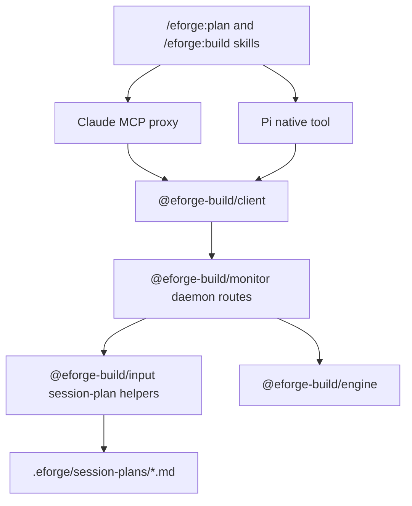

# Session plan tools and API

## Problem / Motivation

Session-plan behavior is now partially centralized in `@eforge-build/input`, but the user-facing integrations still implement critical session-plan behavior in prompt instructions. This leaves multiple sources of truth for:

- discovering active session plans,
- parsing session frontmatter,
- checking whether required dimensions are truly missing,
- handling skipped dimensions,
- dealing with legacy boolean dimensions,
- serializing updated session files,
- marking a plan submitted after enqueue.

This duplication is brittle and has already exposed drift: `@eforge-build/input` does not currently accept the `submitted` status that the build skills write. The next step should make daemon/client/tool surfaces call the shared session-plan library so skills can ask for session-plan operations instead of reimplementing file semantics in natural language.

### Context

The previous architecture plan introduced `@eforge-build/scopes` and `@eforge-build/input`. The built state now includes:

- `packages/scopes/` with shared scope/path/resolution primitives.
- `packages/input/` with playbook handling and session-plan deterministic helpers.
- `packages/input/src/session-plan.ts`, which exports `parseSessionPlan`, `serializeSessionPlan`, `listActiveSessionPlans`, `selectDimensions`, `checkReadiness`, `migrateBooleanDimensions`, `sessionPlanToBuildSource`, and `normalizeBuildSource`.
- `packages/monitor/src/server.ts` now normalizes `.eforge/session-plans/*.md` source paths in the daemon enqueue route before spawning the enqueue worker.
- Docs now state the boundary: engine is input-agnostic, input owns playbook/session-plan protocols, scopes owns path resolution.

Remaining gap: Pi and Claude Code integration skills still duplicate session-plan file parsing/readiness/update rules in Markdown instructions. `/eforge:build` scans `.eforge/session-plans/`, parses frontmatter mentally, checks readiness rules itself, and manually edits session-plan frontmatter after enqueue. `/eforge:plan` still manually creates and edits session-plan files with no shared tool-backed validation.

Important implementation detail discovered while reviewing `@eforge-build/input`: `SessionPlanStatus` currently allows `planning`, `ready`, and `abandoned`, but the build skills set `status: submitted` after enqueue. Existing submitted session-plan files therefore do not parse under the current input schema. That may be acceptable for active-plan listing only if submitted plans are intentionally ignored, but it is surprising for parse/serialize and should be addressed in this follow-on.

Relevant existing surfaces:

- `packages/client/src/routes.ts` is the canonical route map; no session-plan routes exist yet.
- `packages/monitor/src/server.ts` has daemon routes for enqueue, config, playbooks, recovery, queue, etc.; session-plan routes should follow that pattern and import deterministic logic from `@eforge-build/input`.
- `packages/eforge/src/cli/mcp-proxy.ts` exposes MCP tools, including `eforge_playbook`; no `eforge_session_plan` tool exists.
- `packages/pi-eforge/extensions/eforge/index.ts` mirrors the playbook tool in Pi native tool registration; any new session-plan tool should be added in both Claude MCP proxy and Pi extension to maintain parity.
- `packages/pi-eforge/skills/eforge-build/SKILL.md` and `eforge-plugin/skills/build/build.md` duplicate active session-plan discovery/readiness/submitted-state logic.
- `packages/pi-eforge/skills/eforge-plan/SKILL.md` and `eforge-plugin/skills/plan/plan.md` duplicate session creation, dimension selection, readiness, and legacy migration rules.

Roadmap alignment: this fits Integration & Maturity, especially shared tool registry direction and reducing duplicated integration logic. It also continues the boundary guardrail: session plans are input-layer artifacts exposed through daemon/client tools, not engine features.

This looks like a **feature / deep** change: it adds a daemon/client/tool API around an existing input package, touches both consumer integrations for parity, and reduces prompt-level duplicated logic without changing engine semantics.

## Goal

Add daemon/client/tool support for session plans so integrations use `@eforge-build/input` instead of duplicating readiness and file-update logic, eliminating prompt-level YAML/Markdown surgery in both the Claude Code plugin and Pi extension while preserving conversational planning behavior.

## Approach

Add an input-management API layer around session-plan files while preserving the package boundaries from the previous refactor. Daemon HTTP routes back deterministic session-plan operations with `@eforge-build/input`; typed client helpers expose the routes; both the Claude MCP proxy and Pi native extension register an equivalent `eforge_session_plan` tool; skills call the tool instead of parsing/serializing files themselves.

### Architecture

The engine still sees only normalized build source. Session-plan routes are daemon/control-plane conveniences for integrations, not engine APIs.

### Design Decisions

Proposed API shape: one session-plan tool with explicit actions, similar to `eforge_playbook`, rather than many separate tools.

Recommended actions:

- `list-active` — returns active session plans (`planning` / `ready`) with topic, status, path, created date if available, and readiness summary.
- `show` — loads one session plan by session id or path and returns frontmatter/body plus readiness details.
- `create` — creates a new session plan file with canonical frontmatter.
- `set-section` — structured operation to add/update a `## Dimension Title` section without asking skills to rewrite whole files.
- `skip-dimension` — records a skipped dimension with reason in frontmatter.
- `set-status` — updates lifecycle status (`planning`, `ready`, `submitted`, `abandoned`) and optional metadata such as `eforge_session`.
- `select-dimensions` — applies `planning_type` / `planning_depth` and writes required/optional dimension lists using `@eforge-build/input` rules.
- `readiness` — returns readiness details: `ready`, `missingDimensions`, `skippedDimensions`, and covered dimensions if practical.
- `migrate-legacy` — migrates legacy boolean dimension frontmatter when requested or as part of load/update.

Full-file `save` can exist as an escape hatch if useful, but skills should prefer structured operations. The point of the follow-on is to stop asking skills to perform YAML/Markdown surgery for common session-plan state changes.

- **Lifecycle decision:** support `submitted` explicitly. Submitted plans should not be returned by `list-active`, but `show`/parse should still work for submitted session files.
- **Submission decision:** the daemon enqueue/build boundary should mark a session plan submitted automatically when the accepted source is a `.eforge/session-plans/*.md` path. This is an input/control-plane concern, not an engine concern. The daemon route already depends on `@eforge-build/input` for source normalization, so it can update the session plan with the spawned worker `sessionId`. Skills should no longer manually edit YAML after `eforge_build` returns.
- **Path decision:** APIs should accept either `session` id or `path`, but daemon-side resolution must constrain all operations to `[cwd]/.eforge/session-plans/*.md` to prevent path traversal. Prefer `session` id for mutating actions.
- **Dependency decision:** daemon routes and integration tools call `@eforge-build/input`; engine remains input-agnostic.

### Code Impact

Likely package changes:

- `packages/input/src/session-plan.ts`
  - Add `submitted` to `SessionPlanStatus` / schema.
  - Add helper(s) for updating status and session metadata immutably, including marking a plan submitted with `eforge_session`.
  - Add structured section helpers for creating/updating `## Dimension Title` sections and skip-dimension entries so skills do not need to rewrite whole Markdown files for common operations.
  - Possibly expose richer readiness details, e.g. skipped dimensions with reasons and covered dimensions, not only missing dimensions.
- `packages/client/src/routes.ts`
  - Add session-plan route constants.
- `packages/client/src/api/session-plan.ts` (new)
  - Add typed helpers and request/response types.
  - Export from `packages/client/src/index.ts`.
- `packages/monitor/src/server.ts`
  - Add daemon routes that read/write `.eforge/session-plans/` through input helpers.
  - Keep path validation strict: session plan names/paths must stay under `.eforge/session-plans/`.
  - Update the daemon enqueue route so, when the accepted source is a session-plan path, it marks that session plan `submitted` with the returned worker `sessionId` as part of the input/control-plane boundary.
- `packages/eforge/src/cli/mcp-proxy.ts`
  - Add `eforge_session_plan` MCP tool with actions matching daemon/client operations.
- `packages/pi-eforge/extensions/eforge/index.ts`
  - Add matching Pi tool for session-plan actions.
- `packages/pi-eforge/skills/eforge-build/SKILL.md` and `eforge-plugin/skills/build/build.md`
  - Replace manual active-plan/readiness parsing with tool calls.
  - Use tool support to mark submitted after enqueue instead of manual YAML editing when possible.
- `packages/pi-eforge/skills/eforge-plan/SKILL.md` and `eforge-plugin/skills/plan/plan.md`
  - Use tool support for create/list/show/readiness/status updates and dimension selection where appropriate.
  - Keep conversation/codebase-exploration instructions intact.
- `eforge-plugin/.claude-plugin/plugin.json`
  - Bump plugin version if plugin skill/tool docs change, per project convention.

### Documentation Impact

Update docs/skills to explain that session-plan mechanics are tool-backed:

- `README.md` if it describes `/eforge:plan` / `/eforge:build` session-plan behavior.
- `docs/architecture.md` package/control-plane section to mention session-plan routes/tools use `@eforge-build/input`.
- `docs/config.md` only if session-plan storage semantics are described.
- `packages/input/README.md` to mention lifecycle status including `submitted` and any new helper behavior.
- Pi and Claude skill docs for `/eforge:plan` and `/eforge:build` to call the new tool instead of instructing manual YAML/readiness parsing.

### Risks

- **Tool API scope creep** — too many actions could turn this into a full editor API. Keep the first version focused on structured operations the skills already perform today: create, show, set dimensions, set section, skip dimension, readiness, set status, and mark submitted.
- **Concurrent edits** — skills may still edit files directly while tools write status/sections. Minimize by making tool write operations atomic and documenting preferred flow.
- **Path traversal** — any route accepting `path` or `session` must constrain resolution to `.eforge/session-plans/`.
- **Parity drift** — Claude MCP proxy and Pi native tool must expose equivalent actions.
- **Status migration** — existing submitted session files should parse after schema update, but should remain excluded from active listings.
- **Overcoupling build to plan** — `eforge_build` should not become responsible for planning; it should use session-plan APIs only for discovery/readiness/status transitions.

### Profile Signal

Recommend **Excursion**.

Rationale: this is cross-package and user-facing, but the architecture boundary is already established. The work is mostly adding daemon/client/tool surfaces around an existing input library and updating skills to use them. It should not require expedition-style module decomposition unless implementation discovers a need for a broader tool registry refactor.

## Scope

### In scope

- Add session-plan daemon HTTP routes backed by `@eforge-build/input` for deterministic session-plan operations.
- Add typed route constants and client helpers in `@eforge-build/client`.
- Add a Claude MCP proxy tool and Pi native tool for session-plan operations, keeping integration parity.
- Update `/eforge:build` skills in both Pi and Claude plugin to use the session-plan tool for active-plan discovery/readiness and submitted-state updates.
- Update `/eforge:plan` skills in both Pi and Claude plugin to use the session-plan tool where it improves determinism without eliminating the conversational planning workflow.
- Extend `@eforge-build/input` session-plan status/schema behavior to support the lifecycle the skills actually use, including `submitted`.
- Add tests for new client types, daemon routes, and session-plan lifecycle operations where appropriate.
- Update docs to describe session-plan API/tool support as part of the input layer.

### Out of scope

- Moving conversational planning logic out of skills. The agent still gathers context, asks questions, and decides what to record.
- Adding a rich native Pi TUI for `/eforge:plan`; this can remain skill-driven.
- Scheduling/triggers/approvals/notifications or wrapper-app workflow orchestration.
- Changing engine behavior or making the engine depend on `@eforge-build/input`.
- Replacing playbook APIs; only touch playbooks if shared patterns/types are needed.

## Acceptance Criteria

- `@eforge-build/input` session-plan schema supports all lifecycle statuses written by skills, including `submitted`.
- Daemon exposes session-plan routes for active listing, show/readiness, create, structured section updates, skip-dimension updates, status updates, and legacy/readiness handling as scoped in the implementation plan.
- `@eforge-build/client` exports typed route helpers and request/response types for the new session-plan routes.
- Claude MCP proxy exposes an `eforge_session_plan` tool backed by client helpers.
- Pi extension exposes an equivalent `eforge_session_plan` tool.
- `/eforge:build` skills in both Pi and Claude use the new tool for session-plan discovery/readiness and rely on the daemon enqueue/build boundary to mark session plans submitted instead of manually editing YAML.
- `/eforge:plan` skills use the tool for at least create/list/show/readiness/status/dimension-selection operations where appropriate while preserving conversational planning behavior.
- Existing playbook and build flows continue to work.
- Engine does not depend on `@eforge-build/input`.
- Tests cover session-plan status parsing, active listing excluding submitted, readiness details, daemon/client route behavior, and parity-relevant tool behavior where practical.
- `pnpm build`, `pnpm type-check`, and `pnpm test` pass.
