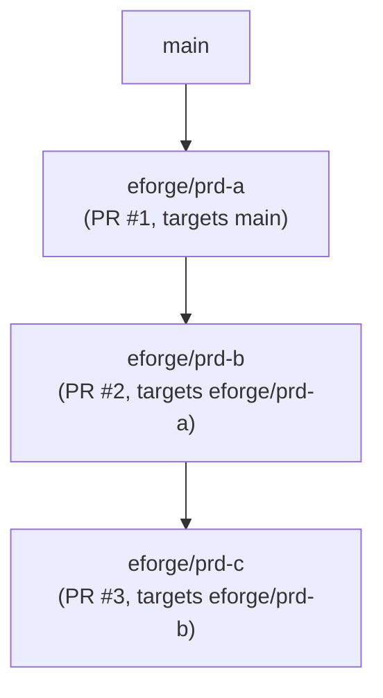

# Stacked PRs with git-spice

eforge supports stacked pull requests via git-spice. When `stacking.enabled: true`, the root artifact branch targets the resolved trunk branch, and each child artifact branch targets its parent artifact branch, forming a linear stack of pull requests that reviewers can merge in order.

## Artifact branches

Every eforge build produces an **artifact branch** - a named Git branch (`eforge/<prd-id>`) that holds the committed output from that build. When `landing.action: pr`, eforge opens a pull request from this artifact branch targeting its resolved base.

For non-stacked builds, the resolved base is the branch eforge builds from (often the project trunk, but it can be an active feature branch). For stacked builds, the root PRD targets the resolved trunk branch and child PRDs target the parent PRD's artifact branch:



## stack_id and stack_parent

PRD frontmatter carries two optional stacking fields:

**`stack_id`** - a logical stack name shared by all PRDs in the same stack. If omitted, defaults to the first PRD id in the chain.

**`stack_parent`** - the PRD id of the immediate parent layer. Controls which artifact branch this PRD's PR targets.

```yaml
---
title: Auth service - part 2
stack_id: auth-refactor
stack_parent: q-abc123
depends_on: [q-abc123]
---
```

## Single-dependency inference

When a PRD has exactly one `depends_on` entry and stacking is enabled, eforge automatically infers `stack_parent` from that dependency at dispatch time. For linear stacks you do not need to set `stack_parent` explicitly.

When a PRD has multiple `depends_on` entries, eforge cannot infer the stack parent. You must set `stack_parent` explicitly to indicate which dependency is the direct parent layer. If `stack_parent` is missing and there are multiple `depends_on` entries, dispatch fails with a clear error.

### Explicit handoff and stack parent

When you use `--after <queue-id>` (CLI) or `afterQueueId` (MCP/Pi tool) to create an explicit dependency, the resulting single `depends_on` entry participates in the same stack parent inference described above. If stacking is enabled and the explicit dependency is the only `depends_on` entry, eforge infers `stack_parent` from it at dispatch time - no extra configuration is needed. The explicit handoff is deterministic: dependency detector inference is not used when `afterQueueId` is supplied.

## Enable stacking

The guided path is `/eforge:workflow`. Choose a stacked workflow preset to write the required `landing.action: pr` and `stacking.enabled: true` keys to `eforge/config.yaml`. The `stacked-pr-autosync` preset also writes `stacking.sync.afterBuild: true` for daemon-owned automatic stack sync.

To configure the same settings by hand, add these fields to `eforge/config.yaml`:

```yaml
stacking:
  enabled: true

landing:
  action: pr    # stacking requires action: pr
```

If git-spice is not installed to a standard PATH location, set the command explicitly:

```yaml
stacking:
  enabled: true
  gitSpice:
    command: /usr/local/bin/git-spice   # or 'gs' if you have the alias on PATH
```

## git-spice setup

Install git-spice from [https://abhinav.github.io/git-spice/](https://abhinav.github.io/git-spice/), then initialize it in your repository once:

```bash
git-spice repo init
```

This writes a local tracking file that git-spice uses to maintain branch relationships. If git-spice is not available, eforge fails the build with a clear error message.

## Stack sync

When an upstream PR merges, GitHub updates downstream PR bases, but your local artifact branches still need to sync and restack. Use one of these task surfaces:

| Surface | Command |
|---------|---------|
| Claude Code | `/eforge:stack` |
| Pi | `/eforge:stack:sync` |
| Standalone CLI | `eforge stack sync` |

Use `--dry-run` to preview what commands would run without executing them:

```bash
eforge stack sync --dry-run
```

`eforge stack sync` calls the daemon's stack sync route, which runs `git-spice repo sync` followed by `git-spice stack restack` to update the full local stack. The sync executes from the project root and returns a structured report:

| Field | Description |
|-------|-------------|
| `outcome` | One of `skipped`, `complete`, `deferred`, `failed`, `conflict` |
| `restackCandidates` | Artifact branches eligible for restack |
| `activeBuildSkips` | Branches excluded because active builds are using their worktrees |
| `providerCommands` | git-spice commands that ran (or would run in dry-run mode) |
| `fastForward` | Whether local trunk is at or behind `origin/<trunk>` |
| `error` | Error message when outcome is `failed` or `conflict` |

### Automatic after-build sync

To run stack sync automatically after every queued build reaches a terminal state, set `stacking.sync.afterBuild: true` in `eforge/config.yaml`:

```yaml
stacking:
  sync:
    afterBuild: true
```

When enabled, the daemon triggers a sync from the project root after each build reaches a terminal state (completed, failed, or skipped). The after-build path uses `activeBuildPolicy: "defer"` — if other active builds still overlap the stack candidates, the sync records a `deferred` outcome rather than running.

> **Avoid `build.postMergeCommands: ["eforge stack sync"]` for automatic sync.** That path bypasses active-build overlap detection. Use `stacking.sync.afterBuild: true` instead.

### Active-build deferral

When sync runs while active builds are in progress, branches whose worktrees overlap active builds are excluded and reported in `activeBuildSkips`. The outcome depends on the `activeBuildPolicy` in the request:

- **`skip` (default for manual sync)** — returns `skipped` immediately without mutating any branch state. Re-run `eforge stack sync` manually after active builds complete.
- **`defer` (used by the after-build trigger)** — returns `deferred`, recording that candidates were blocked. When `stacking.sync.afterBuild: true` is configured, the daemon fires another sync attempt after each build reaches a terminal state, which proceeds if the stack is no longer blocked.

### Conflict recovery

When sync returns `outcome: conflict`, a merge conflict occurred during restack. To recover:

1. Run `git status` to see the conflicting files.
2. Resolve the conflicts in the affected files.
3. Run `git add <resolved-files>` to stage the resolved files.
4. Run `git rebase --continue` (or the git-spice equivalent) to resume the restack.
5. Once the restack finishes, run `eforge stack sync` again to sync remaining branches.

### Fast-forward-only trunk policy

Sync uses a fast-forward-only policy for trunk. When `fastForward` is `false`, the local trunk is ahead of `origin/<trunk>`. Push or align the local trunk with origin before running sync.

## Note on GitHub inline comments

When a PR's base branch changes after an upstream PR merges, GitHub marks existing inline review comments as "outdated". This is a known GitHub limitation. The comment content remains accessible in the PR timeline.

## Migration: build.onSuccess to landing.action

`landing.action` is the current canonical config key. If your config uses the old `build.onSuccess` key, migrate by replacing it with `landing.action` under the `landing:` block:

| Old `build.onSuccess` | New `landing.action` |
|----------------------|---------------------|
| `issue-pr` | `pr` |
| `merge-to-base-branch` | `merge` |
| `leave-branch` | `leave` |

The old `build.onSuccess` key and the legacy full-string values (`issue-pr`, `merge-to-base-branch`, `leave-branch`) are both rejected at validation with migration guidance. Replace `build.onSuccess` with `landing.action` and update the values to `pr`, `merge`, or `leave` before running new builds.

## Where to look next

- [Configuration](/docs/configuration) - full config reference including `stacking`, `stacking.sync.afterBuild`, and `landing` fields
- [Configuration Reference](/reference/config) - machine-readable schema
- [Concepts](/docs/concepts) - artifact branches and the build pipeline
