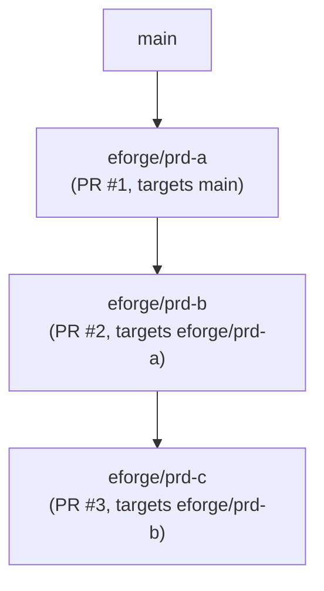

# Stacked PRs with git-spice

eforge supports stacked pull requests via git-spice. When `stacking.enabled: true`, the root artifact branch targets the resolved trunk branch, and each child artifact branch targets its parent artifact branch, forming a linear stack of pull requests that reviewers can merge in order.

## Artifact branches

Every eforge build produces an **artifact branch** - a named Git branch (`eforge/<prd-id>`) that holds the committed output from that build. When `landing.action: pr`, eforge opens a pull request from this artifact branch targeting its resolved base.

For non-stacked builds, the resolved base is the branch eforge builds from (often the project trunk, but it can be an active feature branch). For stacked builds, the root PRD targets the resolved trunk branch and child PRDs target the parent PRD's artifact branch:



## stack_id and stack_parent

PRD frontmatter carries two optional stacking fields:

**`stack_id`** - a logical stack name shared by all PRDs in the same stack. If omitted, defaults to the first PRD id in the chain.

**`stack_parent`** - the PRD id of the immediate parent layer. Controls which artifact branch this PRD's PR targets.

```yaml
---
title: Auth service - part 2
stack_id: auth-refactor
stack_parent: q-abc123
depends_on: [q-abc123]
---
```

## Single-dependency inference

When a PRD has exactly one `depends_on` entry and stacking is enabled, eforge automatically infers `stack_parent` from that dependency at dispatch time. For linear stacks you do not need to set `stack_parent` explicitly.

When a PRD has multiple `depends_on` entries, eforge cannot infer the stack parent. You must set `stack_parent` explicitly to indicate which dependency is the direct parent layer. If `stack_parent` is missing and there are multiple `depends_on` entries, dispatch fails with a clear error.

## Enable stacking

Add these fields to `eforge/config.yaml`:

```yaml
stacking:
  enabled: true

landing:
  action: pr    # stacking requires action: pr
```

If git-spice is not installed to a standard PATH location, set the command explicitly:

```yaml
stacking:
  enabled: true
  gitSpice:
    command: /usr/local/bin/git-spice   # or 'gs' if you have the alias on PATH
```

## git-spice setup

Install git-spice from [https://abhinav.github.io/git-spice/](https://abhinav.github.io/git-spice/), then initialize it in your repository once:

```bash
git-spice repo init
```

This writes a local tracking file that git-spice uses to maintain branch relationships. If git-spice is not available, eforge fails the build with a clear error message.

## Restack after upstream merges

When an upstream PR merges, GitHub updates the base of the downstream PR automatically. Local branches do not update automatically - run `git-spice stack restack` (or `git-spice branch sync`) after upstream PRs merge to keep local branches current. eforge does not run restack or sync automatically. Automated post-merge restack is tracked as future roadmap work.

## Note on GitHub inline comments

When a PR's base branch changes after an upstream PR merges, GitHub marks existing inline review comments as "outdated". This is a known GitHub limitation. The comment content remains accessible in the PR timeline.

## Migration: build.onSuccess to landing.action

`landing.action` is the current canonical config key. If your config uses the old `build.onSuccess` key, migrate by replacing it with `landing.action` under the `landing:` block:

| Old `build.onSuccess` | New `landing.action` |
|----------------------|---------------------|
| `issue-pr` | `pr` |
| `merge-to-base-branch` | `merge` |
| `leave-branch` | `leave` |

The old `build.onSuccess` key and the legacy full-string values (`issue-pr`, `merge-to-base-branch`, `leave-branch`) are both rejected at validation with migration guidance. Replace `build.onSuccess` with `landing.action` and update the values to `pr`, `merge`, or `leave` before running new builds.

## Where to look next

- [Configuration](/docs/configuration) - full config reference including `stacking` and `landing` fields
- [Configuration Reference](/reference/config) - machine-readable schema
- [Concepts](/docs/concepts) - artifact branches and the build pipeline
